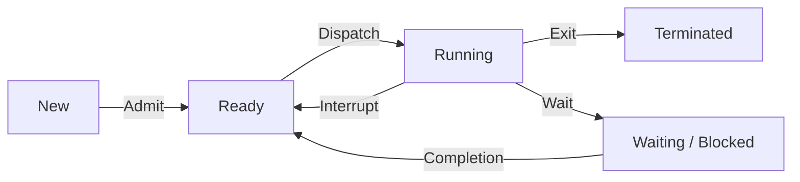

# Lý thuyết

---
**Một tiến trình chứa những thành phần gì?**
1. **Text section**: Chứa mã nguồn.
2. **Data section**: Chứa biến *toàn cục*.
3. **Program counter**, **registers**.
4. **Heap section**: Chứa bộ nhớ cấp phát động.
5. **Stack section**: Chứa dữ liệu tạm thời (các hàm, giá trị trả về, biến *cục bộ*).

---
**Tiến trình có những trạng thái nào? Cách tiến trình chuyển trạng thái?**
1. **new**: Process vừa được tạo.
2. **ready**: Process đã có đủ tài nguyên, chờ thực thi.
3. **waiting** (hay **blocked**): Process đợi I/O hoàn tất, hoặc đợi tín hiệu.
4. **running**: Đang thực thi.
5. **terminated**: Process kết thúc.
Sơ đồ chuyển trạng thái:


---
**Tại sao phải cộng tác giữa các tiến trình?**
- Chia sẻ dữ liệu.
- Tăng tốc tính toán.
- Thực hiện một công việc chung.

---
**PCB là gì? Dùng để làm gì?**
PCB là 1 cấu trúc dữ liệu trong kernel, chứa toàn bộ thông tin cần thiết để quản lý 1 process. Bao gồm:
1. Trạng thái của process.
2. Program counter, register.
3. Thông tin định thời, quản lý bộ nhớ.
4. Lượng CPU, thời gian sử dụng.

---
**Tiểu trình là gì?**
Tiểu trình là tiến trình con, cũng là đơn vị cơ bản sử dụng CPU.

---
**Trình tự thực thi của tiến trình cha và tiến trình con?**
Tiến trình cha được thực thi trước con và đợi tiến trình con kết thúc rồi mới thực thi tiếp.

---
**Các cơ chế trao đổi thông tin giữa các tiến trình?**
Có 2 mô hình:
1. Bộ nhớ chia sẻ (Shared memory): Các process dùng chung bộ nhớ.
2. Hệ thống truyền thông điệp (Message passing): Các process giao tiếp qua địa chỉ của nhau.

# Sơ đồ trạng thái

---
**Chương trình sau đã trải qua những trạng thái nào? Vẽ sơ đồ chuyển trạng thái trong quá trình thực thi?**

>[!NOTE] Các bước làm bài
>- Khi bắt đầu chương trình -> **new - ready - running**.
>- Khi gặp input, output -> **waiting - ready - running**.
>- Khi kết thúc chương trình -> **terminated**.

```c
// new - ready - running
int main (int argc, char** argv) {
    int i = 2;
    while (i <= 5) {
        i++;
        if (i % 2 == 0) {
            printf("Hello");
            // i = 4 : waiting - ready - running
            
            printf ("Hi");
            // i = 4 : waiting - ready - running
        } else
            printf ("Bye");
            // i = 3 : waiting - ready - running
            // i = 5 : waiting - ready - running
    }
    exit (0);
    // terminated
}
```

new - ready - running - waiting - ready - running - waiting - ready - running - waiting - ready - running - waiting - ready - running - terminated.

# Sơ đồ process

---
**Trong chương trình sau, có bao nhiêu process được tạo (*kể cả process cha*). Có bao nhiêu từ `Hi` được in ra? Giả sử chương trình không có sự cố phát sinh.**

Nhắc lại các lệnh tạo process con:

|                              | Mô tả                                                                                                                                                          | Giá trị trả về                                                                                         |
| ---------------------------- | -------------------------------------------------------------------------------------------------------------------------------------------------------------- | ------------------------------------------------------------------------------------------------------ |
| `fork()`<br>(`unistd.h`)     | Tạo process con bằng cách **nhân bản** process hiện có (cha), *kể cả địa chỉ vùng nhớ*.<br><br>Sự thay đổi process con sẽ không ảnh hưởng lên cha.             | - `0`: Ta đang trong process con.<br><br>- > `0`: Ta đang trong process cha.<br><br>-  `-1`: Thất bại. |
| Họ hàm `exec()` (`unistd.h`) | Thay thế process hiện tại bằng một process khác (`name`). Process hiện tại sẽ không được thực thi nữa.<br><br>Một hàm thường dùng là `exel(path, name, NULL)`. | - `void`: Thành công.<br><br>- `-1`: Thất bại.                                                         |
| `system()`<br>(`stdlib.h`)   | Tạo process con. Process cha sẽ đợi con chạy xong rồi chạy tiếp.                                                                                               |                                                                                                        |

>[!note] Các bước làm bài
>1. Vẽ sơ đồ process. Quy ước: Process cha ở bên phải.
>2. Điền các lệnh xử lý ngay trước khi sinh process mới.


```c
#include <stdio.h>
#include <unistd.h>

int x = 10;

int main() {
	int i;
	int f = fork();
	
	if (f == 0)
		print("x");
	else
		print("x+1");
	
	for (i = 0; i < 2; i++) {
		int k = fork();
		if (i > 0)
			print("Hi\n");
	}
	
	return 0;
}
```

Sơ đồ các process:
![[fork1.png]]

Vậy, ta thấy có:
- 8 process.
- 8 từ `Hi`. Chú ý chỉ khi `i == 1` thì mới in `Hi`.

---
**Trong chương trình sau, có bao nhiêu process được tạo (*kể cả process cha*). Có bao nhiêu từ `Hi` được in ra? Giả sử chương trình không có sự cố phát sinh.**

```c
#include <stdio.h>
#include <unistd.h>

int x = 10;

int main() {
	int i;
	int f = fork();
	
	for (i = 0; i < 2; i++) {
		int k = fork();
		if (k > 0)
			print("Hi\n");
	}
	
	return 0;
}
```

Lưu ý trong bài này thì chỉ có process cha mới `Hi` (vì có điều kiện `k > 0`).

Vậy chỉ còn 6 `Hi`.

![[fork2.png]]

---
**Cho biết giá trị nhỏ nhất và lớn nhất của `x` khi thực thi chương trình sau. Giả sử chương trình không có sự cố phát sinh.**

```c
#include <stdio.h>
#include <unistd.h>

int main() {
	int x = 100;
	int pid = fork();
	
	if (pid == 0) {
		for (int i = 0; i < 2; i++)
			if (fork() == 0)
				x = x * 2;
			else
				x = x / 2;
	} else
		fork();
	
	return 0;
}
```

![[fork3.png]]

Vậy:
- Min = 25.
- Max = 400.


