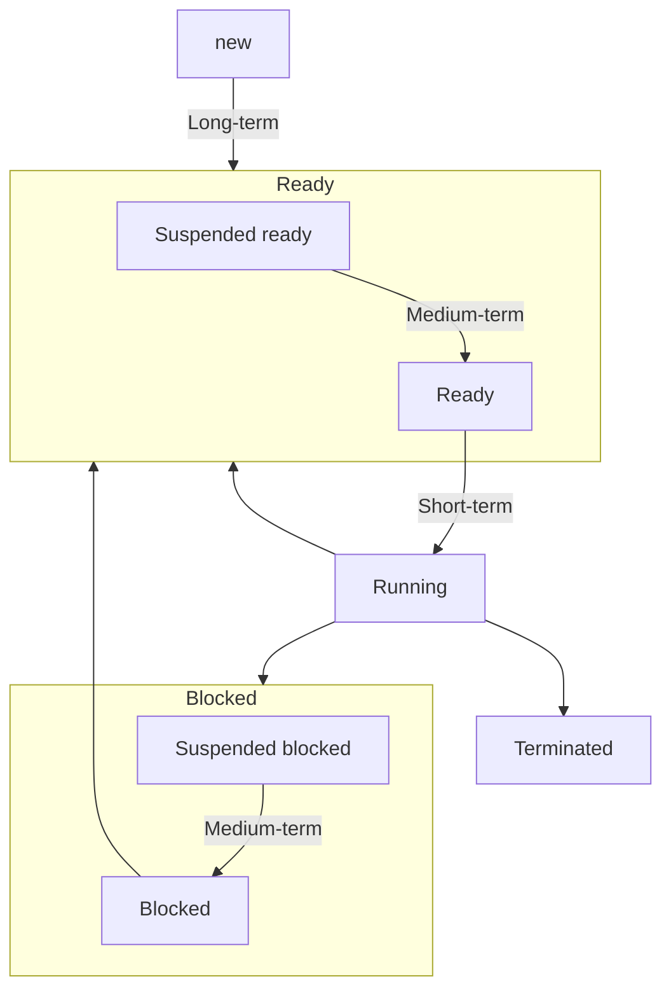

# Tổng quan về Định thời

## Khái niệm

**Định thời** có thể được hiểu là *phân phối thời gian sử dụng* một loại tài nguyên nào đó (chủ yếu là **CPU**) của process/thread. Hoặc có thể hiểu là *lựa chọn tiến trình để thực thi sao cho đạt hiệu quả tốt nhất*.

## Ý nghĩa

- Có nhiều process chạy tại các thời điểm -> **Tận dụng tối đa CPU**.
- User tương tác với mỗi chương trình đang thực thi -> **Tối thiểu thời gian đáp ứng**.

## Yêu cầu đối với OS về định thời

1. Hỗ trợ sự **thực thi luân phiên** giữa nhiều process.
2. **Phân phối tài nguyên** hệ thống hợp lý.
3. **Tránh deadlock, trì hoãn** vô hạn định.
4. Cung cấp cơ chế **giao tiếp và đồng bộ** process.
5. Cung cấp cơ chế hỗ trợ user **tạo / kết thúc** process.

## Bộ định thời

Có 3 loại:

| Bộ định thời                                                      | Nhiệm vụ                                                                 | Nhận xét                                                                                                                                                                                                                                                                                                        |
| ----------------------------------------------------------------- | ------------------------------------------------------------------------ | --------------------------------------------------------------------------------------------------------------------------------------------------------------------------------------------------------------------------------------------------------------------------------------------------------------- |
| **Bộ định thời dài (Long-term scheduler)** (Job sheduler)   | Chọn process từ **new** sang **ready** (*mới nạp process vào hệ thống*). | Xảy ra **ít thường xuyên** (vì nạp job vào bộ nhớ không diễn ra liên tục).                                                                                                                                                                                                                                      |
| **Bộ định thời ngắn (Short-term scheduler)** (CPU sheduler) | Chọn process từ **ready** sang cho **running**.                          | Xảy ra **thường xuyên**.  Tăng **Dispatch latency (Độ trễ)** vì cần thực hiện:  1. **Chuyển ngữ cảnh** (thay đổi process, Context switch). 2. **Chuyển chế độ** người dùng. 3. **Nhảy đến vị trí thích hợp** trong chương trình ứng dụng để khởi động lại chương trình (qua program counter). |
| **Bộ định thời vừa (Medium-term scheduler)**                   | Chọn process từ **bộ nhớ tạm** sang **ready / blocked**.                 | - **Điều chỉnh mức độ đa chương** của hệ thống.  - Hoạt động khi CPU có dấu hiệu **quá tải**.                                                                                                                                                                                                             |

## Các tiêu chuẩn định thời

| Các tiêu chuẩn hướng người dùng (User-oriented)                                                                                                                                             | Các tiêu chuẩn hướng hệ thống / Tài nguyên (System-oriented)                         |
| ---------------------------------------------------------------------------------------------------------------------------------------------------------------------------------------------- | --------------------------------------------------------------------------------------- |
| **3 min**                                                                                                                                                                                      | **2 max 1 ngang**                                                                       |
| **Thời gian đáp ứng (Response time)**: Khoảng thời gian từ lúc *process gửi yêu cầu thực thi đến khi yêu cầu được đáp ứng lần đầu tiên* (trong các hệ thống time-sharing, interactive system). | **Hiệu năng sử dụng CPU (CPU utilization)**: CPU càng bận càng tốt.                     |
| **Thời gian đợi (Waiting time)**: Tổng thời gian một tiến trình đợi trong *ready queue*.                                                                                                       | **Thông lượng (Throughput)**: Số process hoàn tất công việc trong một khoảng thời gian. |
| **Thời gian hoàn thành (Turnaround time)**: Khoảng thời gian từ lúc 1 *process được nạp vào hệ thống đến khi process đó kết thúc*.                                                             | **Tính công bằng (Fairness)**: Tất cả process phải được đối xử như nhau.                |

# Các giải thuật định thời

## Các yếu tố của giải thuật định thời

---
**Hàm chọn lựa (Selection function):**

Mô tả cách thức (căn cứ) để chọn process nào trong ready queue được thực thi (*thường được dựa trên độ ưu tiên, yêu cầu về tài nguyên, đặc điểm thực thi của tiến trình,...*).

---
**Chế độ quyết định (Decision mode) thời điểm thực thi hàm chọn lựa:**

Quyết định **thời điểm thực hiện hàm chọn lựa** để định thời.

| Chế độ                                     | OS có thể lấy lại quyền cấp CPU giữa chừng không? | Process kết thúc khi nào?                                    | Đặc điểm                                                                                                                                 | Thời điểm áp dụng                                                                                  |
| ------------------------------------------ | ------------------------------------------------- | ------------------------------------------------------------ | ---------------------------------------------------------------------------------------------------------------------------------------- | -------------------------------------------------------------------------------------------------- |
| **Không trưng dụng** (*Non-preemptive*) | Không.                                            | - Khi thực thi xong.  - Khi được hệ thống I/O yêu cầu. | - Chi phí vận hành thấp.  - Chuyển ngữ cảnh ít.                                                                                    | - Process chuyển từ **running sang waiting** (*đợi I/O*).                                          |
| **Trưng dụng** (*Preemptive*)           | Có.                                               | - Bất kỳ lúc nào.                                            | - Chi phí vận hành cao.  - Thời gian đáp ứng thấp *vì không có process nào độc chiếm CPU quá lâu*.  - Chuyển ngữ cảnh nhiều. | - Process chuyển từ **running sang ready**.  - Process chuyển từ **waiting/new sang ready**. |

>[!note]
>- Không trưng dụng, không ngắt giữa chừng.
>- Có trưng dụng, có ngắt giữa chừng.

>[!note]
>- Process bị ngắt bởi hệ thống I/O thì chuyển sang **waiting**.
>- Process bị ngắt bởi định thời thì chuyển sang **ready**.

>[!note]
>Nếu thời gian chuyển ngữ cảnh không đáng kể, có thể nói **thời gian hoàn thành giữa 2 chế độ là như nhau**.

## Một số giải thuật định thời

| Giải thuật                             | Hàm chọn lựa                                                                                                                                                                                                                                                                                                                                                                                           | Chế độ quyết định                       | Ưu                                                                                                                                                                            | Nhược                                                                                                                                                                                                                                                                                        |
| -------------------------------------- | ------------------------------------------------------------------------------------------------------------------------------------------------------------------------------------------------------------------------------------------------------------------------------------------------------------------------------------------------------------------------------------------------------ | --------------------------------------- | ----------------------------------------------------------------------------------------------------------------------------------------------------------------------------- | -------------------------------------------------------------------------------------------------------------------------------------------------------------------------------------------------------------------------------------------------------------------------------------------- |
| **First-come, first-serve (FCFS)**     | - Process nào yêu cầu CPU trước sẽ được chọn.  - Process sẽ thực thi đến khi kết thúc hoặc bị blocked do I/O.                                                                                                                                                                                                                                                                                    | Non-preemptive.                         | - **Processor time không bị phân phối lại** (không bị ngắt).  - **Chi phí thực hiện thấp nhất** (vì không thay đổi thứ tự ưu tiên).                                     | **Waiting time trung bình như nhau**.                                                                                                                                                                                                                                                        |
| **Shortest job first (SJF)**           | Giả định ban đầu các process đều có độ ưu tiên như nhau. Sau đó, Process có [[2. Tiến trình & Tiểu trình#Phân loại process\|burst time]] ít nhất sẽ được chọn.                                                                                                                                                                                                                                         | Preemptive (**SRTF**) / Non-preemptive. | **Waiting time trung bình thấp**.                                                                                                                                             | - **Cài đặt phức tạp**.  - **Ko thể được cài đặt tại process ngắn** vì ko có cách nào để biết chiều dài processor time tiếp theo.  - Độc quyền hay ko độc quyền processor -> **SJF có nhiều phiên bản** và sẽ tối ưu hay ko tối ưu phụ thuộc vào chiến lược độc quyền processor. |
| **Priority scheduling**                | Mỗi process được cấp 1 số ưu tiên dựa vào:  - Burst time.  - Yêu cầu bộ nhớ, số lượng file cần dùng.  - Tỉ lệ thời gian dùng I/O so với CPU.  - ...                                                                                                                                                                                                                            | Preemptive / Non-preemptive.            |                                                                                                                                                                               |                                                                                                                                                                                                                                                                                              |
| **Round Robin (RR)**                   | Mỗi process được cấp 1 đơn vị thời gian rất nhỏ (10-1000 ms) để dùng CPU (Quantum time / time slice, $q$). Hết thời gian này, process trở về cuối [[2. Tiến trình & Tiểu trình#Hàng đợi process\|ready queue]].  Mỗi process sẽ không đợi quá $(n-1).q$ quantum time, với $n$ là kích thước ready queue.  Nên ưu tiên [[2. Tiến trình & Tiểu trình#Phân loại process\|process hướng CPU]]. | Preemptive.                             | - **Waiting time thấp** (Các process sẽ được luân phiên xử lý).  - **Hiệu quả cao** với các process liên quan đến I/O, user.  - Việc **cài đặt ko quá phức tạp**. | - **Waiting time trung bình theo RR thường lớn**.  - Nếu $q$ quá lớn thì RR thành **FIFO**.  - Nếu $q$ quá nhỏ thì **context change time lớn**.  -> $q$ nên dài hơn 80% processor time.                                                                                    |
| **Highest Response Ratio Next (HRRN)** | Gọi: $$\text{Response ratio} = \frac{\text{W time}+\text{S time}}{\text{S time}}$$  Thuật toán ưu tiên các process có *Response ratio (RR)* **lớn nhất** (*Serve time* nhỏ).                                                                                                                                                                                                               | Preemptive / Non-preemptive.            | **Waiting time trung bình thấp hơn Aging**.                                                                                                                                   | **Độ phức tạp cao**.                                                                                                                                                                                                                                                                         |
| **Multilevel Queue**                   | [[2. Tiến trình & Tiểu trình#Hàng đợi process\|Ready queue]] được chia thành nhiều queue riêng biệt, có thể có nhiều giải thuật riêng biệt, theo một số tiêu chuẩn sau: 1. Đặc điểm và yêu cầu định thời của process. 2. Phân loại process: Foreground (interactive), background,...  Process được gán cố định vào một queue, mỗi queue sử dụng giải thuật định thời riêng.                | Preemptive / Non-preemptive.            |                                                                                                                                                                               | - Process **không thể chuyển từ queue này sang queue khác**.  - Có thể làm **giảm hiệu suất hệ thống** trong trường hợp 1 queue có quá nhiều process.                                                                                                                               |
| **Multilevel Feedback Queue**          | Phân loại process dựa trên các đặc tính về [[2. Tiến trình & Tiểu trình#Phân loại process\|burst time]].  Sau một khoảng thời gian nào đó, các I/O process và interactive process sẽ ở các queue có độ ưu tiên cao hơn các CPU process.  Một process đã chờ quá lâu ở một queue có độ ưu tiên thấp có thể được chuyển đến queue có độ ưu tiên cao hơn (*Aging*).                           | Preemptive.                             |                                                                                                                                                                               |                                                                                                                                                                                                                                                                                              |

**Đói tài nguyên (trì hoãn vô định)**:
- Là hiện tượng có process **luôn ở ready mà không được thực thi**.
- Các thuật toán **SJF, SRTF, Priority scheduling** dễ xảy ra đói tài nguyên nhất, vì nó luôn ưu tiên các process có mức độ ưu tiên cao hơn, dễ bỏ rơi các process ít ưu tiên.
- Biện pháp khắc phục: **Aging**: Tăng độ ưu tiên của process theo thời gian.

# Định thời thread

## Tổng quan Định thời thread

|                                                                      | Phạm vi định thời                                   | Thông qua                                             |
| -------------------------------------------------------------------- | --------------------------------------------------- | ----------------------------------------------------- |
| **[[2. Tiến trình & Tiểu trình#Phân loại thread\|User thread]]**   | Bên trong process (*Process-contention scope, PCS*) | Các thư viện quản lý thread bởi thiết lập độ ưu tiên. |
| **[[2. Tiến trình & Tiểu trình#Phân loại thread\|Kernel thread]]** | Toàn hệ thống (*System-contention scope, SCS*)      | Trực tiếp trên CPU.                                   |

## Định thời đa bộ xử lý

### Đa xử lý bất đối xứng

Tất cả các thao tác lập lịch, xử lý I/O được thực hiện bởi 1 CPU (**Master server**). Các CPU còn lại chỉ thực thi user code.

**Ưu**: Đơn giản, chỉ một CPU truy xuất dữ liệu hệ thống, không cần chia sẻ dữ liệu.

**Nhược**: Master server có thể bị nghẽn cổ chai (**bottleneck**) -> giảm hiệu năng của hệ thống.

### Đa xử lý đối xứng

#### Hướng xử lý

Có 2 hướng:
1. **Tất cả thread cùng nằm trong 1 queue**: Nảy sinh 2 hiện tượng sau:
	1. Có thread không được CPU nào chọn.
	2. Có thread được nhiều CPU chọn -> Cần có cơ chế kiểm tra & khóa truy xuất thread -> Hiệu năng có thể giảm do bottleneck.
2. **Mỗi CPU có queue riêng** (phổ biến):
	1. Hiệu năng không bị ảnh hưởng.
	2. Khối lượng công việc của các CPU không đồng đều.

#### Cân bằng tải (Load balancing)

**Cân bằng tải** là phân phối khối lượng công việc đều nhau cho các CPU.

Có 2 cách:
1. **Push migration**: Một tác vụ đặc biệt sẽ kiểm tra định kỳ tải của từng CPU. Nếu tình trạng quá tải xuất hiện, hệ thống sẽ di chuyển (push) tác vụ từ CPU bị quá tải sang các CPU khác.
2. **Pull migration**: CPU rỗi kéo (pull) tác vụ đang chờ từ CPU bận.

#### Liên kết giữa tác vụ và processor (Processor affinity)

Có 2 dạng liên kết:
1. **Liên kết mềm (Soft affinity)**: Hệ thống sẽ cố giữ tác vụ chỉ chạy trên CPU đó (nhưng không đảm bảo).
2. **Liên kết cứng (Hard affinity)**: Cho phép process chọn một tập các CPU mà nó có thể chạy trên đó.
