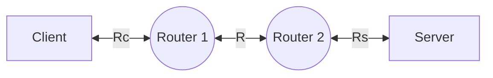

# Tổng quan về Internet

## Định nghĩa Internet

**Ở góc độ phần cứng**:
- Internet là một mạng máy tính (computer network) kết nối hàng tỷ thiết bị *máy tính, dây mạng, card mạng, modem, router,...* trên toàn thế giới. Các thiết bị này gọi là **host** hay **end system (hệ thống đầu cuối)**.
- Internet là **mạng của các mạng**.

**Ở góc độ phần mềm (dịch vụ)**: Internet cung cấp **[[2. Application layer#Socket|các API]]** cho các phần mềm hoạt động. Cho phép các ứng dụng kết nối với nhau và dùng [[2. Application layer#Các dịch vụ vận chuyển trên application layer|các dịch vụ vận chuyển]].

## Kết nối và truyền dữ liệu

Các hệ thống đầu cuối kết nối với nhau qua **liên kết truyền thông (communication links)** và **bộ chuyển mạch (switches)**.

**Một số loại cáp**:
- **Cross cable (Cáp chéo)**: Kết nối 2 thiết bị **cùng loại**.
- **Straight cable (Cáp thẳng)**: Kết nối 2 thiết bị **khác loại**.
- **Rollover cable (Cáp vòng)**: Dùng cho cổng **console**.

Tốc độ truyền được đo bằng **bit/giây (bits/second)**.

**Quá trình truyền dữ liệu**: [[#Mạng lõi (Core network)]].

Đường đi từ hệ thống gửi đến hệ thống nhận gọi là **route/path (tuyến đường)**.

## Nhà cung cấp dịch vụ Internet (ISP, Internet Service Provider)

Người dùng truy cập Internet thông qua **ISP**: Một số ISP:
- ISP dân dụng: công ty cáp, điện thoại.
- ISP doanh nghiệp, ISP trường đại học.
- ISP cung cấp WiFi công cộng: sân bay, khách sạn, quán cà phê.
- ISP di động: 3G/4G/5G.

Mỗi ISP là một mạng gồm
- Bộ chuyển mạch (Switcher).
- Liên kết (Link).

Các ISP cần liên kết với nhau.
- ISP cấp thấp (lower-tier) kết nối qua ISP cấp cao (upper-tier).
- ISP cấp cao gồm **routers tốc độ cao (high-speed routers)** kết nối bằng **cáp quang tốc độ cao (fiber-optic links)**.

## Một số thiết bị kết nối mạng

- **Switch**: Kết nối các **thiết bị mạng**. 
- **Router**: Kết nối các **mạng** -> có thể **chặn broadcast**.
- **Bridge**: Kết nối các **mạng LAN nhỏ**, ít dùng.
- **Modem**: Kết nối **LAN với ISP**.

Cả router và switch đều có thể **định tuyến và chuyển tiếp**. Nhưng:
- **Router**: Hoạt động ở *Network layer*, là bộ định tuyến chính, hoạt động *dựa vào các thuật toán được cài đặt sẵn*.
- **Switch**: Hoạt động ở *Link layer*, hoạt động dựa vào cơ chế *tự học (plug-and-play)*.

# Các vùng mạng

## Mạng biên (Edge network)

Mạng biên bao gồm các host. Có 2 loại host:
1. **Client (máy khách)**: Dùng dịch vụ.
2. **Server (máy chủ)**: Thường là máy mạnh, có khả năng lưu trữ và phân phối dữ liệu.

## Mạng truy cập (Access network)

Mạng truy cập kết nối các host với bộ định tuyến đầu tiên (còn gọi là **bộ định tuyến biên, Edge router**).

Các router kết nối với nhau qua **đường truyền vật lý**.

Phân loại đường truyền theo hình thức:
1. **Vô tuyến**: Không dây.
2. **Hữu tuyến**: Có dây.

Phân loại đường truyền theo hướng:
1. **Có hướng**: Tín hiệu lan truyền trong chất rắn (cáp).
2. **Vô hướng**: Tín hiệu lan truyền tự do (sóng vô tuyến).

Một số loại mạng truy cập:

| Mạng truy cập                             | Độ bao phủ | Tốc độ (Mb/s) | Ghi chú                           |
| ----------------------------------------- | ---------- | ------------- | --------------------------------- |
| **Bluetooth**                             | ~ 10 m     | ~ 1 - 3       | Kết nối cá nhân                   |
| **Mạng cục bộ không dây (WLAN, Wi-fi)**   | ~ 10 m     | ~ 450         | Xung quanh tòa nhà                |
| **Ethernet (LAN)**                        | ~ 100 m    | ~ 10 Gb / s   |                                   |
| **Mạng trung tâm dữ liệu**                | ~ 1 km     | ~ 100 Gb/s    | Trung tâm dữ liệu                 |
| **Mạng truy cập tế bào diện rộng (WCAN)** | ~ 10 km    | ~ 10          | ISP                               |
| **Sóng mặt đất (Terrestrial microwave)**  | ~ 50 km    | ~ 155         | Truyền xa, yêu cầu tầm nhìn thẳng |
| **Vệ tinh**                               | ~ 1000 km  | ~ 100         | Độ trễ truyền cao                 |

>[!note]
>- **Mạng nhanh nhất**: Ethernet (*LAN*), Mạng trung tâm dữ liệu.
>- **Mạng rộng nhất**: Vệ tinh, Sóng mặt đất (*TM*), Mạng truy cập tế bào diện rộng (*WCAN*).
>- **Mạng chậm nhất**: Bluetooth, WCAN.
>- **Mạng hẹp nhất**: Bluetooth, WLAN, Wi-fi.

## Mạng lõi (Core network)

Mạng lõi bao gồm mạng lưới các **bộ định tuyến (rounter / switch)** được kết nối bởi các **liên kết** (link).

Có 2 loại chuyển mạch:

|                | Chuyển mạch gói Packet switching                                                                                                                                                                                                                                                                                                                                                                                                                                                                                                                                                                                                                                                                                                                                                                                                                                                                                                                                                                                                                                                                                               | Chuyển mạch gói Circuit switching                                                                                                                                                                                                                                                                                                                                                          |
| -------------- | -------------------------------------------------------------------------------------------------------------------------------------------------------------------------------------------------------------------------------------------------------------------------------------------------------------------------------------------------------------------------------------------------------------------------------------------------------------------------------------------------------------------------------------------------------------------------------------------------------------------------------------------------------------------------------------------------------------------------------------------------------------------------------------------------------------------------------------------------------------------------------------------------------------------------------------------------------------------------------------------------------------------------------------------------------------------------------------------------------------------------------- | --------------------------------------------------------------------------------------------------------------------------------------------------------------------------------------------------------------------------------------------------------------------------------------------------------------------------------------------------------------------------------------------- |
| Quy trình      1. Chia nhỏ dữ liệu thành các gói tin. 2. Router nhận toàn bộ các bit của gói tin -> Độ trễ truyền. 3. Các gói được chuyển tới các liên kết trung gian, cuối cùng chuyển qua đầu ra.  Trong quá trình này có 2 thao tác:  **Chuyển tiếp (Foward) / Mức dữ liệu (Data plane)**: - Là hành động *cục bộ* trên từng router. - Chuyển gói tin từ đầu vào đến đầu ra thích hợp của router dựa trên địa chỉ trong header của gói tin.  **Định tuyến (Route) / Mức điều khiển (Control plane)**: - Là hành động *toàn cục* trên các router. - Tìm các tuyến đường đi thích hợp từ nguồn gửi gói tin đến đích sao cho chi phí thấp nhất, nhanh nhất, ít nghẽn nhất. - Có 2 cách tiếp cận: 		1. Dùng **[[4.2. Chuyển tiếp (Fowarding)#Các thuật toán định tuyến\|Các thuật toán định tuyến]]** do các router đảm nhiệm. 		2. Dùng **[[4.2. Chuyển tiếp (Fowarding)#SDN (Software defined networking)\|Phần mềm (SDN, Software-defined-networking)]]** được điều khiển từ xa bởi các server (*tách thuật toán định tuyến khỏi chuyển tiếp / tách mặt phẳng điều khiển và mặt phẳng dữ liệu*). .  | Có 2 loại:  **FDM**: 1. Phổ tần được chia thành nhiều dải tần (bandwidth). 2. Tốc độ truyền thấp do mỗi gói tin chỉ dùng 1 dải tần để truyền.  **TDM**: 1. Thời gian chia thành các khung, mỗi khung có các khe thời gian dành riêng cho từng kết nối. 2. Các khe được thay phiên xuất hiện tại 1 thời điểm chứ không xuất hiện liên tục, nên giảm tốc độ truyền.  |
| **Ưu điểm**    | Độ trễ ổn định, phù hợp dịch vụ thời gian th                                                                                                                                                                                                                                                                                                                                                                                                                                                                                                                                                                                                                                                                                                                                                                                                                                                                                                                                                                                                                                                                                      | - Tận dụng tài nguyên linh hoạt, nhanh chóng. - Tránh mất gói, trễ gói.                                                                                                                                                                                                                                                                                                                    |
| **Nhược điểm** | Lãng phí tài ngu                                                                                                                                                                                                                                                                                                                                                                                                                                                                                                                                                                                                                                                                                                                                                                                                                                                                                                                                                                                                                                                                                                                  | Độ trễ khó lường trước. VD: *Khi người dùng im lặng hoặc ngừng truyền dữ liệu, các kênh sẽ rảnh*.                                                                                                                                                                                                                                                                                             |

Giả sử tổng băng thông của mạng là $R_t$, mỗi kết nối cần băng thông là $R_u$. Khi đó, số kết nối tối đa mà mỗi loại chuyển mạch có thể thực hiện là:

| Chuyển mạch kênh              | Chuyển mạch gói                                                                                                                                        |
| ----------------------------- | ------------------------------------------------------------------------------------------------------------------------------------------------------ |
| $$\boxed{N=\frac{R_t}{R_u}}$$ | $$\boxed{N\leq\frac{R_t}{p.R_u}}$$ Với $p$ là khả năng để $N$ người dùng cùng hoạt động cùng lúc, tức là lượng thời gian mà mỗi người dùng sử dụng. |

Thoạt nhìn thì chuyển mạch gói có vẻ bất lợi hơn chuyển mạch kênh. Tuy nhiên, xác suất để có nhiều hơn $n$ người dùng hoạt động cùng lúc là:
$$
\begin{align}
P(N>n)&=1-P(N\leq n)\\
&=\boxed{1-\sum_{k=0}^n.C^k_n.p^k.(1-p)^{n-k}}
\end{align}
$$
Trên thực tế thì xác suất này khá thấp, nên chuyển mạch gói hiệu quả hơn chuyển mạch kênh.

# Các vấn đề liên quan đến chậm trễ và mất gói

### Hàng đợi (Queueing)

Khi có quá nhiều gói tin được gửi đến router, vượt quá khả năng xử lý của router, các gói đó buộc phải đợi ở bộ nhớ tạm.

### Độ trễ (Thời gian truyền gói tin)

>[!note]
>Các tác nhân chính gây độ trễ là **độ trễ truyền** ($d_{trans}$) và **độ trễ lan truyền** ($f_{prop}$).

![[delay.png]]

$$\boxed{d_{nodal​} = d_{proc} ​+ d_{queue} ​+ d_{trans} ​+ d_{prop}} \quad (s)$$
Trong đó:

---
**$d_{proc}$: Độ trễ xử lý**: Thời gian mà *nút mất để xử lý gói tin*, bao gồm:
- Kiểm tra bit lỗi.
- Xác định đường ra.
- Thường có độ lớn nhỏ hơn *microsec*.

---
**$d_{queue}$: Độ trễ hàng đợi**: Thời gian *gói ở trong queue*, phụ thuộc vào mức độ nghẽn của router. Tính bằng băng thông.$$d_{queue}=I.(1-I).d_{trans}\quad(s)$$
Với:
- $I$ là **Cường độ lưu lượng**: Mức độ chiếm dụng đường truyền bởi gói tin.$$\boxed{I=\alpha.d_{trans}} \quad I\in[0;1]$$
- $\alpha\quad(packet/s)$ là tốc độ đến của gói tin.
	- $I \approx 0$: Độ trễ trung bình nhỏ.
	- $I > 0$: Độ trễ trung bình lớn, xuất hiện **hàng đợi**.
	- $I > 1$: Độ trễ trung bình rất lớn, xuất hiện **mất gói**.

---
**$d_{trans}$: Độ trễ truyền**: Thời gian để *đẩy toàn bộ gói dữ liệu lên đường truyền (thông qua nút)*.$$\boxed{d_{trans}=\frac{L}{R}} \quad (s)$$
Với:
- $L \quad (bit)$ (**Length**): Độ dài gói tin.
- $R \quad (bit/s)$ (**Transmisstion rate, Bandthwith, Băng thông**): *Tốc độ truyền tin* tối đa của liên kết.

---
**Số lượng gói tin truyền được**: $$ \boxed{n = \left\lfloor\frac{1}{d_{trans}}\right\rfloor\quad \text{(gói)}} $$

Giả sử đưa vào mạng $N$ gói tin và dung lượng buffer là $n_{buffer}$, thì số gói tin tồn đọng trong hàng đợi là (đơn vị s):
$$\boxed{n = \min\left[n_{buffer};\;\max\left(0,\; \left\lfloor \frac{60}{d_{\text{queue}}} \right\rfloor\right)\right] \quad \text{(gói)}}$$

Số gói bị bỏ đi:
$$n_{dropped}=N-n_{buffer}$$

---
**$d_{prop}$: Độ trễ lan truyền**: Thời gian tín hiệu lan truyền qua *đường truyền vật lý*. $$\boxed{d_{prop}=\frac{d}{s}\quad (s)}$$
Với:
- $d$ (**Link length**): Độ dài đường truyền vật lý (*khoảng cách vật lý*).
- $s\approx3\times10^8 (m/s)$: Tốc độ truyền tin của đường truyền, phụ thuộc vào loại đường truyền.

Trong điều kiện thường thì $d_{proc}<d_{trans}\approx d_{prop}<d_{queue}$.

>[!note] Một số quy tắc đổi đơn vị
>- 1 **Mb** = 1,000,000 **b**.
>- 1 **Kb** = 1,000 **b**.
>- 1 **B** = 8 **b**.
>- 1 **s** = 1,000 **ms**.

>[!note]
>Luôn để đơn vị chuẩn là:
>- **b**: Cho dung lượng.
>- **m**: Cho khoảng cách.
>- **s**: Cho thời gian.

>[!note] Một số đặc điểm quan trọng
>- Độ trễ hàng đợi thường **dao động nhiều**.
>- Độ trễ truyền **đóng vai trò chính trong chậm trễ gói tin**.

### Thông lượng (Throughput, $T$)

**Thông lượng** là số bit được truyền từ nguồn đến đích trong một khoảng thời gian, cũng đồng nghĩa với *tốc độ truyền bit*, **dao động từ 0 đến băng thông**.

Có 2 loại:
1. **Thông lượng tức thời**: Thông lượng đo tại 1 thời điểm.
2. **Thông lượng trung bình**: Thông lượng đo trong 1 khoảng thời gian, là *băng thông nhỏ nhất tại 2 nút liên tiếp* trên đường đi muốn đo. Hiện tượng **thắt nút cổ chai (Bottleneck)** xảy ra tại liên kết giữa 2 nút liên tiếp có băng thông kém nhất, khiến các gói tin bị kẹt lại ở liên kết này.

Giả sử có 4 nút:

- $R_c$: Băng thông máy khách (Độ sử dụng liên kết máy khách).
- $R_s$: Băng thông máy chủ (Độ sử dụng liên kết máy chủ).
- $R$: Băng thông trung tâm (Độ sử dụng liên kết trung tâm, Liên kết thắt nút cổ chai).
Thì:
- **Thông lượng tối đa**: Đạt tại điểm *thắt nút cổ chai*:
$$\boxed{T = \min(R_c, R, R_s) = \frac{L}{d_{total}} \quad (bit/s)}$$
- **Mức sử dụng liên kết máy khách** (*Tương tự với máy chủ*):
$$\boxed{u_c=u_s=\frac{T}{R_c}}$$
- **Mức sử dụng liên kết trung tâm**: Với $n$ là số lượng client / server đi qua liên kết trung tâm:
$$\boxed{u_{tt} = \frac{T.n}{R}.100}$$

### Chương trình đo độ trễ traceroute

Traceroute hỗ trợ đo độ trễ từ nguồn đến từng router.

Các bước đo độ trễ của router thứ $i$:
1. Từ nguồn, gửi *3 gói tin* với router thứ $i$ (3 probes). Mỗi gói tin có một giá trị **TTL (Time to live)**.
2. Khi router thứ $i$ nhận được gói tin thì sẽ phản hồi với bên gửi. Dựa vào thời gian gửi và phản hồi để đo độ trễ.

### Mất gói tin

Xảy ra khi bộ nhớ của queue bị đầy, tức là độ trễ tiến đến vô cùng, băng thông > 1.

Các gói tin bị mất có thể:
1. **Được truyền lại** bởi nút trước đó, hoặc bởi nút nguồn.
2. **Không được truyền lại**.
Tùy vào giao thức.

# Phân tầng giao thức mạng

Là chia nhỏ chức năng của mạng máy tính thành nhiều tầng (layer), mỗi tầng đảm nhiệm một phần công việc riêng biệt.
1. Mỗi tầng chỉ thực hiện chức năng chuyên biệt, không cần lo phần việc của tầng khác.
2. Các tầng chỉ có thể giao tiếp với các tầng liền kề với nó.

## Mô hình TCP/IP, OSI & Mô hình vận chuyển gói tin qua các tầng

Có 2 loại mô hình phân tầng:
1. **TCP/IP**: Gồm 5 tầng: Application, Transport, Network, Link, Physical.
2. **OSI**: Gồm 7 tầng: Bổ sung Presentattion và Session.

| STT | Tầng                                          | Đơn vị vận chuyển (PDU - Protocol data unit) | Phạm vi vận chuyển                          | Chức năng                                                                                                                              |
| --- | --------------------------------------------- | -------------------------------------------- | ------------------------------------------- | -------------------------------------------------------------------------------------------------------------------------------------- |
| 5   | **Application layer**                         | Message / Data                               | Giữa 2 ứng dụng mạng                        | - Cung cấp giao diện cho người dùng vào mạng. - Mã hóa, giải mã dữ liệu.                                                            |
| 5   | **Presentation layer** (*OSI*)             |                                              |                                             | **Giải thích ý nghĩa dữ liệu**: - Mã hóa, giải mã dữ liệu.                                                                          |
| 5   | **Session layer** (*OSI*)                  |                                              |                                             | **Quản lý phiên giao tiếp**: - Đồng bộ hóa. - Khả năng chịu lỗi, phục hồi dữ liệu.                                               |
| 4   | **Transport layer**                           | Segment                                      | Giữa 2 tiến trình                           | **Đảm bảo giao tiếp đầu - cuối**: - RDT. - Flow control.                                                                         |
| 3   | **Network layer (Internet layer)**         | Datagram / Packet                            | Giữa 2 host liên tiếp                       | **Kiểm soát truy cập mạng & quản lý đường dẫn nguồn**: - Định tuyến. - Gán địa chỉ IP. - Xử lý tắc nghẽn.                     |
| 2   | **Link layer (Data link, Network Access)** | Frame                                        | Giữa 2 nút (*Router, Switch,...*) liên tiếp | - Kiểm tra lỗi và sửa lỗi. - Đánh địa chỉ MAC.                                                                                      |
| 1   | **Physical layer**                            | Bit                                          | Giữa 2 thiết bị vật lý                      | Truyền và nhận các bit trong môi trường vật lý (*dây, sóng vô tuyến,...*), quy định điện áp, tốc độ truyền, đầu nối và chuẩn tín hiệu. |

Mỗi tầng đều:
1. **Multiplexing / Encapsulation**: Khi gửi gói tin, các tầng **thêm header** của riêng mình vào gói tin và **dùng các giao thức ở tầng dưới**.
2. **Demultiplexing**: Khi nhận gói tin, các tầng **kiểm tra và gỡ header** của riêng mình ra và **dùng các giao thức ở tầng trên**.

## Giao thức

Các thành phần Internet chạy **giao thức (protocols)** để gửi/nhận dữ liệu.

**Giao thức** quy định **định dạng** (cấu trúc) và **thứ tự** của các thông điệp trao đổi giữa các thực thể giao tiếp, cùng với **hành động** khi gửi/nhận thông điệp hoặc khi có sự kiện khác xảy ra.

Một giao thức ở tầng trên có thể sử dụng các giao thức ở tầng dưới để thực hiện nhiệm vụ của mình.
