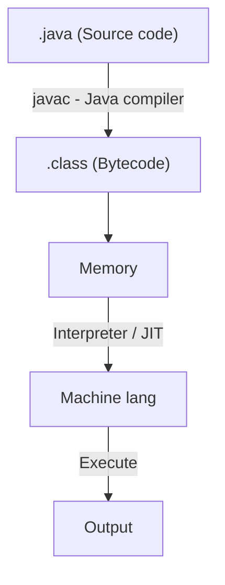
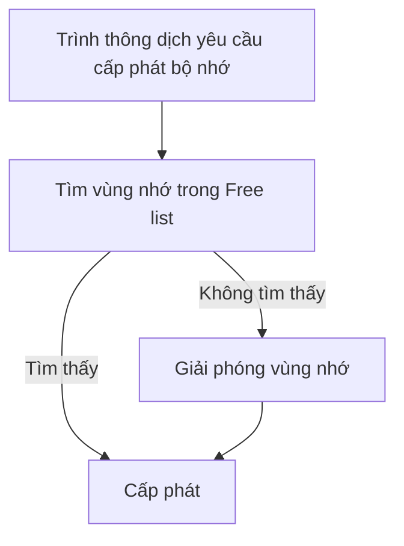

# Tổng quan

## Giới thiệu

**Java** là một *ngôn ngữ lập trình hướng đối tượng*, vừa thông dịch vừa biên dịch, được xây dựng trên nền tảng của C/C++.
Do vậy nó sử dụng các cú pháp tương tự C và các đặc trưng hướng đối tượng giống C++. Lưu ý C/C++ không phải ngôn ngữ lập trình OOP mà chỉ hỗ trợ OOP.

**Java SE** (Java Platform, Standard Edition, Java core) là phiên bản Java tiêu chuẩn, cung cấp đầy đủ các công cụ và thư viện cốt lõi để phát triển ứng dụng Java độc lập (desktop, console, backend,...).

Có 3 loại
1. **Java 2 Standard Edition (J2 SE)**: Dùng để phát triển các ứng dụng đơn, hoặc ứng dụng.
2. **Client-site oJava 2 Enterprise Edition (J2 EE)**: Phát triển các ứng dụng đơn, ứng server-site và JavaServerPage.
3. **Java 2 Micro Edition (J2 ME)**: Phát triển các ứng dụng di động (Mobile), không dây (PDA)

**Đặc trưng**:
- **Mạnh mẽ và dễ sử dụng**:
	- Phải khai báo kiểu dữ liệu, cú pháp nghiêm ngặt.
	- Không có con trỏ. Việc quản lý bộ nhớ do JVM lo.

- **Thuần hướng đối tượng**.

- **Độc lập với phần cứng và OS**:
	- **Mức mã nguồn: Mã nguồn tồn tại ở dạng Bytecode**: Môi trường phát triển của Java được chia làm hai phần: Trình biên dịch và trình thông dịch. Không như C/C++, trình biên dịch của Java chuyển mã nguồn thành dạng bytecode độc lập với phần cứng. Để thực thi chương trình dưới dạng bytecode, *tại mỗi máy cần phải có trình thông dịch của Java (*máy ảo Java, **JVM - Java virtual machine** )*. Máy ảo Java chuyển bytecode thành mã lệnh mà CPU thực thi được.
	- **Mức mã nguồn: Cú pháp và kiểu dữ liệu thống nhất trên mọi OS và phần cứng**: Java có riêng một thư viện các lớp cơ sở. Vì vậy chương trình Java được viết trên một máy có thể dịch và chạy trơn tru trên các loại máy khác mà không cần viết lại.

- **Bảo mật**: Có 4 mức:
	- Tính đóng gói.
	- Compiler kiểm tra lỗi ở source code.
	- Interpreter kiểm tra lỗi ở bytecode.
	- Kiểm tra quá trình nạp chương trình vào bộ nhớ.

# Môi trường Java (JRE, Java Runtime Environment)

Môi trường Java gồm 5 thành phần:
- **Ngôn ngữ Java**: Cú pháp lập trình (class, interface, điều kiện, vòng lặp...).
- **Bytecode**: Mã trung gian (dạng nhị phân) sau khi biên dịch từ mã `.java`.
- **Thư viện lớp chuẩn**: Gồm hàng ngàn class hỗ trợ xử lý chuỗi, tệp, mạng, giao diện,...
- **Máy ảo Java (JVM)**: Thực thi bytecode và cung cấp môi trường chạy an toàn, độc lập nền tảng.
- **Cấu trúc `.class`**: Quy định cách tổ chức bytecode bên trong tệp biên dịch (`.class`).

## Máy ảo Java (Java Virtual Machine, JVM)

**Máy ảo** (Virtual Machine) là một *phần mềm mô phỏng lại một hệ thống máy tính* hoàn chỉnh, bao gồm:
- Bộ nhớ.
- CPU.
- Tập lệnh.
- Quản lý luồng thực thi chương trình.

**JVM** là một máy ảo chuyên dùng để *thực thi chương trình Java*, không phụ thuộc phần cứng hay hệ điều hành.

**Các chức năng tổng quát của JVM**:
- Cho phép chạy mã Java trên mọi nền tảng.
- Quản lý tài nguyên như bộ nhớ, tiến trình, luồng (thread) một cách an toàn.
- Tạo môi trường độc lập giúp Java đạt được *"Write Once, Run Anywhere"*.

**Các chức năng cụ thể của JVM**:
- **Nạp `.class`**: JVM nhận mã bytecode từ trình biên dịch Java (`javac`).
- **Quản lý bộ nhớ**: Gồm heap (dữ liệu động), stack (gọi hàm), metaspace (class metadata).
- **Giải phóng vùng nhớ (Garbage Collector)**: Tự động thu hồi bộ nhớ không dùng nữa.
- **Thông dịch và Biên dịch**: Chạy từng lệnh bytecode hoặc biên dịch sang mã máy qua JIT.

## Quy trình biên dịch, thông dịch và thực thi mã Java:


Trong đó:
- **javac** (Java Compiler): Trình biên dịch mã nguồn `.java` thành bytecode (`.class`). 
- **JIT** (Just-in-time Compiler): Trình biên dịch Java tức thời. Có khả năng biên dịch bytecode thành mã máy ngay khi chương trình đang chạy, giúp tăng hiệu năng so với việc chỉ thông dịch bytecode từng dòng. JIT được dùng thay cho **trình thông dịch** khi cần.
- Từ giai đoạn lưu `.class` vào bộ nhớ, thông dịch và thực thi đều được thực hiện bởi JVM.

## Nguyên lý quản lý bộ nhớ

Trong các ngôn ngữ như C/C++ hay Pascal, người lập trình phải tự tay cấp phát và giải phóng bộ nhớ (dùng `malloc`/`free`, `new`/`delete`, ...). Việc này rất dễ dẫn đến:
- Rò rỉ bộ nhớ (không giải phóng vùng nhớ sau khi dùng).
- Sử dụng vùng nhớ đã bị giải phóng.
- Lỗi phân mảnh bộ nhớ (memory fragmentation)

Java sử dụng mô hình máy ảo Java (JVM) để quản lý bộ nhớ, trong đó **Heap** là vùng cấp phát bộ nhớ chính.

**Phân loại Heap**:
- **Heap tĩnh**: Lưu trữ thông tin về lớp, hằng số, và phương thức.
- **Heap động**: Cấp phát đối tượng lúc chạy (runtime objects). Heap động được chia thành 2 luồng:
	- Luồng chứa các đối tượng.
	- Luồng chứa các con trỏ trỏ tới các đối tượng đó.

**Các kỹ thuật để tối ưu việc sử dụng Heap**:
- **Free list** (danh sách vùng nhớ rảnh): Lưu các khối chưa được sử dụng.
- **Allocated list**: lưu các khối đang được cấp phát.
- **Best-fit allocation**: Khi có một yêu cầu về cấp phát bộ nhớ, hệ thống xem xét trong *free list* để lấy ra khối bộ nhớ đầu tiên có kích cỡ sát nhất. Chiến thuật cấp phát này giảm tối thiểu việc phân mảnh của Heap.
- **Coalescing**: Gom các vùng nhớ rảnh nằm liền kề nhau.
- **Compaction**: Di chuyển các đối tượng để tạo ra vùng nhớ rảnh liên tục → hỗ trợ cấp phát nhanh hơn.

**Quy trình hoạt động**:

Ngoài ra, việc giải phóng vùng nhớ có thể được kích hoạt nếu xuất hiện một số tình huống khẩn cấp.

## Nguyên lý kiểm tra `.class`

Trước khi `.class` được thực thi, **Class Loader** và các thành phần kiểm tra của JVM sẽ tiến hành 4 bước kiểm tra bảo mật để:
- Ngăn mã độc.
- Bảo vệ bộ nhớ, hệ thống file, mạng, và OS.
- Đảm bảo không có hành vi phá hoại hoặc truy cập trái phép

File `.class` gồm ba phần chính:
1. **Bytecode**: Mã trung gian được JVM thực thi.
2. **Thông tin về class**: Danh sách phương thức, các giao diện đã implement, các giá trị có sẵn.
3. **Thuộc tính**: Các metadata khác liên quan đến class.
Các thông tin này được tổ chức thành các bảng:
- **Field Table**: Chứa danh sách biến (thuộc tính).
- **Method Table**: Chứa các phương thức (hàm).
- **Interface Table**: Chứa danh sách interface và hằng số.

**Các bước kiểm tra**:
1. Kiểm tra cú pháp (Syntax check).
2. Kiểm tra các nguyên tắc logic (Semantic check).
3. Kiểm tra luồng hoạt động (Bytecode verification).
4. Kiểm tra các lỗi xảy ra khi thực thi chương trình (Runtime check).

# Bộ công cụ phát triển Java (JDK, Java Development Kit)

**JDK** (Java Development Kit) là bộ công cụ dành cho lập trình viên Java. Nó cung cấp mọi thứ bạn cần để viết, biên dịch, và thực thi ứng dụng Java, bao gồm [[1. Giới thiệu & Cài đặt Java SE#Môi trường Java (JRE, Java Runtime Environment)|JRE]].

**Cài đặt JDK**:
1. Bạn có thể tải JDK tại [trang web chính thức của Oracle](https://www.oracle.com/java/technologies/downloads/#jdk24-windows). Riêng đối với Windows, hãy tải về file `x64 Installer`. Mặc định, folder của JDK 24.0.2 đặt tại `C:\Program Files\Java\jdk-24`.
2. Tạo biến môi trường:
	1. Vào cửa sổ `System properties`, tab `Advanced`, chọn `Environment Variables`.
	2. Tại cửa sổ `Environment Variables`, mục `System Variables` chọn `New...` để tạo biến mới. Hãy đặt `Variable name` là `JAVA_HOME`  và `Variable value` là đường dẫn folder JDK.
	3. Tại biến `PATH`, chọn `Edit...` để thêm giá trị `%JAVA_HOME%\bin`.

Để kiểm tra xem JDK đã được cài đặt chưa, bạn dùng lệnh:
```bash
java -version
```

Để biên dịch một chương trình Java, chạy:
```bash
javac urFile.java
```

Để thực thi một chương trình Java, chạy:
```bash
java urFile
```

Để tiện cho việc sử dụng, bạn cần dùng một IDE. IDE chuyên dùng và đại trà cho Java là **IntelliJ IDEA**. Bạn có thể tại nó tại [trang web chính thức của JetBrains](https://www.jetbrains.com/idea/download/?source=google&medium=cpc&campaign=APAC_en_ASIA_IDEA_Branded&term=intellij+idea&content=693444343121&gad_source=1&gad_campaignid=9730668635&gbraid=0AAAAADloJzj1pAb9m8W2JyRN8yA0i7HCj&gclid=CjwKCAjw1ozEBhAdEiwAn9qbzZQE84tNfGhZxyFrknY_Gx2whQZLZz7mr8MC2Ub7sMk3eYEhc3YuyxoCYvAQAvD_BwE&section=windows#). Bản sử dụng miễn phí (**Comunity - C**) đã đầy đủ các tính năng.
