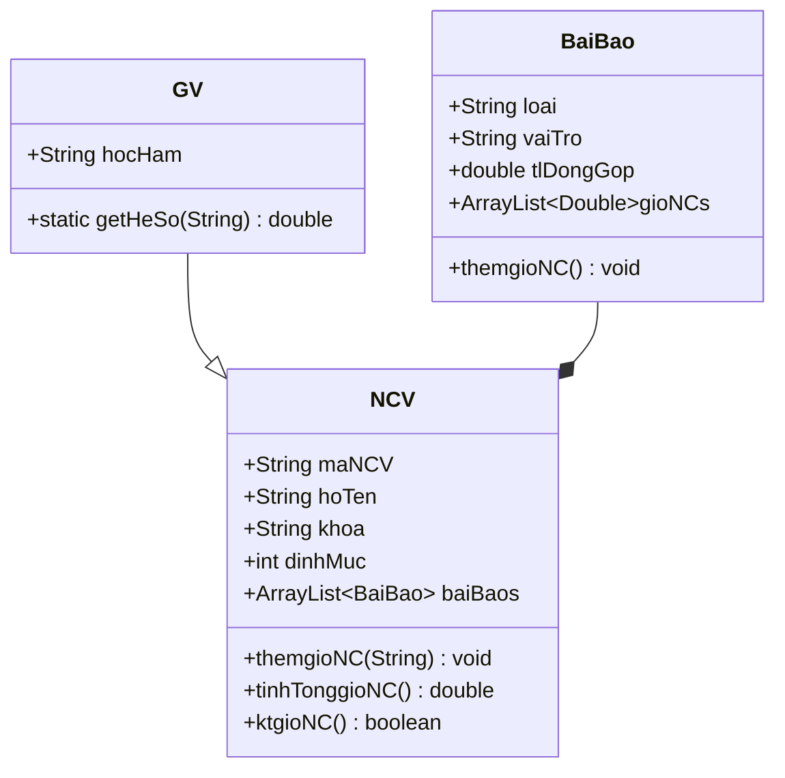
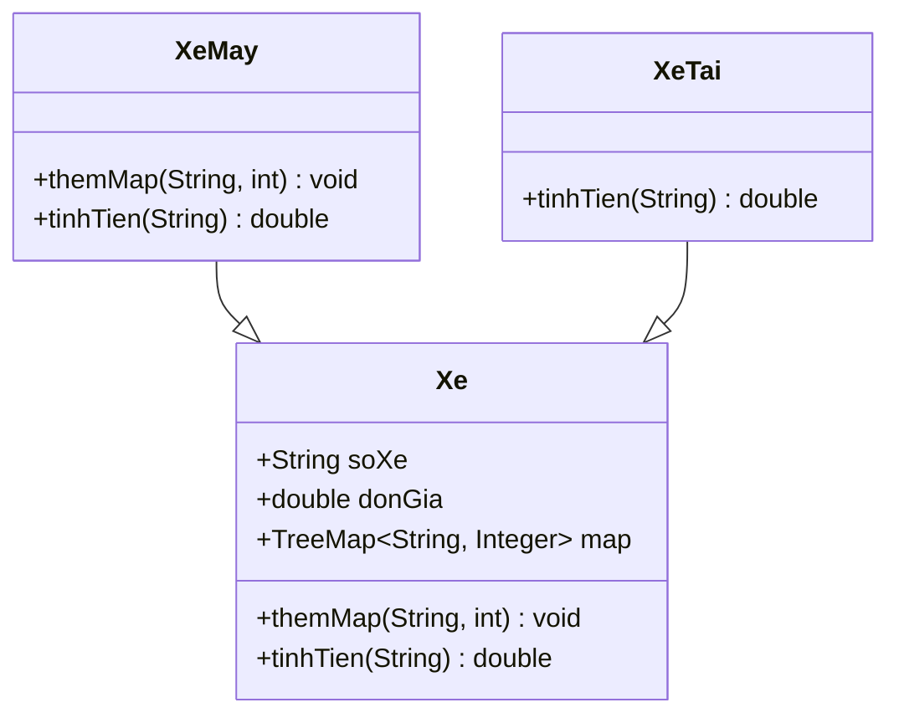
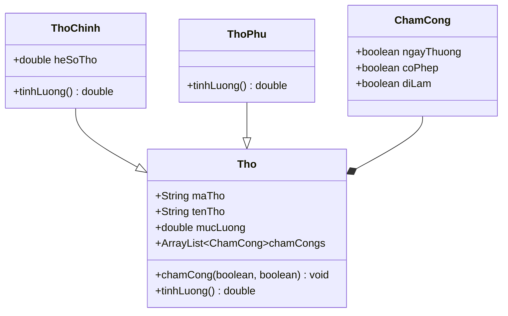

**Quy ước tên biến**:
- **Tên lớp**: Ghi hoa chữ cái đầu.
- **Tên biến**: Ghi thường chữ cái đầu.
- **Tên viết tắt**: Ghi hoa toàn bộ chữ cái.
- **Tên danh sách**: Thêm `s` phía cuối tên danh sách.
- **Tên biến trong vòng lặp**: Ghi tắt và ghi thường toàn bộ.

**Các bước làm bài**:
1. Đọc toàn bộ bài làm và gạch chân xác định các **thuộc tính** -> Tìm các thuộc tính chung và thiết kế **sơ đồ lớp sơ khai**.
2. Gạch chân xác định các **phương thức**, tìm hiểu cách để thực thi các phương thức đó -> **CRUD + di chuyển các thuộc tính** qua lại giữa các lớp để hoàn thành.

# Đề 1

**Câu 1:**



Lấy hệ số giảng viên:
```java
private static double getHeSo(String hocHam) {
    return switch (hocHam) {
        case "GS" -> 1.8;
        case "PGS" -> 1.5;
        case "GVC" -> 1.2;
        case "TS" -> 1.1;
        default -> 1.0;
    };
}
```

Constructors:
```java
public NCV() {
	this.baiBaos = new ArrayList<BaiBao>();
}

public NCV(String maNV, String hoTen, String khoa, int dinhMuc) {
	this.maNV = maNV;
	this.hoTen = hoTen;
	this.khoa = khoa;
	this.dinhMuc = dinhMuc;
	this.baiBaos = new ArrayList<BaiBao>();
}

public GV() {
	super();
}

public GV(String maNV, String hoTen, String khoa, String hocHam) {
    super(maNV, hoTen, khoa, (int)(800 * getHeSo(hocHam)));
    this.hocHam = hocHam;
}

public BaiBao() {
	this.gioNCs = new ArrayList<double>();
}

public BaiBao(String loai, String vaitro, double tlDongGop) {
	this.loai = loai;
	this.vaiTro = vaiTro;
	this.tlDongGop = tlDongGop;
	this.gioNCs = new ArrayList<Double>();
}
```

Ghi nhận giờ nghiên cứu:
```java
public void themgioNC() {
	// Giờ nghiên cứu theo loại bài báo
	double gioNC = 0;
	switch (this.loai) {
		"A": gioNC = 200; break;
		"B": gioNC = 100; break;
		"C": gioNC = 50;
	}
	
	// Tỷ lệ đóng góp
	double tlDongGop = 0;
	switch (this.vaiTro) {
		case "Tg chinh": tlDongGop = 1; break;
		case "Tg lien he": tlDongGop = 0.5; break;
		case "Dong tg": tlDongGop = 0.3;
	}
	
	this.gioNCs.add(gioNC * tlDongGop);
}
```

Tính tổng giờ nghiên cứu:
```java
public double tinhTonggioNC() {
	double tonggioNC = 0;
	
	for (BaiBao baiBao : this.baiBaos)
		for (double gioNC : baiBao.gioNCs)
			tonggioNC += gioNC;
	
	return tonggioNC;
}
```

Kiểm tra giờ nghiên cứu vào cuối năm:
```java
public boolean ktgioNC() {
	return this.tinhTonggioNC() >= this.dinhMuc;
}
```

**Câu 2**:

Giả sử có ArrayList `NCVs`.

a.
```java
for (NCV ncv : NCVs)
	// Tìm NCV
	if (ncv.hoTen.equals("Lê H") &&
		ncv.maNCV.equals("GV20")) {
		// Tìm bài báo
		for (BaiBao bb : ncv.baiBaos)
			if (bb.loai.equals("A") &&
				bb.vaiTro.equals("Dong tg")) {
				bb.themgioNC();
				break;
			}
		break;
	}
```

b.
```java
for (NCV ncv : NCVs)
	if (ncv.ktgioNC())
		System.out.printf("Ma: %s, Ho ten: %s, So luong bai bao: %d, Tong gio nghien cuu: %.2f\n",
			ncv.maNCV,
			ncv.hoTen,
			ncv.baiBaos.size(),
			ncv.tinhTonggioNC()
		);
```

# Đề 2

**Câu 1**:



Constructors:
```java
public Xe() {
	this.map = new TreeMap<String, Integer>();
};

public Xe(String soXe, double donGia) {
	this.soXe = soXe;
	this.donGia = donGia;
	this.map = new TreeMap<String, Integer>();
}

public XeMay() {};

public XeMay(String soXe, double donGia) {
	super(soXe, donGia);
}

public XeTai() {};

public XeTai(String soXe, double donGia) {
	super(soXe, donGia);
}
```

Thêm khối lượng hàng / quãng đường:
```java
// Xe
public void themMap(String ngay, int gt) {
	this.map.put(ngay, gt);
}

// XeMay
public void themMap(String ngay, int khoiLuong) {
	if (khoiLuong > 30) {
		System.out.println("Khoi luong hang vuot muc");
		return;
	}
	super.themMap(ngay, khoiLuong);
}
```

Tính tiền vận chuyển:
```java
// XeMay
public double tinhTien(String ngay) {
	if (!this.map.containsKey(ngay)) {
		System.out.println("Khong tim thay ngay");
		return 0;
	}
	
	return this.map.get(ngay) * super.donGia;
}

// XeTai
public double tinhTien(String ngay) {
	if (!this.map.containsKey(ngay)) {
		System.out.println("Khong tim thay ngay");
		return 0;
	}
	
	double quangDuong = this.map.get(ngay);
	double tlGiam = 0;
	if (quangDuong > 200)
		tlGiam = (int)((quangDuong - 200) / 50) * 0.01;
	
	return quangDuong * super.donGia * (1 - tlGiam);
}
```

**Câu 2**:

Giả sử có ArrayList `xes`.

a.
```java
for (Xe xe : xes)
	if (xe instanceof XeTai && xe.soXe.equals("51C.XXXXX")) {
		XeTai xt = (XeTai) xe;
		
		xt.themMap("03/04/2025", 270);
		System.out.printf("Tien van chuyen %.2f", xt.tinhTien("03/04/2025"));
		break;
	}
```

b.
```java
HashMap<String, Double> xeTien = new HashMap<>();

for (Xe xe : xes)
	for (Map.Entry<String, Integer> pair : xe.map.entrySet()) {
		String ngayht = pair.getKey();
		if ("25/03/2025" <= ngayht && ngayht <= "04/04/2025") {
			
			if (!xeTiens.containsKey(xe.soXe))
				xeTien.put(xe.soXe, xe.tinhTien(ngayht));
			else
				xeTien.put(xe.soXe, xeTien.get(soXe) + xe.tinhTien(ngayht));
		}
	}

for (Map<String, Double> pair : xeTien)
	System.out.printf("So xe %s - Tong tien %.2f\n",
		pair.getKey(),
		pair.getValue()
	);
```

# Đề 3

**Câu 1**:



Constructors:
```java
public ChamCong(boolean ngayThuong, boolean coPhep, boolean diLam) {
	this.ngayThuong = ngayThuong;
	this.coPhep = coPhep;
	this.diLam = diLam;
}

public ChamCong() {
	this(true, true, true);
}

public Tho(String maTho, String tenTho, String mucLuong) {
	this.maTho = maTho;
	this.tenTho = tenTho;
	this.mucLuong = mucLuong;
	this.chamCongs = new ArrayList<ChamCong>();
}

public Tho() {
	this("", "", 0);
}

public ThoChinh(String maTho, String tenTho, String mucLuong, double heSoTho) {
	super(maTho, tenTho, mucLuong);
	this.heSoTho = heSoTho;
}

public ThoChinh() {
	super();
	this.heSoTho = 0.1;
}

public ThoPhu(String maTho, String tenTho, double mucLuong) {
	super(maTho, tenTho, mucLuong);
}

public ThoPhu() {
	super();
}
```

Chấm công:
```java
public void chamCong(boolean ngayThuong, boolean coPhep, boolean diLam) {
	this.chamCongs.add(new ChamCong(ngayThuong, coPhep, diLam));
}
```

Tính lương tháng:
```java
// ThoChinh
public double tinhLuong() {
	double luong = 0;
	
	for (ChamCong cc : super.chamCongs) {
		double heSo = 1;
		if (cc.diLam) heSo = cc.ngayThuong ? 1 : 2;
		else heSo = cc.coPhep ? 0.5 : 0;
		
		luong += super.mucLuong * heSo * this.heSoTho;
	}
	
	return luong;
}

// ThoPhu
public double tinhLuong() {
	double luong = 0;
	
	for (ChamCong cc : super.chamCongs) {
		double heSo = 1;
		if (cc.diLam) heSo = cc.ngayThuong ? 1 : 1.5;
		else heSo = cc.coPhep ? 0.25 : 0;
		
		luong += super.mucLuong * heSo;
	}
	
	return luong;
}
```

**Câu 2**:

Giả sử có ArrayList `thos`.

a.
```java
for (Tho t : thos)
	if (t.tenTho.equals("Nguyễn A") && t.maTho.equals("TH013")) {
		t.chamCong(true, true, false);
		// Giả sử hôm nay là ngày thường
		break;
	}
```

b.
```java
// Giả sử hiện tại là tháng 3
// Do mỗi tháng thì chamCongs refresh 1 lần

for (Tho t : thos) {
	System.out.printf("Ma: %s, Ten: %s\n", t.maTho, t.tenTho);
	
	int soNgayLam = 0;
	int soNgayNghiPhep = 0;
	int soNgayNghi = 0;
	
	for (ChamCong cc : t.chamCongs)
		if (!cc.diLam) {
			if (cc.coPhep) soNgayNghiPhep += 1;
			soNgayNghi += 1;
		} else
			soNgayLam += 1;
	
	System.out.printf("So ngay lam viec: %d\n", soNgayLam);
	System.out.printf("So ngay nghi phep: %d\n", soNgayNghiPhep);
	System.out.printf("So ngay khong phep: %d\n", soNgayNghi - soNgayNghiPhep);
	
	if (t instanceof ThoChinh) {
		ThoChinh tc = (ThoChinh) t;
		System.out.println("Loai tho: Tho Chinh");
		System.out.printf("Luong: %.2f\n", tc.tinhLuong());
	} else {
		ThoPhu tp = (ThoPhu) t;
		System.out.println("Loai tho: Tho Phu");
		System.out.printf("Luong: %.2f\n", tp.tinhLuong());
	}
}
```
