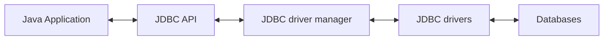

# Tổng quan về JDBC

JDBC là API dùng để kết nối các chương trình Java và databases.

Package: `java.sql.*` hoặc `javax.sql.*`.

# Kiến trúc JDBC





### JDBC Driver

Là thành phần giao tiếp trực tiếp với database.

**Driver manager**: Quản lý các JDBC driver.

**Phân loại**:

|                      | Nguyên lý                                       | Đặc điểm                                   | Hiệu năng |
| -------------------- | ----------------------------------------------- | ------------------------------------------ | --------- |
| **JDBC ODBC**        | Thông qua trung gian là ODBC API của Microsoft. | Kết nối được mọi loại database.            | Thấp.     |
| **Network protocol** | Thông qua trung gian là middleware server.      | Kết nối được mọi loại database.            | Thấp.     |
| **Native API**       | Sử dụng native library của từng database.       | Cần cài đặt riêng biệt trên từng database. | Cao.      |
| **Native Protocol**  | Kết nối trực tiếp với từng database.            | Cần cài đặt riêng biệt trên từng database. | Cao.      |

### JDBC API

Tập hợp các interface cung cấp các phương thức thao tác với JDBC.

**Bao gồm**:
- **DriverManager**: Nạp các driver và tạo Connection đến database.
- **Driver**: Tượng trưng cho driver của JDBC.
- **Connection**: Tượng trưng cho một kết nối đến database.
- **Statement**: Thuộc về 1 Connection, tương ứng với 1 query lên database.
- **PreparedStatement**: Giống Statement nhưng query được compile trước (Pre-compiled SQL) để chống SQL-injection.
- **ResultSet**: Các dữ liệu do database phản hồi.
	- **ResultSetMetaData**: Chứa metadata của dữ liệu trả về.
	- **DatabaseMetaData**: Chứa metadata của database.
- **SQLException**: Các ngoại lệ liên quan.

# Sử dụng JDBC

**Quy trình**:
1. Đăng ký driver.
2. Cài đặt thông số kết nối với database.
3. Tạo Connection.
4. Tạo Statement / PreparedStatement.
5. Thực thi lệnh và nhận về ResultSet.
6. Đóng Connection.

**VD1.1**: Bố cục sử dụng JDBC:
```java
String url = "jdbc:mysql://localhost:3306/world?user=root&password=";
String driver = "com.mysql.jdbc.Driver";
String userName = "ADMIN";
String password = "12345";

try {
	Class.forName(driver);
	con = DriverManager.getConnection(url, userName, password);
	// Thực thi truy vấn ...
	con.close();
} catch(Exception e) {
	// ...
}
```

**VD1.2**: Bố cục sử dụng transaction:
```java
try {
	// Bước 1, 2 ...
	con.setAutoCommit(false);
	// Thực thi truy vấn ...
	con.commit();
} catch (SQLException ex) {
	con.rollBack();
} finally {
	con.close();
}
```

**VD2.1**: Truy vấn bằng **Statement**:
```java
Statement stat = con.createStatement();

// Đối với SELECT
String sql = "SELECT * FROM users";
ResultSet rs = stat.executeQuery(sql);

// Đối với INSERT, UPDATE, DELETE
String sql = "INSERT INTO users VALUES('A', 'B')";
int rs = stat.executeUpdate(sql); // Return số dòng bị tác động

// Đối với DROP
String sql = "DROP TABLE users";
stat.execute(sql);
```

**VD2.2**: Truy vấn bằng **PreparedStatement**:
```java
String sql = "SELECT * FROM users WHERE username = ? AND password = ?";

PreparedStatement prest = con.prepareStatement(sql);

// prest có thể được tái sử dụng nhiều lần thông qua phương thức .set
prest.setString(1, "caothaibao");
prest.setInt(2, 12345);

// Thực thi
ResultSet rs = prest.executeQuery(sql);
// Tương tự với .executeUpdate và .execute
```

**VD3**: Đọc **ResultSet**:
```java
while(rs.next())
	int id = rs.getInt("user_id");
	String username = rs.getString("username");
}
```

Các phương thức thường dùng là `getInt()`, `getString()`, `getDate()`, `getFloat()`, `getObject()`.

**VD4**: **CallableStatement**: Là những statement có thể gọi các procedure / function trong database.

```sql
CREATE PROCEDURE getAccounts
AS ...
```
```java
String call = "{call getAccounts}";
CallableStatement caSt = con.prepareCall(call);
ResultSet rs = caSt.executeQuery();
```

```sql
CREATE PROCEDURE deleteAccount
@username VARCHAR 50
AS ...
```
```java
String call = "{call deleteAccount(?)}"; // Prepared
CallableStatement caSt = con.prepareCall(call);
caSt.setString(1, user);
caSt.execute();
```

