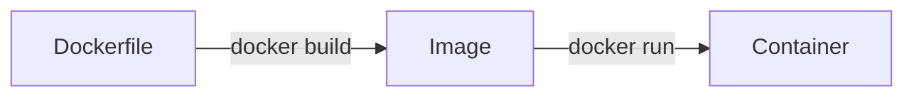

**Bài đọc trước**:
- [[1. Tổng quan về hệ thống máy tính và OS|Hệ điều hành (OS)]].
- [[1. Tổng quan về mạng máy tính|Mạng máy tính (Computer networking)]].
- [[1. Tổng quan về Dữ liệu & Cơ sở dữ liệu|Cơ sở dữ liệu (Database)]].
- [[0. Giới thiệu & Cài đặt Pandas|Pandas]].

# Giới thiệu

## Container

**Containerlization** là công nghệ giúp cài đặt nhiều máy ảo trên 1 máy chủ vật lý (*host machine*).

**Container engine** là phần mềm sử dụng công nghệ containerlization để đóng gói phần mềm cùng với tất cả dependency (*thư viện, mã nguồn, cấu hình, ...*) vào trong một môi trường riêng biệt gọi là *container*, nó sẽ quản lý và vận hành các container này để phần mềm của chúng ta có thể chạy ở trong đó.

**Đặc điểm của container**:
- *Chứa tất cả mọi thứ mà phần mềm đó cần để chạy*. Bào gồm OS, thư viện,...
- *Các process trong một container bị cô lập*, tách biệt với các tiến trình của các container khác trong cùng hệ thống
- **Máy ảo (Virtual machine)** một OS thực thụ, riêng biệt. Container giống như một *process* chạy trên hệ điều hành host.

**Tại sao container lại quan trọng?**
- Dễ dàng chia sẻ dự án với bất kỳ ai mà không lo bị mâu thuẫn hoặc thiếu dependency.
- Các cài đặt bên trong container không bị mâu thuẫn với các cài đặt ở host machine.

## Docker

Docker là một phần mềm hỗ trợ containerlization.

Có 3 bước hoạt động chính:


Trong đó:
- **Dockerfile**: Bao gồm các định nghĩa, hướng dẫn cho Docker để xây dựng các Image. Dockerfile không có phần mở rộng.
- **Image** giống như class của các **Container**.
- **Container** là ứng dụng đang thực thi.

# Cài đặt

Docker vốn được sinh ra OS *Linux*, sau này mới mở sang các OS khác như Windows, Mac,... Nhưng khi cài Docker vào các OS này thì Docker sẽ tự cài thêm một máy ảo Linux để hoạt động, làm giảm hiệu năng.

**Docker Desktop** là một GUI để sử dụng Docker .Cài đặt Docker Desktop tại [Docker docs / Get Docker](https://docs.docker.com/get-started/get-docker/).

Kiểm tra phiên bản Docker:
```sh
docker --version
```
