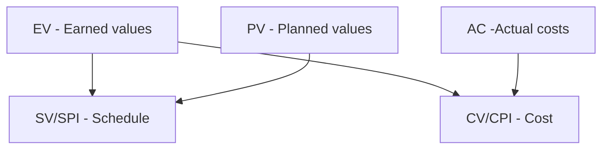

# Khởi động dự án (Initating)

| Quy trình                                               | Mục đích                                                                                    | Input                                                                                                                                                                   | Tool & Technique                                                                                                                                           | Output                                      |
| ------------------------------------------------------- | ------------------------------------------------------------------------------------------- | ----------------------------------------------------------------------------------------------------------------------------------------------------------------------- | ---------------------------------------------------------------------------------------------------------------------------------------------------------- | ------------------------------------------- |
| **Xây dựng điều lệ dự án (Develop project charter)** | Chính thức phê duyệt dự án, trao quyền cho PM và xác định mục tiêu cấp cao của dự án.       | - Business Case.  - Benefits Management Plan.  - Agreements.  - Enterprise Environmental Factors (EEF).  - Organizational Process Assets (OPA). | - Expert Judgment.  - Data Gathering (Brainstorming, Focus Group, Interview).  - Interpersonal & Team Skills.  - Meetings.               | - Project Charter.  - Assumption Log. |
| **Nhận diện bên liên quan (Identify Stakeholders)**  | Xác định tất cả các bên liên quan và phân tích mức độ ảnh hưởng, quyền lực, lợi ích của họ. | - Project Charter.  - Business Documents.  - Agreements.  - EEF.  - OPA.                                                                        | - Stakeholder Analysis.  - Power/Interest Grid.  - Power/Influence Grid.  - Salience Model.  - Expert Judgment.  - Meetings. | - Stakeholder Register.                     |

# Lập kế hoạch quản lý dự án (Planning)

### Quản lý phạm vi (Scope management)

Gồm các bước sau:

| Quy trình                | Mục đích                                | Input                                                   | Tool & Technique                                                                                                          | Output                                                                   |
| ------------------------ | --------------------------------------- | ------------------------------------------------------- | ------------------------------------------------------------------------------------------------------------------------- | ------------------------------------------------------------------------ |
| **Collect Requirements** | Thu thập yêu cầu từ stakeholder.        | - Project Charter.  - Stakeholder Register.       | - Interview.  - Questionnaire.  - Workshop.  - Brainstorming.  - Observation.  - Prototype. | - Requirements Documentation.  - Requirements Traceability Matrix. |
| **Define Scope**         | Xây dựng Project Scope Statement.       | - Requirements Documentation.  - Project Charter. | - Expert Judgment.  - Product Analysis.                                                                             | - Project Scope Statement.                                               |
| **Create WBS**           | Phân rã phạm vi thành các Work Package. | - Scope Statement.  - Requirements Documentation  | - Decomposition.                                                                                                          | - WBS.  - WBS Dictionary.  - Scope Baseline.                 |

#### Cấu trúc phân rã công việc - WBS (Work breakdown structure)

WBS là một sự **phân rã phân cấp** toàn bộ phạm vi công việc mà nhóm dự án cần thực hiện để đạt được các mục tiêu và tạo ra các sản phẩm bàn giao (deliverables) yêu cầu. Một công việc được tượng trưng bằng sản phẩm hoặc kết quả của công việc đó.

#### Tiêu chí đánh giá WBS

- **Nguyên lý cơ bản:** Một đơn vị công việc chỉ xuất hiện tại một nơi duy nhất trong WBS. nội dung của một mục WBS phải bằng tổng các công việc con bên dưới nó.
- **Độ chi tiết:** Từng công việc trong WBS nên được chi tiết tới mức thấp nhất, thường là **dưới 80 giờ làm việc** để dễ dàng quản lý.
- **Đầy đủ:** Một công việc được coi là phân rã đủ khi tình trạng công việc có thể đo lường được, thời gian và chi phí dễ ước lượng, và công việc có thể được phân công độc lập cho các cá nhân. Nếu không thỏa mãn, cần tiếp tục **phân rã tiếp**.

#### Phân loại WBS

- **Deliverable-oriented WBS**: Phân chia dựa vào *sản phẩm làm ra* của mỗi công việc.
- **Phase-oriented WBS**: Phân chia dựa vào *thời gian thực hiện* công việc.
- **Organizational-oriented WBS**: Phân chia dựa vào *đặc điểm các thành viên trong nhóm* xây dựng dự án.
- **System-oriented WBS**: Phân chia dựa vào *cấu trúc hệ thống* của sản phẩm làm ra của dự án.
- **Hybrid-oriented WBS**: Phương pháp *lai*.

#### Phân rã WBS (Decomposition)

Là kỹ thuật chia nhỏ công việc để xây dựng WBS.
1. **Xác định và phân tích** các sản phẩm bàn giao và công việc liên quan.
2. **Cấu trúc và tổ chức** WBS theo các cấp bậc hợp lý.
3. **Chia nhỏ các cấp trên** thành các thành phần chi tiết ở cấp thấp hơn.
4. **Phát triển và gán mã định danh** (identification codes) cho từng thành phần trong WBS.
5. **Xác nhận** mức độ phân rã là phù hợp (không quá nông cũng không quá sâu)

#### Các phương pháp tiếp cận xây dựng WBS

- **Tiếp cận từ trên xuống (Top-down):** Bắt đầu từ *mục tiêu lớn nhất* của dự án, sau đó chia nhỏ dần thành các thành phần chi tiết.
- **Tiếp cận từ dưới lên (Bottom-up):** Bắt đầu từ *các công việc chi tiết nhất*, sau đó nhóm chúng lại thành các hạng mục công việc lớn hơn,,.
- **Tiếp cận tương tự (Analogy approach):** Xem xét *WBS của các dự án tương tự đã thực hiện* trước đó và điều chỉnh lại cho phù hợp với dự án hiện tại.
- **Sơ đồ tư duy (Mind-mapping):** Thường dùng cho các dự án có tính sáng tạo cao.
- **Sử dụng mẫu (Templates):** Sử dụng các *tiêu chuẩn WBS cụ thể của ngành hoặc các mẫu có sẵn của tổ chức* để làm khung sườn.

### Quản lý tiến độ (Schedule management)

Gồm các bước sau:

| Quy trình                       | Mục đích                              | Tool & Technique                                                                                | Output                                          |
| ------------------------------- | ------------------------------------- | ----------------------------------------------------------------------------------------------- | ----------------------------------------------- |
| **Define Activities**           | Xác định các hoạt động cần thực hiện. |                                                                                                 | - Activity List.  - Milestone List.       |
| **Sequence Activities**         | Xác định trình tự công việc.          | - Precedence Diagramming Method (PDM).                                                          | - Project Schedule Network Diagram.             |
| **Estimate Activity Durations** | Ước lượng thời gian.                  | - Analogous Estimating.  - Parametric Estimating.  - Three-point Estimating (PERT). | - Duration Estimates                            |
| **Develop Schedule**            | Xây dựng lịch trình hoàn chỉnh.       | - Critical Path Method (CPM).  - Resource Leveling.  - What-if Analysis.            | - Schedule Baseline.  - Project Schedule. |

#### Sơ đồ AON (Activity on Node)

- Các nút tượng trưng cho các công việc. Nút $N_0$ là bắt đầu (không có công việc) và $N_n$ là nút kết thúc.
- Cung $N_i\xrightarrow{t_{ij}}N_j$ biểu thị: Nút $N_i$ cần $t_{ij}$ thời gian để hoàn thành, và cần thực hiện trước nút $N_j$.
- Mỗi nút cần đính kèm 4 loại thông tin:
	- **Thời điểm sớm nhất bắt đầu của nút $\text{hiện tại}$ **:$$\boxed{\text{TĐ sớm nhất}_\text{hiện tại}=\max{(\text{TĐ sớm nhất}_\text{liền trước}+\text{TG hoàn thành}_\text{liền trước})}}$$
	- **Thời điểm trễ nhất bắt đầu của nút $\text{hiện tại}$ **: $$\boxed{\text{TĐ trễ nhất}_\text{hiện tại}=\min{(\text{TĐ trễ nhất}_\text{liền sau}-\text{TG hoàn thành}_\text{hiện tại})}}$$.
	- **Khoảng dư toàn phần của nút $\text{hiện tại}$** (thả nổi toàn phần): Là thời gian tối đa công việc có thể kéo dài mà *không ảnh hưởng đến tiến độ dự án*. $$\boxed{\text{Khoảng dư toàn phần}=\text{TĐ trễ nhất}-\text{TĐ sớm nhất}}$$
	- **Khoảng dư tự do của nút $\text{hiện tại}$** (thả nổi tự do): Là thời gian tối đa công việc có thể kéo dài mà *không ảnh hưởng đến thời gian bắt đầu của các công việc sau nó*: $$\boxed{\text{Khoảng dư tự do}_\text{hiện tại}=\min{(\text{TĐ sớm nhất}_\text{liền sau})}-\text{TĐ sớm nhất}_\text{hiện tại}-\text{TG hoàn thành}_\text{hiện tại}}$$
	Khi vẽ sơ đồ chỉ cần thể hiện thông tin thời điểm sớm nhất và trễ nhất bắt đầu.
- **Đường găng (Critical path)**:
	- Là đường có độ dài dài nhất trong sơ đồ AON, thể hiện *tổng thời gian thực hiện ngắn nhất của dự án*.
	- Độ dài của đường găng là *lớn nhất*.
	- Các nút trên đường găng có *thời điểm sớm nhất bắt đầu = thời điểm trễ nhất bắt đầu*.
	- Các đường nằm ngoài đường găng có thể kéo dài hơn dự kiến một khoảng biên độ cho phép, và cũng có thể sẽ trở thành đường găng.
	- Mỗi dự án có thể có nhiều đường găng.

**Cách xét 1 sự delay 1 công việc có thể ảnh hưởng đến tiến độ dự án hay không?**
- Xét các thời điểm bắt đầu từ thời điểm bắt đầu sớm nhất đến trễ nhất của dự án.
- Xét định thời gian làm việc và thời gian dự trữ ở các trường hợp trên.
- Xét xem khi delay ở các trường hợp trên có thể sử dụng thời gian dự trữ thay không. Nếu không thì sự delay này có ảnh hưởng đến tiến độ dự án.

**Rút ngắn lịch biểu**:
- Tính toán *thời gian hoàn thành tối thiểu* mỗi công việc và *chi phí khi rút ngắn 1 ngày* thời gian hoàn thành mỗi công việc.
- Rút ngắn lịch biểu tức là **rút ngắn đường găng**, và đảm bảo không có đường nào có độ dài lớn hơn (các) đường găng.
- Tức có nghĩa:
	- Luôn chọn các nút có chi phí nhỏ nhất để rút trước.
	- Chỉ được rút những nút có trong đường găng.
	- Phải rút sao cho **không có đường nào có độ dài lớn hơn (các) đường găng** ở bất kỳ thời điểm nào.

Khi phải rút ngắn nhiều đường găng, có 2 chiến lược sau nên dùng theo thứ tự ưu tiên giảm dần:
1. Rút ngắn các công việc chung của các đường găng (càng nhiều điểm chung càng tốt).
2. Rút ngắn riêng lẻ các đường găng.

### Quản lý chi phí (Schedule management)

Gồm các bước sau:

| Quy trình            | Mục đích                              | Input                                         | Tool & Technique                                                 | Output                                                  |
| -------------------- | ------------------------------------- | --------------------------------------------- | ---------------------------------------------------------------- | ------------------------------------------------------- |
| **Estimate Costs**   | Ước lượng chi phí dự án.              | - WBS.  - Activity Cost Estimates.      | - Analogous.  - Parametric.  - Bottom-up Estimating. | - Cost Estimates.                                       |
| **Determine Budget** | Thiết lập ngân sách và Cost Baseline. | - Cost Estimates.  - Schedule Baseline. | - Cost Aggregation.  - Reserve Analysis.                   | - Cost Baseline.  - Project Funding Requirements. |

#### Đường cơ sở chi phí (Cost Baseline)

**Cost Baseline** (Đường cơ sở chi phí) là **phiên bản ngân sách được phê duyệt**, được dùng làm chuẩn để đo lường và kiểm soát chi phí dự án.

Cost Baseline = "Kế hoạch chi tiêu chuẩn" mà dự án cam kết thực hiện.

Cost Baseline thể hiện bằng biểu đồ đường chi phí tích lũy theo thời gian.

### Quản lý rủi ro (Risk management)

Gồm các bước sau:

| Quy trình                              | Mục đích                         | Tool & Technique                                                                                                                           | Output                      |
| -------------------------------------- | -------------------------------- | ------------------------------------------------------------------------------------------------------------------------------------------ | --------------------------- |
| **Identify Risks**                     | Xác định những loại rủi ro.      | - Brainstorming.  - Checklist.  - SWOT Analysis - Interview.                                                                | - Risk Register.            |
| **Perform Qualitative Risk Analysis**  | Xếp hạng rủi ro.                 | - Probability & Impact Matrix.                                                                                                             | - Prioritized Risks.        |
| **Perform Quantitative Risk Analysis** | Định lượng tác động của rủi ro.  | - Monte Carlo Simulation.  - Decision Tree Analysis.  - EMV.                                                                   | - Quantified Risk Exposure. |
| **Plan Risk Responses**                | Lập kế hoạch ứng phó với rủi ro. | **Threats**: - Avoid - Mitigate - Transfer - Accept  **Opportunities**: - Exploit - Enhance - Share - Accept | - Risk Response Plan.       |

### Quản lý nguồn lực (Resource Management)

| Mục đích                                             | Tool & Technique                               | Output                                             |
| ---------------------------------------------------- | ---------------------------------------------- | -------------------------------------------------- |
| Xác định vai trò và trách nhiệm nhân sự trong dự án. | - Organizational Charts.  - RACI Matrix. | - Resource Management Plan.  - Team Charter. |

#### RACI Matrix

RACI Matrix là ma trận phân công trách nhiệm. RACI giúp trả lời câu hỏi "Ai làm gì?".

| Ký hiệu | Viết tắt của | Ý nghĩa                 |
| ------- | ------------ | ----------------------- |
| R       | Responsible  | Người làm.              |
| A       | Accountable  | Người chịu trách nhiệm. |
| C       | Consulted    | Người được hỏi.         |
| I       | Informed     | Người được báo.         |

>[!tip]
>- R làm.
>- A chịu.
>- C góp ý.
>- I biết.

**VD**:

|Công việc|PM|BA|Dev|
|---|---|---|---|
|Thu thập yêu cầu|A|R|I|
|Thiết kế|A|C|R|

# Thực thi dự án (Executing)

| Quy trình                                          | Mục đích                                          | Input                                                             | Tool & Technique                                          | Output                      |
| -------------------------------------------------- | ------------------------------------------------- | ----------------------------------------------------------------- | --------------------------------------------------------- | --------------------------- |
| **Quản lý tri thức (Manage Project Knowledge)** | Tạo và chia sẻ tri thức dự án.                    | --                                                                | --                                                        | - Lessons Learned Register. |
| **Quản lý chất lượng (Manage Quality)**         | Đảm bảo quy trình tạo ra sản phẩm đạt chất lượng. | - Audit.  - Root Cause Analysis.  - Process Analysis. | --                                                        | - Quality Reports.          |
| **Phát triển đội ngũ (Develop team)**           | Nâng cao năng lực nhóm dự án.                     | --                                                                | - Training.  - Team Building.  - Recognition. | --                          |

#### Mô hình Tuckman

Tuckman Model là mô hình mô tả các giai đoạn phát triển của nhóm dự án do nhà tâm lý học Bruce Tuckman đề xuất.

Gồm các giai đoạn sau:

| Giai đoạn                         | Ý nghĩa                      | Đặc điểm                                                                     |
| --------------------------------- | ---------------------------- | ---------------------------------------------------------------------------- |
| **Forming (Hình thành)**       | Đội nhóm mới được thành lập. | - Thành viên còn xa lạ. - Chưa hiểu vai trò. - Phụ thuộc nhiều vào PM. |
| **Storming (Xung đột)**        | Bắt đầu xuất hiện bất đồng.  | - Tranh luận. - Mâu thuẫn. - Cạnh tranh quyền lực.                     |
| **Norming (Ổn định)**          | Nhóm bắt đầu thống nhất.     | - Quy trình rõ ràng. - Vai trò rõ ràng. - Hợp tác tốt hơn.             |
| **Performing (Hiệu suất cao)** | Nhóm hoạt động hiệu quả.     | - Tự quản. - Tin tưởng lẫn nhau. - Năng suất cao.                      |
| **Adjourning (Giải thể)**      | --                           | - Dự án kết thúc. - Nhóm giải tán. - Tổng kết bài học kinh nghiệm.     |

#### Quality Assurance (QA) & Quality Control (QC)

| Tiêu chí           | QA (Quality Assurance)                      | QC (Quality Control)         |
| ------------------ | ------------------------------------------- | ---------------------------- |
| **Mục tiêu**       | Đảm bảo **quy trình** đúng                  | Kiểm tra **sản phẩm** đúng   |
| **Tập trung**      | Quy trình                                   | Sản phẩm                     |
| **Hướng tiếp cận** | Phòng ngừa lỗi                              | Phát hiện lỗi                |
| **Thời điểm**      | Trong suốt quá trình                        | Sau khi tạo ra sản phẩm      |
| **VD**             | Thiết lập coding standard, quy trình review | Test chức năng, kiểm tra lỗi |

# Theo dõi & kiểm soát dự án (Monitoring & Controlling)

| Quy trình                                                              | Mục đích                                                             | Input                                                                                   | Tool & Technique                                                           | Output                                                                                        |
| ---------------------------------------------------------------------- | -------------------------------------------------------------------- | --------------------------------------------------------------------------------------- | -------------------------------------------------------------------------- | --------------------------------------------------------------------------------------------- |
| **Kiểm soát thay đổi tích hợp (Perform Integrated Change Control)** | Đánh giá và phê duyệt mọi thay đổi ảnh hưởng đến baseline của dự án. | - Change Requests.  - Project Management Plan.  - Work Performance Reports. | - Change Control Board (CCB).  - Expert Judgment.  - Meetings. | - Approved Change Requests.  - Rejected Change Requests.  - Project Plan Updates. |

#### Quy trình xử lý yêu cầu thay đổi (Change request)

#### Phân tích tài chính dự án

##### Giá trị tương lai (Future value)
\[Đọc thêm]
$$\boxed{v_n=v_0\times(1+r)^n}$$
- $v_0$: Giá trị hiện tại.
- $v_n$: Giá trị sau $n$ kỳ.
- $r$: Lãi suất mỗi kỳ.

##### Chuỗi tiền tệ đều (Present value)
\[Đọc thêm]

Là tổng giá trị của một chuỗi tiền đều mỗi kỳ, khi xét ở hiện tại.
$$
\begin{align}
PV&=\sum_{i=1}^n\dfrac{v}{(1+r)^i}\\
&=\boxed{\dfrac{v}{r}\times\left(1-\dfrac{1}{(1+r)^n}\right)}
\end{align}
$$
- $v_i$: Khoảng tiền nhận / trả ở mỗi kỳ.

##### Giá trị hiện tại thuần (Net present value - NPV)

Là số tiền lời của dự án (doanh thu trừ chi phí - dòng tiền) ở một khoảng thời gian, khi xét ở hiện tại. NPV là một dạng tổng quát của chuỗi tiền tệ đều vì giá trị mỗi kỳ nhận được của NPV không đều,
$$\boxed{NPV_{1..n}=\sum_{t=1}^nNPV_t=\sum_{t=1}^n\frac{B_t-C_t}{(1+r)^t}}$$
- $B_t$: Doanh thu trong kỳ $t$.
- $C_t$: Chi phí trong kỳ $t$.
- $B_t-C_t$: Lợi nhuận / Dòng tiền thuần tại thời điểm $t$.

##### Tỷ suất sinh lời (Return on vestment - ROI)

Là khả năng sinh lời của dự án:
$$\boxed{ROI=\frac{B-C}{C}=\frac{NPV}{C}}$$

##### Thời điểm hòa vốn

**Phương pháp 1 - Khi có doanh thu và chi phí**:
- Dùng sơ đồ đường thể hiện *chi phí tích lũy* và *doanh thu tích lũy*.
- Giao của *2 đường đó* chính là thời điểm hoàn vốn.

**Phương pháp 2 - Khi chỉ có dòng tiền thuần**:
- Dùng sơ đồ đường thể hiện *dòng tiền thuần tích lũy*.
- Giao của *đường đó với trục hoành* là thời điểm hoàn vốn.

#### Đo lường hiệu suất (Earned Value Management - EVM)

Là kỹ thuật cho biết mức độ hoàn thành của dự án so với kế hoạch trong môi trường dự đoán (Predictive environments).

##### Các chỉ số nguyên tử

**BAC (Budget at completion)**
$$\boxed{\text{BAC}=\sum\text{Ngân sách dự kiến hoặc chi phí}}$$

**PV (Planned values)**
$$\boxed{\text{PV}=\frac{\text{Tổng thời gian đã trôi qua}}{\text{Tổng thời gian hoàn thành dự án}}\times\text{BAC}}$$

**EV (Earned values)**
$$\boxed{\text{EV}=\frac{\text{Khối lượng công việc đã hoàn thành}}{\text{Tổng khối lượng công việc dự kiến}}\times\text{BAC}}$$

**AC (Actual costs)**
Chi phí thực tế phải chi trả.

##### Các chỉ số đánh giá tình trạng hiện tại của dự án

| Chỉ số                                                       | Xấu (<)      | Đúng kế hoạch (=) | Tốt (>)       |
| ------------------------------------------------------------ | --------------- | -------------------- | ---------------- |
|                                                              | **Trễ tiến độ** | **Đúng tiến độ**     | **Vượt tiến độ** |
| **Schedule variance**$$\boxed{SV=EV-PV}$$                    | $SV<0$          | $SV=0$               | $SV>0$           |
| **Schedule performance index**$$\boxed{SPI=\dfrac{EV}{PV}}$$ | $SPI<1$         | $SPI=1$              | $SPI>1$          |
|                                                              | **Vượt chi**    | **Trong chi**        | **Dưới chi**     |
| **Cost variance**$$\boxed{CV=EV-AC}$$                        | $CV<0$          | $CV=0$               | $CV>0$           |
| **Cost performance index**$$\boxed{CPI=\dfrac{EV}{AC}}$$     | $CPI<1$         | $CPI=1$              | $CPI>1$          |

>[!tip]
>- **Đo schedule** -> Sử dụng values.
>- **Đo cost** -> Sử dụng cost.
>- Cả 2 đều có hạng tử đầu là **EV**.

##### Các chỉ số dự đoán tình trạng tương lai của dự án

**ETC (Estimate to completion)**
Chi phí *cần bổ sung cho tới khi* kết thúc dự án.$$\boxed{\text{ETC}=\dfrac{\text{Tổng thời gian còn lại để thực hiện dự án}}{SPI}}$$

**EAC (Estimate at completion)**
Chi phí *ước lượng sau khi* kết thúc dự án.$$\boxed{\text{EAC}=\dfrac{BAC}{CPI}}$$

>[!tip]
>- **to** -> Dùng **t**hời gian.
>- **at** -> Dùng chi phí.

# Kết thúc dự án (Closing)

**Mục đích**: Hoàn tất chính thức dự án hoặc giai đoạn.

**Input**:
- Accepted Deliverables.
- Project Management Plan.
- Business Documents.

**Tools & Techniques**:
- Expert Judgment
- Meetings
- Data Analysis

**Output**:
- Final Product/Service Transition
- Final Report
- Lessons Learned Repository
- Organizational Process Assets Updates

**Các hoạt động chính**:
1. Nghiệm thu sản phẩm bàn giao.
2. Chuyển giao cho vận hành.
3. Giải phóng nguồn lực.
4. Đóng hợp đồng.
5. Lưu trữ hồ sơ dự án.
6. Cập nhật Lessons Learned.
7. Ban hành báo cáo tổng kết dự án.

