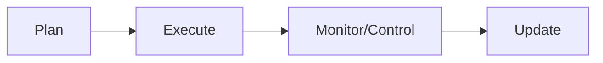
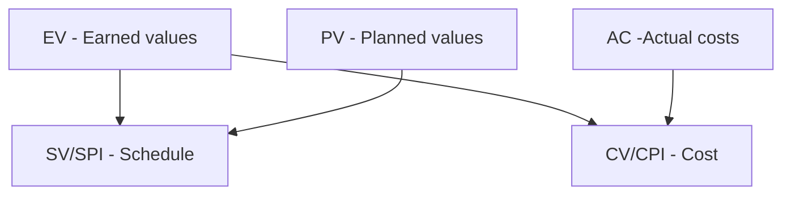

# Quy trình quản lý

# Input của các quy trình quản lý

- Project Charter.
- Project Management Plan.
- Project Documents.
- EEF.
- OPA.

# Output của các quy trình quản lý

### Initating

- Develop Project Charter (xác định mục tiêu dự án) → **Project Charter**, Assumption Log (*giả định và ràng buộc*).
- Identify Stakeholders (xác định các bên liên quan) → **Stakeholder Register**.

### Planning

Process nào bắt đầu bằng "Plan" thì output là một Management Plan.

- Plan Scope Management → Scope Management Plan.
- Plan Schedule Management → Schedule Management Plan.
- Plan Cost Management → Cost Management Plan.
- Plan Risk Management → Risk Management Plan.

#### Scope management

1. Collect Requirements (thu thập yêu cầu) → Requirements Documentation.
2. Define Scope (xác định phạm vi) → Scope Statement (mô tả các mục tiêu chính của dự án).
3. Create WBS → WBS.

#### Schedule management

1. Define Activities (xác định công việc) → Activity List.
2. Sequence Activities (sắp xếp công việc) → Network Diagram.
3. Estimate Duration (ước tính thời gian thực thi) → Duration Estimates.
4. Develop Schedule (hoàn chỉnh lịch) → Schedule Baseline.

#### Cost management

1. Estimate Costs (ước tính và dự toán chi phí) → Cost Estimates.
2. Determine Budget (xác định ngân sách) → Cost Baseline.

**2 thuật ngữ dễ nhầm lẫn**:
- **Ước tính chi phí (Cost estimating)**: Chỉ những hoạt động và tài liệu phục vụ cho xác định ngân sách dự kiến.
- **Dự toán chi phí (Cost estimate)**: Chỉ kết quả thu được từ quá trình ước tính và phân bổ chi phí ước tính vào từng hạng mục công việc.

**Các kỹ thuật ước tính chi phí**:
- **Analogous (Top-Down) Estimating**: Ước tính dựa trên chi phí của một dự án đã hoàn thành trước đó.
- **Parametric Estimating**: Dùng đơn giá và các tham số đo lường.
- **Bottom-Up Estimating**: Ước tính từ các công việc nhỏ đến các công việc to.
- **Expert Judgment**: Tham khảo ý kiến từ các chuyên gia.
- **Three-Point Estimating**: Dùng 3 điểm Optimistic ($O$), Most likely ($M$), Pessimistic ($P$) để đo lường.
	- *Công thức tam giác*: $E=\dfrac{O+M+P}{3}$.
	- *Công thức PERT*: $E=\dfrac{O+4M+6P}{6}$.
- **Reserve Analysis**: Dựa trên chi phí dự phòng cho những rủi ro có thể xảy ra.
- **Vendor Bid Analysis**: Dựa trên giá các bên đấu thầu đưa ra.
- **Cost of Quality**: Dựa trên chất lượng sản phẩm đầu ra.

Độ chính xác của ước tính chi phí theo thứ tự sau: **Bottom-Up -> Parametric -> Analogous**.
Tốc độ thực hiện thì ngược lại.

#### Risk management

1. Plan Risk Management (lập kế hoạch quản lý rủi ro).
2. Identify Risks (tìm rủi ro).
3. Qualitative Analysis (phân tích rủi ro bằng phương pháp định tính).
4. Quantitative Analysis  (phân tích rủi ro bằng phương pháp định lượn).
5. Plan Responses (ứng phó với rủi ro)

**Rủi ro**: là các sự kiện xảy ra có tính ngẫu nhiên, tác động bất lợi cho dự án.

**Các kỹ thuật phân tích rủi ro định tính**:
- **Probability and Impact Matrix**: Phân tích xác suất xuất hiện, khả năng tác động và mức độ ưu tiên của mỗi rủi ro.
- **Delphi**: Lấy ý kiến từ các chuyên gia.

**Các kỹ thuật phân tích rủi ro định lượng**:
- **Expected Monetary Value (EMV)**: Giá trị tiền tệ kỳ vọng.
- **Decision Tree Analysis**: Mỗi nhánh là 1 trường hợp cần lựa chọn, căn cứ vào xác suất và EMV, dùng cho các trường hợp rủi ro không chắc chắn và cần nhiều hành vi phản ứng.
- **Monte Carlo Simulation**: Mô phỏng rủi ro.
- **Sensitivity Analysis**: Phân tích tác động của rủi ro.
- **Modeling and Simulation**: Sử dụng các mô hình toán học.

#### Resource management

1. Plan Resource Management (lập kế hoạch quản lý nhân lực).
2. Estimate Activity Resources (ước lượng số lượng nhân lực).
3. Acquire Resources (tuyển dụng nhân lực).
4. Develop Team (xây dựng thành nhóm).

**Ma trận kỳ vọng**: Ghi nhận và quản lý kỳ vọng của các bên liên quan (stakeholders) đối với dự án.

**Ma trận RACI**: Là ma trận phân công trách nhiệm. RACI giúp trả lời câu hỏi "Ai làm gì?".

| Ký hiệu | Viết tắt của | Ý nghĩa                 |
| ------- | ------------ | ----------------------- |
| R       | Responsible  | Người làm.              |
| A       | Accountable  | Người chịu trách nhiệm. |
| C       | Consulted    | Người được hỏi.         |
| I       | Informed     | Người được báo.         |

**Các chế độ xử lý xung đột**:

| Chế độ                            | Ý nghĩa                     | Đặc điểm                                                   |
| --------------------------------- | --------------------------- | ---------------------------------------------------------- |
| **Withdraw / Avoid**              | Né tránh                    | Tránh đối đầu, **trì hoãn giải quyết**.                    |
| **Smooth / Accommodate**          | Xoa dịu / Nhượng bộ         | Nhấn mạnh **điểm đồng thuận**, giảm căng thẳng.            |
| **Compromise / Reconcile**        | Thỏa hiệp                   | Mỗi bên **nhường** một phần.                               |
| **Force / Direct**                | Cưỡng ép / Ra lệnh          | Dùng quyền lực để **áp đặt** giải pháp.                    |
| **Collaborate / Problem Solving** | Hợp tác / Giải quyết vấn đề | Tìm nguyên nhân gốc và giải pháp **cùng thắng** (win-win). |

**Mô hình Tuckman**: Là mô hình mô tả các giai đoạn phát triển của nhóm dự án do nhà tâm lý học Bruce Tuckman đề xuất. Gồm các giai đoạn sau:

| Giai đoạn                         | Ý nghĩa                      | Đặc điểm                                                                     |
| --------------------------------- | ---------------------------- | ---------------------------------------------------------------------------- |
| **Forming (Hình thành)**       | Đội nhóm mới được thành lập. | - Thành viên còn xa lạ. - Chưa hiểu vai trò. - Phụ thuộc nhiều vào PM. |
| **Storming (Xung đột)**        | Bắt đầu xuất hiện bất đồng.  | - Tranh luận. - Mâu thuẫn. - Cạnh tranh quyền lực.                     |
| **Norming (Ổn định)**          | Nhóm bắt đầu thống nhất.     | - Quy trình rõ ràng. - Vai trò rõ ràng. - Hợp tác tốt hơn.             |
| **Performing (Hiệu suất cao)** | Nhóm hoạt động hiệu quả.     | - Tự quản. - Tin tưởng lẫn nhau. - Năng suất cao.                      |
| **Adjourning (Giải thể)**      | --                           | - Dự án kết thúc. - Nhóm giải tán. - Tổng kết bài học kinh nghiệm.     |

**Tháp nhu cầu Maslow**: Là học thuyết của nhà tâm lý học Abraham Maslow, cho rằng con người có 5 cấp độ nhu cầu được sắp xếp từ thấp đến cao. Khi nhu cầu ở tầng thấp được thỏa mãn tương đối, con người sẽ hướng đến các nhu cầu cao hơn.
1. Thể hiện cá tính (Self-Actualization).
2. Được tôn trọng (Esteem).
3. Nhu cầu xã hội (Love & Belonging).
4. Nhu cầu an toàn (Safety).
5. Nhu cầu sinh lý (Physiological).

### Executing

Là giai đoạn thực thi dự án thật.

**Quy trình tổng quát**:
- **Input**: Plan.
- **Output**: Deliverable / Work Performance Data.

**Cụ thể**:
- Manage Project Knowledge → Lessons Learned Register.
- Manage Quality → Quality Reports, Test and Evaluation Documents.
- Develop Team → Team Performance Assessments.

**Chất lượng (Quality)**: Là tổng hợp các đặc tính của 1 sản phẩm mà có khả năng thỏa mãn mọi yêu cầu về sản phẩm đó.
-> **Quản lý chất lượng** nhằm mục đích đảm bảo dự án thỏa mãn mọi yêu cầu đề ra.

**Một số kỹ thuật dùng cho quản lý chất lượng**:

| Tool                                                           | Insight                            |
| -------------------------------------------------------------- | ---------------------------------- |
| **Biểu đồ xương cá (Cause-and-Effect, Fishbone, Ishikawa)** | Nguyên nhân dẫn đến lỗi.           |
| **Pareto Chart**                                               | Khoanh vùng nguyên nhân gây lỗi.   |
| **Phiếu kiểm tra (Check Sheet)**                            | Tần suất xuất hiện lỗi.            |
| **Biểu đồ tần suất (Histogram)**                            | Tần suất xuất hiện các giá trị.    |
| **Biểu đồ kiểm soát (Control chart)**                       | Kiểm soát quy trình.               |
| **Run Chart**                                                  | Kiểm soát quy trình.               |
| **Biểu đồ phân tán (Scatter diagram)**                      | Tương quan giữa 2 biến.            |
| **Lưu đồ (Flowchart)**                                      | Quy trình hoạt động.               |
| **SIPOC Diagram**                                              | Quy trình hoạt động.               |
| **Biểu đồ xu hướng (Trend chart)**                          | Sự thay đổi các chỉ số chất lượng. |

### Monitoring & Controlling

Là giai đoạn so sánh thực tế dự án với kế hoạch đã đề ra.

**Quy trình tổng quát**:
- **Input**: Baseline, Work Performance Data.
- **Output**: Work Performance Information, Change Requests.

# Cấu trúc phân rã công việc - WBS (Work breakdown structure)

WBS là một sự **phân rã phân cấp** toàn bộ phạm vi công việc mà nhóm dự án cần thực hiện để đạt được các mục tiêu và tạo ra các sản phẩm bàn giao (deliverables) yêu cầu. Một công việc được tượng trưng bằng sản phẩm hoặc kết quả của công việc đó.

### Tiêu chí đánh giá WBS

- **Nguyên lý cơ bản:** Một đơn vị công việc chỉ xuất hiện tại một nơi duy nhất trong WBS. nội dung của một mục WBS phải bằng tổng các công việc con bên dưới nó.
- **Độ chi tiết:** Từng công việc trong WBS nên được chi tiết tới mức thấp nhất, thường là **dưới 80 giờ làm việc** để dễ dàng quản lý.
- **Đầy đủ:** Một công việc được coi là phân rã đủ khi tình trạng công việc có thể đo lường được, thời gian và chi phí dễ ước lượng, và công việc có thể được phân công độc lập cho các cá nhân. Nếu không thỏa mãn, cần tiếp tục **phân rã tiếp**.

### Phân loại WBS

- **Deliverable-oriented WBS**: Phân chia dựa vào *sản phẩm làm ra* của mỗi công việc.
- **Phase-oriented WBS**: Phân chia dựa vào *thời gian thực hiện* công việc.
- **Organizational-oriented WBS**: Phân chia dựa vào *đặc điểm các thành viên trong nhóm* xây dựng dự án.
- **System-oriented WBS**: Phân chia dựa vào *cấu trúc hệ thống* của sản phẩm làm ra của dự án.
- **Hybrid-oriented WBS**: Phương pháp *lai*.

### Phân rã WBS (Decomposition)

Là kỹ thuật chia nhỏ công việc để xây dựng WBS.
1. **Xác định và phân tích** các sản phẩm bàn giao và công việc liên quan.
2. **Cấu trúc và tổ chức** WBS theo các cấp bậc hợp lý.
3. **Chia nhỏ các cấp trên** thành các thành phần chi tiết ở cấp thấp hơn.
4. **Phát triển và gán mã định danh** (identification codes) cho từng thành phần trong WBS.
5. **Xác nhận** mức độ phân rã là phù hợp (không quá nông cũng không quá sâu)

### Các phương pháp tiếp cận xây dựng WBS

- **Tiếp cận từ trên xuống (Top-down):** Bắt đầu từ *mục tiêu lớn nhất* của dự án, sau đó chia nhỏ dần thành các thành phần chi tiết.
- **Tiếp cận từ dưới lên (Bottom-up):** Bắt đầu từ *các công việc chi tiết nhất*, sau đó nhóm chúng lại thành các hạng mục công việc lớn hơn,,.
- **Tiếp cận tương tự (Analogy approach):** Xem xét *WBS của các dự án tương tự đã thực hiện* trước đó và điều chỉnh lại cho phù hợp với dự án hiện tại.
- **Sơ đồ tư duy (Mind-mapping):** Thường dùng cho các dự án có tính sáng tạo cao, các ý tưởng phi tuyến tính.
- **Sử dụng mẫu (Templates):** Sử dụng các *tiêu chuẩn WBS cụ thể của ngành hoặc các mẫu có sẵn của tổ chức* để làm khung sườn.

# Sơ đồ AON (Activity on Node)

Sơ đồ AON là 1 loại sơ đồ mạng (Project Network Diagram) là sơ đồ mô tả quan hệ giữa các công việc trong lịch, là công cụ ước tính thời gian thực hiện dự án.

### Các thành phần của sơ đồ AON

- Các nút tượng trưng cho các công việc. Nút $N_0$ là bắt đầu (không có công việc) và $N_n$ là nút kết thúc.
- Cung $N_i\xrightarrow{t_{ij}}N_j$ biểu thị: Nút $N_i$ cần $t_{ij}$ thời gian để hoàn thành, và cần thực hiện trước nút $N_j$.
- Mỗi nút cần đính kèm 4 loại thông tin:
	- **Thời điểm sớm nhất bắt đầu của nút $\text{hiện tại}$ **:$$\boxed{\text{TĐ sớm nhất}_\text{hiện tại}=\max{(\text{TĐ sớm nhất}_\text{liền trước}+\text{TG hoàn thành}_\text{liền trước})}}$$
	- **Thời điểm trễ nhất bắt đầu của nút $\text{hiện tại}$ **: $$\boxed{\text{TĐ trễ nhất}_\text{hiện tại}=\min{(\text{TĐ trễ nhất}_\text{liền sau}-\text{TG hoàn thành}_\text{hiện tại})}}$$.
	- **Khoảng dư toàn phần của nút $\text{hiện tại}$** (thả nổi toàn phần): Là thời gian tối đa công việc có thể kéo dài mà *không ảnh hưởng đến tiến độ dự án*. $$\boxed{\text{Khoảng dư toàn phần}=\text{TĐ trễ nhất}-\text{TĐ sớm nhất}}$$
	- **Khoảng dư tự do của nút $\text{hiện tại}$** (thả nổi tự do): Là thời gian tối đa công việc có thể kéo dài mà *không ảnh hưởng đến thời gian bắt đầu của các công việc sau nó*: $$\boxed{\text{Khoảng dư tự do}_\text{hiện tại}=\min{(\text{TĐ sớm nhất}_\text{liền sau})}-\text{TĐ sớm nhất}_\text{hiện tại}-\text{TG hoàn thành}_\text{hiện tại}}$$
	Khi vẽ sơ đồ chỉ cần thể hiện thông tin thời điểm sớm nhất và trễ nhất bắt đầu.

### Đường găng (Critical path)

Là đường có độ dài dài nhất trong sơ đồ AON, thể hiện **tổng thời gian thực hiện ngắn nhất của dự án**.
-> Dùng để ước lượng thời gian tổng thể của dự án.

**Đặc điểm**:
- Độ dài của đường găng là **lớn nhất**.
- Các nút trên đường găng có **thời điểm sớm nhất bắt đầu = thời điểm trễ nhất bắt đầu**.
- Các đường nằm ngoài đường găng **có thể dài hơn dự kiến** một khoảng biên độ cho phép, và cũng **có thể sẽ trở thành đường găng**.
- Mỗi dự án **có thể có nhiều đường găng**.
- Đường găng **có thể thay đổi**.

### Quan hệ logic (Logical relationship)

Là mối quan hệ **xác định một công việc ảnh hưởng đến thời điểm bắt đầu hoặc kết thúc của công việc khác** như thế nào.

**Xét công việc B liền sau công việc A**:
- Công việc B chỉ được **bắt đầu** khi:
	- **Finish-to-start (FS)** \[Phổ biến nhất]: A kết thúc.
	- **Start-to-start (SS)**: A bắt đầu.
	
- Công việc B chỉ được **kết thúc** khi:
	- **Finish-to-finish (FF)**: A kết thúc.
	- **Start-to-finish (SF)** \[Hiếm nhất]: A bắt đầu.

### Phụ thuộc (Dependency)

| Loại phụ thuộc                             | Ý nghĩa                                                                          |
| ------------------------------------------ | -------------------------------------------------------------------------------- |
| **Mandatory Dependency** (Bắt buộc)     | Do **bản chất công việc**, yêu cầu kỹ thuật, pháp lý hoặc hợp đồng quy định.     |
| **Discretionary Dependency** (Tùy chọn) | Do **kinh nghiệm**, thông lệ tốt (best practice) hoặc quyết định của nhóm dự án. |
| **Internal Dependency** (Nội bộ)        | Quan hệ giữa các công việc **nằm trong scope**.                                  |
| **External Dependency** (Bên ngoài)     | Quan hệ giữa công việc dự án và các **yếu tố ngoài** dự án.                      |

### Cách xét 1 sự delay 1 công việc có thể ảnh hưởng đến tiến độ dự án hay không?

- Xét các thời điểm bắt đầu từ thời điểm bắt đầu sớm nhất đến trễ nhất của dự án.
- Xét định thời gian làm việc và thời gian dự trữ ở các trường hợp trên.
- Xét xem khi delay ở các trường hợp trên có thể sử dụng thời gian dự trữ thay không. Nếu không thì sự delay này có ảnh hưởng đến tiến độ dự án.

### Rút ngắn lịch biểu

- Tính toán *thời gian hoàn thành tối thiểu* mỗi công việc và *chi phí khi rút ngắn 1 ngày* thời gian hoàn thành mỗi công việc.
- Rút ngắn lịch biểu tức là **rút ngắn đường găng**, và đảm bảo không có đường nào có độ dài lớn hơn (các) đường găng.
- Tức có nghĩa:
	- Luôn chọn các nút có chi phí nhỏ nhất để rút trước.
	- Chỉ được rút những nút có trong đường găng.
	- Phải rút sao cho **không có đường nào có độ dài lớn hơn (các) đường găng** ở bất kỳ thời điểm nào.

Khi phải rút ngắn nhiều đường găng, có 2 chiến lược sau nên dùng theo thứ tự ưu tiên giảm dần:
1. Rút ngắn các công việc chung của các đường găng (càng nhiều điểm chung càng tốt).
2. Rút ngắn riêng lẻ các đường găng.

# Quality Assurance (QA) & Quality Control (QC)

| Tiêu chí           | QA (Quality Assurance)                      | QC (Quality Control)         |
| ------------------ | ------------------------------------------- | ---------------------------- |
| **Mục tiêu**       | Đảm bảo **quy trình** đúng                  | Kiểm tra **sản phẩm** đúng   |
| **Tập trung**      | Quy trình                                   | Sản phẩm                     |
| **Hướng tiếp cận** | Phòng ngừa lỗi                              | Phát hiện lỗi                |
| **Thời điểm**      | Trong suốt quá trình                        | Sau khi tạo ra sản phẩm      |
| **VD**             | Thiết lập coding standard, quy trình review | Test chức năng, kiểm tra lỗi |

# Phân tích tài chính dự án

### Giá trị tương lai (Future value)
\[Đọc thêm]
$$\boxed{v_n=v_0\times(1+r)^n}$$
- $v_0$: Giá trị hiện tại.
- $v_n$: Giá trị sau $n$ kỳ.
- $r$: Lãi suất mỗi kỳ.

### Chuỗi tiền tệ đều (Present value)
\[Đọc thêm]

Là tổng giá trị của một chuỗi tiền đều mỗi kỳ, khi xét ở hiện tại.
$$
\begin{align}
PV&=\sum_{i=1}^n\dfrac{v}{(1+r)^i}\\
&=\boxed{\dfrac{v}{r}\times\left(1-\dfrac{1}{(1+r)^n}\right)}
\end{align}
$$
- $v_i$: Khoảng tiền nhận / trả ở mỗi kỳ.

### Giá trị hiện tại thuần (Net present value - NPV)

Là số tiền lời của dự án (doanh thu trừ chi phí - dòng tiền) ở một khoảng thời gian, khi xét ở hiện tại. NPV là một dạng tổng quát của chuỗi tiền tệ đều vì giá trị mỗi kỳ nhận được của NPV không đều,
$$\boxed{NPV_{1..n}=\sum_{t=1}^nNPV_t=\sum_{t=1}^n\frac{B_t-C_t}{(1+r)^t}}$$
- $B_t$: Doanh thu trong kỳ $t$.
- $C_t$: Chi phí trong kỳ $t$.
- $B_t-C_t$: Lợi nhuận / Dòng tiền thuần tại thời điểm $t$.

### Tỷ suất sinh lời (Return on vestment - ROI)

Là khả năng sinh lời của dự án:
$$\boxed{ROI=\frac{B-C}{C}=\frac{NPV}{C}}$$

### Thời điểm hòa vốn

**Phương pháp 1 - Khi có doanh thu và chi phí**:
- Dùng sơ đồ đường thể hiện *chi phí tích lũy* và *doanh thu tích lũy*.
- Giao của *2 đường đó* chính là thời điểm hoàn vốn.

**Phương pháp 2 - Khi chỉ có dòng tiền thuần**:
- Dùng sơ đồ đường thể hiện *dòng tiền thuần tích lũy*.
- Giao của *đường đó với trục hoành* là thời điểm hoàn vốn.

# Đo lường hiệu suất (Earned Value Management - EVM)

Là kỹ thuật **đo lường sự thực hiện dự án** bằng cách tích hợp dữ liệu về cost, time và scope.

### Các chỉ số nguyên tử

**BAC (Budget at completion)**
$$\boxed{\text{BAC}=\sum\text{Ngân sách dự kiến hoặc chi phí}}$$

**PV (Planned values)**
$$\boxed{\text{PV}=\frac{\text{Tổng thời gian đã trôi qua}}{\text{Tổng thời gian hoàn thành dự án}}\times\text{BAC}}$$

**EV (Earned values)**
$$\boxed{\text{EV}=\frac{\text{Khối lượng công việc đã hoàn thành}}{\text{Tổng khối lượng công việc dự kiến}}\times\text{BAC}}$$

**AC (Actual costs)**
Chi phí thực tế phải chi trả.

### Các chỉ số đánh giá tình trạng hiện tại của dự án

| Chỉ số                                                       | Xấu (<)      | Đúng kế hoạch (=) | Tốt (>)       |
| ------------------------------------------------------------ | --------------- | -------------------- | ---------------- |
|                                                              | **Trễ tiến độ** | **Đúng tiến độ**     | **Vượt tiến độ** |
| **Schedule variance**$$\boxed{SV=EV-PV}$$                    | $SV<0$          | $SV=0$               | $SV>0$           |
| **Schedule performance index**$$\boxed{SPI=\dfrac{EV}{PV}}$$ | $SPI<1$         | $SPI=1$              | $SPI>1$          |
|                                                              | **Vượt chi**    | **Trong chi**        | **Dưới chi**     |
| **Cost variance**$$\boxed{CV=EV-AC}$$                        | $CV<0$          | $CV=0$               | $CV>0$           |
| **Cost performance index**$$\boxed{CPI=\dfrac{EV}{AC}}$$     | $CPI<1$         | $CPI=1$              | $CPI>1$          |

>[!tip]
>- **Đo schedule** -> Sử dụng values.
>- **Đo cost** -> Sử dụng cost.
>- Cả 2 đều có hạng tử đầu là **EV** -- luôn lấy những gì thu được làm mốc so sánh trước tiên.

### Các chỉ số dự đoán tình trạng tương lai của dự án

**ETC (Estimate to completion)**
Chi phí *cần bổ sung cho tới khi* kết thúc dự án.$$\boxed{\text{ETC}=\dfrac{\text{Tổng thời gian còn lại để thực hiện dự án}}{SPI}}$$

**EAC (Estimate at completion)**
Chi phí *ước lượng sau khi* kết thúc dự án.$$\boxed{\text{EAC}=\dfrac{BAC}{CPI}}$$

>[!tip]
>- **to** -> Dùng **t**hời gian.
>- **at** -> Dùng chi phí.

# Perform Integrated Change Control (PICC, Quản lý tích hợp dự án)

Đánh giá, phê duyệt hoặc từ chối các thay đổi, đồng thời quản lý việc cập nhật các tài liệu, kế hoạch và baseline của dự án.

**Quy trình**:
1. Có người muốn thay đổi dự án (Change request).
2. Phân tích tác động.
3. Ra quyết định thông qua Change Control Board (hội đồng quyết định).
4. Cập nhật kế hoạch.
5. Triển khai thay đổi.

