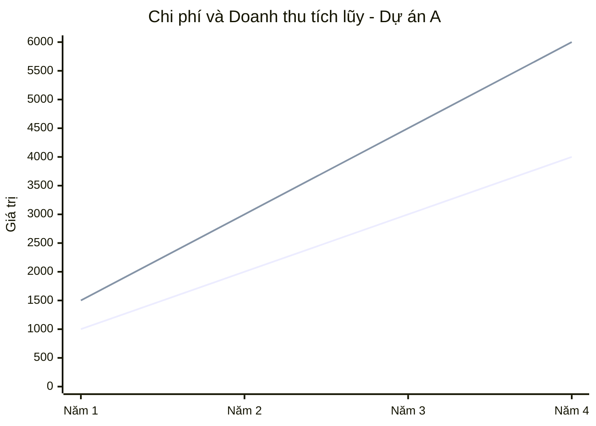
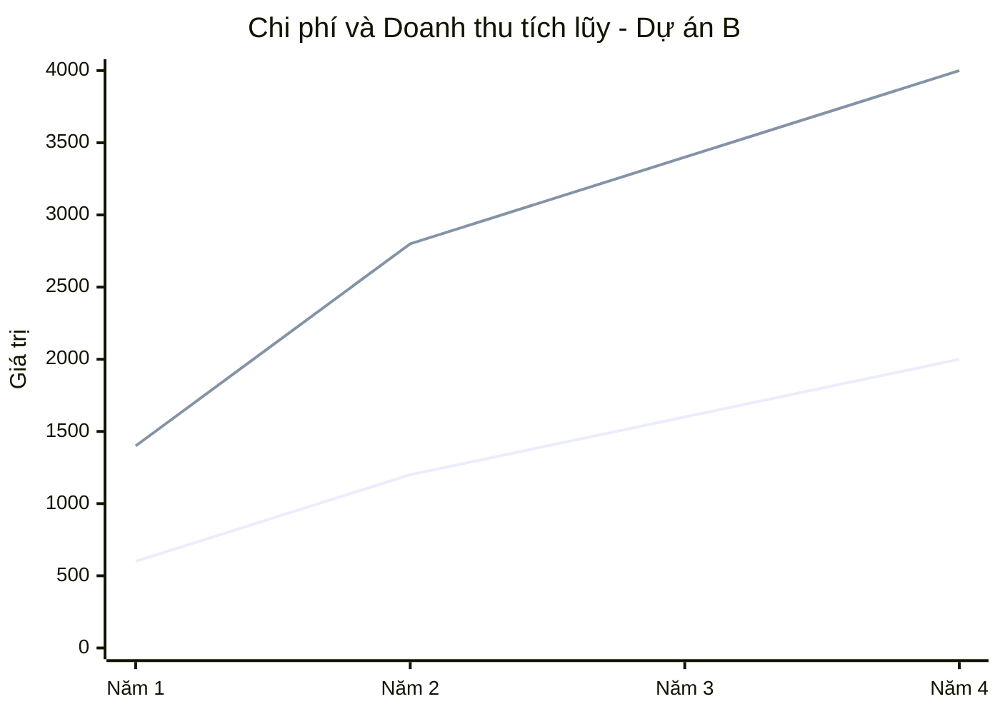

# Phân tích tài chính dự án

**VD1**: Ông M phải trả cho ông N 1000 USD ở năm thứ 2 và 3000 USD ở năm thứ 5 kể từ thời điểm hiện tại. Nếu làm lại hợp đồng để trả hết số tiền này vào năm thứ 3 thì ông M phải trả bao nhiêu? Biết rằng lãi suất là 6%/năm.

Ta có:
- Quy 1000 USD ở năm 2 vào năm 3: $1000\times(1+0.06)^1=1060$.
- Quy 5000 USD ở năm 5 vào năm 3: $x\times(1+0.06)^2=3000\Rightarrow x=2669.98$.
Vậy số tiền tại năm 3 là $3729.98$.

**VD2**: Một dây chuyền sản xuất linh kiện máy tính được bán với giá 2000 USD và trả góp thêm 12 tháng, mỗi tháng 250 USD, trên cơ sở lãi suất 18%/tháng. Hỏi nếu muốn mua dây chuyền này và trả ngay hết số tiền thì phải trả bao nhiêu?

Ta phải lấy 2000 là số tiền buộc phải trả ngay, cộng với tổng chuỗi tiền trả góp (250 / tháng):
$$2000+\sum_{i=1}^{12}\dfrac{250}{(1+0.18)^i}=3198$$

**VD3**: Giả sử ông A đã trả được 7 lần 10 triệu VND ở cuối mỗi năm cho một số tiền vay 100 triệu VNĐ với lãi suất 5%/năm. Hỏi nếu ông ta muốn trả hết số tiền còn lại trong 5 lần trả cuối mỗi năm tiếp theo thì phải trả số tiền là bao nhiêu mỗi năm?

Nợ còn lại (dư nợ) tại năm thứ 7 (7 năm sau):
$$B=100\times1.05^7-\dfrac{10}{0.05}\times\left(1-\dfrac{1}{1.05^7}\right)=82.84$$

Nếu muốn trả số này trong 5 năm thì số tiền mỗi năm là:
$$82.84=\dfrac{x}{0.05}\times\left(1-\dfrac{1}{1.05^5}\right)\Rightarrow x=19.13$$

**VD4**: Bạn cho thuê nhà với giá 6000$/năm thanh toán vào cuối năm trong thời hạn 5 năm. Toàn bộ tiền cho thuê được ký gửi vào ngân hàng với lãi suất 6%/năm. Sau 5 năm, số tiền có được cả gốc và lãi là bao nhiêu?

Là tổng số tiền tiền cho thuê mỗi năm gửi vào ngân hàng trong 5 năm, xét ở thời điểm sau 5 năm:
$$\dfrac{6000}{0.06}\times\left(1-\dfrac{1}{1.06^5}\right)\times1.06^5=33822.55776$$

**VD5**: Để chuẩn bị chọn 1 trong 2 dự án A và B, với số tiền chi phí cho mỗi dự án ngay năm đầu
(năm thứ 0) đều là 1000 USD, lãi suất 10%/năm, doanh thu và chi phí cho mỗi dự án được ước lượng như sau. Dự án nào có tiềm năng hơn? Chứng minh bằng ROI và thời điểm hoàn vốn.

| Dự án A                         | Năm 1   | Năm 2   | Năm 3   | Năm 4   |
| ------------------------------- | ------- | ------- | ------- | ------- |
| Chi phí                         | 1000    | 1000    | 1000    | 1000    |
| Doanh thu                       | 1500    | 1500    | 1500    | 1500    |
| **Lợi nhuận (Dòng tiền thuần)** | **500** | **500** | **500** | **500** |

| Dự án B                         | Năm 1   | Năm 2   | Năm 3   | Năm 4   |
| ------------------------------- | ------- | ------- | ------- | ------- |
| Chi phí                         | 600     | 600     | 400     | 400     |
| Doanh thu                       | 1400    | 1400    | 600     | 600     |
| **Lợi nhuận (Dòng tiền thuần)** | **800** | **800** | **200** | **200** |

Ta có:

$$NPV_A=\sum_{i=1}^n\dfrac{B-C}{(1+0.1)^i}=1584.9327\Rightarrow ROI_A=\dfrac{NPV_A}{1000}=1.5849$$
$$NPV_B=\sum_{i=1}^n\dfrac{B-C}{(1+0.1)^i}=2535.8923\Rightarrow ROI_B=\dfrac{NPV_B}{1000}=2.5359$$

Tỷ suất sinh lời của B tốt hơn A nên B tiềm năng hơn.

Bảng chi phí tích lũy và doanh thu tích lũy của 2 dự án:

| Dự án A            | Năm 1 | Năm 2 | Năm 3 | Năm 4 |
| ------------------ | ----- | ----- | ----- | ----- |
| Chi phí tích lũy   | 1000  | 2000  | 3000  | 4000  |
| Doanh thu tích lũy | 1500  | 3000  | 4500  | 6000  |

| Dự án B            | Năm 1 | Năm 2 | Năm 3 | Năm 4 |
| ------------------ | ----- | ----- | ----- | ----- |
| Chi phí tích lũy   | 600   | 1200  | 1600  | 2000  |
| Doanh thu tích lũy | 1400  | 2800  | 3400  | 4000  |

Hai dự án đều luôn lời. Dự án đã vượt ngưỡng hòa vốn ngay từ đầu kỳ phân tích.

# Quản lý chi phí dự án

**VD1**: Giám đốc dự án Mary hiện đang thực hiện một dự án nâng cấp mạng. Dự án có kinh phí 4.000 USD và thời gian thực hiện là 4 năm. Mary chỉ mới hoàn thành tháng thứ 17 của dự án. Nhóm dự án đã hoàn thành 35% công việc của dự án và đã chi 1.500USD. Tìm các giá trị sau: BAC, PV, EV, AC, CV, CPI, SV, SPI, EAC, ETC.

**Các chỉ số nguyên tử**:
- $\text{BAC (Budget at completion)}=4000$.
- $\text{PV (Planned values)}=\dfrac{17}{4\times12}\times4000=1416,67$.
- $\text{EV (Earned values)}=35\%\times4000=1400$.
- $\text{AC (Actual costs)}=1500$.

**Các chỉ số đánh giá tình trạng hiện tại của dự án**:
- $\text{CV (Cost variance)}=1400-1500=-100$, xấu (vượt chi).
- $\text{CPI (Cost performance index)}=\dfrac{1400}{1500}=0,93$, xấu (vượt chi).
- $\text{SV (Schedule variance)}=1400-1416,67=-16,67$, xấu (trễ tiến độ).
- $\text{SPI (Schedule performance index)}=\dfrac{1400}{1416,67}=0,99$, xấu (trễ tiến độ).

**Các chỉ số dự đoán tình trạng tương lai của dự án**:
- $\text{EAC (Estimate at completion)}=\dfrac{4000}{0,93}=4301$.
- $\text{ETC (Estimate to completion)}=\dfrac{4\times12-17}{0,99}=31,31$.

# Quản lý tiến độ dự án

| Công việc | Thg. bth. | Thg. rút ngắn | Chi phí bth. | Chi phí (sau khi) rút ngắn | Công việc liền trước |
| --------- | --------- | ------------- | ------------ | -------------------------- | -------------------- |
| A         | 6         | 4             | 200          | 210                        | -                    |
| B         | 10        | 7             | 500          | 650                        | -                    |
| C         | 10        | 8             | 450          | 500                        | -                    |
| D         | 12        | 11            | 750          | 780                        | A, B                 |
| E         | 4         | 3             | 150          | 160                        | B                    |
| F         | 2         | 1             | 70           | 75                         | C                    |
| G         | 9         | 6             | 800          | 900                        | C                    |
| H         | 5         | 3             | 170          | 200                        | E                    |
| I         | 8         | 6             | 560          | 600                        | E, F                 |
| J         | 2         | 1             | 300          | 345                        | H                    |
| K         | 10        | 7             | 720          | 750                        | D                    |
| L         | 3         | 1             | 90           | 100                        | I, J                 |
| M         | 9         | 6             | 620          | 650                        | G                    |

Sơ đồ AON:

![[aon.svg]]

Ta có:
$$
\begin{cases}
\text{Số ngày được rút ngắn}&=\text{Thgian (sau) rút ngắn}-\text{Thgian bình thường}\\\\
\text{Chi phí rút ngắn / ngày}&=\dfrac{|\text{Chi phí rút ngắn}-\text{Chi phí bình thường}|}{|\text{Thgian rút ngắn}-\text{Thgian bình thường}|}
\end{cases}
$$

Xây dựng được bảng:

| Công việc | Số ngày được rút ngắn | Chi phí rút ngắn / ngày |
| --------- | --------------------- | ----------------------- |
| A         | 2                     | 5                       |
| \*B       | 3                     | 50                      |
| C         | 2                     | 25                      |
| \*D       | 1                     | 30                      |
| E         | 1                     | 10                      |
| F         | 1                     | 5                       |
| G         | 3                     | 33,33                   |
| H         | 2                     | 15                      |
| I         | 2                     | 20                      |
| J         | 1                     | 45                      |
| \*K       | 3                     | 10                      |
| L         | 2                     | 5                       |
| M         | 3                     | 10                      |

Bắt đầu rút ngắn:

| Nút được rút | \*B\*D\*K | A\*D\*K | \*BEHJL | \*BEIL | CFIL | CGM    | Chi phí rút ngắn | Ghi chú                                                  |
| ------------ | --------- | ------- | ------- | ------ | ---- | ------ | ---------------- | -------------------------------------------------------- |
| Chưa rút     | 32        | 28      | 24      | 25     | 23   | 28     | 0                |                                                          |
| \*K          | **31**    | **27**  | 24      | 25     | 23   | 28     | 10               |                                                          |
| \*K          | **30**    | **26**  | 24      | 25     | 23   | 28     | 10               |                                                          |
| \*K          | **29**    | **25**  | 24      | 25     | 23   | 28     | 10               |                                                          |
| \*D          | **28**    | **24**  | 24      | 25     | 23   | 28     | 30               | Có 2 đường găng là \*B\*D\*K và CGM. Phải rút CGM xuống. |
| \*B + M      | **27**    | 24      | **23**  | **24** | 23   | **27** | 60               | Có 2 đường găng là \*B\*D\*K và CGM. Phải rút CGM xuống. |
| \*B + M      | **26**    | 24      | **22**  | **23** | 23   | **26** | 60               | Có 2 đường găng là \*B\*D\*K và CGM. Phải rút CGM xuống. |
| \*B + M      | **25**    | 24      | **21**  | **22** | 23   | **25** | 60               | Có 2 đường găng là \*B\*D\*K và CGM. Phải rút CGM xuống. |
|              |           |         |         |        |      |        |                  | Đã rút hết 3 nút trong đường găng.                       |

Vậy:
- Số ngày sau khi rút ngắn: 25.
- Tổng chi phí rút ngắn: 240.

 **Thời điểm sớm nhất bắt đầu**: Của nút $i$ và nó có các nút $j$ liền trước nó: $$\boxed{t_i=\max{(t_j+t_{ij})}}$$
	- **Thời điểm trễ nhất bắt đầu**: Của nút $i$ và nó có các nút $j$ liền sau nó: $$\boxed{T_i=\min(T_j-t_{ij})};\;T_n=t_n$$.
	- **Khoảng dư toàn phần** (thả nổi toàn phần): Là thời gian tối đa công việc có thể kéo dài mà *không ảnh hưởng đến tiến độ dự án*. $$\boxed{M_i=T_i-t_i}$$
	- **Khoảng dư tự do** (thả nổi tự do): Là thời gian tối đa công việc có thể kéo dài mà *không ảnh hưởng đến thời gian bắt đầu của các công việc $j$ sau nó*: $$\boxed{m_i=t_j-t_{ij}}$$
	Khi vẽ sơ đồ chỉ cần thể hiện thông tin thời điểm sớm nhất và trễ nhất bắt đầu.

