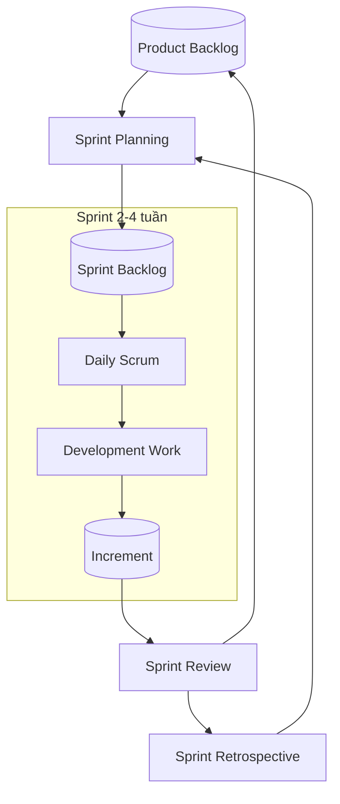

# Agile

### Tổng quan về Agile

**Agile (Phát triển linh hoạt)** là một triết lý/phương pháp tiếp cận quản lý và phát triển phần mềm, tập trung vào:
- Phát hành sản phẩm sớm và liên tục.
- Hợp tác chặt chẽ với khách hàng.
- Thích nghi nhanh với thay đổi.
- Cải tiến liên tục.

Mục tiêu của Agile là **tạo ra giá trị cho khách hàng nhanh nhất có thể**, thay vì cố gắng lập kế hoạch chi tiết toàn bộ dự án ngay từ đầu.

### Tuyên ngôn Agile (Agile Manifesto)

>[!important]
>Agile ưu tiên tích thực tiễn, thực dụng của sản phẩm.

#### 4 giá trị cốt lõi

| Ưu tiên                      | Hơn                   |
| ---------------------------- | --------------------- |
| Cá nhân và sự **tương tác**. | Quy trình và công cụ. |
| Phần mềm **chạy được**.      | Tài liệu đầy đủ.      |
| **Cộng tác** với khách hàng. | Đàm phán hợp đồng.    |
| Phản hồi với **thay đổi**.   | Bám sát kế hoạch.     |

#### 12 nguyên lý

1. Thỏa mãn khách hàng bằng việc **bàn giao sớm và liên tục**.
2. **Chào đón thay đổi** yêu cầu.
3. Bàn giao phần mềm thường xuyên.
4. Khách hàng và nhóm phát triển **làm việc cùng nhau** hàng ngày.
5. Xây dựng dự án quanh những cá nhân có **động lực**.
6. **Giao tiếp trực tiếp** là hiệu quả nhất.
7. **Phần mềm chạy được** là thước đo tiến độ chính.
8. Phát triển **bền vững**.
9. Chú trọng **kỹ thuật và thiết kế tốt**.
10. **Đơn giản hóa** tối đa công việc.
11. Nhóm tự tổ chức tạo ra giải pháp tốt nhất.
12. Thường xuyên **cải tiến** cách làm việc.

# Scrum

### Tổng quan về Scrum

>[!quote] Srum (n)
>Là hành vi của một nhóm mà các cá nhân bên trong tác động lẫn nhau để cùng giành được một thứ gì đó.
>_Cambridge dictionary_

**Scrum** là một framework dựa trên *Agile* dùng để quản lý và phát triển các dự án phức tạp.

Đặc điểm:
- Làm việc theo các chu kỳ ngắn gọi là **Sprint**.
- Tạo ra sản phẩm có thể sử dụng được sau mỗi Sprint.
- Nhóm tự quản và liên chức năng.
- Dựa trên nguyên lý **thực nghiệm (Empiricism) - 3 trụ cột**: Minh bạch - Thanh tra - Thích nghi.

Scrum **không được xem là một quy trình (process)** mà được xem là một **framework (khung làm việc)**. Vì nó không quy định các bước thực thi cụ thể mà do nhóm tự linh động triển khai.

**Scrum workflow**:

### Scum team

**Product owner (PO)**: Chịu trách nhiệm **tối đa hóa giá trị sản phẩm**:
- Xây dựng và quản lý Product Backlog.
- Sắp xếp độ ưu tiên công việc.
- Xác định tầm nhìn sản phẩm.
- Chấp nhận hoặc từ chối kết quả công việc.

**Scrum master (SM)**: Người chịu trách nhiệm về **quy trình Scrum**:
- Đảm bảo Scrum được thực hiện đúng.
- Hỗ trợ Product Owner.
- Hỗ trợ nhóm phát triển.
- Loại bỏ trở ngại (Impediments).
- Huấn luyện tổ chức áp dụng Scrum.

-> Product owner và Scrum master **chịu trách nhím trên thành công của sản phẩm / dự án**.

**Development team**: Chịu trách nhiệm tạo ra **Increment** hoàn chỉnh sau mỗi Sprint.
- Quản lý Sprint backlog.
- Tự quản lý, tự phân công, đa năng.

### Events

Đóng khung thời gian:

| Event                    | Time-box                         | Ý nghĩa                                                                                       |
| ------------------------ | -------------------------------- | --------------------------------------------------------------------------------------------- |
| **Sprint**               | Tối đa 1 tháng (thường 1-4 tuần) | Là 1 chu kỳ làm việc dài, có thể kết thúc sớm hơn kế hoạch), kết quả của nó là 1 increment.   |
| **Sprint Planning**      | Tối đa 8 giờ.                    | Họp lập kế hoạch, các công việc cần làm trong Sprint.                                         |
| **Daily Scrum**          | 15 '.                            | Họp thường ngày, cho các developer tự chia sẻ khó khăn với nhau để đáp ứng tiến độ công việc. |
| **Sprint Review**        | Tối đa 4 giờ / Sprint 1 tháng.   | Demo sản phẩm và nhận feedback từ các bên liên quan.                                          |
| **Sprint Retrospective** | Tối đa 3 giờ / Sprint 1 tháng.   | Họp cải tiến cho Sprint kế tiếp.                                                              |

### Artifacts

**User Story**: Mô tả ngắn gọn các tính năng mà khách hàng cần hoặc quan điểm của họ.

**Product Backlog**:
- **Danh sách yêu cầu** sản phẩm.
- Luôn thay đổi.
- Được PO ưu tiên theo giá trị kinh doanh.
- Do product owner quản lý.

**Sprint Backlog**:
- **Danh sách công việc** được chọn để thực hiện trong Sprint hiện tại.
- Do developers quản lý.

**Increment**: Phần sản phẩm hoàn chỉnh được tạo ra sau Sprint, đáp ứng Definition of Done (định nghĩa sản phẩm hoàn tất).

**Burndown Chart**: Biểu đồ thể hiện:
- Khối lượng công việc còn lại theo thời gian.
- Dùng để theo dõi tiến độ Sprint.

