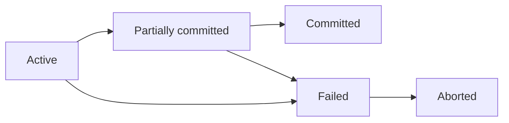

# Tổng quan

Giao tác (Giao dịch) là 1 chuỗi các hành động tác động lên cơ sở dữ liệu, có các tính chất sau:

**ACID**:
- **Atomicity**: Hoặc là toàn bộ hoạt động của giao dịch thành công, hoặc không có hoạt động nào cả.
- **Consistency**: Một giao tác được thực hiện độc lập với các giao tác khác xử lý đồng thời với nó.
- **Isolation**: Một giao tác không quan tâm đến các giao tác khác xử lý đồng thời với nó.
- **Durability**: Mọi thay đổi mà giao tác thực hiện trên CSDL phải được ghi nhận bền vững

**Các thao tác**:
- Đọc.
- Ghi.
- Ký hiệu: $r_i(X)$, giao tác $i$ đang $r$ (đọc) trên đơn vị dữ liệu $X$. Tương tự với $w_i(X)$.

**Các trạng thái**:
- **Active**: Ngay khi bắt đầu thực hiện thao tác.
- **Partially committed**: Sau khi lệnh thi hành cuối cùng thực hiện.
- **Failed**: Sau khi nhận ra không thể thực hiện các hành động được nữa.
- **Aborted**: Sau khi giao tác được quay lui (rollback) và CSDL được phục hồi về trạng thái trước trạng thái bắt đầu giao dịch.
- **Committed**: Sau khi mọi hành động hoàn tất thành công

# Lập lịch thao tác

## Bộ lập lịch

**Scheduler (Bộ lập lịch)**: Có nhiệm vụ phân phối thời gian thực thi một số giao tác được xảy ra đồng thời. Có 2 loại lịch:
- **Serial schedule (tuần tự)**: Các giao tác được thực thi theo thứ tự liên tiếp tuần tự nhau, đảo bảo đồng bộ dữ liệu nhưng hiệu năng kém.
- **Serializable schedule (khả tuần tự)**: Các giao tác được thực thi đồng thời nhưng có thể có kết quả giống serial (*khả tuần tự*) hoặc không giống serial (*không khả tuần tự*), dễ xảy ra xung đột dữ liệu nhưng hiệu năng cao.

## Conflict-serializable và View-serializable

2 đặc điểm của lịch:

| Conflict-serializable                                                                                                                                                                                                                                                       | View-serializable                                                                                                                                                                                                                                                                                                                                                                                                                                                                                                                                                                                                                                                       |
| --------------------------------------------------------------------------------------------------------------------------------------------------------------------------------------------------------------------------------------------------------------------------- | ----------------------------------------------------------------------------------------------------------------------------------------------------------------------------------------------------------------------------------------------------------------------------------------------------------------------------------------------------------------------------------------------------------------------------------------------------------------------------------------------------------------------------------------------------------------------------------------------------------------------------------------------------------------------- |
| Xảy ra nếu có thể biến đổi lịch thành 1 serial-schedule bằng cách đổi chỗ các thao tác không xung đột.                                                                                                                                                                      | 1 lịch view-serializable nếu nó view-quivalent với 1 lịch khác.  $S$ và $S'$ **view-equivalent** khi: - Trong $S$ và $S'$ đều có $w_j(A)...r_j(A)$. - Trong $S$ và $S'$ đều có $r_i(A)$ đọc giá trị ban đầu lên $A$. - Trong $S$ và $S'$ đều có $w_i(A)$ ghi giá trị s                                                                                                                                                                                                                                                                                                                                                                                   |
| **Đồ thị precedence graph (đồ thị trình tự)**: Có cạnh $(T_i)\xrightarrow{A}(T_J)$ khi đạt một trong hai ý sau: - $w_i(A)...r_j(A)$ và $T_i<_ST_j$. - $r_i(A)...w_j(A)$ và $T_i<_ST_j$.  Nếu đồ thị này *không chu trình* thì lịch *conflict-serializable*.  | **Đồ thị poly graph (đồ thị trình tự gán nhãn, G(S))**: - Thêm giao tác ảo bắt đầu $T_b$ ghi tất cả đơn vị dữ liệu. - Thêm giao tác ảo kết thúc $T_f$ đọc tất cả đơn vị dữ liệu.  **Xác định cạnh**: - Nếu $w_i(A)...r_j(A)$ và $w_i(A)$ là thao tác cuối cùng trước $r_j(A)$ thì có cạnh $(T_i)\xrightarrow{A}(T_j)$. Không được chọn $(T_b)\xrightarrow{A}(T_f)$. - Nút can thiệp $T_k$ là nút có thao tác ghi. Buộc chọn 1 trong 2 $(T_k)\xrightarrow{A}(T_i)$ và $(T_k)\xrightarrow{A}(T_j)$ sao cho đồ thị không có chu trình. Không được chọn các cung có $T_b$ và $T_f$.  Nếu đồ thị này *không chu trình* thì lịch *view-serializable*. |

Lịch *conflict-serializable* thì cũng *view-serializable*. Điều ngược lại chưa hẳn đúng.

