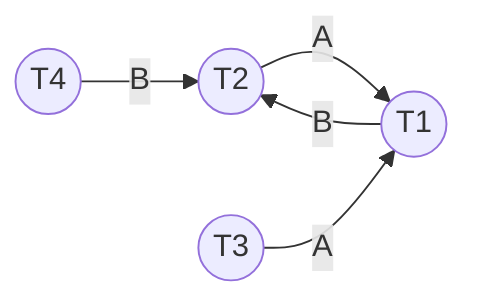
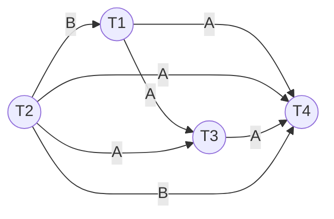
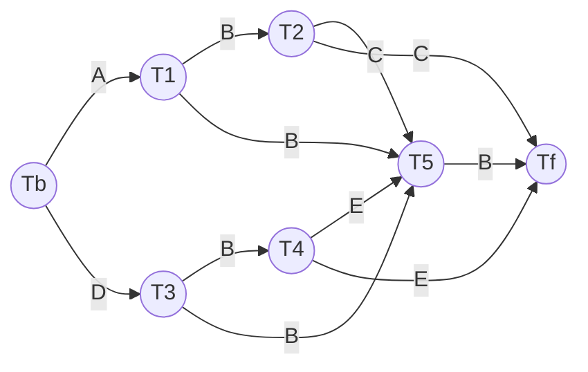
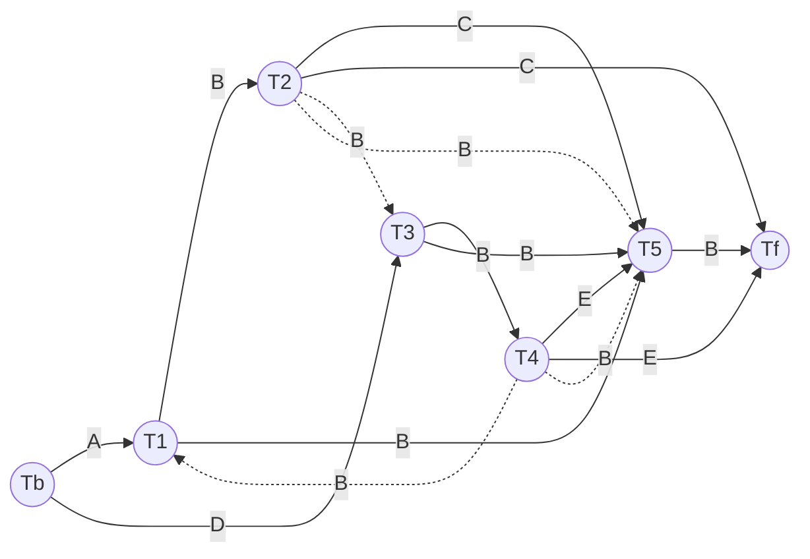
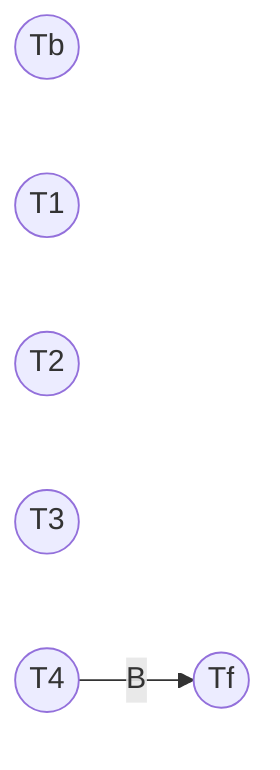

**Conflict-serializable**: Nhận diện bằng **Precedence graph**:
1. *Xác định cạnh*: Có cạnh $(T_i)\xrightarrow{A}(T_J)$ khi $w_i(A)...r_j(A)$ và $T_i<_ST_j$ hoặc ngược lại.
2. Nếu đồ thị này *không chu trình* thì lịch *conflict-serializable*.

**View-serializable**: Nhận diện bằng **Poly graph**:
1. Thêm giao tác ảo bắt đầu $T_b$ **ghi** tất cả đơn vị dữ liệu.
2. Thêm giao tác ảo kết thúc $T_f$ **đọc** tất cả đơn vị dữ liệu.
3. *Xác định cạnh*: Có 2 trường hợp:
	- Nếu $w_i(A)...r_j(A)$ và $w_i(A)$ là thao tác cuối cùng trước $r_j(A)$ thì có cạnh $(T_i)\xrightarrow{A}(T_j)$. Không được chọn $(T_b)\xrightarrow{A}(T_f)$.
	- Khi có nút ghi $T_k$, chọn 1 trong 2 $(T_k)\xrightarrow{A}(T_i)$ và $(T_k)\xrightarrow{A}(T_j)$ sao cho đồ thị không có chu trình. Không được chọn các cung có $T_b$ và $T_f$.
4. Nếu đồ thị này *không chu trình* thì lịch *view-serializable*.

# Conflict serializable

Nhận xét tính conflict-serializable của các lịch sau:

**Câu 1**:

| S   | T1   | T2   | T3   | T4   |
| --- | ---- | ---- | ---- | ---- |
| 1   | R(A) |      |      |      |
| 2   |      | R(A) |      |      |
| 3   | R(B) |      |      |      |
| 4   |      | R(B) |      |      |
| 5   |      |      | R(A) |      |
| 6   |      |      |      | R(B) |
| 7   | W(A) |      |      |      |
| 8   |      | W(B) |      |      |

Ta có:
- Xét đơn vị dữ liệu A:
	- $r_2(A)...w_1(A):\;T_2<_ST_1\Rightarrow(T_2)\xrightarrow{A}(T_1)$.
	- $r_3(A)...w_1(A):\;T_3<_ST_1\Rightarrow(T_3)\xrightarrow{A}(T_1)$.
- Xét đơn vị dữ liệu B:
	- $r_1(B)...w_2(B):\;T_1<_ST_2\Rightarrow(T_1)\xrightarrow{B}(T_2)$.
	- $r_4(B)...w_2(B):\;T_4<_ST_2\Rightarrow(T_4)\xrightarrow{B}(T_2)$.

Precedence graph:

Đồ thị có chu trình $(T_2)\xrightarrow{A}(T_1)\xrightarrow{B}(T_2)$ nên không có conflict-serializable.

| S   | T1   | T2   | T3   | T4   |
| --- | ---- | ---- | ---- | ---- |
| 1   |      | R(A) |      |      |
| 2   |      |      | R(A) |      |
| 3   |      | W(B) |      |      |
| 4   |      |      | W(A) |      |
| 5   | R(B) |      |      |      |
| 6   |      |      |      | R(B) |
| 7   | R(A) |      |      |      |
| 8   | W(C) |      |      |      |
| 9   |      |      |      | W(A) |

Hãy xét tính khả tuần tự (conflict-serializable) của lịch thao tác này.

Ta có:
- Xét đơn vị dữ liệu A:
	- $r_1(A)...w_3(A)\;:\;T_1<_ST_3\Rightarrow(T_1)\xrightarrow{A}(T_3)$.
	- $r_2(A)...w_3(A)\;:\;T_2<_sT_3\Rightarrow(T_2)\xrightarrow{A}(T_3)$.
	- $r_1(A)...w_4(A)\;:\;T_1<_ST_4\Rightarrow(T_1)\xrightarrow{A}(T_4)$.
	- $r_2(A)...w_4(A)\;:\;T_2<_ST_4\Rightarrow(T_2)\xrightarrow{A}(T_4)$.
	- $r_3(A)...w_4(A)\;:\;T_3<_ST_4\Rightarrow(T_3)\xrightarrow{A}(T_4)$.
- Xét đơn vị dữ liệu B:
	- $r_1(B)...w_2(B)\;:\;T_2<_ST_1\Rightarrow(T_2)\xrightarrow{B}(T_1)$.
	- $r_4(B)...w_2(B)\;:\;T_2<_sT_4\Rightarrow(T_2)\xrightarrow{B}(T_4)$.
- Xét đơn vị dữ liệu C: Không có cạnh.

Precedence graph:

Do đồ thị không có chu trình nên lịch conflict-serializable.
Thứ tự thực thi: $(T_2)\rightarrow(T_1)\rightarrow(T_3)\rightarrow(T_4)$.

# View-serializable

Nhận xét tính view-serializable của các lịch sau.

**Câu 2**:

| S   | T1   | T2   | T3   | T4   | T5   |
| --- | ---- | ---- | ---- | ---- | ---- |
| 1   | R(A) |      |      |      |      |
| 2   |      |      | R(D) |      |      |
| 3   | W(B) |      |      |      |      |
| 4   |      | R(B) |      |      |      |
| 5   |      |      | W(B) |      |      |
| 6   |      |      |      | R(B) |      |
| 7   |      | W(C) |      |      |      |
| 8   |      |      |      |      | R(C) |
| 9   |      |      |      | W(E) |      |
| 10  |      |      |      |      | R(E) |
| 11  |      |      |      |      | W(B) |

Bổ sung $T_b$ và $T_f$:

| Tb   | T1   | T2   | T3   | T4   | T5   | Tf   |
| ---- | ---- | ---- | ---- | ---- | ---- | ---- |
| W(A) |      |      |      |      |      |      |
| W(B) |      |      |      |      |      |      |
| W(C) |      |      |      |      |      |      |
| W(D) |      |      |      |      |      |      |
| W(E) |      |      |      |      |      |      |
|      | R(A) |      |      |      |      |      |
|      |      |      | R(D) |      |      |      |
|      | W(B) |      |      |      |      |      |
|      |      | R(B) |      |      |      |      |
|      |      |      | W(B) |      |      |      |
|      |      |      |      | R(B) |      |      |
|      |      | W(C) |      |      |      |      |
|      |      |      |      |      | R(C) |      |
|      |      |      |      | W(E) |      |      |
|      |      |      |      |      | R(E) |      |
|      |      |      |      |      | W(B) |      |
|      |      |      |      |      |      | R(A) |
|      |      |      |      |      |      | R(B) |
|      |      |      |      |      |      | R(C) |
|      |      |      |      |      |      | R(D) |
|      |      |      |      |      |      | R(E) |

Ta có:

| Đơn vị dữ liệu | Cung thường                                                                                                      | $T_k$                                                                                                                                                    |
| -------------- | ---------------------------------------------------------------------------------------------------------------- | -------------------------------------------------------------------------------------------------------------------------------------------------------- |
| A              | $w_b(A)...r_1(A)\Rightarrow (T_b)\xrightarrow{A}(T_1)$                                                           | --                                                                                                                                                       |
| B              | $w_1(B)...r_2(B)\Rightarrow (T_1)\xrightarrow{B}(T_2)$                                                           | $T_k=3\Rightarrow(T_3)\xrightarrow{B}(T_1)\;\&\;(T_2)\xrightarrow{B}(T_3)$ $T_k=5\Rightarrow(T_5)\xrightarrow{B}(T_1)\;\&\;(T_2)\xrightarrow{B}(T_5)$ |
| B              | $w_3(B)...r_4(B)\Rightarrow (T_3)\xrightarrow{B}(T_4)$                                                           | $T_k=1\Rightarrow(T_1)\xrightarrow{B}(T_3)\;\&\;(T_4)\xrightarrow{B}(T_1)$ $T_k=5\Rightarrow(T_5)\xrightarrow{B}(T_3)\;\&\;(T_4)\xrightarrow{B}(T_5)$ |
| B              | $w_5(B)...r_f(B)\Rightarrow (T_5)\xrightarrow{B}(T_f)$                                                           | $T_k=1\Rightarrow(T_1)\xrightarrow{B}(T_5)\;\&\;(T_f)\xrightarrow{B}(T_1)$ $T_k=3\Rightarrow(T_3)\xrightarrow{B}(T_5)\;\&\;(T_f)\xrightarrow{B}(T_3)$ |
| C              | $w_2(C)...r_5(C)\Rightarrow (T_2)\xrightarrow{C}(T_5)$ $w_2(C)...r_f(C)\Rightarrow (T_2)\xrightarrow{C}(T_f)$ | --                                                                                                                                                       |
| D              | $w_b(D)...r_3(D)\Rightarrow (T_b)\xrightarrow{D}(T_3)$                                                           | --                                                                                                                                                       |
| E              | $w_4(E)...r_5(E)\Rightarrow (T_4)\xrightarrow{E}(T_5)$ $w_4(E)...r_f(E)\Rightarrow (T_4)\xrightarrow{E}(T_f)$ | --                                                                                                                                                       |

<table border="1" style="border-collapse: collapse; text-align: center;">
  <tr>
    <th>Tb</th><th>T1</th><th>T2</th><th>T3</th><th>T4</th><th>T5</th><th>Tf</th>
  </tr>

  <tr>
    <td style="background-color:#f8c8dc;">W(A)</td><td></td><td></td><td></td><td></td><td></td><td></td>
  </tr>
  <tr>
    <td>W(B)</td><td></td><td></td><td></td><td></td><td></td><td></td>
  </tr>
  <tr>
    <td>W(C)</td><td></td><td></td><td></td><td></td><td></td><td></td>
  </tr>
  <tr>
    <td style="background-color:#FFBF00;">W(D)</td><td></td><td></td><td></td><td></td><td></td><td></td>
  </tr>
  <tr>
    <td>W(E)</td><td></td><td></td><td></td><td></td><td></td><td></td>
  </tr>

  <tr>
    <td></td><td style="background-color:#f8c8dc;">R(A)</td><td></td><td></td><td></td><td></td><td></td>
  </tr>
  <tr>
    <td></td><td></td><td></td><td style="background-color:#FFBF00;">R(D)</td><td></td><td></td><td></td>
  </tr>
  <tr>
    <td></td><td style="background-color:#cce5ff;">W(B)</td><td></td><td></td><td></td><td></td><td></td>
  </tr>
  <tr>
    <td></td><td></td><td style="background-color:#cce5ff;">R(B)</td><td></td><td></td><td></td><td></td>
  </tr>
  <tr>
    <td></td><td></td><td></td><td style="background-color:#99ccff;">W(B)</td><td></td><td></td><td></td>
  </tr>
  <tr>
    <td></td><td></td><td></td><td></td><td style="background-color:#99ccff;">R(B)</td><td></td><td></td>
  </tr>
  <tr>
    <td></td><td></td><td style="background-color:#ccffcc;">W(C)</td><td></td><td></td><td></td><td></td>
  </tr>
  <tr>
    <td></td><td></td><td></td><td></td><td></td><td style="background-color:#ccffcc;">R(C)</td><td></td>
  </tr>
  <tr>
    <td></td><td></td><td></td><td></td><td style="background-color:#ffd9b3;">W(E)</td><td></td><td></td>
  </tr>
  <tr>
    <td></td><td></td><td></td><td></td><td></td><td style="background-color:#ffd9b3;">R(E)</td><td></td>
  </tr>
  <tr>
    <td></td><td></td><td></td><td></td><td></td><td style="background-color:#66b2ff;">W(B)</td><td></td>
  </tr>

  <tr>
    <td></td><td></td><td></td><td></td><td></td><td></td><td>R(A)</td>
  </tr>
  <tr>
    <td></td><td></td><td></td><td></td><td></td><td></td><td style="background-color:#66b2ff;">R(B)</td>
  </tr>
  <tr>
    <td></td><td></td><td></td><td></td><td></td><td></td><td style="background-color:#ccffcc;">R(C)</td>
  </tr>
  <tr>
    <td></td><td></td><td></td><td></td><td></td><td></td><td>R(D)</td>
  </tr>
  <tr>
    <td></td><td></td><td></td><td></td><td></td><td></td><td style="background-color:#ffd9b3;">R(E)</td>
  </tr>

</table>

Đồ thị sơ khai gồm các cung bắt buộc phải có, gồm:
- Các cung không có $T_k$.
- Các cung có $T_k$ nhưng $T_i=T_b$ hoặc $T_j=T_f$ -> Chọn cạnh không có $T_b$ và $T_f$ ($(T_1)\xrightarrow{B}(T_5)$, $(T_3)\xrightarrow{B}(T_5)$).

Vẽ thêm các cung chọn lựa, ưu tiên xét các cung có thể tạo ra chu trình trước:
1. $T_k=5\Rightarrow(T_5)\xrightarrow{B}(T_1)\;\&\;(T_2)\xrightarrow{B}(T_5)$ -> Lấy $(T_2)\xrightarrow{B}(T_5)$. 
2. $T_k=5\Rightarrow(T_5)\xrightarrow{B}(T_3)\;\&\;(T_4)\xrightarrow{B}(T_5)$ -> Lấy $(T_4)\xrightarrow{B}(T_5)$.
3. $T_k=3\Rightarrow(T_3)\xrightarrow{B}(T_1)\;\&\;(T_2)\xrightarrow{B}(T_3)$ -> Lấy $(T_2)\xrightarrow{B}(T_3)$ để đảm bảo bao được toàn bộ giao tác (theo thứ tự).
4. $T_k=1\Rightarrow(T_1)\xrightarrow{B}(T_3)\;\&\;(T_4)\xrightarrow{B}(T_1)$ -> Lấy $(T_4)\xrightarrow{B}(T_1)$.

Do đồ thị không có chu trình nên *view-serializable*. Một chuỗi thực thi là $(T_b)\rightarrow(T_1)\rightarrow(T_2)\rightarrow(T_3)\rightarrow(T_4)\rightarrow(T_5)\rightarrow(T_f)$.

**Câu 2**:

| S   | T1   | T2   | T3   | T4   |
| --- | ---- | ---- | ---- | ---- |
| 1   | R(A) |      |      |      |
| 2   |      | R(A) |      |      |
| 3   |      |      | R(A) |      |
| 4   |      |      |      | R(A) |
| 5   | W(B) |      |      |      |
| 6   |      | W(B) |      |      |
| 7   |      |      | W(B) |      |
| 8   |      |      |      | W(B) |
| 9   |      |      |      |      |

Bổ sung $T_b$ và $T_f$:

| Tb   | T1   | T2   | T3   | T4   | Tf   |
| ---- | ---- | ---- | ---- | ---- | ---- |
| W(A) |      |      |      |      |      |
| W(B) |      |      |      |      |      |
|      | R(A) |      |      |      |      |
|      |      | R(A) |      |      |      |
|      |      |      | R(A) |      |      |
|      |      |      |      | R(A) |      |
|      | W(B) |      |      |      |      |
|      |      | W(B) |      |      |      |
|      |      |      | W(B) |      |      |
|      |      |      |      | W(B) |      |
|      |      |      |      |      | R(A) |
|      |      |      |      |      | R(B) |

Ta có:

| Đơn vị dữ liệu | Cung thường                                           | $T_k$ |
| -------------- | ----------------------------------------------------- | ----- |
| A              | --                                                    | --    |
| B              | $w_4(B)...r_4(B)\Rightarrow(T_4)\xrightarrow{B}(T_f)$ | --    |

Poly-graph:

Do đồ thị không có chu trình nên view-serializable. Trong đó, $(T_4)$ luôn được thực thi sau cùng.

