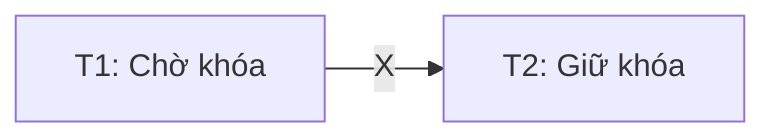

# Kỹ thuật khóa

**Ý tưởng**: Một transaction chỉ được thao tác trên một đơn vị dữ liệu **nếu nó giữ khóa**.
- Chỉ có 1 khóa trên 1 đơn vị dữ liệu.
- Tức có nghĩa tại một thời điểm chỉ có 1 transaction thao tác trên 1 đơn vị dữ liệu.

**Khóa 2 giai đoạn (2PL)**:
- Khi 1 transaction nào đang lock, không thể có transaction nào khác được unlock.
- Khi 1 transaction nào đang unlock, không thể có transaction nào khác được lock.
- **Nhược điểm**: Không tối ưu khi không cho phép các transaction thực thi các thao tác đọc / ghi cùng lúc.

**Khóa đọc viết**:
- Khắc phục nhược điểm của khóa 2 giai đoạn.
- Ở mỗi đơn vị dữ liệu sẽ có 2 loại khóa:
	- **Khóa ghi**: 1 transaction chỉ được ghi khi đơn vị dữ liệu đó không đang đọc hay ghi. Khi đó, không có transaction nào khác được phép nhận khóa đọc hay ghi.
	- **Khóa đọc**: 1 transaction chỉ được đọc khi đơn vị dữ liệu đó đang không ghi. Có thể có nhiều transaction đọc cùng lúc.
- **Ma trận tương thích**:
	- **Đơn vị dữ liệu đang được đọc**: Chỉ cho các transaction đọc.
	- **Đơn vị dữ liệu đang được ghi**: Không cho các transaction làm gì khác.

# Kỹ thuật nhãn thời gian (Timestamping)

**Ý tưởng**:
- Gán cho mỗi giao tác một nhãn thời gian duy nhất để xác định thứ tự thực hiện của chúng.
- Khi giao tác $T$ được khởi tạo, hệ thống dựa trên đồng hồ hệ thống hoặc bộ đếm lập lịch để gắn cho $T$ một nhãn thời gian $TS(T)$. Nhãn càng lớn thì thứ tự thực hiện càng trễ.
- Nếu một giao tác có thể vi phạm tính khả tuần tự thì hệ thống sẽ hủy giao tác đó (rollback) và gắn lại nhãn -> Càng nhiều giao tác thì rollback càng nhiều theo.

| Kịch bản                            | Nhãn thời gian toàn phần (Full timestamping)                                                            | Nhãn thời gian từng phần (Partial timestamping)                                                                                                                                               | Nhãn thời gian nhiều phiên bản (Multi-version timestamping)                                                                                                                                                                                                 |
| ----------------------------------- | ---------------------------------------------------------------------------------------------------------- | ------------------------------------------------------------------------------------------------------------------------------------------------------------------------------------------------ | -------------------------------------------------------------------------------------------------------------------------------------------------------------------------------------------------------------------------------------------------------------- |
| **Khởi tạo timestamp cho ĐVDL $X$** | $TS(X)$                                                                                                    | $RT(X)$ (read).  $WT(X)$ (write).                                                                                                                                                          | $RT(X_i)$ (read thứ i).  $WT(X_i)$ (write thứ i).                                                                                                                                                                                                        |
| **$T$ muốn read**                   | **Kiểm tra $\boxed{TS(X)\leq TS(T)}$**.  **Đúng**: $TS(X):=\max{(TS(X), TS(T))}$. **Sai**: Abort. | **Kiểm tra $\boxed{WT(X)\leq TS(T)}$**.  **Đúng**: $RT(X):=\max{(RS(X), TS(T))}$. **Sai**: Abort.                                                                                    | **Kiểm tra** liệu có tồn tại $\boxed{\text{newest}(WT_{x_i})\leq TS(T)}$.  **Đúng**: $RT(X_i):=\max{(RT(X_i),TS(T))}$. **Sai**: Abort.                                                                                                                |
| **$T$ muốn write**                  | Giống kịch bản khi read.                                                                                   | **Kiểm tra $\boxed{RT(X)\leq TS(T)}$**.   **Đúng**: Kiểm tra $\boxed{WT(X)\leq TS(T)}$. **Sai**: Abort.  **Đúng**: $WT(X):=\max{(WS(X), TS(T))}$. **Sai**: Không làm gì cả. | **Kiểm tra** liệu có tồn tại $\boxed{\text{newest}(WT_{x_i})\leq TS(T)}$.  **Đúng**: Kiểm tra $\boxed{RT(X_i)\leq TS(T)}$. **Sai**: Abort.  **Đúng**: $RT(X_{i+1})=0$ và $WT(X_{i+1})=\max{(WT(X_{i+1}), TS(T))}$. **Sai**: Không làm gì cả. |

**Lưu ý**:
- Đối với các transaction bị abort thì cần khởi tạo lại *TS lớn nhất* và *chạy sau* các transaction khác.
- Đối với partial:
	- **Muốn read phải kiểm tra write**.
	- **Muốn write phải kiểm tra ==read trước, write sau==**.
- Riêng đối với multi-version, **Muốn write phải kiểm tra ==write trước, read sau== mới nhất**.

| Cơ chế             | Khi rollback/restart                       |
| ------------------ | ------------------------------------------ |
| Timestamp Ordering | Cấp **timestamp mới** lớn hơn timestamp cũ |
| Wait-Die           | Giữ nguyên **timestamp cũ**                |

# Kỹ thuật xác nhận hợp lệ (Validation)

Kỹ thuật này cho phép các transaction tự do thao tác lên dữ liệu, sau đó hệ quản trị sẽ kiểm tra tính khả tuần tự của chuỗi. Nếu không khả tuần tự thì rollback.
-> Tốc độ cao nếu các transaction thường không liên quan gì đến nhau.
-> Cần bộ nhớ lớn để phục vụ rollback.

# Deadblock

Deadlock xảy ra khi các giao tác chờ lẫn nhau và không giao tác nào có thể tiếp tục được nữa.

### Phát hiện deadblock bằng Wait-for graph

Trong đồ thị có cạnh $(T1)\xrightarrow{X}(T2)$ thể hiện rằng:

Nếu đồ thị này có chu trình thì lịch có deadblock.

### Tránh (ngăn ngừa) deadblock bằng Wait-die

Gọi $ts(T)$ là thứ tự xuất hiện của $T$ trong lịch.

Xét trong wait-for, có $(T1)\xrightarrow{X}(T2)$:
- Nếu $ts(T1)<ts(T2)$ thì $T1$ sẽ thực hiện (wait) sau khi $T2$ hoàn thành.
- Ngược lại, $T1$ bị hủy (die), các khóa đang giữ được giải phóng và đợi restart với *ts cũ*.

Khi một đơn vị dữ liệu được giải phóng rồi thì các transaction cần nó không cần wait nữa.

>[!tip]
>- Trong sơ đồ lịch, nếu $T1$ nằm bên phải $T2$ thì phải die, ngược lại là wait.
>- **Phải die trái wait**.

| Cơ chế             | Khi rollback/restart                       |
| ------------------ | ------------------------------------------ |
| Timestamp Ordering | Cấp **timestamp mới** lớn hơn timestamp cũ |
| Wait-Die           | Giữ nguyên **timestamp cũ**                |

### Giải quyết (ngăn chặn) deadblock bằng phương pháp rollback

**Chọn 1 trong số những transaction có số lượng giao tác vào ra bằng nhau để rollback**. Sau đó nếu có nhiều nhánh có thể xảy ra thì cần chọn 1 trường hợp để giả sử.

