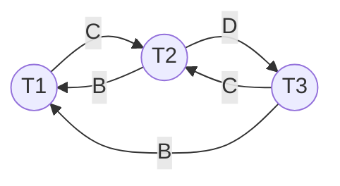
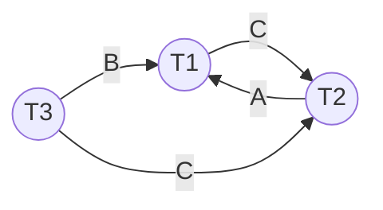

# CK2_2021-2022_C1ab

|     | T1       | T2       | T3       |
| --- | -------- | -------- | -------- |
| 1   | RLock(A) |          |          |
| 2   |          | RLock(C) |          |
| 3   |          |          | WLock(D) |
| 4   | WLock(B) |          |          |
| 5   |          | RLock(B) |          |
| 6   |          |          | RLock(B) |
| 7   | WLock(C) |          |          |
| 8   |          | WLock(D) |          |
| 9   |          |          | WLock(C) |
| 10  | Unlock   | Unlock   | Unlock   |

### Phát hiện deadblock bằng Wait-for graph

Ta có:
- Xét đơn vị dữ liệu $A$: Không có xung đột.
- Xét đơn vị dữ liệu $B$:
	- $W_1(B)<R_2(B)\Rightarrow(T2)\xrightarrow{B}(T1)$.
	- $W_1(B)<R_3(B)\Rightarrow(T3)\xrightarrow{B}(T1)$.
- Xét đơn vị dữ liệu $C$:
	- $R_2(C)<W_1(C)\Rightarrow(T1)\xrightarrow{C}(T2)$.
	- $R_2(C)<W_3(C)\Rightarrow(T3)\xrightarrow{C}(T2)$.
- Xét đơn vị dữ liệu $D$:
	- $W_3(D)<W_2(D)\Rightarrow(T2)\xrightarrow{D}(T3)$.

Do đồ thị có chu trình nên lịch S có xảy ra deadblock.

### Tránh (ngăn ngừa) deadblock bằng Wait-die

Ta có:

|     | T1 ts(T1)=10 | T2 t2(T2)=20    | T3 ts(T3)=30    | Ghi chú                                    |
| --- | --------------- | ------------------ | ------------------ | ------------------------------------------ |
| 1   | RLock(A)        |                    |                    |                                            |
| 2   |                 | RLock(C)           |                    |                                            |
| 3   |                 |                    | WLock(D)           |                                            |
| 4   | WLock(B)        |                    |                    |                                            |
| 5   |                 | RLock(B) -> Die |                    | ts(T2) > ts(T1) -> Die và giải phóng C. |
| 6   |                 |                    | RLock(B) -> Die | ts(T3) > ts(T1) -> Die và giải phóng D. |
| 7   | WLock(C)        |                    |                    |                                            |

T1 thực hiện lại và nhận các khóa trên C:

|     | T1 ts(T1)=10 | T2 t2(T2)=20 | T3 ts(T3)=30    | Ghi chú                                    |
| --- | --------------- | --------------- | ------------------ | ------------------------------------------ |
| 1   | RLock(A)        |                 |                    |                                            |
| 2   | WLock(B)        |                 |                    |                                            |
| 3   | WLock(C)        |                 |                    |                                            |
| 4   | Unlock          |                 |                    |                                            |
| 5   |                 | RLock(C)        |                    |                                            |
| 6   |                 |                 | WLock(D)           |                                            |
| 7   |                 | RLock(B)        |                    |                                            |
| 8   |                 |                 | RLock(B) -> Die | ts(T3) > ts(T2) -> Die và giải phóng D. |

T3 thực hiện lại, nhận được khóa trên B sau khi T2 thực hiện xong và kết thúc.

### Giải quyết (ngăn chặn) deadblock bằng phương pháp rollback

- Chọn T2 để rollback:
	- T2 giải phóng đơn vị dữ liệu C.
	- T1 xin được khóa trên đơn vị dữ liệu C, thực hiện xong, kết thúc và trả khóa trên đơn vị dữ liệu B, C.
	- T3 xin được khóa trên đơn vị dữ liệu B, C, thực hiện xong, kết thúc và trả khóa trên đơn vị dữ liệu B, C, D.
- Lịch khả tuần tự theo thứ tự T1, T3, T2.

# CK2_2024-2025_C1ab

Cho lịch S như sau:

|     | T1       | T2       | T3       |
| --- | -------- | -------- | -------- |
| 1   | RLock(A) |          |          |
| 2   |          | RLock(C) |          |
| 3   | WLock(B) |          |          |
| 4   |          | RLock(D) |          |
| 5   |          |          | RLock(B) |
| 6   | WLock(C) |          |          |
| 7   |          | WLock(A) |          |
| 8   |          |          | WLock(C) |
| 9   | Unlock   | Unlock   | Unlock   |

### Phát hiện deadblock bằng Wait-for graph

Ta có:
- Xét đơn vị dữ liệu A:
	- $R_1(A)...W_2(A)\Rightarrow(T2)\xrightarrow{A}(T1)$.
- Xét đơn vị dữ liệu B:
	- $W_1(B)...R_3(B)\Rightarrow(T3)\xrightarrow{B}(T1)$.
- Xét đơn vị dữ liệu C:
	- $R_2(C)...W_1(C)\Rightarrow(T1)\xrightarrow{C}(T2)$.
	- $R_2(C)...W_3(C)\Rightarrow(T3)\xrightarrow{C}(T2)$.
- Xét đơn vị dữ liệu D:
	- Không có.

Do đồ thị có chu trình $(T1)\xrightarrow{C}(T2)\xrightarrow{A}(T1)$ nên có deadblock.

### Tránh (ngăn ngừa) deadblock bằng Wait-die

(*Trong bài thi chỉ cần trình bày vì sao wait/die là được*)

Ta có:

|     | T1 ts(T1)=10     | T2 t2(T2)=20    | T3 ts(T3)=30    | Ghi chú                                                                           |
| --- | ------------------- | ------------------ | ------------------ | --------------------------------------------------------------------------------- |
| 1   | RLock(A)            |                    |                    |                                                                                   |
| 2   |                     | RLock(C)           |                    |                                                                                   |
| 3   | WLock(B)            |                    |                    |                                                                                   |
| 4   |                     | RLock(D)           |                    |                                                                                   |
| 5   |                     |                    | RLock(B) -> Die | ts(T3) > ts(T1) -> T3 die và không giữ khóa nào nên không cần giải phóng khóa. |
| 6   | WLock(C) -> Wait |                    |                    | ts(T1) < ts(T2) -> T1 wait.                                                    |
| 7   |                     | WLock(A) -> Die |                    | ts(T2) > ts(T1) -> T2 die và giải phóng C, D.                                  |

T1 nhận được các khóa trên A, B, C:

|     | T1 ts(T1)=10 | T2 t2(T2)=20 | T3 ts(T3)=30    | Ghi chú                                        |
| --- | --------------- | --------------- | ------------------ | ---------------------------------------------- |
| 1   | RLock(A)        |                 |                    |                                                |
| 2   | WLock(B)        |                 |                    |                                                |
| 3   | WLock(C)        |                 |                    | T1 giải phóng A, B, C. T2, T3 được restart. |
| 4   | Unlock          |                 |                    |                                                |
| 5   |                 | RLock(C)        |                    |                                                |
| 6   |                 | RLock(D)        |                    |                                                |
| 7   |                 |                 | RLock(B)           |                                                |
| 8   |                 | WLock(A)        |                    |                                                |
| 9   |                 |                 | WLock(C) -> Die | ts(T3) > ts(T2)                                |

T3 thực hiện lại, nhận được khóa trên C sau khi T2 thực hiện xong và kết thúc.

### Giải quyết (ngăn chặn) deadblock bằng phương pháp rollback

- Chọn T2 để rollback, T2 giải phóng khóa trên C.
- Giả sử T1 hoặc T3 xin được khóa trên C:
	- Giả sử T1 xin được khóa trên C, T1 sau khi hoàn tất sẽ giải phóng A, B, C.
	- T3 xin được khóa trên C.
- T2 nhận được khóa khi T1, T3 xong.

Vậy lịch khả tuần tự theo thứ tự {T1, T3, T2}.

# CK2_2021-2022_C1c

Hãy điều khiển việc truy xuất đồng thời của các giao tác dùng kỹ thuật **timestamp từng phần**. Nếu có thao tác bị hủy, hãy khởi tạo lại timestamp mới cho đến khi không còn thao tác nào bị hủy nữa. Cho biết lịch khả tuần tự theo thứ tự nào?

|     | T1 TS(T1) = 10 | T2 TS(T2) = 20 | T3 TS(T3) = 30 |
| --- | ----------------- | ----------------- | ----------------- |
| 1   | Read(A)           |                   |                   |
| 2   |                   | Read(C)           |                   |
| 3   |                   |                   | Write(D)          |
| 4   | Write(B)          |                   |                   |
| 5   |                   | Read(B)           |                   |
| 6   |                   |                   | Read(B)           |
| 7   | Write(C)          |                   |                   |
| 8   |                   | Write(D)          |                   |
| 9   |                   |                   | Write(C)          |

Ta có (*trong bài thi phải thể hiện rõ phần ghi chú là vì sao cập nhật RT/WT và kết luận transaction có thể R/W hay không*):

|     | T1 TS(T1)=10  | T2 TS(T2)=20       | T3 TS(T3)=30 | A RT(A)=0 WT(A)=0 | B RT(B)=0 WT(B)=0 | C RT(C)=0 WT(C)=0 | D RT(D)=0 WT(D)=0 |
| --- | ---------------- | --------------------- | --------------- | ----------------------- | ----------------------- | ----------------------- | ----------------------- |
| 1   | R(A)             |                       |                 | RT(A)=10 WT(A)=0     |                         |                         |                         |
| 2   |                  | R(C)                  |                 |                         |                         | RT(C)=20 WT(C)=0     |                         |
| 3   |                  |                       | W(D)            |                         |                         |                         | RT(D)=0 WT(D)=30     |
| 4   | W(B)             |                       |                 |                         | RT(B)=0 WT(B)=10     |                         |                         |
| 5   |                  | R(B)                  |                 |                         | RT(B)=20 WT(B)=10    |                         |                         |
| 6   |                  |                       | R(B)            |                         | RT(B)=30 WT(B)=10    |                         |                         |
| 7   | W(C) -> Abort |                       |                 |                         |                         |                         |                         |
| 8   |                  | W(D) -> Do nothing |                 |                         |                         |                         |                         |
| 9   |                  |                       | W(C)            |                         |                         | RT(C)=20 WT(C)=30    |                         |

Tại thời điểm 7, TS(T1) < RT(C) nên T1 bị abort và khởi tạo lại TS(T1) = 40.

|     | T1 TS(T1)=40 | T2 TS(T2)=20       | T3 TS(T3)=30 | A RT(A)=0 WT(A)=0 | B RT(B)=0 WT(B)=0 | C RT(C)=0 WT(C)=0 | D RT(D)=0 WT(D)=0 |
| --- | --------------- | --------------------- | --------------- | ----------------------- | ----------------------- | ----------------------- | ----------------------- |
| 1   |                 | R(C)                  |                 |                         |                         | RT(C)=20 WT(C)=0     |                         |
| 2   |                 |                       | W(D)            |                         |                         |                         | RT(D)=0 WT(D)=30     |
| 3   |                 | R(B)                  |                 |                         | RT(B)=20 WT(B)=0     |                         |                         |
| 4   |                 |                       | R(B)            |                         | RT(B)=30 WT(B)=0     |                         |                         |
| 5   |                 | W(D) -> Do nothing |                 |                         |                         |                         | RT(D)=0 WT(D)=30     |
| 6   |                 |                       | W(C)            |                         |                         | RT(C)=20 WT(C)=30    |                         |
| 7   | R(A)            |                       |                 | RT(A)=40 WT(A)=0     |                         |                         |                         |
| 8   | W(B)            |                       |                 |                         | RT(B)=30 WT(B)=40    |                         |                         |
| 9   | W(C)            |                       |                 |                         |                         | RT(C)=20 WT(C)=40    |                         |

Vậy lịch khả tuần tự theo thứ tự là {T2, T3, T1}.

# CK2_2024-2025_C1c

Hãy điều khiển việc truy xuất đồng thời của các giao tác dùng kỹ thuật **timestamp từng phần**. Nếu có thao tác bị hủy, hãy khởi tạo lại timestamp mới cho đến khi không còn thao tác nào bị hủy nữa. Cho biết lịch khả tuần tự theo thứ tự nào?

|     | T1 TS(T1) = 10 | T2 TS(T2) = 20 | T3 TS(T3) = 30 |
| --- | ----------------- | ----------------- | ----------------- |
| 1   | Read(A)           |                   |                   |
| 2   |                   | Read(C)           |                   |
| 3   | Write(B)          |                   |                   |
| 4   |                   | Read(D)           |                   |
| 5   |                   |                   | Read(B)           |
| 6   | Write(C)          |                   |                   |
| 7   |                   | Write(A)          |                   |
| 8   |                   |                   | Write(C)          |

Ta có (*trong bài thi phải thể hiện rõ phần ghi chú là vì sao cập nhật RT/WT và kết luận transaction có thể R/W hay không*):

| STT | T1 TS(T1)=10      | T2 TS(T2)=20 | T3 TS(T3)=30 | A RT(A)=0 WT(A)=0 | B RT(B)=0 WT(B)=0 | C RT(C)=0 WT(C)=0 | D RT(D)=0 WT(D)=0 |
| --- | -------------------- | --------------- | --------------- | ----------------------- | ----------------------- | ----------------------- | ----------------------- |
| 1   | Read(A)              |                 |                 | RT(A)=10 WT(A)=0     |                         |                         |                         |
| 2   |                      | Read(C)         |                 |                         |                         | RT(C)=20 WT(C)=0     |                         |
| 3   | Write(B)             |                 |                 |                         | RT(B)=0 WT(B)=10     |                         |                         |
| 4   |                      | Read(D)         |                 |                         |                         |                         | RT(D)=20 WT(D)=0     |
| 5   |                      |                 | Read(B)         |                         | RT(B)=30 WT(B)=10    |                         |                         |
| 6   | Write(C) -> Abort |                 |                 |                         |                         |                         |                         |
| 7   |                      | Write(A)        |                 |                         |                         |                         |                         |
| 8   |                      |                 | Write(C)        |                         |                         |                         |                         |

Tại bước 6, RT(C)=20 > TS(T1)=10 -> Abort và khởi tạo lại TS(T1)=30.

