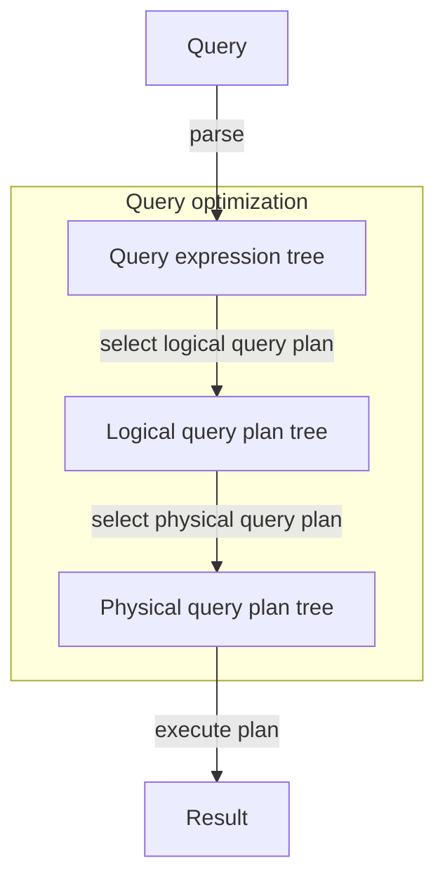

# Tổng quan quy trình truy vấn



# Cây SFW và cây đại số quan hệ

Xem xét 2 ví dụ:
![[query-optimization-eg1.svg]]

**Quy tắc chuyển từ cây SFW sang cây đại số quan hệ**:
- Thay thế SELECT \<SelectList> bằng $\boxed{\pi_{\text{SelectList}}}$.
- Thay thế FROM \<Relation> bằng $\boxed{\text{Relation}}$.
- Thay thế WHERE \<Condition> bằng $\boxed{\sigma_{\text{Condition}}}$.
- Thay thế agreeate function (attribute) bằng $\boxed{\gamma_{\text{attribute}}}$.
- Thay thế phép đổi tên bằng $\boxed{\rightarrow a}$.
- Nếu có truy vấn con thì mỗi truy vấn con bắt đầu bằng $\boxed{\delta}$. Quan hệ giữa bảng với bảng hoặc bảng với truy vấn con luôn là phép $\boxed{\times}$ kết hợp với $\sigma$ (nếu có).

Thứ tự một cây đại số luôn là: $\boxed{\pi\rightarrow\sigma\rightarrow\text{Relation}/\delta}$.

# Quy trình tối ưu hóa truy vấn

- Đưa phép chọn $\sigma$, phép chiếu $\pi$ xuống sâu các nhánh.
- Thay thế phép tính $\times$ bằng phép chọn $\sigma$ và phép kết $\bowtie$.

![[query-optimization-rule.svg]]

# Ví dụ

**CK2_2021-2022_C3**:
Cho lược đồ:
- THANHVIEN (MaTV, HoTen, NgSinh, GioiTinh, DienThoai, Quan, LoaiTV).
- PHIM (MaP, TenP, NamSX, TheLoai, ThoiLuong, TinhTrang, SoLuotXem).
- RAPPHIM (MaRP, TenRP, SLVe, DiaChi, ThanhPho).
- LICHCHIEU (MaLC, MaRP, MaP, PhongChieu, SuatChieu, SucChua, TuNgay, DenNgay).
- VE (MaVe, MaTV, MaLC, NgayMua, LoaiVe, GiaTien).

Phân tích và tối ưu hóa truy vấn sau:
```sql
SELECT TV.MATV, HoTen
FROM RAPPHIM RP, PHIM P, LICHCHIEU LC, VE V, THANHVIEN TV
WHERE
	RP.MARP = LC.MARP AND
	P.MAP = LC.MAP AND
	V.MALC = LC.MALC AND
	TV.MATV = LC.MATV AND
	HoTen = "Nguyễn Văn A" AND
	ThanhPho = "Tp. Hồ Chí Minh" AND
	TenP = "Top Gun: Maverich" AND
	SuatChieu = "19:45" AND
	TuNgay = "27/05/2022" AND
	DenNgay = "29/05/2022" AND
	LoaiVe = "3D"
```

| Cây biểu diễn truy vấn ban đầu | Cây biểu diễn truy vấn sau khi tối ưu                                                                                   |
| ------------------------------ | ----------------------------------------------------------------------------------------------------------------------- |
| ![[CK2_2021-2022_C3_1.svg]]    | Đưa phép chọn, phép chiếu xuống sâu các nhánh. Thay thế phép tích bằng phép chọn và kết.<br>![[CK2_2021-2022_C3_2.svg]] |

Biểu diễn truy vấn bằng SQL sau khi tối ưu:
```sql
SELECT THANHVIEN.MaTP, HoTen
FROM
(
	SELECT MaTV
	FROM
	(
		SELECT MaLC, MaTV
		FROM
		(
			SELECT MaP, MaLC, MaTV
			FROM
			(SELECT MaRP FROM RAPPHIM WHERE ThanhPho = "Tp. Hồ Chí Minh")
			JOIN
			(SELECT MaRP, MaP, MaLC, MaTV) FROM LICHCHIEU WHERE SuatChieu = "19:45" AND TuNgay = "27/05/2022" AND DenNgay = "29/05/2022")
			ON RAPPHIM.MaRP = LICHCHIEU.MaRP
		) JOIN (
			SELECT MaP FROM PHIM WHERE TenP = "Top Gun: Maverich"
		) ON LICHCHIEU.MaP = PHIM.MaP
	) JOIN (
		SELECT MaLC FROM VE WHERE LoaiVe = "3D"
	) ON LICHCHIEU.MaLC = VE.MaLC
) JOIN (
	SELECT MaTV, HoTen FROM THANHVIEN WHERE HoTen = "Nguyễn Văn A"
)
```

**CK2_2024-2025_C3**:
Cho lược đồ:
- KHOAHOC (MAKH, TENKH, NGAYBD, NGAYKT).
- HOCVIEN (MAHV, TENHV, NTNS, DCHI, NNGHIEP).
- GIAOVIEN (MAGV, TENGV, NTNS, DC).
- LOPHOC (MALOP, TENLOP, MAKH, MAGV, SISODK, LTRG, PHHOC).
- BIENLAI (SOBL, MALOP, MAHV, DIEM, KQUA, XEPLOAI, TIENNOP).

Phân tích và tối ưu hóa truy vấn sau:
```sql
SELECT HV.MAHV, TENHV
FROM HOCVIEN HV, BIENLAI BL, LOPHOC LH, KHOAHOC KH
WHERE
		HV.MAHV = BL.MAHV
	AND LH.MALOP = BL.MALOP
	AND LH.MAKH = KH.MAKH
	AND KQUA = "Đạt"
	AND XEPLOAI = "Giỏi"
	AND DCHI = "TPHCM"
	AND YEAR(NGAYBD) = 2024
```

| Cây biểu diễn truy vấn ban đầu | Cây biểu diễn truy vấn sau khi tối ưu                                                                                   |
| ------------------------------ | ----------------------------------------------------------------------------------------------------------------------- |
| ![[CK2_2024-2025_C3_1.png]]    | Đưa phép chọn, phép chiếu xuống sâu các nhánh. Thay thế phép tích bằng phép chọn và kết.<br>![[CK2_2024-2025_C3_2.png]] |

Biểu diễn truy vấn bằng SQL sau khi tối ưu:
```sql
SELECT BIENLAI.MaHV, TenHV
FROM
(
	(
		SELECT MaHV, MaLop
		FROM BIENLAI
		WHERE KQUA = "Đạt" AND XEPLOAI = "Giỏi"
	)
	JOIN
	(
		SELECT MaHV, TenHV
		FROM HOCVIEN
		WHERE DCHI = "TPHCM"
	)
	ON BIENLAI.MaHV = HOCVIEN.MaHV
)
JOIN
(
	(
		SELECT MaKH
		FROM KHOAHOC
		WHERE YEAR(NGAYBD) = 2024
	)
	JOIN
	(
		SELECT MaKH, MaLop
		FROM LOPHOC
	)
	ON KHOAHOC.MaKH = LOPHOC.MaKH
)
ON BIENLAI.MaLop = LOPHOC.MaLop
```