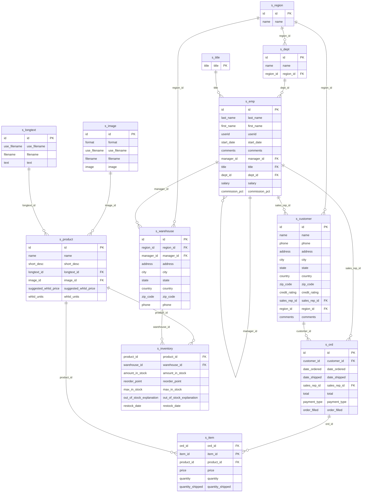

# Đề 1

Cho lược đồ:
- **KHACHHANG** (MAKH, HOTEN, DCHI, SODT, NGSINH, DOANHSO, NGDK).
- **NHANVIEN** (MANV, HOTEN, NGVL, SODT).
- **SANPHAM** (MASP, TENSP, DVT, NUOCSX, GIA).
- **HOADON** (SOHD, NGHD, MAKH, MANV, TRIGIA)
- **CTHD** (SOHD, MASP, SL)

In ra danh sách các khách hàng (MAKH, HOTEN) đã mua sản phẩm có mã sản phẩm là “BB01” trong năm 2024.

```sql
SELECT KH.MAKH, KH.HOTEN
FROM KHACHHANG KH
JOIN HOADON HD ON HD.MAKH = KH.MAKH
JOIN CTHD ON CTHD.SOHD = HD.SOHD
WHERE CTHD.MASP = 'BB01' AND EXTRACT(YEAR FROM HD.NGHD) = 2024
GROUP BY KH.MAKH, KH.HOTEN;
```

In ra danh sách các nhân viên (MANV, HOTEN) và tổng số hóa đơn từng nhân viên đã lập trong năm 2024. 

```sql
SELECT NV.MANV, NV.HOTEN, COUNT(*) SL
FROM NHANVIEN NV
LEFT JOIN HOADON HD ON HD.MANV = NV.MANV AND EXTRACT(YEAR FROM HD.NGHD) = 2024
GROUP BY NV.MANV, NV.HOTEN;
```

In ra danh sách các sản phẩm (MASP, TENSP) có tổng số lượng bán ra nhiều nhất trong năm 2024.

```sql
SELECT SP.MASP, SP.TENSP
FROM SANPHAM SP
JOIN CTHD CT ON CT.MASP = SP.MASP
JOIN HOADON HD ON HD.SOHD = CT.SOHD
WHERE EXTRACT(YEAR FROM HD.NGHD) = 2024
GROUP BY SP.MASP, SP.TENSP
ORDER BY SUM(CT.SL) DESC
FETCH FIRST 1 ROWS ONLY WITH TIES;
```

Xây dựng thủ tục `PrintCustomerInvoice` cho phép *nhập vào MAKH* và *in ra danh sách các hóa đơn của khách hàng này và số sản phẩm mua trong hóa đơn đó*.

```sql
CREATE OR REPLACE PROCEDURE
PrintCustomerInvoice(p_makh IN VARCHAR2)
IS
	v_tenkh KHACHHANG.HOTEN%TYPE;
BEGIN
    -- Lấy HOTEN từ MAKH
    SELECT HOTEN INTO v_tenkh
    FROM KHACHHANG
    WHERE MAKH = p_makh;
    
    DBMS_OUTPUT.PUT_LINE('KH: ' || v_tenkh || '; ' || p_makh);

    -- Lặp qua các hóa đơn
    FOR r IN (
        SELECT H.SOHD, COUNT(*) SL
        FROM HOADON H
        JOIN CTHD C ON H.SOHD = C.SOHD
        WHERE H.MAKH = p_makh
        GROUP BY H.SOHD
    )
    LOOP
        DBMS_OUTPUT.PUT_LINE('SOHD: ' || r.SOHD || 'SL ' || r.SL);
    END LOOP;
	
EXCEPTION
    WHEN NO_DATA_FOUND THEN
        DBMS_OUTPUT.PUT_LINE('Khong ton tai khach hang.');
END;
```

Viết hàm `SumQuantity` *nhận vào tháng, năm, MASP* và trả về *tổng số lượng bán hàng* của sản phẩm trong tháng năm đó. Trả về `NULL` nếu không tồn tại.

```sql
CREATE OR REPLACE FUNCTION SumQuantity(
    p_month NUMBER,
    p_year  NUMBER,
    p_masp  VARCHAR2
)
RETURN NUMBER
IS
	v_total NUMBER;  
	v_count NUMBER;
BEGIN
    -- Kiểm tra sản phẩm có tồn tại không
    SELECT COUNT(*)
    INTO v_count
    FROM SANPHAM
    WHERE MASP = p_masp;

    IF v_count = 0 THEN
        RETURN NULL;
    END IF;

    -- Tính tổng số lượng bán
    SELECT SUM(C.SL)
    INTO v_total
    FROM CTHD C
    JOIN HOADON H ON C.SOHD = H.SOHD
    WHERE C.MASP = p_masp
    AND EXTRACT(MONTH FROM H.NGHD) = p_month
    AND EXTRACT(YEAR FROM H.NGHD) = p_year;

    RETURN v_total;

EXCEPTION
    WHEN NO_DATA_FOUND THEN
        RETURN NULL;
END;
```

# Đề 2

Cho sơ đồ cơ sở dữ liệu:



Hãy sử dụng các bảng S_EMP, S_DEPT, S_ORD, S_ITEM và S_PRODUCT. 

Hiển thị họ, tên và ngày tuyển dụng của tất cả các nhân viên cùng phòng với Lan.

```sql
SELECT EMP.FIRST_NAME, EMP.LAST_NAME, EMP.START_DATE
FROM S_EMP EMP
WHERE EMP.DEPT_ID = (
	SELECT EMP1.DEPT_ID
	FROM S_EMP EMP1
	WHERE EMP1.LAST_NAME = 'Lan'
	FETCH FIRST 1 ROWS ONLY
);
```

Hiển thị mã nhân viên, họ, tên và mã truy cập của tất cả các nhân viên có mức lương trên mức lương trung bình.

```sql
SELECT EMP.ID, EMP.FIRST_NAME, EMP.LAST_NAME, EMP.USERID
FROM S_EMP EMP
WHERE EMP.SALARY > (
	SELECT AVG(EMP1.SALARY)
	FROM S_EMP EMP1
);
```

Kiểm tra nhân viên có mã (id) là 1 nếu có mức lương (salary) nhỏ hơn hoặc bằng 2000 thì cập nhật cộng thêm 1000 sau đó in ra thông báo 'Salary updated'.

```sql
BEGIN
    UPDATE S_EMP
    SET SALARY = SALARY + 1000
    WHERE ID = 1 AND SALARY <= 2000;
	
    IF SQL%ROWCOUNT > 0 THEN
        DBMS_OUTPUT.PUT_LINE('Salary updated');
    END IF;
END;
/
```

Viết trigger hiện thực yêu cầu sau: “Mỗi nhân viên không được quản lý quá 3 nhà kho”.

```sql
CREATE OR REPLACE TRIGGER trg_biu_warehouse
BEFORE INSERT OR UPDATE
ON S_WAREHOUSE
FOR EACH ROW
DECLARE
	v_total_warehouse NUMBER;
BEGIN
	SELECT COUNT(*)
	INTO v_total_warehouse
	FROM S_WAREHOUSE W
	WHERE W.MANAGER_ID = :NEW.MANAGER_ID
	
	IF v_total_warehouse + 1 > 3 THEN
		RAISE_APPLICATION_ERROR(-20000, 'Khong duoc quan ly nhieu hon 3 nha kho.');
	END IF;
END;
/
```

Tạo một bó lệnh PL/SQL khai báo một con trỏ (cursor) EMP_CUR để lấy tên, lương và ngày vào làm của những nhân viên có lương lớn hơn 15000 và ngày vào làm lớn hơn ngày 01 tháng 02 năm 1988 trong bảng nhân viên.

```sql
CREATE OR REPLACE PROCEDURE emp_cur_proc ()
IS
BEGIN
	FOR emp_cur IN SELECT EMP.FIRST_NAME, EMP.LAST_NAME, EMP.START_DATE
		FROM S_EMP EMP
		WHEN EMP.SALARY > 1500 AND START_DATE > TO_DATE('01-02-1988', 'dd-MM-yyyy')
	LOOP
		DBMS_OUTPUT.PUT_LINE('Name: ' || emp_cur.FIRST_NAME || emp_cur.LAST_NAME || 'Salary: ' || TO_CHAR(emp_cur.START_DATE));
	END LOOP;
END;
/
```

Viết hàm Tong_Doanhso nhận vào mã số của khách hàng trả về tổng doanh số mua hàng của khách hàng đó. Trả về NULL nếu không tồn tại khách hàng tương ứng. 

```sql
CREATE OR REPLACE FUNCTION Tong_Doanhso (p_customer_id IN VARCHAR2)
RETURN NUMBER
	v_total_payment S_ORD.total%TYPE;
IS
	SELECT SUM(ORD.TOTAL)
	INTO v_total_payment
	FROM S_ORD ORD
	WHERE ORD.CUSTOMER_ID = p_customer_id
	
	RETURN v_total_payment;

EXCEPTION
	WHEN NO_DATA_FOUND THEN
		RETURN NULL;
BEGIN
END;
/
```


