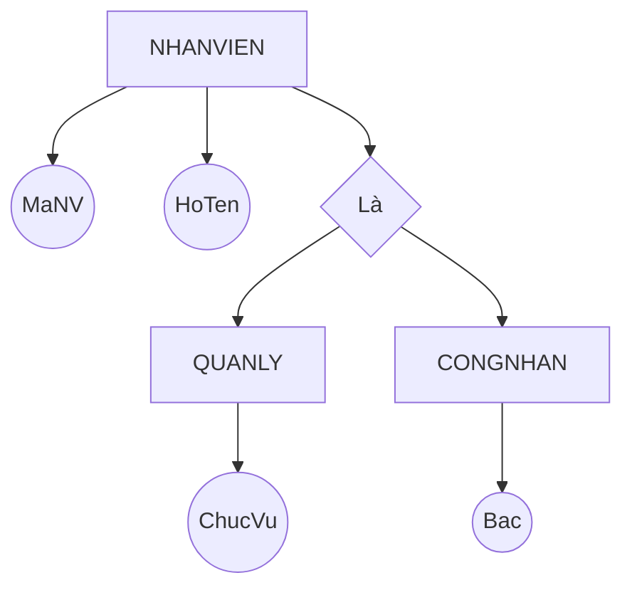
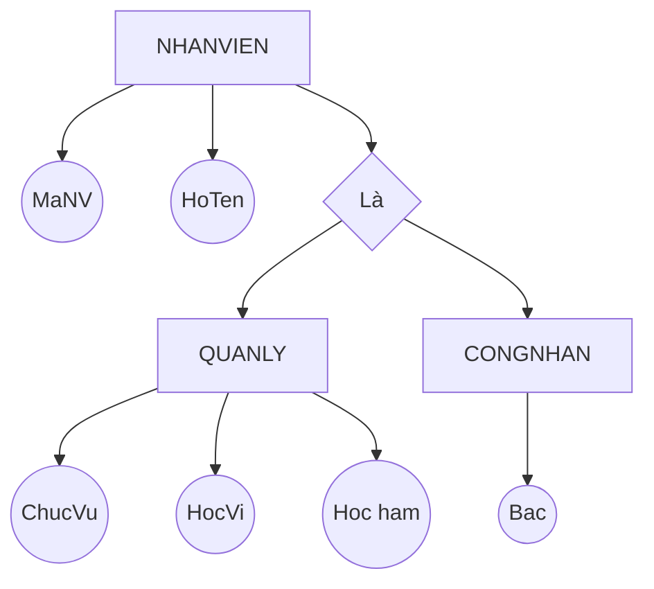

Mô hình quan hệ là một dạng [[2. Mô hình dữ liệu]].

# Các thành phần của mô hình quan hệ

1. **Thuộc tính (Attribute)**
    - Mô tả đặc trưng, tính chất riêng biệt của đối tượng cần được lưu trữ trong CSDL.
    - Gồm có:
        1. **Tên gọi**: Dãy ký tự.
        2. **Kiểu dữ liệu**: Số, Chuỗi, Ngày tháng, Boolean, NULL,... Không có các kiểu dữ liệu phức tạp như list, set, array,...
        3. **Miền giá trị**: Tập giá trị mà thuộc tính có thể nhận.
            - VD: Dom(GioiTinh)=('Nam', 'Nu').

2. **Quan hệ (Relation)**
    - Là một tập hữu hạn các attribute.
    - Ký hiệu: $R = ( a_1; \quad a_2; \quad ...; \quad a_n )$. $R^+ = \{ a_1; \quad a_2; \quad ..; \quad a_n. \}$.
    - VD: LOP(MaLop, TenLop, SiSo).

3. **Bộ (Tuple, Record)**
    - Là tập hợp các giá trị thuộc các attribute khác nhau của một đối tượng.
    - Ký hiệu: $r = ( v_1; \quad v_2; \quad ... )$.
    - Chú ý:
        1. Các bộ là phân biệt.
        2. Thứ tự các bộ không quan trọng. Nhưng thứ tự các giá trị trong bộ là quan trọng.

4. **Thể hiện của quan hệ (Instance)**
    - Là tập hợp các bộ tại 1 thời điểm.

5. **Các loại khóa**:
	1. **Siêu khóa (Super key)**: Là tập của các thuộc tính sao cho các bộ phân biệt với nhau ở tập này. Một quan hệ có thể có nhiều siêu khóa.
	2. **Khóa (Key)**: Là siêu khóa có ít thuộc tính nhất.
	3. **Khóa chính (Primary key)**: Là 1 khóa được chọn để phân biệt các bộ của quan hệ.
	4. **Khóa tương đương**: Là các khóa không được chọn làm khóa chính.
	5. **Khóa ngoại (Foreign key)**: Là khóa ở quan hệ B tham chiếu đến khóa chính ở quan hệ A.

# Biểu diễn mô hình quan hệ

Được biểu diễn qua lược đồ **(Schema)**:
1. **Lược đồ quan hệ**:
	- Là lược đồ mô tả cấu trúc của một quan hệ và các mối liên hệ giữa các thuộc tính trong quan hệ đó.
	- VD: **THI (MaSV, MaMH, LanThi, Diem)**. Tân từ: Mỗi sv được phép thi một môn học nhiều lần, mỗi lần thi lưu trữ thông tin sinh viên nào (MaSV) thi môn gì (MaMH), lần thi thứ mấy (LanThi), và điểm đạt được (Diem).

2. **Lược đồ CSDL**:
	- Là tập hợp gồm các lược đồ quan hệ và các mối liên hệ giữa chúng trong cùng một hệ thống quản lý.
	- VD: Lược đồ CSDL Quản lý điểm thi của Sinh viên:
		1. **MONHOC (MAMH, TENMH, TCLT, TCTH, MAKHOA)**. Tân từ: Mỗi môn học có mã môn học (MaMH) duy nhất để phân biệt với các môn học khác, có tên môn học (TenMH), số tín chỉ lý thuyết (TCLT), số tín chỉ thực hành (TCTH) và do một khoa phụ trách về mặt nội dung (MaKhoa).
		2. **DIEUKIEN (MAMH, MAMH_TRUOC)**. Tân từ: Có những môn học (MaMH) sinh viên phải có kiến thức từ một số môn học trước (MaMH_Truoc).

# Ánh xạ mô hình ER sang mô hình quan hệ

## Chuyển đổi mối

- **Mối 1-1**:
	- 2 quan hệ *ít* thuộc tính -> Gộp lại thành *1 quan hệ*.
	- 2 quan hệ *nhiều* thuộc tính -> Tách ra thành *2 quan hệ, quan hệ có **ít** bộ tham gia hơn thì có khóa ngoại đến quan hệ kia*.

- **Mối 1-n**: Tách ra thành *2 quan hệ, quan hệ có **ít** bộ tham gia hơn thì có khóa ngoại đến quan hệ kia*.

- **Mối n-n**:
	- Tách ra thành 2 quan hệ và *1 quan hệ trung gian*, quan hệ trung gian có khóa ngoại đến 2 quan hệ kia.
	- *Khóa chính* của quan hệ trung gian có thể là các khóa ngoại như trên hoặc khóa chính riêng biệt, tùy trường hợp.

- **Mối đệ quy**: Tạo thêm một khóa ngoại trỏ đến chính nó.

## Chuyển đổi mức chuyên biệt hóa, tổng quát hóa

- Mức chuyên biệt hóa có **ít hoặc không** có thuộc tính riêng -> *Gom lên mức tổng quát, bổ sung thêm thuộc tính phân loại và các ràng buộc toàn vẹn*.

- NHANVIEN(MaNV, HoTen, **Loai, ChucVu, Bac**)

- Mức chuyên biệt hóa có **nhiều** thuộc tính riêng -> Tách thành nhiều thực thể riêng.

- **CONGNHAN** (MaNV, HoTen, **Bac**).
- **QUANLY** (MaNV, HoTen, **ChucVu, HocVi, HocHam**).

# Đại số quan hệ

Đại số quan hệ là:
- Mô hình toán học dựa trên **lý thuyết tập hợp**.
- Đối tượng xử lý là các quan hệ trong CSDL quan hệ.
- Cho phép sử dụng các phép toán rút trích dữ liệu từ các quan hệ.
- Tối ưu hóa quá trình rút trích dữ liệu.
- Bao gồm các phép toán và biểu thức quan hệ.

## Các phép toán đại số quan hệ

Một số phép toán đại số thông thường:
1. $\cap$: Giao. $\wedge$: Và.
2. $\cup$: Hợp. $\vee$: Hoặc.

>[!CAUTION]
Kết quả của một phép toán quan hệ là một **quan hệ**.

**Các phép toán quan hệ**:

---
**Phép đổi tên**:
$$\text{New name}\leftarrow R$$

---
**Phép chọn**: Chọn ra các bộ thỏa mãn điều kiện $P$ trong quan hệ $R$:
$$\sigma_{(P)}(R)$$
Những điều kiện $P$ có cú pháp *<tên thuộc tính><toán tử><giá trị>*.

---
**Phép chiếu**: Lấy ra một số thuộc tính $A_i$ trong quan hệ $R$:
$$\pi_{(A_1, A_2, ...)}(R)$$

---
**Các phép Hợp, Giao, Trừ**: Chỉ thực hiện khi chúng **khả hợp**: Số lượng thuộc tính giữa 2 quan hệ phải *bằng nhau*.

---
**Phép tích Descartes**: Trả về một quan hệ có $|A|\times|B|$ bộ bằng cách kết hợp từng bộ của quan hệ $A$ với từng bộ của quan hệ $B$:
$$ A \times B$$

---
**Phép kết Theta-join**: Là thực hiện tích Descartes, rồi từ kết quả chọn ra các bộ thỏa mãn điều kiện $a\;\theta\;b$. Ký hiệu $A\underset{a\;\theta\;b}{\bowtie} B$. Có 3 loại:
	1. **Phép kết bằng (Equi-join)**: Ký hiệu $A\underset{a\;=\;b}{\bowtie}B$, ghép các bộ mà  $A.a=B.b$.
	2. **Phép kết tự nhiên (Natural-join)**: Ký hiệu $A\underset{t}{\bowtie}B$, ghép các bộ mà $A.t=B.t$.
	3. **Phép kết ngoài (Outer-join)**:
		1. **Left-outer-join**: Ký hiệu $A\;\underset{t}{⟕}\;B$. Là kết bằng, nhưng vẫn giữ lại các bộ của quan hệ bên trái, các thuộc tính của quan hệ bên phải không có giá trị tương ứng sẽ mang giá trị NULL.
		2. **Right-outer-join**: Ký hiệu $A\;\underset{t}{⟖}\;B$. Là kết bằng, nhưng vẫn giữ lại các bộ của quan hệ bên trái, phải thuộc tính của quan hệ bên trái không có giá trị sẽ mang giá trị NULL.
		3. **Full-outer-join**: Ký hiệu $A\;\underset{t}{⟗}\;B$. Là kết bằng, nhưng vẫn giữ lại các bộ thuộc quan hệ bên phải và trái, các thuộc tính ở quan hệ bên trái và phải mà không có dữ liệu sẽ mang giá trị NULL.

---
**Phép chia**:
- Có kết quả có $A-B$ thuộc tính.
- Trả về các bộ của quan hệ $A$ tương ứng với tất cả các bộ của quan hệ $B$. 
- Điều kiện: Tất cả thuộc tính của $B$ phải là **tập con** các thuộc tính của $A$.

---
**Phép gom nhóm**:
$$A(a_1, a_2,...)\leftarrow _{(r_x,r_y,...)}\mathcal{J}_{(f(r_n),f(r_m),...)}(R)  $$
Trong đó:
- $R$: Quan hệ ban đầu.
- $A$: Quan hệ kết quả.
- $r_i$: Các thuộc tính được gom nhóm.
- $f(r_j)$: Thực hiện hàm aggreeate lên thuộc tính $r\in R$. Các hàm tính toán thường có **count()**, **sum()**, **min()**, **max()**, **avg()**, **day()**, **month()**, **year()** và không nhất thiết dùng trong phép gom nhóm.
- $a_t$: Các thuộc tính ánh xạ từ $r_i$ và $r_j$ sang.

## Xác định thứ tự các bộ

Trên lý thuyết thì mỗi quan hệ là các tập hợp, nên không phân biệt thứ tự.

Trên thực tế:
- Người ta sẽ dùng một hoặc vài thuộc tính để xác định thứ tự, như thời điểm, số thứ tự,... lúc này, thứ tự nhỏ nhất và lớn nhất có thể được xác định qua **min(), max()**.
- Trong trường hợp đặc biệt, cần dùng tổng hợp các phép toán quan hệ mới đưa ra được thứ tự

**VD1**: Cho quan hệ **KIEMDINH(MaKD, MaSP, KetQua)** thể hiện kết quả kiểm định với từng loại sản phẩm.
- Nếu sản phẩm có kết quả `Đạt` thì không cần kiểm định nữa.
- Nếu sản phẩm `Không đạt` thì cần kiểm định lại.
Với từng loại sản phẩm, cho biết các sản phẩm có kết quả kiểm định `Đạt` nhưng không phải ở lần đầu.

Gọi $A$ và $B$ lần lượt là các sản phẩm đạt và không đạt:
$$
\begin{align}
	A&\leftarrow\sigma_{(\text{KetQua}\;=\;\text{'Đạt'})}\text{KIEMDINH}\\
	B&\leftarrow\sigma_{(\text{KetQua}\;=\;\text{'Không đạt'})}\text{KIEMDINH}
\end{align}
$$
Ta thấy rằng $B$ là tập con của $A$ bởi vì tất cả sản phẩm đều phải `Không đạt` trước khi `Đạt`, ngoại trừ những sản phẩm chỉ `Đạt` (tức là `Đạt` ở lần đầu).

Vậy đáp án là:
$$\text{Đáp án}\leftarrow A-B$$

## Các bước truy vấn

1. Vẽ sơ đồ cơ sở dữ liệu.

2. Xác định các quan hệ sẽ có trong truy vấn (*bao gồm quan hệ của các thuộc tính cần lấy ra, quan hệ của các điều kiện, quan hệ trung gian để kết*):
	1. Nếu chỉ có một quan hệ thì ghi vào truy vấn.
	2. Nếu có nhiều quan hệ thì xem xét các phép:
		1. **Hội, giao, trừ**: Cần khả giao.
		2. **Kết**: Dựa trên giá trị giống nhau ở 2 thuộc tính ở 2 quan hệ (*khóa nội - khóa ngoại*).
		3. **Chia**: Các thuộc tính của quan hệ chia phải thuộc tập thuộc tính của quan hệ bị chia.

3. Xác định các thuộc tính cần lấy ra (sử dụng $\pi$ và $\leftarrow$).

4. Xác định các điều kiện lọc ra cuối cùng ($\sigma$).

>[!CAUTION]
>- Dạng bài **Hiển thị các mã HĐ cùng mua 2 sản phẩm '01' và '02'** -> Không dùng $\wedge$.
>-> Chọn tập mã HĐ mua sp '01', chọn tập hợp mã HĐ mua sp '02' -> **Hợp 2 tập lại**.
>- Dạng bài **mua sản phẩm '01' nhưng không mua '02'** -> Lấy 2 tập **trừ** nhau.

>[!TIP]
>- Đề yêu cầu liệt kê **"nếu có"** -> Xem xét ***LEFT/RIGHT JOIN***.
>- Đề yêu cầu liệt kê **"tất cả (quan hệ này ứng với tất cả quan hệ kia)"** -> Xem xét phép ***CHIA***.
>- Đề yêu cầu "**với từng loại** thì..." -> Xem xép ***NHÓM***.
>- Nếu truy vấn quá dài thì có thể dùng phép $\leftarrow$ để gán bảng tạm. **Càng trình bày chi tiết thì điểm càng cao**.

# Ràng buộc toàn vẹn

## Mô tả ràng buộc toàn vẹn

RBTV là những yêu cầu mà tất cả thể hiện của quan hệ phải thỏa.

**Ý nghĩa**: Giúp đảm bảo:
1. CSDL luôn đúng về mặt ngữ nghĩa.
2. Tính nhất quán của dữ liệu.

**Phân loại**:

| Tên                                       | Ký hiệu                                                                       | Mô tả ...                                  |
| ----------------------------------------- | ----------------------------------------------------------------------------- | ------------------------------------------ |
| **Miền giá trị**                          | $\forall r\in R:$ $r.a=...\;\vee\;r.a=...\; ...$                           | Các giá trị có thể có của 1 thuộc tính.    |
| **Nhiều thuộc tính**                      | $\forall r\in R:$ $r.a\;?\;r.b\; ...$                                      | Quan hệ giữa các thuộc tính của cùng bảng. |
| **Nhiều bộ**                              | $\forall r_1,\;r_2\in R$ $r_1\neq r_2\;\Rightarrow\;r_1.a\;?\;r_2.a\; ...$ | Quan hệ giữa các bộ trong cùng thuộc tính. |
| **Khóa ngoại**                            | $\forall r\in R,\;\forall s\in S:$ $r.a=s.b,\;...$                         | --                                         |
| **Nhiều thuộc tính/bộ, Nhiều quan hệ** | $\forall r\in R,\;\forall s\in S:$ $r.a=s.b\;\Rightarrow\;...$             | --                                         |

**Cách biểu diễn agreeation function**:
Dùng cú pháp $\boxed{\forall r_1\;...\;f_{(\forall r_2\;...\;:\;...)}(r.a)}$ để tác động hàm $f$ lên thuộc tính $a$.

>[!note] Chú ý cách ký hiệu
>- Khi biểu diễn **nếu $A$ thì $B$** thì cho phép dùng cú pháp $\boxed{A\Rightarrow B}$.
>- Nếu xét cùng lúc *nhiều thuộc tính của 1 bảng* thì: $\boxed{\forall r_1, r_2,...\in R}$.
>- Nếu xét cùng lúc *nhiều bộ khác bảng* thì: $\boxed{\forall r\in R,\;\forall s\in S,\;...}$.

## Bảng tầm ảnh hưởng

Là bảng 2 chiều thể hiện **tầm ảnh hưởng** của các thao tác Thêm, Sửa, Xóa lên các RBTV, gồm có các dạng ký hiệu:
- **+**: Thao tác này ảnh hưởng lên RBTV nếu thêm toàn toàn bộ thuộc tính.
- **-** : Thao tác này KHÔNG ảnh hưởng lên RBTV nếu xóa toàn toàn bộ thuộc tính..
- **+(a, b, c,...)**: Thao tác này ảnh hưởng lên RBTV nếu sửa các thuộc tính a, b, c,...
- ...

**Quy tắc xây dựng bảng tầm ảnh hưởng**:
1. Thao tác **thêm và xóa** xét trên một bộ giá trị của quan hệ.
2. Thao tác **sửa** xét từng thuộc tính của quan hệ, *không áp dụng cho khóa*.

**Quy tắc xác định các thao tác sẽ ảnh hưởng**: Ngoại trừ khóa, nếu thao tác lên bảng chứa các thuộc tính thuộc nội dung RBTV thì *có ảnh hưởng lên thuộc tính đó (sửa) hoặc lên bảng đó (thêm)*.

# Phụ thuộc hàm

## Phụ thuộc hàm

Phụ thuộc hàm (PTH) trên quan hệ $R$ biểu diễn mối liên hệ giữa các tập thuộc tính trong $R$.
Ký hiệu: $X \rightarrow Y$, với $X$ và $Y$ là 2 tập thuộc tính của $R$, nghĩa là:
- $X$ kéo theo $Y$, hay:
- Sự tồn tại của giá trị trong $Y$ phụ thuộc vào sự tồn tại của giá trị trong $X$.

VD:
- SinhVien(MSSV, HoTen, NgaySinh, Lop).
- 1 PTH: $\text{MSSV} \rightarrow \text{HoTen, NgaySinh, Lop}$. Vì mỗi sv có MSSV duy nhất, từ MSSV có thể xác định được họ tên, ngày sinh, và lớp nên các thuộc tính này phụ thuộc vào MSSV.

## Hệ luật dẫn Armstrong

Gọi $F$ là tập các PTH.
Ký hiệu: $F \models X \rightarrow Y$.

Các PTH có các tính chất sau:
1. **Tính phản xạ**: Mọi thuộc tính có thể được xác định bởi chính nó hoặc tập con của nó.
$$ Y⊆X \Rightarrow X \rightarrow Y $$
2. **Tính tăng trưởng**: Thêm cùng một tập thuộc tính vào cả hai vế, phụ thuộc hàm vẫn đúng.
$$ X \rightarrow Y, \quad \forall Z \quad \Rightarrow \quad XZ \rightarrow YZ $$
3. **Tính bắc cầu**:
$$ 
\begin{cases}
	X \rightarrow Y\\
	Y \rightarrow Z
\end{cases}
\quad \Rightarrow \quad X \rightarrow Z $$
4. **Tính tựa bắc cầu (giả bắc cầu)**: Bỏ cái chung:
$$ 
\begin{cases}
	X &\rightarrow Y\\
	YZ &\rightarrow W
\end{cases}
\Rightarrow \quad XZ \rightarrow W
$$

5. **Tính kết hợp**:
$$
\begin{cases}
	X \rightarrow Y\\
	X \rightarrow Z\\
\end{cases}
\quad \Rightarrow \quad X \rightarrow YZ
$$
6. **Tính phân rã**:
$$ X \rightarrow YZ \quad \Rightarrow \quad
\begin{cases}
	X \rightarrow Y\\
	X \rightarrow Z
\end{cases}
$$

>[!tip] Dạng bài tập chứng minh PTH
>Có 2 cách:
>1. **Chứng minh bằng các tính chất của PTH**: Giải bài toán theo kiểu đệ quy, nếu thấy $A\rightarrow B$ thì ta kiểm tra xem $B$ có thể được suy ra như thế nào.
>2. **Chứng minh qua bao đóng**.

## Bao đóng

Gọi $F^+$ là tất cả các PTH có thể được suy ra từ $F$.
Bao đóng ($X^+_F$) là tất cả các thuộc tính có thể suy ra từ $X$ qua $F^+$.

**Các bước tìm bao đóng**:
1. Khởi tạo $X^+=X$.
2. Với mỗi $A \rightarrow B ⊆ F$, nếu $A ⊆ X^+$ thì thêm $B$ vào $X^+$.
3. Lặp lại bước trên cho đến khi **không thêm được thuộc tính** nào vào $X^+$ nữa hay $X^+=Q^+$ ($Q^+$ là tập tất cả thuộc tính của $R$).

**VD**: Chứng minh $AC \rightarrow E \in F^+$?
$$
\begin{align}
	&R(A, B, C, D, E, G, H) \\
	&F = \{ f_1: B \rightarrow A; \quad f_2: DA \rightarrow CE; \quad f_3: D \rightarrow H; \quad f_4: GH \rightarrow C; \quad f_5: AC \rightarrow D \}
\end{align}
$$

Tìm bao đóng:
$$
\begin{align}
AC^+_F&=AC\\
&=AC\;\cup\;D&(f_5:AC\rightarrow D)\\
&=ACD\;\cup\;CE&(f_2:DA\rightarrow CE)\\
&=ACDE\;\cup\;H&(f_3:D\rightarrow H)\\
&=ACDEH
\end{align}
$$

Ta thấy $E \in AC^+_F= ACDEH  \quad \Rightarrow \quad AC \rightarrow E \in F^+$.

## Khóa

$K$ là khóa của $R$ khi $K^+_F = R^+$, tức là:
- Bao đóng của  là tất cả thuộc tính của $R$, hay,
- Từ $K$ có thể suy ra tất cả thuộc tính của $R$.

**Các bước tìm khóa:**
1. Gọi $N$ là **tập nguồn**: tập các thuộc tính **chỉ ở vế trái** của các PTH. Nếu $N^+_F = R^+$ thì kết luận $N$ là khóa, không thì đến bước 2.
2. Gọi $M$ là **tập trung gian**: tập các thuộc tính **ở vế trái và phải** của các PTH.
3. Xét các tập con $X_i ⊆ M\neq\emptyset$ (*có $2^{|M|}-1$ tập con*).
	- Với mỗi $X_i$, nếu $(N ∪ X_i)^+_F = R^+$ thì **$X_i$ là 1 khóa**.
	- Chú ý rằng nếu $X_i$ là khóa thì các tập cha của nó cũng là khóa nên không cần xét.

>[!note]
>Khi làm bài, nên liệt kê các thuộc tính có ở vế trái và có ở vế phải trước, sau đó nối các thuộc tính xuất hiện ở các 2 vế lại sẽ dễ tìm ra $N$ và $M$ hơn.

**VD**: Tìm các khóa của:
$$
\begin{align}
	&R(A, B, C, D, E, G) \\
	&F = \{ AE\rightarrow C,\;CG\rightarrow A,\;BD\rightarrow G,\;GA\rightarrow E \}
\end{align}
$$

Theo thuật toán:
1. Tập nguồn $N=BD$; $BD^+_F=BDG\neq R^+$.
2. Tập trung gian $M=ACEG$.
3. Xét $X_i\subset M$:

| $X_i$ | $N ∪ X_i$ | $(N ∪ X_i)^+_F$ | $(N ∪ X_i)^+_F = R^+$ ? (Là khóa?) | Ghi chú                                   |
| ----- | --------- | --------------- | ------------------------------------- | ----------------------------------------- |
| $A$   | $ABD$     | $ABCDEG$        | Đúng                                  | Không cần xét các tập $X_j$ chứa $A$ nữa. |
| $C$   | $BCD$     | $ABCDEG$        | Đúng                                  | Không cần xét các tập $X_j$ chứa $C$ nữa. |
| $E$   | $BDE$     | $BDEG$          | Sai                                   |                                           |
| $G$   | $BDG$     | $BDG$           | Sai                                   |                                           |
| $EG$  | $BDEG$    | $BDEG$          | Sai                                   |                                           |

# Dạng chuẩn

Dạng chuẩn là đơn giản hóa hết mức có thể quan hệ, tránh dư thừa (anomaly).

| Tên dạng chuẩn                      | Cách tìm                                                                                                                                 | Mô tả học thuật                                                                       |
| ----------------------------------- | ---------------------------------------------------------------------------------------------------------------------------------------- | ------------------------------------------------------------------------------------- |
| **Dạng chuẩn Boyce Codd (BCNF)** | **Mọi** *vế trái đều chứa khóa*.                                                                                                         | Mọi phụ thuộc hàm $A\rightarrow B$ đều có $A$ là siêu khóa.                           |
| **Dạng chuẩn 3 (3NF)**           | **Mọi PTH** thỏa *vế trái chứa khóa* hoặc *khóa chứa vế phải*.                                                                           | Mọi phụ thuộc hàm $A\rightarrow B$ đều có $A$ là siêu khóa và $B$ là thuộc tính khóa. |
| **Dạng chuẩn 2 (2NF)**           | - B1: Tìm **bao hàm** của các thuộc tính *khóa nguyên tố*. - B2: Nếu **không có bao hàm nào chứa thuộc tính không khóa** thì đạt 2NF. | Mọi thuộc tính không khóa đều phụ thuộc đầy đủ vào khóa.                              |
| **Dạng chuẩn 1 (1NF)**           | Mọi bộ của $R$ đều có tính nguyên tố, không thể chia nhỏ (*không thể suy luận từ PTH*).                                                  | Mọi thuộc tính đều có tính nguyên tố.                                                 |

**Cách xác định dạng chuẩn cao nhất:**
1. Tìm khóa.
2. Xác định dạng chuẩn theo thứ tự ưu tiên giảm dần: BCNF -> 3NF -> 2NF -> 1NF.
