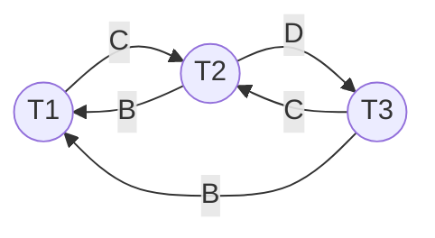
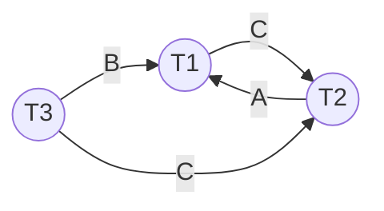

# CK2_2021-2022_C1ab

|     | T1       | T2       | T3       |
| --- | -------- | -------- | -------- |
| 1   | RLock(A) |          |          |
| 2   |          | RLock(C) |          |
| 3   |          |          | WLock(D) |
| 4   | WLock(B) |          |          |
| 5   |          | RLock(B) |          |
| 6   |          |          | RLock(B) |
| 7   | WLock(C) |          |          |
| 8   |          | WLock(D) |          |
| 9   |          |          | WLock(C) |
| 10  | Unlock   | Unlock   | Unlock   |

### Vẽ đồ thị wait-for để xác định xem lịch có deablock không?

>[!note]
>- Cạnh $(T1)\xrightarrow{X}(T2)$ thể hiện rằng $T1$ đang cần khóa trên $X$ và $T2$ đang giữ khóa trên $X$.
>- Các cặp thao tác của $T1-T2$ là $W-W$, $W-R$ hoặc $R-W$.

Ta có:
- Xét đơn vị dữ liệu $A$: Không có xung đột.
- Xét đơn vị dữ liệu $B$:
	- $W_1(B)<R_2(B)\Rightarrow(T2)\xrightarrow{B}(T1)$.
	- $W_1(B)<R_3(B)\Rightarrow(T3)\xrightarrow{B}(T1)$.
- Xét đơn vị dữ liệu $C$:
	- *Không xét $W_1(C)<W_3(C)$ vì cả $T1$ và $T3$ đều đang đợi $T3$ để lấy quyền $W$*.
	- $R_2(C)<W_1(C)\Rightarrow(T1)\xrightarrow{C}(T2)$.
	- $R_2(C)<W_3(C)\Rightarrow(T3)\xrightarrow{C}(T2)$.
- Xét đơn vị dữ liệu $D$:
	- $W_3(D)<W_2(D)\Rightarrow(T2)\xrightarrow{D}(T3)$.

Do đồ thị có chu trình nên lịch S có xảy ra deadblock.

### Giải pháp ngăn chặn deadblock?

>[!note]
>**Chọn 1 trong số những transaction có số lượng giao tác vào ra để rollback**. Sau đó nếu có nhiều nhánh có thể xảy ra thì cần chọn 1 trường hợp để giả sử.

- Chọn T2 để rollback:
	- T2 giải phóng đơn vị dữ liệu C.
	- T1 xin được khóa trên đơn vị dữ liệu C, thực hiện xong, kết thúc và trả khóa trên đơn vị dữ liệu B, C.
	- T3 xin được khóa trên đơn vị dữ liệu B, C, thực hiện xong, kết thúc và trả khóa trên đơn vị dữ liệu B, C, D.
- Lịch khả tuần tự theo thứ tự T1, T3, T2.

### Giải pháp giải quyết deadblock?

# CK2_2024-2025_C1ab

Cho lịch S như sau:

|     | T1       | T2       | T3       |
| --- | -------- | -------- | -------- |
| 1   | RLock(A) |          |          |
| 2   |          | RLock(C) |          |
| 3   | WLock(B) |          |          |
| 4   |          | RLock(D) |          |
| 5   |          |          | RLock(B) |
| 6   | WLock(C) |          |          |
| 7   |          | WLock(A) |          |
| 8   |          |          | WLock(C) |
| 9   | Unlock   | Unlock   | Unlock   |
| 10  | Unlock   | Unlock   | Unlock   |

**Vẽ đồ thị wait-for để xác định xem lịch có deablock không?**

Ta có:
- Xét đơn vị dữ liệu A:
	- $R_1(A)...W_2(A)\Rightarrow(T2)\xrightarrow{A}(T1)$.
- Xét đơn vị dữ liệu B:
	- $W_1(B)...R_3(B)\Rightarrow(T3)\xrightarrow{B}(T1)$.
- Xét đơn vị dữ liệu C:
	- $R_2(C)...W_1(C)\Rightarrow(T1)\xrightarrow{C}(T2)$.
	- $R_2(C)...W_3(C)\Rightarrow(T3)\xrightarrow{C}(T2)$.
- Xét đơn vị dữ liệu D:
	- Không có.

Do đồ thị có chu trình $(T1)\xrightarrow{C}(T2)\xrightarrow{A}(T1)$ nên có deadblock.

**Giải pháp ngăn chặn deadblock?**

- Chọn T2 để rollback, T2 giải phóng khóa trên C.
- Giả sử T1 hoặc T3 xin được khóa trên C:
	- Giả sử T1 xin được khóa trên C, T1 sau khi hoàn tất sẽ giải phóng A, B, C.
	- T3 xin được khóa trên C.
- T2 nhận được khóa khi T1, T3 xong.

Vậy lịch khả tuần tự theo thứ tự {T1, T3, T2}.

**Giải pháp giải quyết deadblock?**

# CK2_2024-2025_C1c

Hãy điều khiển việc truy xuất đồng thời của các giao tác dùng kỹ thuật **timestamp từng phần**. Nếu có thao tác bị hủy, hãy khởi tạo lại timestamp mới cho đến khi không còn thao tác nào bị hủy nữa. Cho biết lịch khả tuần tự theo thứ tự nào?

|     | T1 TS(T1) = 10 | T2 TS(T2) = 20 | T3 TS(T3) = 30 |
| --- | ----------------- | ----------------- | ----------------- |
| 1   | Read(A)           |                   |                   |
| 2   |                   | Read(C)           |                   |
| 3   | Write(B)          |                   |                   |
| 4   |                   | Read(D)           |                   |
| 5   |                   |                   | Read(B)           |
| 6   | Write(C)          |                   |                   |
| 7   |                   | Write(A)          |                   |
| 8   |                   |                   | Write(C)          |

| STT | T1 TS(T1)=10      | T2 TS(T2)=20 | T3 TS(T3)=30 | A RT(A)=0 WT(A)=0 | B RT(B)=0 WT(B)=0 | C RT(C)=0 WT(C)=0 | D RT(D)=0 WT(D)=0 |
| --- | -------------------- | --------------- | --------------- | ----------------------- | ----------------------- | ----------------------- | ----------------------- |
| 1   | Read(A)              |                 |                 | RT(A)=10 WT(A)=0     |                         |                         |                         |
| 2   |                      | Read(C)         |                 |                         |                         | RT(C)=20 WT(C)=0     |                         |
| 3   | Write(B)             |                 |                 |                         | RT(B)=0 WT(B)=10     |                         |                         |
| 4   |                      | Read(D)         |                 |                         |                         |                         | RT(D)=20 WT(D)=0     |
| 5   |                      |                 | Read(B)         |                         | RT(B)=30 WT(B)=10    |                         |                         |
| 6   | Write(C) -> Abort |                 |                 |                         |                         |                         |                         |
| 7   |                      | Write(A)        |                 |                         |                         |                         |                         |
| 8   |                      |                 | Write(C)        |                         |                         |                         |                         |

Tại bước 6, RT(C)=20 > TS(T1)=10 -> Abort và khởi tạo lại TS(T1)=30.

