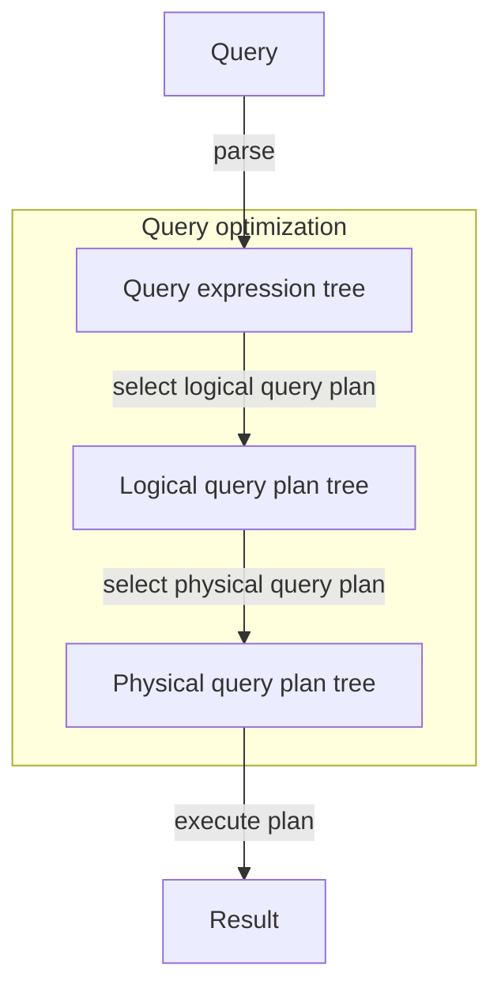

# Tổng quan quy trình truy vấn



# Cây SFW và cây đại số quan hệ

Xem xét 2 ví dụ:
![[query-optimization-eg1.svg]]

**Quy tắc chuyển từ cây SFW sang cây đại số quan hệ**:
- Thay thế SELECT \<SelectList> bằng $\boxed{\pi_{\text{SelectList}}}$.
- Thay thế FROM \<Relation> bằng $\boxed{\text{Relation}}$.
- Thay thế WHERE \<Condition> bằng $\boxed{\sigma_{\text{Condition}}}$.
- Thay thế agreeate function (attribute) bằng $\boxed{\gamma_{\text{attribute}}}$.
- Thay thế phép đổi tên bằng $\boxed{\rightarrow a}$.
- Nếu có truy vấn con thì mỗi truy vấn con bắt đầu bằng $\boxed{\delta}$. Quan hệ giữa bảng với bảng hoặc bảng với truy vấn con luôn là phép $\boxed{\times}$ kết hợp với $\sigma$ (nếu có).

Thứ tự một cây đại số luôn là: $\boxed{\pi\rightarrow\sigma\rightarrow\text{Relation}/\delta}$.

# Quy trình tối ưu hóa truy vấn

- Đưa phép chọn $\sigma$, phép chiếu $\pi$ xuống sâu các nhánh.
- Thay thế phép tính $\times$ bằng phép chọn $\sigma$ và phép kết $\bowtie$.

![[query-optimization-rule.svg]]

# Ví dụ

**CK2_2024-2025_C3**:
Cho lược đồ:
- KHOAHOC (MAKH, TENKH, NGAYBD, NGAYKT).
- HOCVIEN (MAHV, TENHV, NTNS, DCHI, NNGHIEP).
- GIAOVIEN (MAGV, TENGV, NTNS, DC).
- LOPHOC (MALOP, TENLOP, MAKH, MAGV, SISODK, LTRG, PHHOC).
- BIENLAI (SOBL, MALOP, MAHV, DIEM, KQUA, XEPLOAI, TIENNOP).

Phân tích và tối ưu hóa truy vấn sau:
```sql
SELECT HV.MAHV, TENHV
FROM HOCVIEN HV, BIENLAI BL, LOPHOC LH, KHOAHOC KH
WHERE
		HV.MAHV = BL.MAHV
	AND LH.MALOP = BL.MALOP
	AND LH.MAKH = KH.MAKH
	AND KQUA = "Đạt"
	AND XEPLOAI = "Giỏi"
	AND DCHI = "TPHCM"
	AND YEAR(NGAYBD) = 2024
```

Phân tích thành *cây biểu diễn biểu thức truy vấn ban đầu*:

![[CK2_2024-2025_C3_1.png]]

*Cây biểu diễn biểu thức truy vấn sau khi tối ưu hóa*:
- Đưa phép chọn, phép chiếu xuống sâu các nhánh.
- Thay thế phép tính bằng phép chọn và phép kết.

![[CK2_2024-2025_C3_2.png]]

Viết lại truy vấn *(mức ý tưởng)*:
```sql
SELECT BIENLAI.MaHV, TenHV
FROM
(
	(
		SELECT MaHV, MaLop
		FROM BIENLAI
		WHERE KQUA = "Đạt" AND XEPLOAI = "Giỏi"
	)
	JOIN
	(
		SELECT MaHV, TenHV
		FROM HOCVIEN
		WHERE DCHI = "TPHCM"
	)
	ON BIENLAI.MaHV = HOCVIEN.MaHV
)
JOIN
(
	(
		SELECT MaKH
		FROM KHOAHOC
		WHERE YEAR(NGAYBD) = 2024
	)
	JOIN
	(
		SELECT MaKH, MaLop
		FROM LOPHOC
	)
	ON KHOAHOC.MaKH = LOPHOC.MaKH
)
ON BIENLAI.MaLop = LOPHOC.MaLop
```