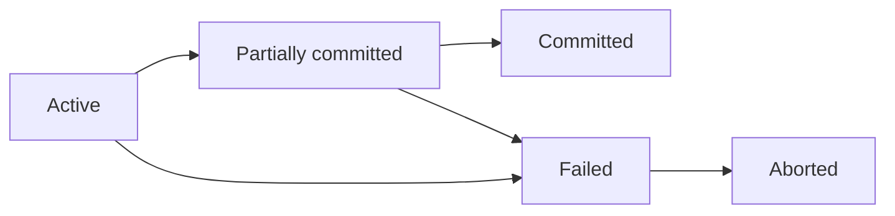
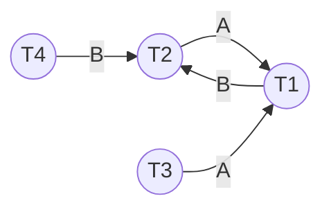

# Tổng quan

Giao tác (Giao dịch) là 1 chuỗi các hành động tác động lên cơ sở dữ liệu, có các tính chất sau:

**ACID**:
- **Atomicity**: Hoặc là toàn bộ hoạt động của giao dịch thành công, hoặc không có hoạt động nào cả.
- **Consistency**: Một giao tác được thực hiện độc lập với các giao tác khác xử lý đồng thời với nó.
- **Isolation**: Một giao tác không quan tâm đến các giao tác khác xử lý đồng thời với nó.
- **Durability**: Mọi thay đổi mà giao tác thực hiện trên CSDL phải được ghi nhận bền vững

**Các thao tác**:
- Đọc.
- Ghi.
- Ký hiệu: $r_i(X)$, giao tác $i$ đang $r$ (đọc) trên đơn vị dữ liệu $X$. Tương tự với $w_i(X)$.

**Các trạng thái**:
- **Active**: Ngay khi bắt đầu thực hiện thao tác.
- **Partially committed**: Sau khi lệnh thi hành cuối cùng thực hiện.
- **Failed**: Sau khi nhận ra không thể thực hiện các hành động được nữa.
- **Aborted**: Sau khi giao tác được quay lui (rollback) và CSDL được phục hồi về trạng thái trước trạng thái bắt đầu giao dịch.
- **Committed**: Sau khi mọi hành động hoàn tất thành công

# Lập lịch thao tác

## Bộ lập lịch

**Scheduler (Bộ lập lịch)**: Có nhiệm vụ phân phối thời gian thực thi một số giao tác được xảy ra đồng thời. Có 2 loại lịch:
- **Serial schedule (tuần tự)**: Các giao tác được thực thi theo thứ tự liên tiếp tuần tự nhau, đảo bảo đồng bộ dữ liệu nhưng hiệu năng kém.
- **Serializable schedule (khả tuần tự)**: Các giao tác được thực thi đồng thời nhưng có thể có kết quả giống serial (*khả tuần tự*) hoặc không giống serial (*không khả tuần tự*), dễ xảy ra xung đột dữ liệu nhưng hiệu năng cao.

## Conflict-serializable và View-serializable

2 đặc điểm của lịch:

| Conflict-serializable                                                                                                                 | View-serializable |
| ------------------------------------------------------------------------------------------------------------------------------------- | ----------------- |
| Xảy ra nếu có thể biến đổi lịch thành 1 serial-schedule bằng cách đổi chỗ các thao tác không xung đột (*non-conflicting operations*). |                   |
| Nếu trong precedence graph có chu trình thì không conflict-serializable.                                                              |                   |

**Confict serializable**:
- Là hiện tượng xảy ra khi có thể biến đổi lịch thành một serial schedule bằng cách đổi chỗ các thao tác không xung đột (*non-conflicting operations*).
- Tức là lịch khả tuần tự (*serializable*).

## Precedence graph

**Đồ thị thao tác (Sơ đồ trình tự, Precedence graph)**: Gồm:
- Các đỉnh là các giao tác, trong đó có thao tác thực hiện ghi và cùng vùng dữ liệu.
- Đỉnh $T_i<_ST_j$ hoặc $T_i\xrightarrow{A}T_j$ tức là $T_i$ được thực hiện trước $T_j$ trên vùng dữ liệu $A$.
- Nếu đồ thị này *có chu trình* thì *không conflic seralizable*.

**VD1**: Cho lịch S1 gồm các giao tác sau:

| S   | T1       | T2       | T3      | T4      |
| --- | -------- | -------- | ------- | ------- |
| 1   | Read(A)  |          |         |         |
| 2   |          | Read(A)  |         |         |
| 3   | Read(B)  |          |         |         |
| 4   |          | Read(B)  |         |         |
| 5   |          |          | Read(A) |         |
| 6   |          |          |         | Read(B) |
| 7   | Write(A) |          |         |         |
| 8   |          | Write(B) |         |         |

Vẽ sơ đồ trình tự (precedence graph) của S1. Cho biết S1 có conflict-serializable không? Cho biết S1 khả tuần tự (serial) theo thứ tự nào?

Ta có:
- $T_2<_ST_1\Rightarrow(T_2)\xrightarrow{A}(T_1)$.
- $T_3<_ST_1\Rightarrow(T_3)\xrightarrow{A}(T_1)$.
- $T_1<_ST_2\Rightarrow(T_1)\xrightarrow{B}(T_2)$.
- $T_4<_ST_2\Rightarrow(T_4)\xrightarrow{B}(T_2)$.

Sơ đồ trình tự:

Ta thấy có chu trình $(T_2)\xrightarrow{A}(T_1)\xrightarrow{B}(T_2)$ nên không có conflict-serializable.

## Precedence graph

**VD1**: Cho lịch S2 gồm các giao tác sau:

| S   | T1       | T2       | T3       | T4       | T5       |
| --- | -------- | -------- | -------- | -------- | -------- |
| 1   | Read(A)  |          |          |          |          |
| 2   |          |          | Read(D)  |          |          |
| 3   | Write(B) |          |          |          |          |
| 4   |          | Read(B)  |          |          |          |
| 5   |          |          | Write(B) |          |          |
| 6   |          |          |          | Read(B)  |          |
| 7   |          | Write(C) |          |          |          |
| 8   |          |          |          |          | Read(C)  |
| 9   |          |          |          | Write(E) |          |
| 10  |          |          |          |          | Read(E)  |
| 11  |          |          |          |          | Write(B) |

