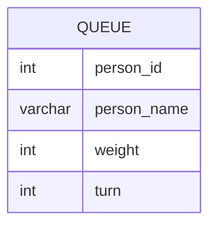

Cho 1 bảng thể hiện những người đang xếp hàng để lên xe bus:


Trong đó, `turn` là thứ tự lên xe bus (1-based). Biết xe bus chỉ có tải trọng tối đa `1000`. Hãy in ra người cuối cùng có thể được lên xe bus.

VD:
Input:
```
+------+----+-----------+--------+--------------+
| Turn | ID | Name      | Weight | Total Weight |
+------+----+-----------+--------+--------------+
| 1    | 5  | Alice     | 250    | 250          |
| 2    | 3  | Alex      | 350    | 600          |
| 3    | 6  | John Cena | 400    | 1000         |
| 4    | 2  | Marie     | 200    | 1200         |
| 5    | 4  | Bob       | 175    | ___          |
| 6    | 1  | Winston   | 500    | ___          |
+------+----+-----------+--------+--------------+
```

Output: `John Cena`.

Bài này giống như 1 mảng cộng dồn, ta phải làm để với mỗi person `i`, tính được `totalweight` từ person `1` đến `i` sao cho `totalweight <= 1000`.

```sql
SELECT TOP 1 person_name
FROM PREFIXSUM
ORDER BY totalweight DESC
```

Để tính được `PREFIXSUM`, ta tự `JOIN` `Weight` để lấy các `turn` liền kề.

>[!important]
>Chỉ có CTE là có thể tự `JOIN` với chính nó theo kiểu đệ quy.

```sql
SELECT
	q.weight, q.turn, q.person_name,
	q.weight + c.totalweight AS totalweight
FROM QUEUE q
JOIN PREFIXSUM c ON q.turn = c.turn +1
WHERE q.weight + c.totalweight <= 1000
```

Với `turn` = `1` thì `totalweight` là chính nó:
```sql
SELECT
	weight, turn, person_name,
	weight AS totalweight
FROM QUEUE
WHERE turn = 1
```

Toàn bộ CTE:
```sql
WITH PREFIXSUM AS (
	SELECT
		weight, turn, person_name,
		weight AS totalweight
	FROM QUEUE
	WHERE turn = 1
	
	UNION ALL
	
	SELECT
		q.weight, q.turn, q.person_name,
		q.weight + c.totalweight AS totalweight
	FROM QUEUE q
	JOIN PREFIXSUM c ON q.turn = c.turn +1
	WHERE q.weight + c.totalweight <= 1000
)

SELECT TOP 1 person_name
FROM PREFIXSUM
ORDER BY totalweight DESC
```
