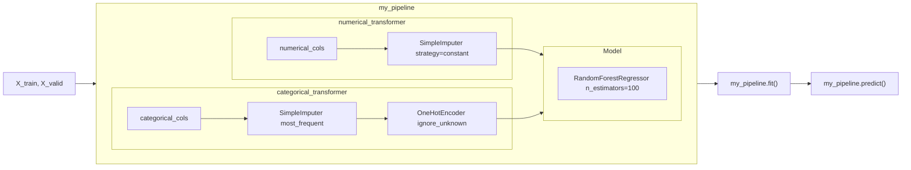

**Tài liệu tham khảo**:
- https://inria.github.io/scikit-learn-mooc/predictive_modeling_pipeline/predictive_modeling_module_intro.html.
- https://www.kaggle.com/learn/intermediate-machine-learning.
- Machine Learning cơ bản, Vũ Hữu Tiệp, 2018.

# Giới thiệu

Chuỗi bài viết này sử dụng công cụ thực hành là **Scikit-learn** (`sklearn`). Đây là một Python module hỗ trợ các phương thức liên quan đến ML.

**Cài đặt**:
```sh
pip install -U scikit-learn
```

Một mô hình học máy thực chất là một hàm số $f$ phản ánh mối quan hệ giữa dữ liệu đầu vào $X$ và dữ liệu đầu ra $Y$. Trong đó:
- $X$: Dataset dùng để training model (training dataset). $X$ thường là *tabular data*, tức là các record bao gồm các attributes, mỗi attribute còn được gọi là **feature**.
- $y$: Thuộc tính cần dự đoán từ dữ liệu $\hat{X}$, $\hat{y}=f(\hat{X})$.
- $f$: Là mô hình máy học, hoặc hàm phân phối xác suất của $Y$ theo $X$. Vì ta không thể nào biết chính xác $Y$ có xuất hiện hay không mà chỉ biết khả năng xuất hiện của nó, hay $Y\approx f(X)\approx P(Y|X)$.
- $w$: Trọng số của model, có được nhờ học từ dữ liệu $X$ nạp vào model. Khi ta nói "máy học", kết quả học tập chính là $w$. 
- **Hyperparameter**: Là tham số của model. Các hyperparameter khác nhau kết hợp với dataset $X$ khác nhau sẽ cho ra error khác nhau.

# Model training

Có 2 kiểu training model:
1. **Học có giám sát (Supervised learning)**: Cho model biết cả $X$ lẫn $y$.
2. **Học không giám sát (UnSupervised learning)**: Chỉ cho model biết $X$, model phải tự đoán $y$.

Ngoài ra còn các những kiểu training lai giữa supervised và unsupervised, tùy thuộc vào đặc điểm model và dataset.

## Tổng quan quy trình model training

1. **Preparing**:
	1. Chọn thuộc tính đích (thuộc tính cần dự đoán) (`y` / `target`).
	2. Chọn danh sách các thuộc tính feature (`X` / `data`).
	3. Tách `X` và `y` rời nhau (dùng `df.drop(columns=...)`).
2. **Transforming (nếu cần)**:
	1. Import các thuật toán chuẩn hóa (**estimator**) có sẵn trong `sklearn.preprocessing`.
	2. Dùng phương thức `.fit()` của estimator để trả về object chứa các tham số thống kê dành cho quá trình transform, còn gọi là **transformer**.
	3. Dùng phương thức `.transform()` để chuẩn hóa dataset (*nếu không đưa transform vào pipeline thì không cần dùng phương thức này*).
3. **Estimating**:
	1. Import các thuật toán training model (**estimator**) có sẵn trong module.
	2. Dùng phương thức `.fit()` của estimator để trả về object chứa các tham số thống kê dành cho quá trình predict, còn gọi là **predictor**.
4. **Predicting**:
	1. Định nghĩa estimator từ bước 3 hoặc kết hợp bước 2 và 3 trong pipeline.
	2. Dùng phương thức `.predict()` để dự đoán `y'` từ một dataset `X'` mới.

Tổng quan quá trình training model:
![[training-process.svg]]

# Training set / Testing set

Thông thường, khi training model, dữ liệu sẽ được chia thành hai phần riêng biệt: **tập huấn luyện (training set)** và **tập kiểm thử (testing set / validation set)**.
- Tập huấn luyện được dùng để tìm các tham số mô hình.
- Tập kiểm thử được dùng để đánh giá năng lực của mô hình tìm được.

Bài đọc liền sau chủ đề này: [[2. Data leakage]].

Scikit-learn cung cấp hàm `train_test_split` cho phép chia 1 dataset thành 2 phần (training set và validation set):

```python
from sklearn.model_selection import train_test_split

train_X, val_X, train_y, val_y = train_test_split(X, y, random_state=None)
```
Trong đó, `random_state` quy định seed ngẫu nhiên khi chia 2 tập dữ liệu. Nếu là `None` thì 2 tập sẽ giống nhau hoàn toàn dù chạy lệnh trên bao nhiêu lần đi nữa. Thường thì `random_state=42`.

Có 2 loại learning:
1. **Online learning**: Dữ liệu huấn luyện sẽ được bổ sung liên tục, là tập kiểm thử ở giai đoạn đầu và sau đó trở thành tập huấn luyện.
2. **Offline learning**: Dữ liệu có tính cố định.

## Transformer

Có 2 loại transformer:
- **Imputer**: Chuẩn hóa dữ liệu số (*Numerical data*). Xem thêm tại [[5. Data cleaning]] và [[2. Feature engineering]].
- **Encoder**: Chuẩn hóa dữ liệu danh mục (*Categorical data*). Xem thêm tại [[2. Feature engineering]].

VD:
```python
from sklearn.preprocessing import StandardScaler

scaler = StandardScaler()
scaler.fit(data_train) # Xây dựng transformer

scaler.mean_  # Trung bình của dataset
scaler.scale_ # Hệ số scale

scaler.transform(data_train) # Chuẩn hóa dữ liệu
```

Cú pháp tắt của `.fit` và `.transform` là `.fit_transform`:
```python
scaler.fit_transform(data_train)
```

>[!note] Quy ước của Sklearn
>Các thuộc tính có phần hậu tố `_` là thu được sau khi `.fit()` (khảo sát các tham số thống kê).

>[!important]
>**Tuyệt đối không được `.fit` trên testing set mà chỉ được `.transform` cứng**. Bởi vì nguyên lý của fit là "học từ dữ liệu", nếu fit trên testing set sẽ làm model vô tình học được các thông tin từ testing set.

## Pipeline & ColumnTransformer

**Pipeline và ColumnTransformer** là các phương thức kết nối transformer và estimator lại với nhau thành một estimator mới.

| `sklearn.pipeline.Pipeline`                                                                            | `sklearn.compose.ColumnTransformer`                        |
| ------------------------------------------------------------------------------------------------------ | ---------------------------------------------------------- |
| Thực hiện **tuần tự** từng transformer (`steps`).                                                      | Thực hiện **song song** từng transformer (`transformers`). |
| Nếu step cuối là transformer -> Trả về transformer.<br>Nếu step cuối là estimator -> Trả về estimator. | Trả về transformer.                                        |

![[preprocessing.svg]]

**Bước 1**: Định nghĩa các bước preprocessing:
```python
from sklearn.compose import ColumnTransformer
from sklearn.pipeline import Pipeline
from sklearn.impute import SimpleImputer
from sklearn.preprocessing import OneHotEncoder

# Preprocessing for numerical data
numerical_transformer = SimpleImputer(strategy='constant')

# Preprocessing for categorical data
categorical_transformer = Pipeline(steps=[
    ('imputer', SimpleImputer(strategy='most_frequent')),
    ('onehot', OneHotEncoder(handle_unknown='ignore'))
])

# Bundle preprocessing for numerical and categorical data
preprocessor = ColumnTransformer(
    transformers=[
        ('num', numerical_transformer, numerical_cols),
        ('cat', categorical_transformer, categorical_cols)
    ])
```

**Bước 2**: Định nghĩa model:
```python
from sklearn.ensemble import RandomForestRegressor

model = RandomForestRegressor(n_estimators=100, random_state=0)
```

**Bước 3**: Tạo pipeline tổng thể và fit model:
```python
my_pipeline = Pipeline(steps=[('preprocessor', preprocessor),
                              ('model', model)
                             ])

# Preprocessing of training data, fit model 
my_pipeline.fit(X_train, y_train)

# Preprocessing of validation data, get predictions
preds = my_pipeline.predict(X_valid)
```



## (Metric) Scoring

Đánh giá chất lượng model thông qua các chỉ báo (`sklearn.metrics`), mỗi loại model sẽ có các chỉ báo riêng, gọi chung là **hàm mất mát (Loss function) / hàm chi phí (Cost function) / hàm đánh giá (Scoring function)**. Nhìn chung thì các hàm này đều thể hiện **sai số (error)** giữa kết quả mà mô hình trả về so với kết quả chính xác thực tế.

**Ký hiệu**: $\mathcal{L}(y,\hat{y})$.

Mục tiêu của model training đó là **làm sao cho loss-function nhỏ nhất**. Tức là:
$$f(X,y,w):w=\arg\min_w\mathcal{L}(y,\hat{y})$$

**VD**: Chỉ báo MAE:
```python
from sklearn.metrics import mean_absolute_error
score = mean_absolute_error(y_valid, preds)
print('MAE:', score)
```
```sh
MAE: 160679.18917034855
```

>[!quote]
>**Error không bao giờ là 0** -> Mọi model đều chỉ có thể chính xác hơn 1 model khác chứ không thể chính xác hoàn toàn.
>Nó là sự đánh đổi giữa độ linh hoạt của mô hình (**model flexibility**) và kích thước của dữ liệu nguồn dùng để huấn luyện (**size of the training set**).
