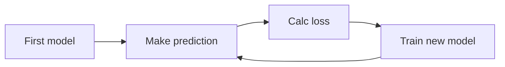

**Ensemble method** là sự kết hợp kết quả dự đoán của nhiều model khác nhau để cho ra dự đoán tốt nhất.

VD: *RandomForest* là ensemble method của nhiều *DecisionTree*.

**Gradient boosting** cũng có ý tưởng tương tự ensemble method, nó là sự lặp đi lặp lại các thao tác training để cho ra model tốt nhất. Thuật toán ẩn đằng sau gradient boosting là [[2. Gradient descent|Gradient descent]].



Có rất nhiều cách để triển khai Gradient boosting.

**`XGBoost` (Extreme gradient boosting)**:

```python
from xgboost import XGBRegressor

my_model = XGBRegressor()
my_model.fit(X_train, y_train)
```

`XGBoost` có một số tham số:

| Tham số                                            | Giá trị thường thấy | Ý nghĩa                                                                                                     |
| -------------------------------------------------- | ------------------- | ----------------------------------------------------------------------------------------------------------- |
| **`n_estimators`**                                 | `500`               | Số vòng lặp để hiệu chỉnh model. Đối số quá cao thì model dễ *Overfiting*, và ngược lại.                    |
| **`learning_rate`**                                | `0.05`              | Hệ số đóng góp kết quả từ mỗi lần lặp. Đối số quá lớn thì model học nhanh nhưng dễ *Overfit*, và ngược lại. |
| **`early_stopping_rounds`**<br>(*Dùng cho `.fit`*) | `5`                 | Nếu sau `early_stopping_rounds` vòng lặp mà sai số không cải thiện thì dừng.                                |


