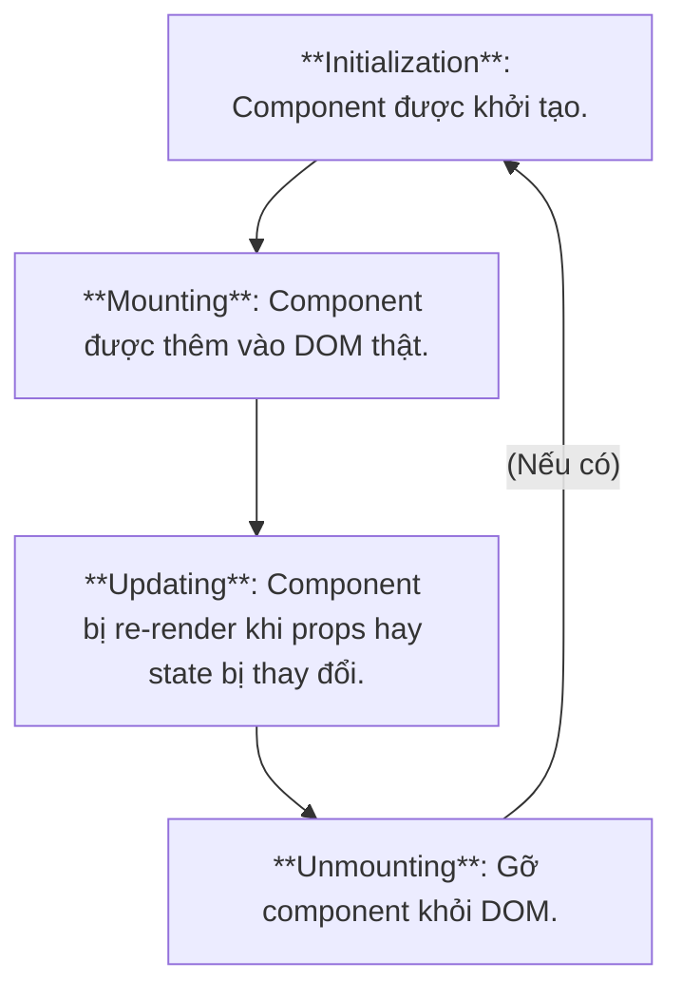
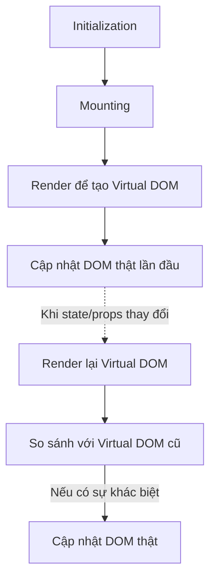

# Tổng quan

**JSX** (JavaScript XML) là một cú pháp mở rộng của JS dành riêng cho React, cho phép bạn viết mã HTML trong JS mà không cần thông qua string.

JSX không phải mã HTML, cần phải biên dịch (transpile) sang HTML thông qua `React.createElement()` thì browser mới hiểu được.

**Lợi ích**:  
- **Trực quan:** Giúp mô tả UI dễ hiểu và gần gũi với HTML.  
- **Đóng gói:** Cho phép kết hợp logic JS và markup HTML trong cùng một file component (Sự phân tách mối quan tâm theo component thay vì theo công nghệ).

**Lưu ý**: Một giá trị thường (`null`, `string`, `number`,...) cũng được coi là component.

**VD**: JSX:
```jsx
<h1 className="title">Hello</h1>
```
Sẽ được biên dịch thành:
```js
React.createElement("h1", { className: "title" }, "Hello")
```
Kết quả cuối cùng:
```html
<h1 className="title">Hello</h1>
```

-> Mỗi component function chỉ được phép return 1 component duy nhất tương ứng với 1 `React.createElement`.

# Khai báo JSX

## Normal component

JSX là một dạng giá trị, có thể được gán vào biến hay return.

**VD**: JSX 1 dòng:
```jsx
const element = <h1>Hello, JSX!</h1>;
```

**VD**: JSX nhiều dòng, cần dùng `(` và `)`:
```jsx
const element = (
  <div>
    <h1>Hello</h1>
    <p>This is multi-line JSX</p>
  </div>
);
```

**Chú ý**:
- Tên thuộc tính quy định class của JSX là `className`, không phải `class`.
- JSX buộc phải gói gọn trong một thẻ lớn nhất, thẻ đó có thể là `<></>` (Fragment ).

## React Fragment

**React Fragment** (`<React.Fragment>...</React.Fragment>` / `<>...</>`) cho phép nhóm nhiều phần tử con lại với nhau mà không tạo thêm một thẻ DOM thừa (như `<div>`) bọc bên ngoài.

**Kịch bản sử dụng**:  
- Khi một component cần return nhiều phần tử cùng cấp.  
- Khi nhóm các phần tử bên trong `<dl>`, `<ul>`, hoặc `<table>` (ví dụ: `<tr>` hoặc `<li>`) mà thẻ bọc ngoài sẽ làm sai cấu trúc HTML hợp lệ.

**Chú ý**: `<>...</>` không hỗ trợ khai báo các thuộc tính. Nhưng `<React.Fragment>...</React.Fragment>` thì có.

# Các thuộc tính của JSX

## Biểu thức (Expression)

JSX cũng tương tự như template, một **giá trị** hoặc một biểu thức trả về giá trị, có thể được đưa vào JSX thông qua `{` và `}` (Expression).

**Các trường hợp đặc biệt**:
- Nếu giá trị là `""`, `null`, `undefined`, `true`, `false` thì React sẽ **không render nội dung**.
- Nếu giá trị là `0` hoặc `NaN`, React vẫn sẽ **render** thành text tương ứng.

**VD**:
```jsx
const name = "Thái";
<h1>Hello, {name}!</h1>;
```
Khi đó, JSX sẽ trở thành:
```jsx
<h1>Hello, Thái!</h1>;
```

**VD**: `.map()`: Lặp qua từng phần tử trong danh sách và render component tương ứng.
```jsx
{items.map(i => <li key={i.id}>{i.name}</li>)}
```

## Props

**Props** (Properties) là một object chứa các thông tin về các property của JSX.

Props có thể chứa mọi kiểu dữ liệu, bao gồm các hàm. **Children** là một props đặc biệt, là phần JSX nằm giữa 2 cặp thẻ đóng và mở lớn nhất của JSX cha.

>[!important]
>Dữ liệu truyền từ component cha vào component con phải thông qua drop (**Prop drilling**).

**VD**: Prop cơ bản:
JSX:
```jsx
<Hello name="Thái" age={20}>
```
Sẽ có props là:
```json
{
	name: "Thái",
	age: 20
}
```

**VD**: **Prop children**: Prop là 1 component.
Có JSX:
```jsx
<MyBox>
  <h2>Title</h2>
  <p>Content.</p> 
</MyBox>
```
Khi đó, chilren sẽ là:
```jsx
MyBox({ children: [<h2>Title</h2>, <p>Content.</p>] });
```

**VD**: **Prop drilling**: Truyền drop xuyên qua nhiều lớp component:
```jsx
function Child({ username }) {
  return <p>Xin chào, {username}!</p>;
}

function Parent() {
  return (
    <div>
      <h2>Đây là Parent</h2>
      <Child username="Heli" />
    </div>
  );
}
```
Ta thấy `Child` chỉ có thể được gọi thông qua `Parent`, dữ liệu từ `Parent` được truyền cho `Child`.

**VD**: **Key prop**: Dùng để JSX định danh các component và tối ưu hiệu năng rendering.
```jsx
key={1}
```

**VD**: **Handler**: Khác với HTML nhận handler là 1 string đại diện cho lời gọi hàm (`"handler()"`), component nhận tham chiếu của hàm đó.
```jsx
// Cách 1: Reference
onClick={handleClick}

// Cách 2: Arrow function reference
onClick={() => handleClick()}
```

**VD**: **Spread operator**: Cho phép truyền toàn bộ các thuộc tính của một object JS làm các props riêng lẻ cho một component.
```jsx
// spread
const btnProps = { color: "blue", disabled: true, type: "submit" };
<Button {...btnProps} />

// Tương đương với
<Button color="blue" disabled={true} type="submit" />
```

# Conditional rendering

Là chế độ chỉ render component khi thỏa mãn 1 số điều kiện.

Có 2 toán tử thường dùng là:
- **Ternary operator**: Dùng cho toggle.
- **`&&` Short-Circuit evaluation** Dùng để hiển thị component khi thỏa mãn 1 số điều kiện.

**VD**: Ternary operator:
```jsx
{isLoggedIn ? <Dashboard /> : <Login />}
```

**VD**: `&&` Short-Circuit evaluation:
```jsx
{isLoading && <Spinner />}
```

# Component lifecycle

Là quy trình các giai đoạn mà một React component đi qua, từ khi được tạo ra, cập nhật, bị xóa khỏi giao diện.


Trong đó, **render** là quá trình React chuyển JSX thành cấu trúc DOM ảo (Virtual DOM) và sau đó cập nhật DOM thực tế nếu có thay đổi.




