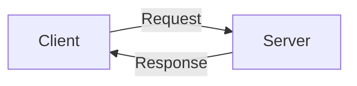
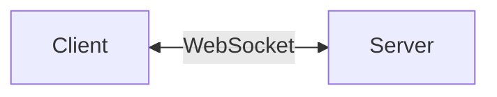
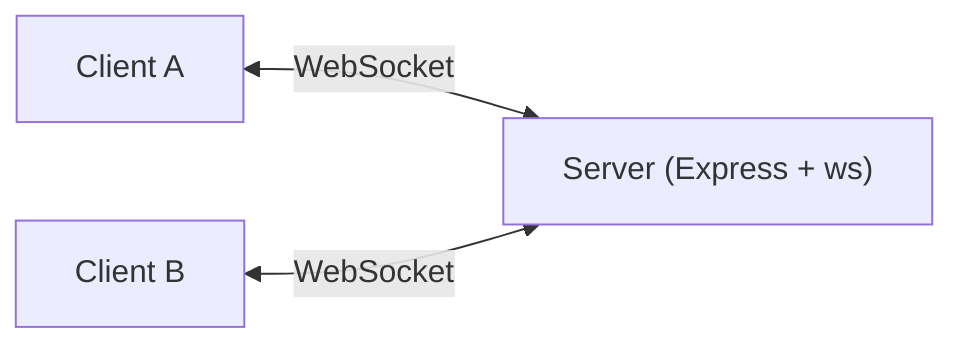
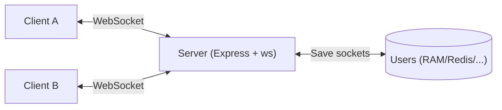
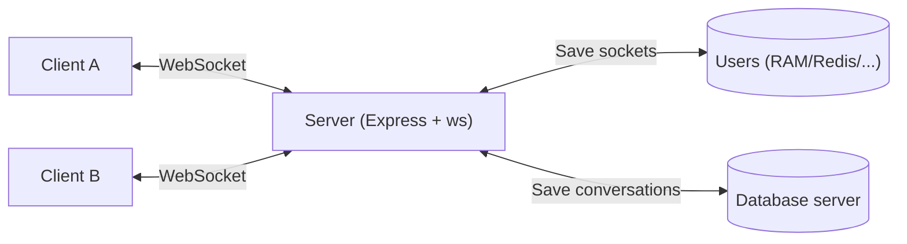

# Tình huống đặt ra

Thông thường với HTTP:


Trong một ứng dụng web chat real-time, để kiểm tra tin nhắn thì client và server liên tục (Web polling), có độ trễ thời gian, giảm hiệu năng và giảm UX.

Với WebSocket:


Sau khi kết nối được thiết lập:
- Client gửi dữ liệu bất cứ lúc nào.
- Server cũng gửi dữ liệu bất cứ lúc nào.
- Không cần request mới.
Đây là lý do WebSocket được dùng cho các ứng dụng real-time.

>[!question] Nếu WebSocket mạnh như vậy, tại sao không thay thế HTTP bằng WS luôn?
>- HTTP và WS đảm nhận 2 nhiệm vụ riêng. Ví dụ như đối với các thao tác CRUD, HTTP đã hỗ trợ sẵn các method; còn đối với WS thì bạn phải tự định nghĩa.
>- Việc xử lý các vấn đề như scaling, reconnect,... trong WS phức tạp hơn so với HTTP thông thường.
>- WS tốn RAM hơn ở phía server vì nó phải duy trì 1 connection lâu dài cho mỗi user.

**WebSocket có 4 sự kiện là**:

| Event     | Khi nào xảy ra                         | Payload                                    |
| --------- | -------------------------------------- | ------------------------------------------ |
| `open`    | Handshake thành công, kết nối sẵn sàng | —                                          |
| `message` | Có dữ liệu mới đến                     | `event.data` (string / Blob / ArrayBuffer) |
| `error`   | Có lỗi ở tầng transport                | `Error` object                             |
| `close`   | Kết nối đóng (chủ động hoặc do lỗi)    | `code`, `reason`, `wasClean`               |

**Sử dụng công nghệ ExpressJS, server có các bước sau tại sự kiện `message`**:
1. Lấy ra socket của user cần nhận dữ liệu. Socket ở đây tượng trưng cho 1 kết nối giữa user đó với WebSocket server.
2. Nếu socket của người nhận `readyState` thì `.send` cho socket đó.
Trong đó, `wss.clients` là danh sách toàn bộ các socket.

# Xây dựng dự án



### Xây dựng Backend

```bash
mkdir chat-server
cd chat-server

npm init -y
npm install express ws cors
```

`server.js`
```javascript
const express = require("express");
const cors = require("cors");
const WebSocket = require("ws");

const app = express();

app.use(cors());

const server = app.listen(3001, () => {
  console.log("Server running");
});

const wss = new WebSocket.Server({ server });

wss.on("connection", (socket) => {
  console.log("User connected");

  socket.on("message", (message) => {
    console.log("Received:", message.toString());

    // wss.clients là danh sách client
    // Mặc định, server sẽ gửi dữ liệu nó nhận được cho toàn bộ client readyState
    wss.clients.forEach((client) => {
      if (client.readyState === WebSocket.OPEN)
        client.send(message.toString());
    });
  });

  socket.on("close", () => {
    console.log("User disconnected");
  });
});
```

### Xây dựng Frontend

```bash
npm create vite@latest chat-client
cd chat-client

npm install
```

`App.jsx`
```jsx
import { useEffect, useState } from "react";

function App() {
  const [socket, setSocket] = useState(null);
  const [message, setMessage] = useState("");
  const [messages, setMessages] = useState([]);

  useEffect(() => {
    const ws = new WebSocket("ws://localhost:3001");

    ws.onopen = () => {
      console.log("Connected");
    };

    ws.onmessage = (event) => {
      setMessages((prev) => [...prev, event.data]);
    };

    ws.onclose = () => {
      console.log("Disconnected");
    };

    setSocket(ws);

    // Tự động ngắt kết nối khi thoát app
    return () => {
      ws.close(); // Lệnh ngắt kết nối
    };
  }, []);

  const sendMessage = () => {
    if (!message.trim()) return;
    socket.send(message);
    setMessage("");
  };

  return (
    <div style={{ padding: "20px" }}>
      <h2>Realtime Chat</h2>

      <div
        style={{
          border: "1px solid #ccc",
          height: "300px",
          overflowY: "auto",
          marginBottom: "10px",
          padding: "10px",
        }}
      >
        {messages.map((msg, index) => (
          <div key={index}>{msg}</div>
        ))}
      </div>

      <input
        value={message}
        onChange={(e) => setMessage(e.target.value)}
      />

      <button onClick={sendMessage}>
        Send
      </button>
    </div>
  );
}

export default App;
```

### Chạy thử

Backend:
```bash
node server.js
```

Frontend:
```bash
npm run dev
```

Mở:
```text
http://localhost:5173
```

Mở 2 tab để kiểm tra tính năng.

# Hỗ trợ username và gửi tin nhắn đến người dùng cụ thể

Thay vì để client gửi tới server một raw text, hãy gửi một JSON để có nhiều thông tin hơn.

Client gửi lên username của mình với type `REGISTER` (do dev quy định) với ý nghĩa muốn đăng ký user.
```json
{
  type: "REGISTER",
  username: "Bao"
}
```

Thông thường, socket của mỗi client kết nối với server được lưu vào `.WebSocket().clients`, nhưng nó không giúp ta định danh socket nào của client nào. Để định danh được socket, khi user `connection` và `message` (gửi yêu cầu đăng ký), ta cần lưu ngay socket đó vào một cấu trúc dữ liệu riêng để tiện tra cứu.

Ở đây, mỗi socket sẽ được định danh bằng `username` của client đó.



`server.js`
```js
const users = new Map();

wss.on("connection", (socket) => {
  console.log("User connected");

  socket.on("message", (message) => {
    const data = JSON.parse(message.toString());

    // Đăng ký user
    if (data.type === "REGISTER") {
      users.set(data.username, socket);

      console.log(`${data.username} registered`);
      return;
    }

    // Gửi tin nhắn riêng
    
    const receiverSocket = users.get(data.receiver);

    if (
      receiverSocket &&
      receiverSocket.readyState === WebSocket.OPEN
    ) {
      receiverSocket.send(
        JSON.stringify({
          from: data.sender,
          text: data.text,
        })
      );
    }
  });

  socket.on("close", () => {
    // Xóa user khỏi Map khi ngắt kết nối
    for (const [username, userSocket] of users.entries()) {
      if (userSocket === socket) {
        users.delete(username);
        console.log(`${username} disconnected`);
        break;
      }
    }
  });
});
```

# Kết nối user với cơ sở dữ liệu

Phiên bản này chỉ nâng cấp ở chỗ thay vì mặc nhiên lưu socket của client, **server chỉ lưu khi client chứng minh được tính hợp lệ của mình** (đăng nhập).



**Bước 1: Client đăng nhập:**

Client gửi JSON:
```json
{
  "username": "Bao",
  "password": "123456"
}
```

Server:
1. Xác thực thông tin đăng nhập (credentials).
2. Nếu xác thực thành công, trả về token (jwt) cho client.

**Bước 2: Client kết nối với WebSocket server nhờ vào token:**

Client tạo sự kiện `connection` thông qua `token`.
```js
const ws = new WebSocket(
  `ws://localhost:3001?token=${jwt}`
);
```

Server:
1. Xác thực token.
2. Nếu xác thực thành công, lưu socket của client giống với phiên bản cũ: `users.set(username, socket);`.

**Bước 3: Lưu tin nhắn xuống database:**

Client: Gửi JSON tin nhắn giống như phiên bản cũ.

Server:
1. Kiểm tra danh tính người nhận và người gửi dựa vào JSON.
2. Server lưu tin nhắn vào database trước.
3. Server gửi tin nhắn cho người nhận thông qua `receiverSocket.send()`.

# Phòng chat

WebSocket thuần (raw `ws`) chỉ cho bạn **một kết nối 1-1** giữa client và server. Trong đó:
- Server luôn giữ một danh sách các connection đang mở.
- Nếu muốn gửi tin cho nhiều client cùng lúc, sẻvrer phải tự loop qua danh sách connection và lọc ra các connection cần gửi.

**Room** là một cái "nhãn" gắn vào tập hợp các connection.
- Một socket có thể tham gia nhiều room cùng lúc.
- Server có thể broadcast message tới tất cả socket đang ở trong 1 room mà không cần biết chính xác đó là ai.

>[!note]
>- Gửi message tới room thực chất là gửi broadcast message tới room đó.
>- Gửi broadcast tới room thực chất là loop rồi gửi message cho các connection trong room đó.

**VD**:
Xây dựng room và các phương thức với room:
```js
// room được hiểu là 1 tập hợp connection
// roomId -> Set<socket>
const rooms = new Map();

// Thêm 1 connection vào 1 room
function joinRoom(roomId, socket) {
  if (!rooms.has(roomId)) rooms.set(roomId, new Set());
  rooms.get(roomId).add(socket);
  socket.roomId = roomId; // Lưu tạm room của connection hiện tại
}

// Cho connection hiện tại rời room
function leaveRoom(socket) {
  const roomId = socket.roomId;
  if (!roomId || !rooms.has(roomId)) return;

  rooms.get(roomId).delete(socket);
  if (rooms.get(roomId).size === 0) rooms.delete(roomId); // dọn phòng rỗng
}

// Gửi broadcast messege
// Thực chất là loop để gửi message cho từng connection trong room đó
// excludeSocket: Connection sẽ không nhận được message
function broadcastToRoom(roomId, payload, excludeSocket = null) {
  const members = rooms.get(roomId);
  if (!members) return;

  for (const client of members)
    if (client !== excludeSocket && client.readyState === WebSocket.OPEN)
      client.send(JSON.stringify(payload));
}
```

`server.js`
```jsx
const express = require("express");
const { WebSocketServer, WebSocket } = require("ws");
const http = require("http");

const app = express();
const server = http.createServer(app);
const wss = new WebSocketServer({ server });

wss.on("connection", (socket) => {
  console.log("User connected");

  socket.on("message", (message) => {
    const data = JSON.parse(message.toString());

    switch (data.type) {
      // Xử lý sự kiện thêm connection hiện tại vào roomId
      case "JOIN_ROOM": {
        joinRoom(data.roomId, socket);
        broadcastToRoom(data.roomId, {
          type: "SYSTEM",
          text: `${data.username} đã tham gia phòng`,
        });
        break;
      }
      
      // Xử lý dự kiện gửi message vào roomId
      case "SEND_ROOM_MESSAGE": {
        broadcastToRoom(
          socket.roomId,
          {
            type: "MESSAGE",
            from: data.username,
            text: data.text,
          },
          socket // không gửi lại cho chính người gửi
        );
        break;
      }

      // Xử lý dự kiện rời room
      case "LEAVE_ROOM": {
        const roomId = socket.roomId;
        leaveRoom(socket);
        broadcastToRoom(roomId, {
          type: "SYSTEM",
          text: `${data.username} đã rời phòng`,
        });
        break;
      }
    }
  });
  
  // Xử lý sự kiện ngắt kết nối
  socket.on("close", () => {
    leaveRoom(socket);
    console.log("User disconnected");
  });
});

server.listen(3000);
```
