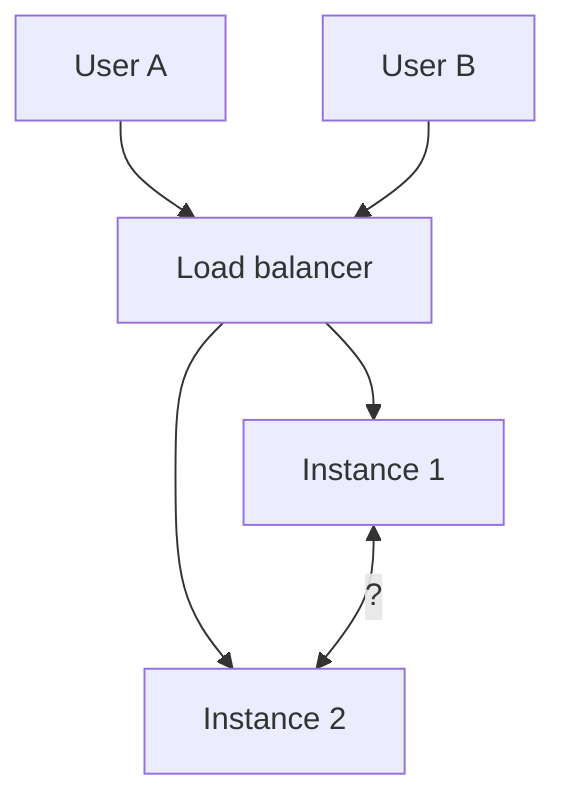

# Reconnect

WebSocket là kết nối **persistent** (giữ mở liên tục), nhưng không có nghĩa là nó không bao giờ đứt.

Một số nguyên nhân khiến connection bị chết:
- Mất mạng.
- Server restart / deploy lại.
- ...

WebSocket không thể tự retry. Nếu không lập trình reconnect, user sẽ mất kết nối vĩnh viễn cho tới khi họ tự F5 lại trang.

>[!important] Reconnect là gì?
>**Reconnect** là chiến lược cố gắng kết nối lại WebSocket connection khi nó bị chết, để đảm bảo trải nghiệm của user trên trang web.

### Cách nhận biết connection đã chết

|Loại|Đặc điểm|Cách phát hiện|
|---|---|---|
|**Đứt rõ ràng**|Server đóng, client gọi `.close()`, mất mạng hẳn|Sự kiện `close`, `error`|
|**Zombie connection**|Kết nối vẫn "mở" về mặt logic nhưng thực chất TCP đã chết (rớt mạng đột ngột, không kịp gửi gói FIN)|Phải chủ động kiểm tra bằng **heartbeat (ping/pong)**|

### Luồng xử lý

| Sự kiện                                 | FE gửi                                                       | Server xử lý                                                                               |
| --------------------------------------- | ------------------------------------------------------------ | ------------------------------------------------------------------------------------------ |
| Kết nối mở (lần đầu hoặc sau reconnect) | `{ type: "REGISTER", username }`                             | Lưu `username → socket` vào `Map` (ghi đè nếu đã tồn tại)                                  |
| Server ping định kỳ                     | Client tự động trả `pong`, *không cần code*.                 | Đánh dấu `isAlive = true`, nếu không nhận được thì  ngắt kết nối (`terminate()`).          |
| Mất mạng / server restart               | Client tự phát hiện qua `onclose`.                           | Server phát hiện qua `close` hoặc heartbeat timeout, nếu chết rồi thì xóa user khỏi `Map`. |
| Kết nối lại                             | Tự động gọi lại `connect()` với backoff, gửi lại `REGISTER`. | Coi như một `connection` hoàn toàn mới, không có state cũ.                                 |

### VD

`client.jsx`
```jsx
function useChatSocket(username) {
  const wsRef = useRef(null);
  const retryRef = useRef(0); // Biến đếm số lần retry
  const intentionalRef = useRef(false); // Đánh dấu user chủ động ngắt

  const connect = useCallback(() => {
    const ws = new WebSocket("ws://localhost:3000");
    wsRef.current = ws;

    ws.onopen = () => {
      // Chưa retry nên retryRef = 0
      retryRef.current = 0;
      // FE gửi lại REGISTER mỗi khi có kết nối mới
      // (kể cả khi reconnect)
      ws.send(JSON.stringify({ type: "REGISTER", username }));
    };

    ws.onmessage = (e) => {
      const data = JSON.parse(e.data);
      // ...
    };

    // Xử lý reconnect
    ws.onclose = () => {
      if (intentionalRef.current) return; // user tự đóng -> KHÔNG reconnect
      
      // Retry cho đến khi delay quá ngưỡng 30s (30000ms)
      // Mỗi lần retry cho phép delay tăng gấp đôi (exponential backoff)
      const delay = Math.min(1000 * 2 ** retryRef.current, 30000);
      retryRef.current++;
      
      // Chờ đúng khoảng delay rồi connect lại
      setTimeout(connect, delay);
    };

    ws.onerror = () => ws.close();
  }, [username]);

  // Kết nối khi mount
  useEffect(() => {
    connect();
    return () => wsRef.current?.close();
  }, [connect]);

  return wsRef;
}
```

Cách kích hoạt `intentionalRef`:
```jsx
const disconnect = useCallback(() => {
  intentionalRef.current = true; // set TRƯỚC khi close
  wsRef.current?.close(1000, "User logout");
}, []);
```

>[!question] Tại sao không connect nhiều lần liên tiếp mà phải delay?
>Spam một lượng connect lớn và dồn dập tới server có thể gây trầm trọng thêm vấn đề. Phải có khoảng nghỉ (delay) để server phục hồi.

`server.js`
```js
const users = new Map();

wss.on("connection", (socket) => {
  socket.isAlive = true;
  socket.on("pong", heartbeat); // client trả lời ping -> còn sống

  socket.on("message", (message) => {
    const data = JSON.parse(message.toString());

    // Đăng ký user (chạy lại mỗi lần FE connect/reconnect)
    if (data.type === "REGISTER") {
      users.set(data.username, socket); // Ghi đè socket cũ (nếu có)
      console.log(`${data.username} registered`);
      return;
    }

    // Gửi tin nhắn riêng — giữ nguyên như code gốc
    const receiverSocket = users.get(data.receiver);
    if (receiverSocket && receiverSocket.readyState === WebSocket.OPEN) {
      receiverSocket.send(JSON.stringify({ from: data.sender, text: data.text }));
    }
  });

  socket.on("close", () => {
    for (const [username, userSocket] of users.entries())
      if (userSocket === socket) {
        users.delete(username);
        console.log(`${username} disconnected`);
        break;
      }
  });
});

// Kiểm tra định kỳ mỗi 30s: đóng các connection chết
const interval = setInterval(() => {
  wss.clients.forEach((socket) => {
    if (!socket.isAlive) return socket.terminate(); // không ping -> coi như chết
    
    // Bắt đầu gửi ping lại
    socket.isAlive = false;
    socket.ping();
  });
}, 30000);

wss.on("close", () => clearInterval(interval));
```

Khi server `terminate` thì sự kiện `onClose` được kích hoạt và bắt đầu quá trình reconnect.

# Scaling & Multi-instance

>[!note]
>Đây chính là lý do **SocketIO có Redis Adapter**, **SignalR có Backplane**.

Một WebSocket connection được giữ **trong bộ nhớ của 1 process cụ thể**. Nếu bạn chạy nhiều instance server, user A kết nối vào instance 1, user B kết nối vào instance 2 - **instance 1 không thể gửi message trực tiếp cho socket đang nằm ở instance 2**.



### Giải pháp Sticky session

Load balancer phải đảm bảo **cùng 1 user luôn được route về đúng 1 instance** trong suốt vòng đời connection (dựa vào cookie hoặc IP hash). Nếu không, các request `GET /events/:username` (SSE) hay `GET /messages/:username` (polling) ở phần Fallback có thể rơi vào instance khác - mất luôn state trong `Map` local.

### Giải pháp Message broker

Thay vì `Map<username, socket>` local, dùng **message broker** (Redis Pub/Sub, NATS...) làm cầu nối giữa các instance. Message broker là một thành phần trung gian dùng để nhận, lưu trữ và chuyển tiếp các message (thông điệp) giữa các ứng dụng hoặc dịch vụ trong hệ thống.

`server.js`
```js
import { createClient } from "redis";

const pub = createClient();
const sub = createClient();
await pub.connect();
await sub.connect();

const localUsers = new Map(); // chỉ chứa socket nằm trên CHÍNH instance này

// Instance nào cũng lắng nghe channel chung
await sub.subscribe("chat-events", (message) => {
  const { receiver, payload } = JSON.parse(message);
  const socket = localUsers.get(receiver);
  // Nếu receiver không nằm trên instance này thì bỏ qua
  if (socket && socket.readyState === socket.OPEN) {
    socket.send(JSON.stringify(payload));
  }
});

// Khi có message mới, publish ra channel chung thay vì gửi trực tiếp
app.post("/message", async (req, res) => {
  const { sender, receiver, text } = req.body;
  await pub.publish(
    "chat-events",
    JSON.stringify({ receiver, payload: { from: sender, text } })
  );
  res.sendStatus(200);
});
```

# Security

### Origin Validation

Browser có thể cho một website A mở WebSocket đến server của website B, và nếu server B dùng cookie để xác thực mà không kiểm tra Origin, website A có thể lợi dụng phiên đăng nhập của người dùng.

>[!note] Nguyên lý kết nối của WebSocket
>Khi khởi tạo connection, đầu tiên client gửi 1 HTTP request đến server trước để đề nghị upgrade lên WS.

`server.js`
```js
server.on("upgrade", (req, socket, head) => {
  const allowedOrigins = ["https://myapp.com"];
  const origin = req.headers.origin;

  if (!allowedOrigins.includes(origin)) {
    socket.write("HTTP/1.1 403 Forbidden\r\n\r\n");
    socket.destroy(); // Từ chối handshake, không cho upgrade thành WebSocket
    return;
  }

  wss.handleUpgrade(req, socket, head, (ws) => {
    wss.emit("connection", ws, req);
  });
});
```

### WSS (WebSocket Secure)

`wss` là phiên bản mã hóa, bảo mật hơn so với `ws`. Cũng như `https` và `http`.

`server.js`
```js
import https from "https";
import fs from "fs";
import { WebSocketServer } from "ws";

const server = https.createServer({
  cert: fs.readFileSync("cert.pem"),
  key: fs.readFileSync("key.pem"),
}, app);

const wss = new WebSocketServer({ server });
server.listen(443);

// Server tạo qua phương thức https có thể lắng nghe kết nối wss tương ứng
// Nói cách khác,
// wss có thể chạy trên một HTTPS server thông qua HTTP Upgrade
```

### Rate limiting / message size limit

WebSocket là connection sống lâu - nếu không giới hạn, 1 client độc hại có thể spam hàng nghìn message/giây hoặc gửi payload khổng lồ để DoS server.

`server.js`
```js
const MAX_MESSAGE_SIZE = 64 * 1024; // 64KB
const RATE_LIMIT = 20; // 20 message / giây

wss.on("connection", (socket) => {
  let messageCount = 0;
  const resetInterval = setInterval(() => (messageCount = 0), 1000);

  socket.on("message", (data) => {
    // Ngăn chặn message không an toàn
    if (data.length > MAX_MESSAGE_SIZE) {
      return socket.close(1009, "Message too large");
    }

    messageCount++;
    if (messageCount > RATE_LIMIT) {
      return socket.close(1008, "Rate limit exceeded");
    }

    // Xử lý message bình thường...
  });

  socket.on("close", () => clearInterval(resetInterval));
});
```
