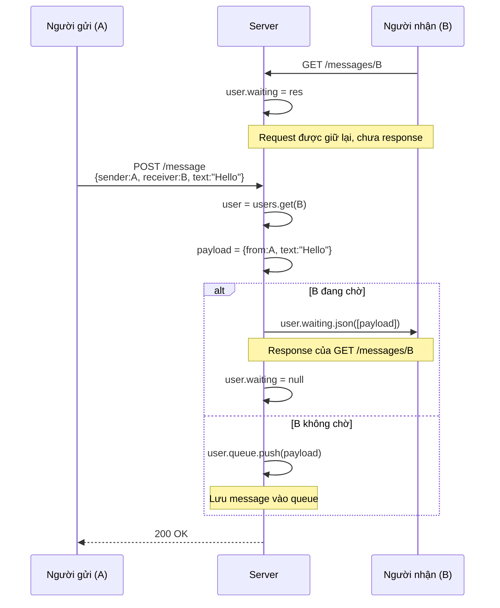
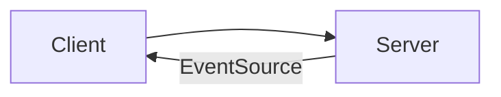
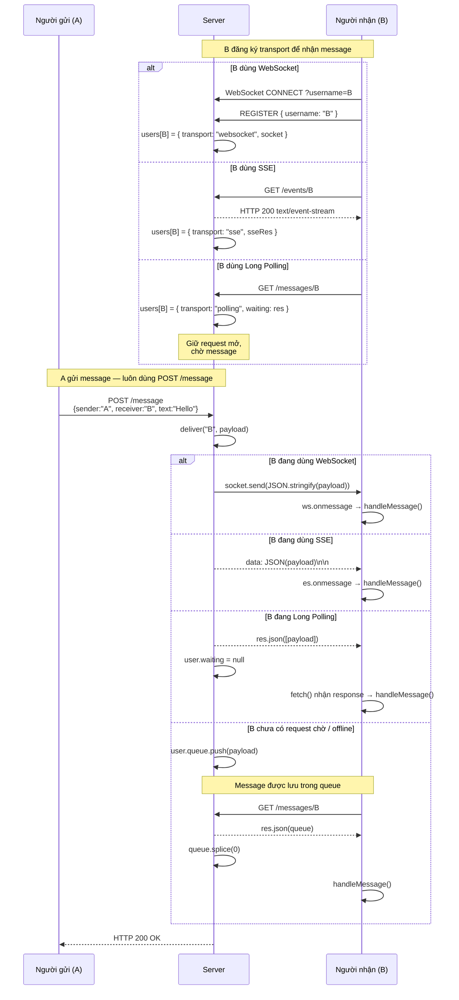

Khi WebSocket connection bị chết, thay vì để tính năng realtime chết theo, ứng dụng cần **fallback** - chuyển sang một cơ chế giao tiếp khác để vẫn hoạt động, dù trải nghiệm kém mượt hơn.

>[!important] Fallback là gì?
>**Fallback** là chiến lược sử dụng HTTP thuần để đảm bảo kết nối của user nếu WebSocket hỏng.

# HTTP Short-polling

Client liên tục gửi request cho server (có 1 đoạn delay ngắn khoảng 2s) để cập nhật dữ liệu.
→ Dễ thực hiện nhưng dễ tốn bộ nhớ.

`client.js`
```js
// Cứ mỗi 2s cập nhật messages của username 1 lần
setInterval(async () => {
  const res = await fetch(`/messages/${username}`);
  const messages = await res.json(); // có thể là []
  messages.forEach(handleMessage);
}, 2000);
```

`server.js`
```js
const users = new Map(); // username -> { queue: [] }

// Trả về danh sách messages của user
app.get("/messages/:username", (req, res) => {
  const user = users.get(req.params.username);
  const messages = user ? user.queue.splice(0) : [];
  res.json(messages);
});
```

# HTTP Long-polling

1. Client gửi request GET.
2. Server giữ request đó mở cho đến khi có dữ liệu mới hoặc hết timeout mới trả response.
3. Client nhận xong lập tức gửi request tiếp theo.

`client.js`
```js
// Liên tục gửi request lấy messages của username
// Gửi request mới khi nhận được response
async function poll() {
  const res = await fetch(`/messages/${username}`);
  const messages = await res.json();
  poll(); // gọi lại ngay khi có response
}
```

`server.js`
```js
const users = new Map();
// username -> { queue: [], waiting: res | null }

// Xử lý nhận danh sách messages
app.get("/messages/:username", (req, res) => {
  const user = users.get(req.params.username);
  if (!user) return res.json([]);

  if (user.queue.length > 0) return res.json(user.queue.splice(0));
  
  // Trường hợp username CHƯA có message mới
  // user.waiting đại diện cho response nhưng chưa gửi ngay
  // Đợi tối đa 25s sẽ gửi
  user.waiting = res;
  const timer = setTimeout(() => {
    // Nếu user.waiting === res, tức là chưa có message mới --> response []
    if (user.waiting === res) {
      user.waiting = null;
      res.json([]);
    }
  }, 25000);
  res.on("close", () => clearTimeout(timer));
});

// Xử lý gửi message mới
app.post("/message", (req, res) => {
  const { sender, receiver, text } = req.body;
  const user = users.get(receiver); // Lấy thông tin người nhận
  if (user) {
    const payload = { from: sender, text };
    // Nếu người nhận đang đợi thì response ngay payload
    if (user.waiting) {
      user.waiting.json([payload]);
      user.waiting = null;
    } else {
      // Nếu không đợi, đưa vào queue
      user.queue.push(payload);
    }
  }
  res.sendStatus(200);
});
```

Trong đó, mỗi user (truy cập thông qua `username`) sẽ có 2 thuộc tính là:
- `.queue`: Những message đã xuất hiện (message mới) nhưng `username` chưa GET message mới.
- `.waiting`: Dùng để nhận biết `username` đã GET message mới nhưng `.queue` đang trống (chưa có message mới).

>[!note] Lưu ý về syntax
>Trong ExpressJS, thuộc tính `.json` có nghĩa là gửi response.



# Server-Sent-events (SSE, EventSource API)

**EventSource API** là một API của trình duyệt dùng để nhận dữ liệu realtime từ server theo một chiều: Server → Client.
- Server có thể gửi liên tiếp data cho client mà client không cần request lại.
- Có khả năng tự reconnect khi kết nối chết.



`client.js`
```js
// Kết nối với EventSource
// Client tự gửi GET `/events/${username}` lên server
const es = new EventSource(`/events/${username}`);

// Client nhận được response từ server theo EventSource
es.onmessage = (e) => handleMessage(JSON.parse(e.data));
// handleMessage là hàm tự định nghĩa

// Một HTTP POST bình thường
function sendMessage(receiver, text) {
  fetch("/message", {
    method: "POST",
    headers: { "Content-Type": "application/json" },
    body: JSON.stringify({ sender: username, receiver, text }),
  });
}
```

`server.js`
```js
const users = new Map();
// username -> res (SSE stream - tức là response đến từng user)

// Xử lý kết nối đến EventSource
app.get("/events/:username", (req, res) => {
  res.set({
    "Content-Type": "text/event-stream", // SSE-stream
    "Cache-Control": "no-cache",
    Connection: "keep-alive", // Duy trì connection cho đến khi res xong
  });
  res.flushHeaders(); // Gửi header xuống client
  
  users.set(req.params.username, res); // Lưu connection

  // Đóng kết nối, xóa connection
  req.on("close", () => {
    users.delete(req.params.username);
  });
});

// Client gửi message lên
app.post("/message", (req, res) => {
  const { sender, receiver, text } = req.body;
  const receiverRes = users.get(receiver);
  if (receiverRes)
    receiverRes.write(`data: ${JSON.stringify({ from: sender, text })}\n\n`);
  res.sendStatus(200);
});
```

>[!note]
>- `\n\n` là ký hiệu biểu diễn response EventSource đã kết thúc.
>- `text/event-stream` là chuẩn duy nhất của EventSource.
>- EventSource là 1 dạng của **HTTP streaming**. Bạn có thể tạo stream bằng cách polling.

**Các web chatbot AI dùng SSE như thế nào?** Các web chatbot AI thường dùng SSE để stream câu trả lời từ server xuống UI từng phần, thay vì đợi AI generate xong toàn bộ câu trả lời mới trả về.

`client.js`
```js
const es = new EventSource("/chat/stream");

es.onmessage = (e) => {
  const data = JSON.parse(e.data);

  appendToCurrentMessage(data.token);
};
```

`server.js`
```js
app.get("/chat/stream", async (req, res) => {
  res.setHeader("Content-Type", "text/event-stream");
  res.setHeader("Cache-Control", "no-cache");
  res.setHeader("Connection", "keep-alive");

  const tokens = [
    "Web",
    "Socket",
    " là",
    " một",
    " giao",
    " thức",
    " realtime."
  ];

  for (const token of tokens) {
    res.write(`data: ${JSON.stringify({ token })}\n\n`);

    await new Promise(resolve => setTimeout(resolve, 100));
  }

  res.write(`data: [DONE]\n\n`);
  res.end();
});
```

# Linh động kiểm soát phương thức kết nối

**Ý tưởng**:
- Mỗi user chỉ có **1 record duy nhất** trong `users`, ghi nhớ đang dùng `transport` nào (`websocket` / `sse` / `polling` / ...).
- Toàn bộ việc gửi tin nhắn đi qua 1 hàm `deliver()` duy nhất - hàm này tự chọn cách gửi cho phù hợp.

`client.js`
```js
function sendMessage(receiver, text) {
  fetch("/message", {
    method: "POST",
    headers: { "Content-Type": "application/json" },
    body: JSON.stringify({ sender: username, receiver, text }),
  });
}

if (window.WebSocket) {
  const ws = new WebSocket(`ws://localhost:3000?username=${username}`);
  ws.onmessage = (e) => handleMessage(JSON.parse(e.data));
} else if (window.EventSource) {
  const es = new EventSource(`/events/${username}`);
  es.onmessage = (e) => handleMessage(JSON.parse(e.data));
} else {
  setInterval(async () => {
    const res = await fetch(`/messages/${username}`);
    (await res.json()).forEach(handleMessage);
  }, 2000);
}
```

Client luôn dùng `POST /message`, bất kể đang nhận bằng cách nào.

`server.js`
```js
const users = new Map();
// username --> { transport: "websocket"|"sse"|"polling", socket?, sseRes?, waiting?, queue: [] }

// Xử lý Gửi message cho người nhận
function deliver(username, payload) {
  const user = users.get(username);
  if (!user) return;

  if (user.transport === "websocket" && user.socket?.readyState === WebSocket.OPEN) {
    user.socket.send(JSON.stringify(payload));
  } else if (user.transport === "sse" && user.sseRes) {
    user.sseRes.write(`data: ${JSON.stringify(payload)}\n\n`);
  }
  // Long polling
  else if (user.waiting) {
    user.waiting.json([payload]);
    user.waiting = null;
  } else {
    user.queue.push(payload);
  }
}

// Kết nối với server, đăng ký transport EventStream
wss.on("connection", (socket) => {
  socket.on("message", (msg) => {
    const data = JSON.parse(msg.toString());
    if (data.type === "REGISTER") {
      users.set(data.username, { transport: "websocket", socket, queue: [] });
    }
  });
});

// Kết nối với server, đăng ký transport WebSocket
app.get("/events/:username", (req, res) => {
  res.set({ "Content-Type": "text/event-stream", Connection: "keep-alive" });
  res.flushHeaders();
  users.set(req.params.username, { transport: "sse", sseRes: res, queue: [] });
});

app.get("/messages/:username", (req, res) => {
  let user = users.get(req.params.username);
  if (!user) users.set(req.params.username, (user = { transport: "polling", queue: [] }));
  user.transport = "polling"; // fallback nếu trước đó là ws/sse

  // Logic của long polling
  if (user.queue.length > 0) return res.json(user.queue.splice(0));
  user.waiting = res;
});


// Xử lý Gửi message đến server
app.post("/message", (req, res) => {
  const { sender, receiver, text } = req.body;
  deliver(receiver, { from: sender, text });
  res.sendStatus(200);
});
```



>[!note] `.splice` là gì?
>Lấy toàn bộ phần tử ra khỏi danh sách và làm rỗng danh sách.
