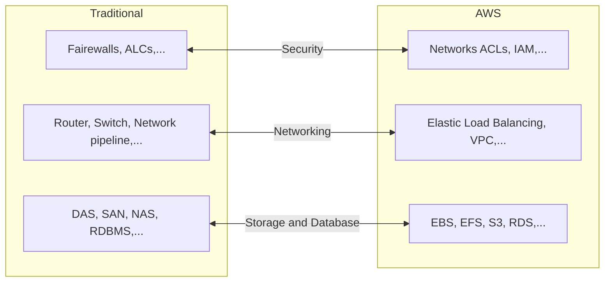
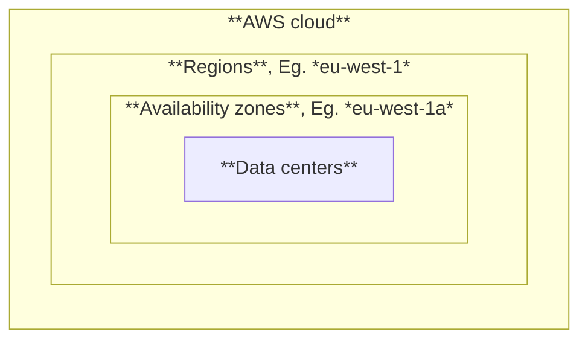

# AWS

**Amazon web services (AWS)** là một nền tảng cung cấp dịch vụ cloud computing với quy mô quốc tế.

AWS có rất nhiều dịch vụ kèm theo. Đây là một số dịch vụ phổ biến nhất của AWS:

**Có 3 cách truy cập các dịch vụ của AWS**:
- AWS Management Console.
- AWS Command Line Interface (CLI).
- AWS Software Development Kits.

Gần như là với mỗi thiết bị phần cứng, AWS đều có (các) dịch vụ tương ứng.

# Mô hình cơ sở hạ tầng của AWS

- AWS có máy chủ trên toàn thế giới, được chia thành từng **regions** khác nhau, trong mỗi region lại có nhiều **availability zones**, và trong mỗi zone lại có nhiều máy chủ (thường là 3).
- Khi một zone có sự cố thì nó không ảnh hưởng đến các zone khác.
- Người dùng chỉ có thể chọn region và zone khi sử dụng dịch vụ, không thể chọn center cụ thể.
- **Edge locations**: Là một lượng nhỏ các máy chủ cache được đặt ở những vùng mà lưu lượng truy cập vào hệ thống của AWS cao, áp dụng lên các tài nguyên có nhu cầu sử dụng cao, nên cần cache để giảm tải áp lực lên server và tăng trải nghiệm của người dùng.

# Mô hình chi phí của AWS

**Nguyên lý cơ bản**: ***Pay-as-you-go***: Dùng tới đâu, trả tới đó.

**AWS Cost Explorer**: Dịch vụ quản lý các chi phí sử dụng AWS.

**AWS Pricing Calculator**: Dịch vụ ước tính chi phí sử dụng AWS trước khi sử dụng thực tế.

**AWS Organizations**: Dịch vụ quản lý tập trung các tài khoản AWS.
- **Organization**: Tập hợp các tài khoản.
- **Management account (root)**: Tài khoản quản lý organization.
- **Member account**: Các tài khoản thành viên. Các tài khoản mới là các tài khoản sử dụng các dịch vụ của AWS.

**Reserved Instances (RIs)**: Là một hình thức đặt trước tài nguyên (capacity) để nhận được giá rẻ hơn so với dùng theo kiểu trả tiền theo nhu cầu (On-Demand).
- **AURI - All upfront**: Trả toàn bộ chi phí ngay từ đầu.
- **PURI - Partial upfront**: Trả một phần chi phí ngay từ đầu, phần còn lại trả trong mỗi tháng.
- **NURI - No upfront**: Trả theo mỗi tháng.

**Support plans**: Các gói hỗ trợ kỹ thuật từ AWS khi bạn sử dụng các dịch vụ của họ:
- **Basic**: Hỗ trợ qua docs, whitepapers, forum, AWS Trusted Advisor. Miễn phí ở tất cả người dùng.
- **Developer**: Hỗ trợ qua email.
- **Business **: Hỗ trợ qua nhắn tin, phone.
- **Enterprise**: Có đội ngũ kỹ thuật Technical Account Manager (TAM) hỗ trợ và báo cáo số liệu.

# Mô hình bảo mật của AWS

**IAM (Identity and Access Management)** là cơ chế quản lý *quyền truy cập (Authentication)* vào *quyền sử dụng (Authorization)* các dịch vụ của AWS.

**Thành phần**:
- **User**:
	- Tượng trưng cho 1 cá nhân hoặc hệ thống.
	- Đăng nhập vào dịch vụ dựa trên username / password (cá nhân) hoặc access key (hệ thống).
- **User group**:
	- Là tập hợp các users.
	- Những quyền được áp dụng cho groups thì cũng được áp dụng cho các user trong group đó.
- **Policy**:
	- Là định nghĩa những gì mà user được quyền thao tác lên hệ thống.
	- **Permission**: Là policy đã được áp đặt lên user.
- **Role**:
	- Là một tập hợp các policy.
	- Khi user đóng vai role, mọi policy của role đó được áp đặt lên user.
