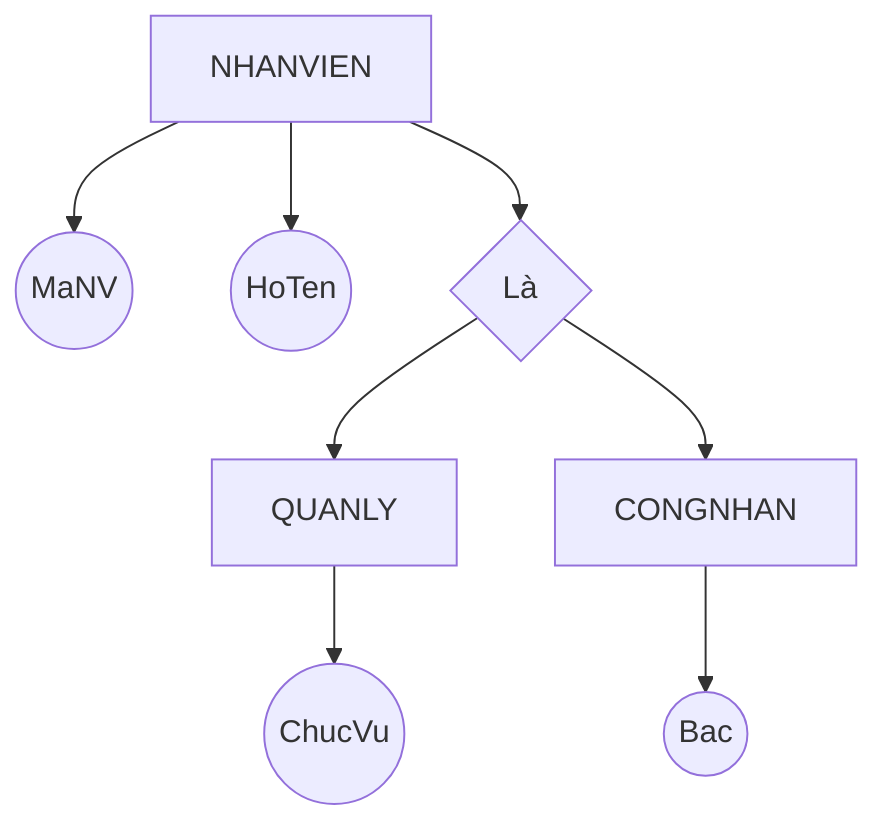
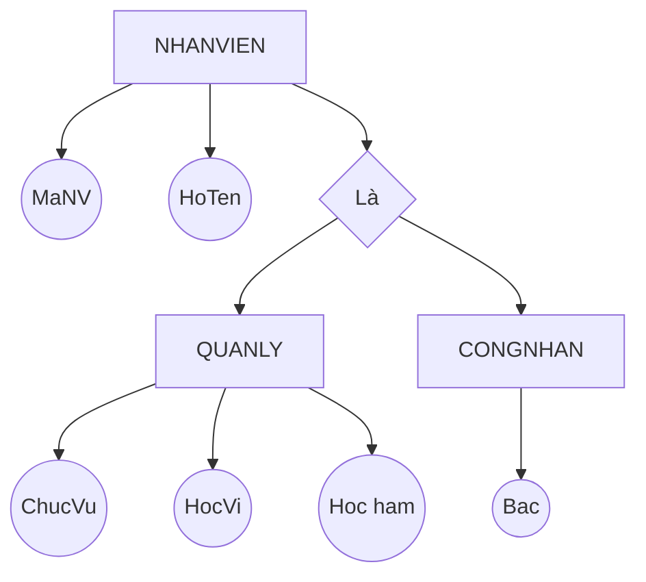
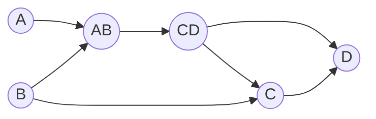
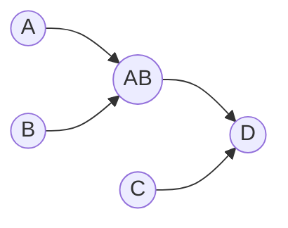

```insta-toc
---
title:
  name: Mục lục
  level: 1
  center: false
exclude: ""
style:
  listType: number
omit: []
levels:
  min: 1
  max: 6
---

# Mục lục

1. Các thành phần của mô hình quan hệ
2. Biểu diễn mô hình quan hệ
3. Ánh xạ mô hình ER sang mô hình quan hệ
    1. Chuyển đổi mối
    2. Chuyển đổi mức chuyên biệt hóa, tổng quát hóa
4. Đại số quan hệ
    1. Các phép toán đại số quan hệ
    2. Xác định thứ tự các bộ
    3. Các bước truy vấn
5. Ràng buộc toàn vẹn
6. Phụ thuộc hàm
    1. Phụ thuộc hàm
    2. Hệ luật dẫn Armstrong
    3. Bao đóng
    4. Phủ tối thiểu
    5. Khóa
7. Dạng chuẩn
```

Mô hình quan hệ là một dạng [[2. Mô hình dữ liệu]].

# Các thành phần của mô hình quan hệ

1. **Thuộc tính (Attribute)**
    - Mô tả đặc trưng, tính chất riêng biệt của đối tượng cần được lưu trữ trong CSDL.
    - Gồm có:
        1. **Tên gọi**: Dãy ký tự.
        2. **Kiểu dữ liệu**: Số, Chuỗi, Ngày tháng, Boolean, NULL,... Không có các kiểu dữ liệu phức tạp như list, set, array,...
        3. **Miền giá trị**: Tập giá trị mà thuộc tính có thể nhận.
            - VD: Dom(GioiTinh)=('Nam', 'Nu').

2. **Quan hệ (Relation)**
    - Là một tập hữu hạn các attribute.
    - Ký hiệu: $R = ( a_1; \quad a_2; \quad ...; \quad a_n )$. $R^+ = \{ a_1; \quad a_2; \quad ..; \quad a_n. \}$.
    - VD: LOP(MaLop, TenLop, SiSo).

3. **Bộ (Tuple, Record)**
    - Là tập hợp các giá trị thuộc các attribute khác nhau của một đối tượng.
    - Ký hiệu: $r = ( v_1; \quad v_2; \quad ... )$.
    - Chú ý:
        1. Các bộ là phân biệt.
        2. Thứ tự các bộ không quan trọng. Nhưng thứ tự các giá trị trong bộ là quan trọng.

4. **Thể hiện của quan hệ (Instance)**
    - Là tập hợp các bộ tại 1 thời điểm.

5. **Các loại khóa**:
	1. **Siêu khóa (Super key)**: Là tập của các thuộc tính sao cho các bộ phân biệt với nhau ở tập này. Một quan hệ có thể có nhiều siêu khóa.
	2. **Khóa (Key)**: Là siêu khóa có ít thuộc tính nhất.
	3. **Khóa chính (Primary key)**: Là 1 khóa được chọn để phân biệt các bộ của quan hệ.
	4. **Khóa tương đương**: Là các khóa không được chọn làm khóa chính.
	5. **Khóa ngoại (Foreign key)**: Là khóa ở quan hệ B tham chiếu đến khóa chính ở quan hệ A.

# Biểu diễn mô hình quan hệ

Được biểu diễn qua lược đồ **(Schema)**:
1. **Lược đồ quan hệ**:
	- Là lược đồ mô tả cấu trúc của một quan hệ và các mối liên hệ giữa các thuộc tính trong quan hệ đó.
	- VD: **THI (MaSV, MaMH, LanThi, Diem)**. Tân từ: Mỗi sv được phép thi một môn học nhiều lần, mỗi lần thi lưu trữ thông tin sinh viên nào (MaSV) thi môn gì (MaMH), lần thi thứ mấy (LanThi), và điểm đạt được (Diem).

2. **Lược đồ CSDL**:
	- Là tập hợp gồm các lược đồ quan hệ và các mối liên hệ giữa chúng trong cùng một hệ thống quản lý.
	- VD: Lược đồ CSDL Quản lý điểm thi của Sinh viên:
		1. **MONHOC (MAMH, TENMH, TCLT, TCTH, MAKHOA)**. Tân từ: Mỗi môn học có mã môn học (MaMH) duy nhất để phân biệt với các môn học khác, có tên môn học (TenMH), số tín chỉ lý thuyết (TCLT), số tín chỉ thực hành (TCTH) và do một khoa phụ trách về mặt nội dung (MaKhoa).
		2. **DIEUKIEN (MAMH, MAMH_TRUOC)**. Tân từ: Có những môn học (MaMH) sinh viên phải có kiến thức từ một số môn học trước (MaMH_Truoc).

# Ánh xạ mô hình ER sang mô hình quan hệ

## Chuyển đổi mối

- **Mối 1-1**:
	- 2 quan hệ *ít* thuộc tính -> Gộp lại thành *1 quan hệ*.
	- 2 quan hệ *nhiều* thuộc tính -> Tách ra thành *2 quan hệ, quan hệ có **ít** bộ tham gia hơn thì có khóa ngoại đến quan hệ kia*.

- **Mối 1-n**: Tách ra thành *2 quan hệ, quan hệ có **ít** bộ tham gia hơn thì có khóa ngoại đến quan hệ kia*.

- **Mối n-n**:
	- Tách ra thành 2 quan hệ và *1 quan hệ trung gian*, quan hệ trung gian có khóa ngoại đến 2 quan hệ kia.
	- *Khóa chính* của quan hệ trung gian có thể là các khóa ngoại như trên hoặc khóa chính riêng biệt, tùy trường hợp.

- **Mối đệ quy**: Tạo thêm một khóa ngoại trỏ đến chính nó.

## Chuyển đổi mức chuyên biệt hóa, tổng quát hóa

- Mức chuyên biệt hóa có **ít hoặc không** có thuộc tính riêng -> *Gom lên mức tổng quát, bổ sung thêm thuộc tính phân loại và các ràng buộc toàn vẹn*.


- NHANVIEN(MaNV, HoTen, **Loai, ChucVu, Bac**)

- Mức chuyên biệt hóa có **nhiều** thuộc tính riêng -> Tách thành nhiều thực thể riêng.


- **CONGNHAN** (MaNV, HoTen, **Bac**).
- **QUANLY** (MaNV, HoTen, **ChucVu, HocVi, HocHam**).

# Đại số quan hệ

Đại số quan hệ là:
- Mô hình toán học dựa trên **lý thuyết tập hợp**.
- Đối tượng xử lý là các quan hệ trong CSDL quan hệ.
- Cho phép sử dụng các phép toán rút trích dữ liệu từ các quan hệ.
- Tối ưu hóa quá trình rút trích dữ liệu.
- Bao gồm các phép toán và biểu thức quan hệ.

## Các phép toán đại số quan hệ

Một số phép toán đại số thông thường:
1. $\cap$: Giao. $\wedge$: Hội (Và).
2. $\cup$: Hợp. $\vee$: Tuyển (Hoặc).

>[!CAUTION]
Kết quả của một phép toán quan hệ là một **quan hệ**.

**Các phép toán quan hệ**:

---
**Phép đổi tên**:
$$\text{New name}\leftarrow R$$

---
**Phép chọn**: Chọn ra các bộ thỏa mãn điều kiện $P$ trong quan hệ $R$:
$$\sigma_{(P)}(R)$$
Những điều kiện $P$ có cú pháp *<tên thuộc tính><toán tử><giá trị>*.

---
**Phép chiếu**: Lấy ra một số thuộc tính $A_i$ trong quan hệ $R$:
$$\pi_{(A_1, A_2, ...)}(R)$$

---
**Các phép Hợp, Giao, Trừ**: Chỉ thực hiện khi chúng **khả hợp**: Số lượng thuộc tính giữa 2 quan hệ phải *bằng nhau*.

---
**Phép tích Descartes**: Trả về một quan hệ có $|A|\times|B|$ bộ bằng cách kết hợp từng bộ của quan hệ $A$ với từng bộ của quan hệ $B$:
$$ A \times B$$

---
**Phép kết Theta-join**: Là thực hiện tích Descartes, rồi từ kết quả chọn ra các bộ thỏa mãn điều kiện $a\;\theta\;b$. Ký hiệu $A\underset{a\;\theta\;b}{\bowtie} B$. Có 3 loại:
	1. **Phép kết bằng (Equi-join)**: Ký hiệu $A\underset{a\;=\;b}{\bowtie}B$, ghép các bộ mà  $A.a=B.b$.
	2. **Phép kết tự nhiên (Natural-join)**: Ký hiệu $A\underset{t}{\bowtie}B$, ghép các bộ mà $A.t=B.t$.
	3. **Phép kết ngoài (Outer-join)**:
		1. **Left-outer-join**: Ký hiệu $A\;\underset{t}{⟕}\;B$. Là kết bằng, nhưng vẫn giữ lại các bộ của quan hệ bên trái, các thuộc tính của quan hệ bên phải không có giá trị tương ứng sẽ mang giá trị NULL.
		2. **Right-outer-join**: Ký hiệu $A\;\underset{t}{⟖}\;B$. Là kết bằng, nhưng vẫn giữ lại các bộ của quan hệ bên trái, phải thuộc tính của quan hệ bên trái không có giá trị sẽ mang giá trị NULL.
		3. **Full-outer-join**: Ký hiệu $A\;\underset{t}{⟗}\;B$. Là kết bằng, nhưng vẫn giữ lại các bộ thuộc quan hệ bên phải và trái, các thuộc tính ở quan hệ bên trái và phải mà không có dữ liệu sẽ mang giá trị NULL.

---
**Phép chia**:
- Có kết quả có $A-B$ thuộc tính.
- Trả về các bộ của quan hệ $A$ tương ứng với tất cả các bộ $b$ của quan hệ $B$. 
- Điều kiện để $A\div B$: Tất cả thuộc tính của $B$ phải là **tập con** các thuộc tính của $A$.

---
**Phép gom nhóm**: Trong quan hệ $R$, nhóm các bộ có chung giá trị của các thuộc tính $G_i$, thực hiện hàm $f_i(A_i)$ cho các giá trị của thuộc tính $A_i$ sau khi nhóm.
$$ _{(G_1,G_2,...)}\gamma_{(f(A_1),f(A_2),...)}(R)  $$

Các hàm tính toán thường có **count()**, **sum()**, **min()**, **max()**, **avg()**, **day()**, **month()**, **year()** và không nhất thiết dùng trong phép gom nhóm.

## Xác định thứ tự các bộ

Trên lý thuyết thì mỗi quan hệ là các tập hợp, nên không phân biệt thứ tự.

Trên thực tế:
- Người ta sẽ dùng một hoặc vài thuộc tính để xác định thứ tự, như thời điểm, số thứ tự,... lúc này, thứ tự nhỏ nhất và lớn nhất có thể được xác định qua **min(), max()**.
- Trong trường hợp đặc biệt, cần dùng tổng hợp các phép toán quan hệ mới đưa ra được thứ tự

**VD1**: Cho quan hệ **KIEMDINH(MaKD, MaSP, KetQua)** thể hiện kết quả kiểm định với từng loại sản phẩm.
- Nếu sản phẩm có kết quả `Đạt` thì không cần kiểm định nữa.
- Nếu sản phẩm `Không đạt` thì cần kiểm định lại.
Với từng loại sản phẩm, cho biết các sản phẩm có kết quả kiểm định `Đạt` nhưng không phải ở lần đầu.

Gọi $A$ và $B$ lần lượt là các sản phẩm đạt và không đạt:
$$
\begin{align}
	A&\leftarrow\sigma_{(\text{KetQua}\;=\;\text{'Đạt'})}\text{KIEMDINH}\\
	B&\leftarrow\sigma_{(\text{KetQua}\;=\;\text{'Không đạt'})}\text{KIEMDINH}
\end{align}
$$
Ta thấy rằng $B$ là tập con của $A$ bởi vì tất cả sản phẩm đều phải `Không đạt` trước khi `Đạt`, ngoại trừ những sản phẩm chỉ `Đạt` (tức là `Đạt` ở lần đầu).

Vậy đáp án là:
$$\text{Đáp án}\leftarrow A-B$$

## Các bước truy vấn

1. Vẽ sơ đồ cơ sở dữ liệu.

2. Xác định các quan hệ sẽ có trong truy vấn (*bao gồm quan hệ của các thuộc tính cần lấy ra, quan hệ của các điều kiện, quan hệ trung gian để kết*):
	1. Nếu chỉ có một quan hệ thì ghi vào truy vấn.
	2. Nếu có nhiều quan hệ thì xem xét các phép:
		1. **Hội, giao, trừ**: Cần khả giao.
		2. **Kết**: Dựa trên giá trị giống nhau ở 2 thuộc tính ở 2 quan hệ (*khóa nội - khóa ngoại*).
		3. **Chia**: Các thuộc tính của quan hệ chia phải thuộc tập thuộc tính của quan hệ bị chia.

3. Xác định các thuộc tính cần lấy ra (sử dụng $\pi$ và $\leftarrow$).

4. Xác định các điều kiện lọc ra cuối cùng ($\sigma$).

>[!CAUTION]
>- Dạng bài **Hiển thị các mã HĐ cùng mua 2 sản phẩm '01' và '02'** -> Không dùng $\wedge$.
>-> Chọn tập mã HĐ mua sp '01', chọn tập hợp mã HĐ mua sp '02' -> **Hợp 2 tập lại**.
>- Dạng bài **mua sản phẩm '01' nhưng không mua '02'** -> Lấy 2 tập **trừ** nhau.

>[!TIP]
>- Đề yêu cầu liệt kê **"nếu có"** -> Xem xét ***LEFT/RIGHT JOIN***.
>- Đề yêu cầu liệt kê **"tất cả (quan hệ này ứng với tất cả quan hệ kia)"** -> Xem xét phép ***CHIA***.
>- Đề yêu cầu "**với từng loại** thì..." -> Xem xép ***NHÓM***.

# Ràng buộc toàn vẹn

RBTV là những yêu cầu mà tất cả thể hiện của quan hệ phải thỏa.

**Ý nghĩa**: Giúp đảm bảo:
1. CSDL luôn đúng về mặt ngữ nghĩa.
2. Tính nhất quán của dữ liệu.

**Ký hiệu**: Là bảng 2 chiều thể hiện **tầm ảnh hưởng**, xác định các thao tác ảnh hưởng (**+**) và thao tác không ảnh hưởng (**-**) lên các quan hệ nằm trong bối cảnh.

Quy tắc xây dựng bảng tầm ảnh hưởng:
1. Thao tác **thêm và xóa** xét trên một bộ giá trị của quan hệ.
2. Thao tác **sửa** xét từng thuộc tính của quan hệ, không áp dụng cho khóa.

Phân loại:
1. **RBTV có bối cảnh trên 1 quan hệ**: Gồm có:
	1. Miền giá trị.
	2. Liên thuộc tính.
	3. Liên bộ.

2. **RBTV có bối cảnh trên nhiều quan hệ**: Gồm có:
	1. Khóa ngoại.
	2. Liên thuộc tính liên quan hệ.
	3. Liên bộ thuộc tính quan hệ.
	4. Do thuộc tính tổng hợp.
	5. Do chu trình.

**VD \[RBTV miền giá trị\]**:
1. NHANVIEN (**MaNV**, HoTen, GT, SoDT, DChi): $\forall \text{nv} \in \text{NHANVIEN} : \text{nv.GT = "Nam"} \vee \text{nv.GT = "Nu"}$.
2. KETQUA (**MaHS**, MaMon, HK, NamHoc, Diem): $\forall \text{kq} \in  \text{KETQUA}: \text{kq.DIEM} \geq 0 \wedge \text{kq.DIEM} \leq 10$.

**VD \[RBTV liên thuộc tính\]**:
1. DUAN (**MaDA**, TenDA, DDiem_DA, MaPH, NgBD_DK, NgKT_DK): $\forall \text{da} \in \text{DUAN}: \text{da.NgBD\_DK} \leq \text{da.NgKT\_DK}$.
2. NHANVIEN (**MaNV**, HoTen, NgVaoLam, Luong): $\forall \text{nv} \in \text{NHANVIEN}: \text{nv.NgVaoLam} \leq 2025, \quad \text{nv.Luong} \geq 5000$.

**VD \[RBTV liên bộ\]**:
1. DUAN (**MaDA**, TenDA, DDiem_DA, MaPH, NgBD_DK, NgKT_DK): $\forall \text{da}_1, \text{da}_2 \in \text{DUAN}: \text{da}_1\text{.MaDA} \neq \text{da}_2\text{.MaDA}$.
2. PHANCONG (**MaNV, MaDA**, ThoiGian): $\forall \text{pc}_1 \in \text{PHANCONG}: \text{COUNT}_{(\text{pc}_2 \in \text{PHANCONG};\quad \text{pc}_1\text{.MaDA} = \text{pc}_2\text{.MaDA})} (\text{pc}_2\text{.MaDA}) \leq 15$.

**VD \[RBTV khóa ngoại\]**:
1. NHANVIEN (**MaNV**, HoTen, NgSinh, NoiSinh, GT, MaNQL, Phong).
2. PHONGBAN (**MaPhong**, TenPhong, TrPhong, NgayNhanChuc)
$$\forall \text{pb} \in \text{PHONGBAN}, \exists \text{nv} \in \text{NHANVIEN}: \text{pb.TrPhong} = \text{nv.MaNV}$$

**VD \[RBTV do chu trình\]**:
1. NHANVIEN (**MaNV**, HoTen, NgSinh, NoiSinh, GT, MaNQL, Phong).
2. PHONGBAN (**MaPhong**, TenPhong, TrPhong, NgayNhanChuc).
$$\forall \text{pb} \in \text{PHONGBAN}, \exists \text{nv} \in \text{NHANVIEN}: \text{pb.TrPhong = nv.MaNV} \wedge \text{pb.MaPhong = nv.Phong} $$

**VD \[RBTV liên thuộc tính liên quan hệ\]**:
1. DATHANG (**MaDH**, MaKH, NgayDH)
2. GIAOHANG (**MaGH**, MaDH, NgayGH)
$$\forall \text{dh} \in \text{DATHANG}, \forall \text{gh} \in \text{GIAOHANG}: \text{dh.NgayDH} \leq \text{gh.NgayGH}$$

**VD \[RBTV liên bộ liên quan hệ\]**:
1. PHONGBAN (**MaPhong**, TenPhong, TrPhong, NgayNhanChuc).
2. DIADIEMPHONG (**MaPhong, DiaDiem**).
$$ \forall \text{pb} \in \text{PHONGBAN}, \exists \text{ddp} \in \text{DIADIEMPHONG}:\text{ddp.MaPhong} = \text{pb.MaPhong} $$

3.  DUAN (**MaDA**, TenDA, DDiem_DA, MaPH, NgBD_DK, NgKT_DK).
4. PHANCONG (**MaNV, MaDA**, ThoiGian).
$$\forall \, da \in DUAN \;:\; 
( da.DDiem\_DA = \text{"TPHCM"} ) 
\;\Rightarrow\;
( \, \# \{ pc \in PHANCONG \mid pc.MaDA = da.MaDA \} \leq 20 )$$

**VD \[RBTV do thuộc tính tổng hợp\]**:
1. PHIEUXUAT (**SoPhieu**, Ngay, TongTriGia).
2. CTPX (**SoPhieu, MaHang**, SL, DG).
$$ \forall \text{px} \in \text{PHIEUXUAT}, \text{px.TongTriGia} = \text{SUM}(\{ \text{ctpx.SL} * \text{ctpx.DG} | \text{ctpx} \in \text{CTPX} \wedge \text{ctpx.SoPhieu = px.SoPhieu} \}) $$

>[!quote]
>*Phụ thuộc hàm và dạng chuẩn* là **cơ sở Toán học để thiết kế tối ưu cơ sở dữ liệu quan hệ**.

# Phụ thuộc hàm

## Phụ thuộc hàm

Phụ thuộc hàm (PTH) trên quan hệ $R$ biểu diễn mối liên hệ giữa các tập thuộc tính trong $R$.
Ký hiệu: $X \rightarrow Y$, với $X$ và $Y$ là 2 tập thuộc tính của $R$, nghĩa là:
- $X$ kéo theo $Y$, hay:
- Sự tồn tại của giá trị trong $Y$ phụ thuộc vào sự tồn tại của giá trị trong $X$.

VD:
- SinhVien(MSSV, HoTen, NgaySinh, Lop).
- 1 PTH: $\text{MSSV} \rightarrow \text{HoTen, NgaySinh, Lop}$. Vì mỗi sv có MSSV duy nhất, từ MSSV có thể xác định được họ tên, ngày sinh, và lớp nên các thuộc tính này phụ thuộc vào MSSV.

## Hệ luật dẫn Armstrong

Gọi $F$ là tập các PTH.
Ký hiệu: $F \models X \rightarrow Y$.

Các PTH có các tính chất sau:
1. **Tính phản xạ**: Mọi thuộc tính có thể được xác định bởi chính nó hoặc tập con của nó.
$$ Y⊆X \Rightarrow X \rightarrow Y $$
2. **Tính tăng trưởng**: Thêm cùng một tập thuộc tính vào cả hai vế, phụ thuộc hàm vẫn đúng.
$$ X \rightarrow Y, \quad \forall Z \quad \Rightarrow \quad XZ \rightarrow YZ $$
3. **Tính bắc cầu**:
$$ 
\begin{cases}
	X \rightarrow Y\\
	Y \rightarrow Z
\end{cases}
\quad \Rightarrow \quad X \rightarrow Z $$
4. **Tính tựa bắc cầu (giả bắc cầu)**: Bỏ cái chung:
$$ 
\begin{cases}
	X &\rightarrow Y\\
	YZ &\rightarrow W
\end{cases}
\Rightarrow \quad XZ \rightarrow W
$$

5. **Tính kết hợp**:
$$
\begin{cases}
	X \rightarrow Y\\
	X \rightarrow Z\\
\end{cases}
\quad \Rightarrow \quad X \rightarrow YZ
$$
6. **Tính phân rã**:
$$ X \rightarrow YZ \quad \Rightarrow \quad
\begin{cases}
	X \rightarrow Y\\
	X \rightarrow Z
\end{cases}
$$

>[!tip] Dạng bài tập chứng minh PTH
>Có 2 cách:
>1. **Chứng minh bằng các tính chất của PTH**: Giải bài toán theo kiểu đệ quy, nếu thấy $A\rightarrow B$ thì ta kiểm tra xem $B$ có thể được suy ra như thế nào.
>2. **Chứng minh qua bao đóng**.

VD: Cho:
$$
\begin{align}
	&R(A, B, C, D, E, G, H) \\
	&F = \{ AB\rightarrow C;\quad B\rightarrow D;\quad CD\rightarrow E;\quad CE\rightarrow GH;\quad G\rightarrow A;\quad AB\rightarrow G \}
\end{align}
$$
Chứng minh $AB \rightarrow G$ bằng các tính chất của PTH.

Ta có:
1. $CE\rightarrow GH$ (gt).
2. $CE\rightarrow G$ (1).
3. $AB\rightarrow C$ (gt).
4. $CD\rightarrow E$ (gt).
5. $B\rightarrow D$ (gt).
6. $AB\rightarrow CD$ (3, 5).
7. $AB\rightarrow E$ (4, 6).
8. $AB\rightarrow CE$ (3, 7).
9. $AB\rightarrow GH$ (1, 8).
10. $AB\rightarrow G$ (9).

## Bao đóng

Gọi $F^+$ là tất cả các PTH có thể được suy ra từ $F$.
Bao đóng ($X^+_F$) là tất cả các thuộc tính có thể suy ra từ $X$ qua $F^+$.

**Các bước tìm bao đóng**:
1. Khởi tạo $X^+=X$.
2. Với mỗi $A \rightarrow B ⊆ F$, nếu $A ⊆ X^+$ thì thêm $B$ vào $X^+$.
3. Lặp lại bước trên cho đến khi **không thêm được thuộc tính** nào vào $X^+$ nữa hay $X^+=Q^+$ ($Q^+$ là tập tất cả thuộc tính của $R$).

**VD**: Tìm $AC^+_F$:
$$
\begin{align}
	&R(A, B, C, D, E, G, H) \\
	&F = \{ f_1: B \rightarrow A; \quad f_2: DA \rightarrow CE; \quad f_3: D \rightarrow H; \quad f_4: GH \rightarrow C; \quad f_5: AC \rightarrow D \}
\end{align}
$$

1. Đặt $X_0 = AC$.

2. Lặp lần đầu, $X_1 = AC$.
	1. Thấy $f_5: AC \rightarrow D$ có $AC ⊆ X^0$ nên thêm $D$ vào $X$.
	2. Các $f_i$ khác không thỏa.

3. Lặp lần 2, $X_1 = ACD$.
	1. Thấy $f_2: DA \rightarrow CE$, thêm $CE$.
	2. Thấy $f_3: D \rightarrow H$, thêm $H$.
	3. Các $f_i$ khác không thỏa.

4. Lặp lần 3, $X_2 = ACDEH$.
	1. Không có $f_i$ nào thỏa điều kiện, dừng thuật toán.

Vậy $AC^+_F = ACDEH$.

>[!note]
>Khi làm bài nên trình bày cụ thể ra từng $f_i$ là thỏa hay không thỏa thay vì ghi vắn tắt như bài mẫu.

**VD**: Chứng minh $AC \rightarrow E \in F^+$?

Giải: Ta thấy $E \in AC^+_F= ACDEH  \quad \Rightarrow \quad AC \rightarrow E \in F^+$.

## Phủ tối thiểu

**Các khái niệm cơ bản**:
1. **PTH tương đương**: Hai tập PTH $F$ và $G$ tương đương nếu chúng có cùng bao đóng.
2. **Vế phải một thuộc tính**: Mọi PTH đều có thể phân rã cho đến khi chỉ còn 1 thuộc tính ở vế phải.
3. **Thuộc tính vế trái dư thừa**: $X \rightarrow Y$ có vế trái dư thừa nếu có thể loại bỏ 1 thuộc tính của $X$ mà không làm thay đổi PTH ban đầu.
4. **Phụ thuộc hàm dư thừa**: Là khi bỏ nó đi thì tập $F$ vẫn tương đương với tập cũ.

$F$ là **phủ tối thiểu** khi:
1. Vế phải của các PTH chỉ có 1 thuộc tính.
2. Không có thuộc tính vế trái dư thừa.
3. Không có phụ thuộc hàm dư thừa.

**Các bước tìm phủ tối thiểu:
1. Phân rã các PTH cho đến khi chỉ còn 1 thuộc tính vế phải.
2. Loại bỏ các thuộc tính dư thừa ở vế trái.
3. Loại bỏ các phụ thuộc hàm dư thừa.

VD: Tìm phủ tối thiểu của:
$$
\begin{align}
	&R(A, B, C, D) \\
	&F = \{ AB \rightarrow CD, \quad B \rightarrow C, \quad C \rightarrow D \}
\end{align}
$$

Theo sơ đồ, ta thấy:
- Ta thấy từ $B$ có thể suy ra $C, D$ dễ dàng, nên bỏ hẳn $A, AB, CD$.
- Vậy phủ là $F = \{ B \rightarrow C, \quad C \rightarrow D \}$.

Theo các bước của thuật toán:
1. Phân rã:
$$F = \{ AB \rightarrow C, \quad AB \rightarrow D, \quad B \rightarrow C, \quad C \rightarrow D \}$$
2. Kiểm tra dư thừa vế trái:
	1. Xét $AB \rightarrow C$: Ta thấy đã có $B \rightarrow C$ nên bỏ $A$.
	2. Xét $AB \rightarrow D$: Ta thấy đã có $B \rightarrow C$ và $C \rightarrow D$ nên đã có $B \rightarrow D$, bỏ $A$.
$$F = \{ B \rightarrow C, \quad B \rightarrow D, \quad B \rightarrow C, \quad C \rightarrow D \}$$
3. Loại bỏ phụ thuộc hàm dư thừa:
	1. Ta loại bỏ $B \rightarrow C$ do trùng.
	2. Ta thấy $B \rightarrow C$, $C \rightarrow D$ nên bỏ luôn $B \rightarrow D$.
$$F = \{B \rightarrow C, \quad C \rightarrow D \}$$

## Khóa

$K$ là khóa của $R$ khi $K^+_F = R^+$, tức là:
- Bao đóng của  là tất cả thuộc tính của $R$, hay,
- Từ $K$ có thể suy ra tất cả thuộc tính của $R$.

**Các bước tìm khóa:**
1. Gọi $N$ là tập các thuộc tính **chỉ ở vế trái** của các PTH. Nếu $N^+_F = R^+$ thì kết luận, không thì đến bước 2.
2. Gọi $M$ là tập các thuộc tính **ở vế trái và phải** của các PTH. Liệt kê các tập con $X_i ⊆ M$. Số lượng tập con là $x^{|M|}-1$.
3. Với mỗi $X_i$, nếu $(N ∪ X_i)^+_F = R^+$ thì $X_i$ là một khóa.

VD: Tìm các khóa của:
$$
\begin{align}
	&R(A, B, C, D, E, G, H) \\
	&F = \{ B \rightarrow A; \quad DA \rightarrow CE; \quad D \rightarrow H; \quad GH \rightarrow C; \quad AC \rightarrow D \}
\end{align}
$$

Theo thuật toán:
1. Tập nguồn $N = BG$. $BG^+_F=BGA\neq R^+$.
2. Tập trung gian $M = ACDH$. Các tập con của $M$:  $\{A\},\{C\},\{D\},\{H\},\{AC\},\{AD\},...$.
3. Xét từng tập con trên:
	1. $BG \cup A = BGA, \quad BGA^+_F = R$. 
	2. $BG \cup D = BGD, \quad BGD^+_F = R$. 
	3. $BG \cup H = BGH, \quad BGH^+_F = R$. 

Xét từng tập con của $M$:

| STT | $X_i$  | $N ∪ X_i$ | $(N ∪ X_i)^+_F$ | $(N ∪ X_i)^+_F = R^+$ ? |
| --- | ------ | --------- | --------------- | ----------------------- |
| 1   | $A$    | $BGA$     | $BGA$           |                         |
| 2   | $C$    | $BGC$     | $BGCA$          |                         |
| 3   | $D$    | $BGD$     | $BGDAECH$       |                         |
| 4   | $H$    | $BGH$     | $BGH$           |                         |
| 5   | $AC$   | $BGAC$    | $BGAC$          |                         |
| 6   | $AD$   | $BGAD$    | $BGAD$          |                         |
| 7   | $AH$   | $BGAH$    | $BGAH$          |                         |
| 8   | $CD$   | $BGCD$    | $BGCD$          |                         |
| 9   | $CH$   | $BGCH$    | $BGCH$          |                         |
| 10  | $DH$   | $BGDH$    | $BGDH$          |                         |
| 11  | $ACD$  | $BGACD$   | $BGACD$         |                         |
| 12  | $ACH$  | $BGACH$   | $BGACH$         |                         |
| 13  | $ADH$  | $BGADH$   | $BGADH$         |                         |
| 14  | $CDH$  | $BGCDH$   | $BGCDH$         |                         |
| 15  | $ACDH$ | $BGACDH$  | $BGACDH$        |                         |


# Dạng chuẩn

Dạng chuẩn là đơn giản hóa hết mức có thể quan hệ.

Có 4 loại dạng chuẩn:
1. **Dạng chuẩn 1**:
	- Tất cả các thuộc tính đều là **nguyên tố**, tức là không thể chia nhỏ.
	- VD: HOADON (**MaHD**, MaKH, NgayHD, ~~CTietMua~~, SoTien), CTietMua không là nguyên tố do có thể chia nhỏ thành các thuộc tính như Tên đơn hàng, số lượng đơn hàng,... 

2. **Dạng chuẩn 2**:
	- Là dạng chuẩn 1 nhưng các thuộc tính không khóa đều **phụ thuộc** vào khóa.
	- Các bước kiểm tra DC2:
		1. Tìm tất cả các khóa của $R$.
		2. Nếu mỗi khóa chỉ có 1 thuộc tính thì $R$ đạt DC2.

3. **Dạng chuẩn 3**:
	- Là dạng chuẩn 2 nhưng các thuộc tính không khóa **không phụ thuộc bắc cầu** vào khóa.
	- Các bước kiểm tra DC3:
		1. Tìm tất cả các khóa của $R$.
		2. Phân rã các PTH cho đến khi chỉ có 1 thuộc tính vế phải.
		3. Nếu mọi PTH $X \rightarrow Y$ đạt ít nhất 1 trong 2 tiêu chuẩn sau thì đạt DC3:
			1. $X$ là siêu khóa.
			2. $Y$ thuộc khóa.

4. **Dạng chuẩn Boyce Codd**:
	- Là dạng chuẩn 3 nhưng $\forall X \rightarrow Y$ thì $X$ là siêu khóa.
	- Các bước kiểm tra DCBC:
		1. Tìm tất cả các khóa của $R$.
		2. Phân rã các PTH cho đến khi chỉ có 1 thuộc tính vế phải.
		3. Nếu mọi PTH $X \rightarrow Y$ đều có $X$ là siêu khóa thì $R$ đạt DCBC.

- DC của một **lược đồ quan hệ**: Là DC **cao nhất** của lược đồ quan hệ đó.
- DC của một **lược đồ CSDL**: Là DC **thấp nhất** trong các dạng chuẩn của các lược đồ quan hệ con.

VD: Kiểm tra $R$ có đạt DC2 không:
$$
\begin{align}
	&R(A, B, C, D) \\
	&F = \{ AB \rightarrow D, \quad C \rightarrow D \}
\end{align}
$$



1. Lược đồ chỉ có 1 khóa là $ABC$.
2. Ta thấy $C$ thuộc khóa và $C \rightarrow D$, nhưng $D$ không thuộc khóa nên $R$ không đạt DC2.

VD: Kiểm tra $R$ có đạt DC3 không:
$$
\begin{align}
	&R(A, B, C, D) \\
	&F = \{ AB \rightarrow D, \quad C \rightarrow D \}
\end{align}
$$

1. Lược đồ chỉ có 1 khóa là $ABC$.
2. Mọi PTH đều có vế phải chỉ 1 thuộc tính.
3. Ta thấy ở $AB \rightarrow D$ thì $AB$ không phải siêu khóa và $D$ không thuộc khóa, nên $R$ không đạt DC3.


