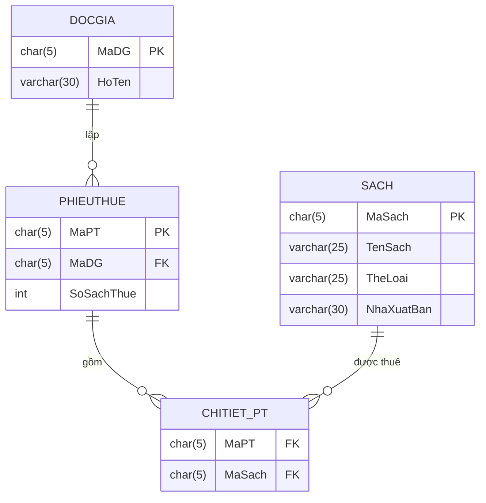
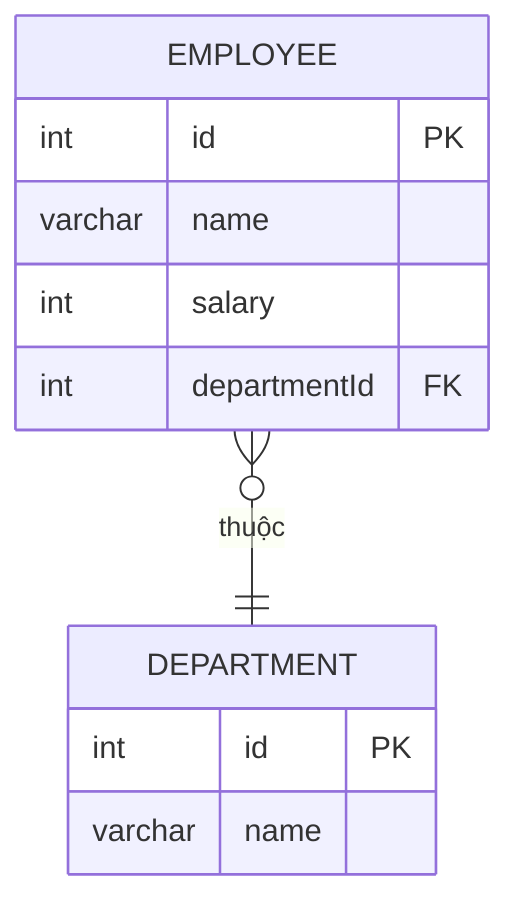

Trong SQL không có phép chia, ta phải thực hiện phép chia bằng ý tưởng như sau:
1. **Ý tưởng 1: Dùng `GROUP BY` và `HAVING`**: Với mỗi khách hàng, đếm xem số lượng sản phẩm khách hàng đó mua có bằng với số lượng sản phẩm trong kho không.
2. **Ý tưởng 2: Dùng phủ định 2 lần**: Không tồn tại sản phẩm mà khách hàng không mua.

Trong bài viết này, ta sẽ dùng ý tưởng 1 do nó đỡ rối não và giải quyết được nhiều bài toán mở rộng của phép chia.

>[!important] Một vài chú ý khi dùng phép chia
>- Khi dùng agreeate function (`COUNT`, `MAX`, ...) -> Cần `GROUP BY` -> Chỉ `SELECT` được các thuộc tính đã `GROUP BY`.
>- Cần dùng `COUNT(DISTINCT ...)` để đếm số lượng sản phẩm, giúp tránh được trường hợp 1 khách hàng mua 1 sản phẩm nhiều lần.

**VD**: Cho cơ sở dữ liệu *quản lý mượn sách* như sau:


---
**\[Cơ bản]**: Tìm các độc giả (`MaDG`, `HoTen`) đã mượn *tất cả **thể loại sách***.

- **Bước 1**: Lấy ra tổng số lượng thể loại sách:
```sql
SELECT COUNT(DISTINCT TheLoai)
FROM SACH
```

- **Bước 2**: Với mỗi độc giả, kiểm tra xem có mượn đúng số lượng thể loại sách không:
```sql
SELECT dg.MaDG, dg.HoTen
FROM DOCGIA dg
JOIN PHIEUTHUE pt ON pt.MaDG = dg.MaDG
JOIN CHITIET_PT ct ON ct.MaPT = pt.MaPT
JOIN SACH s ON s.MaSach = ct.MaSach
GROUP BY dg.MaDG, dg.HoTen
HAVING COUNT(DISTINCT s.TheLoai) = (
	SELECT COUNT(DISTINCT TheLoai)
	FROM SACH
)
```

---
**\[Cơ bản]**: Tìm các độc giả (`MaDG`, `HoTen`) đã mượn *nhiều **thể loại sách** nhất*.

Thật ra bài này không phải phép chia, chỉ cần `GROUP BY`, `ORDER BY DESC` rồi `SELECT TOP 1 WITH TIES` là được.

```sql
SELECT TOP 1 WITH TIES dg.MaDG, dg.HoTen
FROM DOCGIA dg
JOIN PHIEUTHUE pt ON pt.MaDG = dg.MaDG
JOIN CHITIET_PT ct ON ct.MaPt = pt.MaPT
JOIN SACH s ON s.MaSach = ct.MaSach
GROUP BY dg.MaDG, dg.HoTen
ORDER BY COUNT(DISTINCT s.TheLoai) DESC
```


---
**\[Cơ bản]**: Tìm các độc giả (`MaDG`, `HoTen`) đã mượn *tất cả **sách** thuộc thể loại `'A'` và `'B'`*.

- **Bước 1**: Lấy ra các độc giả đã mượn tất cả sách thuộc thể loại `'A'` (tương tự với `'B'`):
```sql
SELECT dg.MaDG, dg.HoTen
FROM DOCGIA dg
JOIN PHIEUTHUE pt ON pt.MaDG = dg.MaDG
JOIN CHITIET_PT ct ON ct.MaPT = pt.MaPT
JOIN SACH s ON s.MaSach = ct.MaSach
WHERE s.TheLoai = 'A'
GROUP BY dg.MaDG, dg.HoTen
HAVING COUNT(DISTINCT s.MaSach) = (
    SELECT COUNT(*)
    FROM SACH
    WHERE TheLoai = 'A'
)
```

- **Bước 2**: Lấy phần giao giữa 2 tập trên:
```sql
(
	SELECT dg.MaDG, dg.HoTen
	FROM DOCGIA dg
	JOIN PHIEUTHUE pt ON pt.MaDG = dg.MaDG
	JOIN CHITIET_PT ct ON ct.MaPT = pt.MaPT
	JOIN SACH s ON s.MaSach = ct.MaSach
	WHERE s.TheLoai = 'A'
	GROUP BY dg.MaDG, dg.HoTen
	HAVING COUNT(DISTINCT s.MaSach) = (
	    SELECT COUNT(*)
	    FROM SACH
	    WHERE TheLoai = 'A'
	)
)
INTERSECT
(
	-- Tương tự với TheLoai = 'B'
)
```

---
**\[Nâng cao]**: Ở mỗi **thể loại sách** (`TheLoai`), cho biết ***sách** (`MaSach`, `TenSach`) được mượn nhiều nhất*.

- **Bước 1**: Giả sử biết trước thể loại `'x'`, tìm các mã sách được mượn nhiều nhất:
```sql
SELECT TOP 1 WITH TIES s.MaSach
FROM SACH s
JOIN CHITIET_PT ct ON ct.MaSach = s.MaSach
JOIN PHIEUTHUE pt ON pt.MaPT = ct.MaPT
WHERE s.TheLoai = 'x'
GROUP BY s.MaSach
ORDER BY SUM(pt.SoSachThue) DESC
```

- **Bước 2**: Truyền vào truy vấn trên giá trị thực của `'x'`:
```sql
SELECT s1.TheLoai, s1.MaSach, s1.TenSach
FROM SACH s1
WHERE s1.MaSach IN (
	SELECT TOP 1 WITH TIES s.MaSach
	FROM SACH s
	JOIN CHITIET_PT ct ON ct.MaSach = s.MaSach
	JOIN PHIEUTHUE pt ON pt.MaPT = ct.MaPT
	WHERE s.TheLoai = s1.TheLoai
	GROUP BY s.MaSach
	ORDER BY SUM(pt.SoSachThue) DESC
)
```

>[!note]
>Bạn vẫn có thể **đếm số lượng `MAX` của sách được thuê nhiều nhất rồi so sánh với `COUNT` (cần `GROUP BY s.MaSach`)** thay vì lấy danh sách `MaSach`.

---
**\[Nâng cao]**: Ở mỗi department, lấy ra các nhân viên có mức lương thuộc *top 3 mức lương cao nhất khác nhau* (lấy ra `DEPARTMENT.name`, `EMPLOYEE.name`, `salary`):



- **Bước 1**: Cho trước `departmentId`, ta cần biết xem top 3 salary của department đó là gì (chỉ cần định danh bằng ID)?
- **Bước 2**: Với mỗi nhân viên, kiểm tra xem salary có thuộc danh sách top 3 như trên không?

```sql
SELECT
    d.name AS Department,
    e.name AS Employee,
    e.salary AS Salary
FROM DEPARTMENT d
JOIN Employee e ON d.id = e.departmentId
WHERE e.salary IN (
    SELECT DISTINCT TOP 3 salary
    FROM EMPLOYEE e2
    WHERE e2.departmentId = d.id
    ORDER BY salary DESC
)
```

>[!question] Dùng `SELECT TOP 3 WITH TIES` ... `ORDER BY salary DESC` có được không
>Không. Giả sử 3 nhân viên có lượng cao nhất có cùng số lương -> Sai yêu cầu bài.


