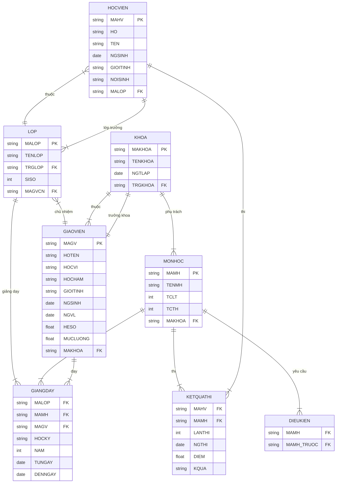

Cho database:



**Ngày thi của lần thi sau phải lớn hơn ngày thi của lần thi trước.**

```sql
CREATE TRIGGER NGTHI_KQTHI_TRG
ON KETQUATHI
FOR INSERT, UPDATE
AS
BEGIN
	IF EXISTS (
		-- Ngày thi hiện tại của học viên
		SELECT 1
		FROM inserted I
		-- Ngày thi của lần thi trước
		JOIN KETQUATHI KQT ON
			KQT.MAHV = I.MAHV AND
			KQT.MAMH = I.MAMH AND
			KQT.LANTHI + 1 = I.LANTHI
		-- Điều kiện trigger: Nếu Ngày thi hiện tại <= ngày thi trước thì sai
		WHERE I.NGTHI <= KQT.NGTHI
	)
	BEGIN
		ROLLBACK TRAN
	END
END
```

**Khi phân công một môn học, chỉ được phân công một môn mà lớp đó đã học môn học trước.**

```sql
CREATE TRIGGER MHTRUOC_GIANGDAY_TRG
ON GIANGDAY
FOR INSERT, UPDATE
AS
BEGIN
	IF EXISTS (
		-- Môn học mà lớp sắp được học
		SELECT 1
		FROM inserted I
		-- Lấy môn học trước của môn này
		JOIN DIEUKIEN DK ON DK.MAMH = I.MAMH
		-- Điều kiện trigger: Nếu môn học trước này chưa được dạy cho lớp thì sai
		WHERE NOT EXISTS (
			SELECT 1
			FROM GIANGDAY GD
			WHERE
				GD.MALOP = I.MALOP AND
				GD.MAMH = DK.MAMH_TRUOC
		)
	)
	BEGIN
		ROLLBACK TRAN
	END
END
```

**Giáo viên chỉ được phân công dạy những môn thuộc khoa giáo viên đó phụ trách.**

```sql
CREATE TRIGGER MH_GIANGDAY_TRG
ON GIANGDAY
FOR INSERT, UPDATE
AS
BEGIN
	IF EXISTS (
		-- Môn mà giáo viên đó sắp được dạy
		SELECT 1
		FROM inserted I
		-- Khoa mà giáo viên đó dạy
		JOIN GIAOVIEN GV ON GV.MAGV = I.MAGV
		JOIN KHOA K ON K.MAKHOA = GV.MAKHOA
		-- Điều kiện trigger: Nếu môn học mà giáo viên đó dạy không nằm trong danh sách môn học khoa đó thì sai
		WHERE NOT EXISTS (
			-- Danh sách môn học của khoa đó
			SELECT MH.MAMH
			FROM MONHOC MH
			WHERE
				MH.MAKHOA = K.MAKHOA AND
				MH.MAMH = I.MAMH
				
		)
	)
	BEGIN
		ROLLBACK TRAN
	END
END
```


