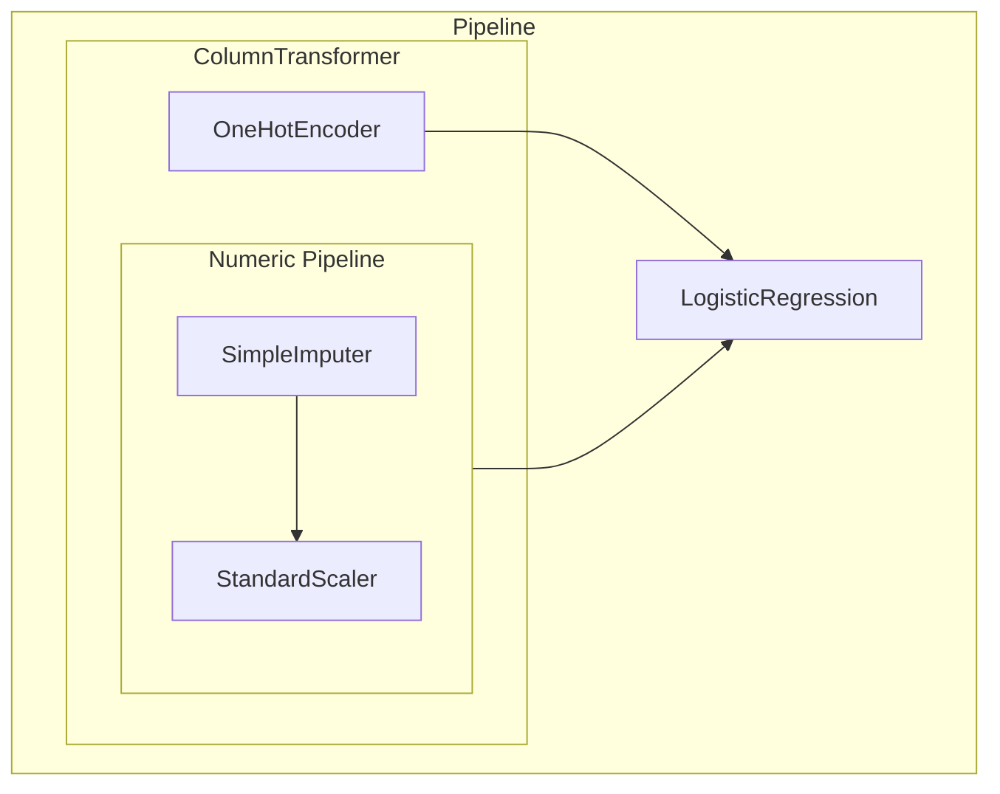

**Tài liệu tham khảo**:
- https://inria.github.io/scikit-learn-mooc/predictive_modeling_pipeline/predictive_modeling_module_intro.html.
- Machine Learning cơ bản, Vũ Hữu Tiệp, 2018.

```insta-toc
---
title:
  name: Mục lục
  level: 1
  center: false
exclude: ""
style:
  listType: number
omit: []
levels:
  min: 1
  max: 6
---

# Mục lục

1. Giới thiệu
2. Model training
    1. Tổng quan quy trình model training
    2. Transform
        1. Một vài phương thức chuẩn hóa dữ liệu số (numerical variables)
        2. Một vài phương thức chuẩn hóa dữ liệu danh mục (categorical variables)
    3. Pipeline
    4. Scoring
3. Training set / Testing set
```

# Giới thiệu

Chuỗi bài viết này sử dụng công cụ thực hành là **Scikit-learn** (`sklearn`). Đây là một Python module hỗ trợ các phương thức liên quan đến ML

**Cài đặt**:
```sh
pip install -U scikit-learn
```

Một mô hình học máy thực chất là một hàm số $f$ phản ánh mối quan hệ giữa dữ liệu đầu vào $X$ và dữ liệu đầu ra $Y$. Trong đó:
- $X$: Dataset dùng để training model (training dataset). $X$ thường là *tabular data*, tức là các record bao gồm các attributes, mỗi attribute còn được gọi là **feature**.
- $y$: Thuộc tính cần dự đoán từ dữ liệu $\hat{X}$, $\hat{y}=f(\hat{X})$.
- $f$: Là mô hình máy học, hoặc hàm phân phối xác suất của $Y$ theo $X$. Vì ta không thể nào biết chính xác $Y$ có xuất hiện hay không mà chỉ biết khả năng xuất hiện của nó, hay $Y\approx f(X)\approx P(Y|X)$.
- $w$: Trọng số của model, có được nhờ học từ dữ liệu $X$ nạp vào model. Khi ta nói "máy học", kết quả học tập chính là $w$. 
- **Hyperparameter**: Là tham số của model. Các hyperparameter khác nhau kết hợp với dataset $X$ khác nhau sẽ cho ra error khác nhau.

# Model training

Có 2 kiểu training model:
1. **Học có giám sát (Supervised learning)**: Cho model biết cả $X$ lẫn $y$.
2. **Học không giám sát (UnSupervised learning)**: Chỉ cho model biết $X$, model phải tự đoán $y$.

Ngoài ra còn các những kiểu training lai giữa supervised và unsupervised, tùy thuộc vào đặc điểm model và dataset.

## Tổng quan quy trình model training

1. **Preparing**:
	1. Chọn thuộc tính đích (thuộc tính cần dự đoán) (`y` / `target`).
	2. Chọn danh sách các thuộc tính feature (`X` / `data`).
	3. Tách `X` và `y` rời nhau (dùng `df.drop(columns=...)`).
2. **Transforming (nếu cần)**:
	1. Import các thuật toán chuẩn hóa (**estimator**) có sẵn trong `sklearn.preprocessing`.
	2. Dùng phương thức `.fit()` của estimator để trả về object chứa các tham số thống kê dành cho quá trình transform, còn gọi là **transformer**.
	3. Dùng phương thức `.transform()` để chuẩn hóa dataset (*nếu không đưa transform vào pipeline thì không cần dùng phương thức này*).
3. **Estimating**:
	1. Import các thuật toán training model (**estimator**) có sẵn trong module.
	2. Dùng phương thức `.fit()` của estimator để trả về object chứa các tham số thống kê dành cho quá trình predict, còn gọi là **predictor**.
4. **Predicting**:
	1. Định nghĩa estimator từ bước 3 hoặc kết hợp bước 2 và 3 trong pipeline.
	2. Dùng phương thức `.predict()` để dự đoán `y'` từ một dataset `X'` mới.

>[!quote] Tóm lại, quy trình tổng quan là
>1. Lấy preprocessing / model estimator.
>2. Dùng `.fit()` để lấy các tham số thống kê, bước này trả về transformer hoặc predictor.
>3. Dùng predictor `.predict()` để dự đoán trên dataset mới.

## Transform

**Preprocessing** (tiền xử lý) thường hướng đến việc hiệu chỉnh các giá trị số trong dataset (**scaling / normalize**). Đặc thù một số model và bài toán (yêu cầu) buộc ta (nên) phải hiệu chỉnh dataset trước khi training để có kết quả tốt nhất.

Các thuật toán preprocessing thông dụng nhất đã được sklearn hỗ trợ sẵn.
Xem [danh sách các phương thức của `sklearn.preprocessing`](https://scikit-learn.org/stable/api/sklearn.preprocessing.html).

VD:
```python
from sklearn.preprocessing import StandardScaler

scaler = StandardScaler()
scaler.fit(data_train) # Xây dựng transformer

scaler.mean_  # Trung bình của dataset
scaler.scale_ # Hệ số scale

scaler.transform(data_train) # Chuẩn hóa dữ liệu
```

Cú pháp tắt của `.fit` và `.transform` là `.fit_transform`:
```python
scaler.fit_transform(data_train)
```

>[!note] Quy ước của Sklearn
>Các thuộc tính có phần hậu tố `_` là thu được sau khi `.fit()` (khảo sát các tham số thống kê).

#### Một vài phương thức chuẩn hóa dữ liệu số (numerical variables)

**`sklearn.preprocessing.StandardScaler`**:
- Đưa các thuộc tính về cùng một phân phối chuẩn có độ lệch chuẩn là 1 và trung bình là 0.
- **Nhược điểm**:
	- Do sử dụng trung bình làm chuẩn quy đổi nên thuật toán rất nhạy cảm với các outlier.
	- Do thuật toán cố gắng đưa về phân phối chuẩn nên sẽ không phù hợp với các dữ liệu có phân phối không chuẩn.
- **Công thức**: $$x'=\frac{x-\text{mean}\;X}{\text{stdDev}\;X}$$


**`sklearn.preprocessing.RobustScaler`**:
- Giống như sự cải tiến của `StandardScaler` vì nó sử dụng trung vị và khoảng phân vị giữa làm chuẩn để quy đổi.
- **Nhược điểm**: Robus scaler đảm bảo scaler không bị ảnh hưởng nhiều bởi các outlier chứ vẫn không sửa được hình dáng phân phối, nên vẫn không phù hợp với các phân phối không chuẩn.
- **Công thức**: $$x'=\frac{x-\text{median}\;X}{Q_3-Q_1}$$, với $Q_3-Q_1$ là khoảng phân vị giữa (*25% -  75%*).

**`sklearn.preprocessing.MinMaxScaler`**:
- Đưa tất cả giá trị về khoảng $(0;1)$ (*nếu dataset không chứa giá trị âm*) hay $(-1;1)$ (*nếu dataset chứa giá trị âm*).
- **Nhược điểm**:
	- Nhạy cảm với các outlier.
	- Làm sai lệch dataset nếu model gặp dataset mới với giá trị min, max mới.
- **Công thức**: $$x'=\frac{x-\min{X}}{\max{X}-\min{X}}$$

**`sklearn.impute.SimpleImputer`**: Xử lý các giá trị đặc biệt. Có một số tham số sau:
- `missing_values`: Những giá trị sẽ bị thay thế.
- `strategy`: Chiến lược thay thế dữ liệu:
	- `'mean'`: Thay bằng giá trị trung bình. Tương tự với `'median'` và `'most_frequent'`.
	- `'constant'`: Thay bằng giá trị hằng số. Khi đó phải truyền thêm đối số cho tham số `'fill_value'`.

#### Một vài phương thức chuẩn hóa dữ liệu danh mục (categorical variables)

>[!note]
>Mỗi category còn được gọi là **class**.

**`sklearn.preprocessing.OrdinalEncoder`**:
- Toàn bộ categories sẽ được mapping thành một dãy số nguyên có thứ tự.
- Quy ước mapping được thể hiện qua tham số `categories` (*là 1 danh sách mà phần tử thứ `i` sẽ được mapping thành giá trị `i`*).
- Sau khi `.fit()`, bạn có thể kiểm tra lại bảng mapping giữa giá trị gốc và số qua thuộc tính transformer `categories_`.
- **Nhược điểm**: Nếu không xử lý `categories` đúng cách, model dễ đưa ra các dự đoán sai vì nhầm tưởng các category đang theo 1 thứ tự nào đó, dù thực tế có thể không (*downstream model*).

**`sklearn.preprocessing.OneHotEncoder`** (*Norminal*):
- One-hot encoder là một giải pháp cải tiến của ordinal encoder.
- Mỗi giá trị trong danh mục sẽ được chuyển thành 1 cột tương ứng (**one-hot vector**). Với mỗi đối tượng, nếu nó thuộc danh mục ứng với cột này thì sẽ bật bit `1`, ngược lại là `0`.
- **Nhược điểm**: Trong nhiều trường hợp, các one-hot vector sẽ tạo thành *ma trận thưa (sparse matrix)*, gây lãng phí bộ nhớ.

| Ordinal encoder          | One-hot encoder          |
| ------------------------ | ------------------------ |
|  |  |

>[!note]
>- Không phải lúc nào cũng nên áp dụng các dữ liệu có tính thứ tự cho ordinal encoder, hay tương tự với one-hot encoder.
>- Khi sử dụng các encoder trên, cần cân nhắc thiệt hơn giữa ưu - nhược điểm các encoder so với dataset hiện có.

## Pipeline

**Pipeline** là kết nối transformer và estimator lại với nhau thành một estimator mới.

Có 2 loại pipeline:
- `sklearn.pipeline.make_pipeline`:
	- Thực hiện **tuần tự** từng transformer.
	- Khi truyền 1 estimator vào pipeline thì pipeline sẽ trả về estimator. Nếu chỉ truyền vào transformer thì pipeline sẽ trả về transformer.
	- `make_pipeline` là wrapper của `Pipeline`. Sklearn cho phép bạn đặt tên từng transformer khi sử dụng constructor `Pipeline`.
- `sklearn.compose.make_column_transformer`: Thực hiện **song song** từng transformer, thường dùng cho categorical transformer.

*VD*:
```python
from sklearn.compose import make_column_transformer
from sklearn.pipeline import make_pipeline

# Các numeric transformers
numeric_transformer = make_pipeline(
    SimpleImputer(strategy="median"),
    StandardScaler()
)

# (Các) categorical transformer(s)
categorical_transformer = OneHotEncoder(handle_unknown="ignore")

# Thực hiện song song 2 transformer trên
preprocessor = make_column_transformer(
    (numeric_transformer, numeric_features),
    (categorical_transformer, categorical_features),
)

# Xây dựng estimator
model = make_pipeline(
	preprocessor,
	LogisticRegression()
)

# Xây dựng predictor
model.fit(data, target)

# model.predict(...)
```



## Scoring

Đánh giá chất lượng model thông qua các chỉ báo (`sklearn.metrics`), mỗi loại model sẽ có các chỉ báo riêng, gọi chung là **hàm mất mát (Loss function) / hàm chi phí (Cost function) / hàm đánh giá (Scoring function)**. Nhìn chung thì các hàm này đều thể hiện **sai số (error)** giữa kết quả mà mô hình trả về so với kết quả chính xác thực tế.

**Ký hiệu**: $\mathcal{L}(y,\hat{y})$.

Mục tiêu của model training đó là **làm sao cho loss-function nhỏ nhất**. Tức là:
$$f(X,y,w):w=\arg\min_w\mathcal{L}(y,\hat{y})$$


Chúng ta sẽ tìm hiểu cụ thể về các chỉ báo đo sai số ở từng model cụ thể.

>[!quote]
>**Error không bao giờ là 0** -> Mọi model đều chỉ có thể chính xác hơn 1 model khác chứ không thể chính xác hoàn toàn.
>Nó là sự đánh đổi giữa độ linh hoạt của mô hình (**model flexibility**) và kích thước của dữ liệu nguồn dùng để huấn luyện (**size of the training set**).

# Training set / Testing set

Thông thường, khi training model, dữ liệu sẽ được chia thành hai phần riêng biệt: **tập huấn luyện (training set)** và **tập kiểm thử (testing set / validation set)**.
- Tập huấn luyện được dùng để tìm các tham số mô hình.
- Tập kiểm thử được dùng để đánh giá năng lực của mô hình tìm được.

Lưu ý:
- Khi tìm các tham số mô hình, ta chỉ được dùng các thông tin trong tập huấn luyện.
- Việc đánh giá có thể được áp dụng lên cả hai tập hợp.
- Muốn mô hình thực hiện tốt trên tập kiểm thử thì nó trước hết phải hoạt động tốt trên tập huấn luyện.

Scikit-learn cung cấp hàm `train_test_split` cho phép chia 1 dataset thành 2 phần (training set và validation set):

```python
from sklearn.model_selection import train_test_split

train_X, val_X, train_y, val_y = train_test_split(X, y, random_state=None)
```
Trong đó, `random_state` quy định seed ngẫu nhiên khi chia 2 tập dữ liệu. Nếu là `None` thì 2 tập sẽ giống nhau hoàn toàn dù chạy lệnh trên bao nhiêu lần đi nữa. Thường thì `random_state=42`.

Có 2 loại learning:
1. **Online learning**: Dữ liệu huấn luyện sẽ được bổ sung liên tục, là tập kiểm thử ở giai đoạn đầu và sau đó trở thành tập huấn luyện.
2. **Offline learning**: Dữ liệu có tính cố định.
