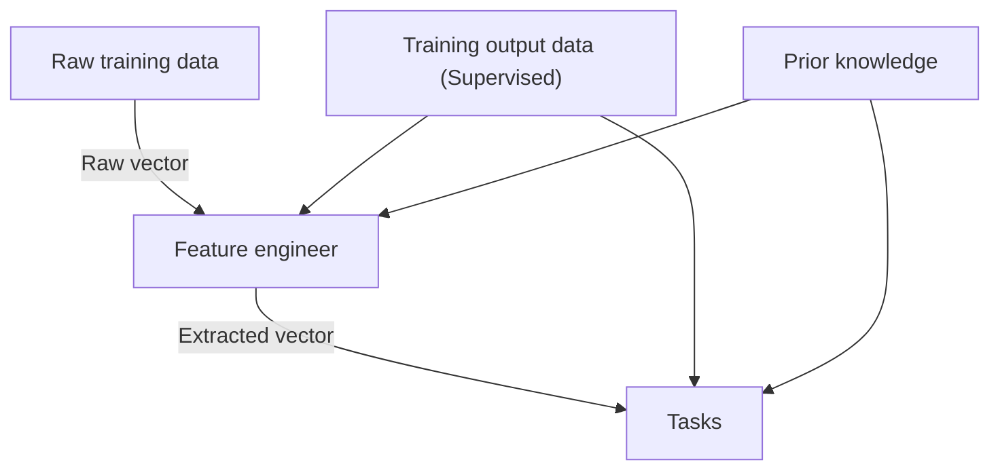

Bài đọc trước: [[Xác suất và Thống kê]].

```insta-toc
---
title:
  name: Mục lục
  level: 1
  center: false
exclude: ""
style:
  listType: number
omit: []
levels:
  min: 1
  max: 6
---

# Mục lục

1. Nhiệm vụ
    1. Classification
    2. Regression và Completion
    3. Clustering
2. Phép đánh giá
3. Kinh nghiệm
4. Hàm mất mát (Loss/Cost function) và Tham số mô hình (Model parameters)
5. Mô hình chung cho các bài toán machine learning
```

Một chương trình máy tính được gọi là học từ kinh nghiệm E để hoàn thành nhiệm vụ T, với hiệu quả được đo bằng phép đánh giá P.

# Nhiệm vụ

Các nhiệm vụ trong machine learning thường được mô tả thông qua việc hệ thống machine learning đó xử lý một **điểm dữ liệu (data point)** như thế nào.

VD:
- Trong bài toán phân loại ảnh, mỗi ảnh là một điểm dữ liệu.
- Trong bài toán phân nhóm khách hàng, mỗi khách hàng là một điểm dữ liệu.
- Trong bài toán xác định một tin nhắn có là rác hay không, mỗi tin nhắn là một điểm dữ liệu.

Mỗi điểm dữ liệu bao gồm nhiều **đặc trưng (feature)** khác nhau, mỗi feature thường được biểu diễn dưới dạng một con số. Chúng ta thường biểu diễn một điểm dữ liệu như một vector $x \in \mathbb{R}^d$ trong đó mỗi phần tử $x_i$ là một đặc trưng, vector này thường được gọi là **vector đặc trưng (Feature vector)**.

VD: Trong một bức ảnh, mỗi giá trị của một điểm ảnh có thể coi là một đặc trưng, vector chứa toàn bộ giá trị các pixel của ảnh có thể coi là một vector đặc trưng.

## Classification

Xây dựng một hàm số gắn nhãn  $y = f(x): \mathbb{R}^d \rightarrow \{1, 2, ... , C\}$, với:
- $x$ là điểm dữ liệu đầu vào.
- $y = f(x)$ là một giá trị thuộc tập ${1, 2, ..., C}$, thể hiện cho một **nhãn (label)** hay **lớp (class)** phân loại cho điểm dữ liệu $x$.

Có một biến thể nhỏ ở đầu ra của hàm gắn nhãn khi đầu ra không phải là một số mà là một vector, $y:\mathbb{R}^d \rightarrow \mathbb{R}^C$, trong đó:
- $y_c$ chỉ ra xác suất để điểm dữ liệu $x$ rơi vào lớp thứ $c$.
- Lớp được chọn cuối cùng là lớp có xác suất rơi vào là cao nhất.

Việc sử dụng xác suất này đôi khi rất quan trọng, nó giúp chỉ ra **độ chắc chắn (confidence)** của mô hình.
- Nếu xác suất cao nhất là cao hơn nhiều so với các xác suất còn lại, ta nói mô hình có độ chắn chắn là cao khi phân lớp điểm dữ liệu $x$.
- Ngược lại thì khả năng mô hình đã phân loại nhầm là cao hơn.

## Regression và Completion

**Regession**: Xây dựng một hàm số hồi quy $y = f(x): \mathbb{R}^d \rightarrow \mathbb{R}^m$, với:
- $x$ là điểm dữ liệu đầu vào.
- $y = f(x)$ là một giá trị được ước lượng.

**Completion**: Cho một tập điểm dữ liệu , completion là điền vào những điểm trống trong tập dữ liệu đó.

Điểm khác nhau giữa regression và completion chủ yếu là ở điểm dữ liệu đầu vào:
- Regession xử lý các điểm dữ liệu số học, có tính liên tục.
- Completion xử lý các điểm dữ liệu phi số học, có tính ngữ nghĩa.

## Clustering

Cho một tập điểm dữ liệu $X$, phân cụm là dựa trên sự tương đồng giữa các điểm trong tập này mà phân chia chúng thành các cụm nhỏ hơn.

# Phép đánh giá

Thông thường, khi thực hiện một thuật toán machine learning, dữ liệu sẽ được chia thành hai phần riêng biệt: **tập huấn luyện (training set)** và **tập kiểm thử (test set)**.
- Tập huấn luyện được dùng để tìm các tham số mô hình.
- Tập kiểm thử được dùng để đánh giá năng lực của mô hình tìm được.

Lưu ý:
- Khi tìm các tham số mô hình, ta chỉ được dùng các thông tin trong tập huấn luyện.
- Việc đánh giá có thể được áp dụng lên cả hai tập hợp.
- Muốn mô hình thực hiện tốt trên tập kiểm thử thì nó trước hết phải hoạt động tốt trên tập huấn luyện.

Có 2 loại learning:
1. **Online learning**: Dữ liệu huấn luyện sẽ được bổ sung liên tục, là tập kiểm thử ở giai đoạn đầu và sau đó trở thành tập huấn luyện.
2. **Offline learning**: Dữ liệu có tính cố định.

# Kinh nghiệm

Việc huấn luyện các mô hình machine learning có thể coi là việc cho chúng trải nghiệm trên các **tập dữ liệu (dataset)**, chính là training set.
- Các tập dữ liệu khác nhau sẽ cho các mô hình các trải nghiệm khác nhau.
- Chất lượng của các tập dữ liệu ảnh hưởng tới hiệu năng của mô hình.

Dựa trên tính chất của các tập dữ liệu, các thuật toán machine learning có thể phân loại thành 2 loại chính:
1. **Học có giám sát (Supervised learning)**: Là các thuật toán dự đoán đầu ra của một hoặc nhiều dữ liệu mới dựa trên các *cặp (đầu vào, đầu ra) đã biết từ trước*.
2. **Học không giám sát (Unsupervised learning)**: Là các thuật toán mà đầu vào chỉ có các vector đặc trưng. Các mô hình sẽ dựa vào cấu trúc của dữ liệu đó để thực hiện một công việc nào đó.
3. **Học củng cố (Reinforcement learning)**: Là các thuật toán mà mô hình không được huấn luyện từ một tập dữ liệu cụ thể. Dữ liệu liên tục được cập nhật và hệ thống phải dùng các dữ liệu đó để tính toán. Việc một hệ thống tự học tập từ chính nó cũng được coi là reinforcement.

# Hàm mất mát (Loss/Cost function) và Tham số mô hình (Model parameters)

Mỗi mô hình machine learning được mô tả bởi các **tham số mô hình** ($\theta$). Công việc của một thuật toán machine learning là đi tìm các tham số mô hình phù hợp sao cho các phép đánh giá cho kết quả tốt nhất.

Quan hệ giữa một phép đánh giá và các tham số mô hình thường được mô tả thông qua một **hàm mất mát** ($\mathcal{L}(\theta)$). Hàm mất mát này thường *có giá trị nhỏ khi phép đánh giá cho kết quả tốt* và ngược lại.

Như vậy, machine learning chính là giải một bài toán sao cho hàm mất mát tối thiểu:
$$\theta^* = \arg\min_\theta\mathcal{L}(\theta)$$

# Mô hình chung cho các bài toán machine learning



Trong đó:
- **Raw training data (Input)**: Là dữ liệu thô đầu vào, dùng để huấn luyện thuật toán.
- **Training output data**: Là dữ liệu đầu ra mẫu tương ứng với dữ liệu đầu vào.
- **Prior knowledge**: Các thông tin khác đã biết về loại dữ liệu (*ngoài những thông tin về raw input và output*).
- **Feature engineer (Feature extraction)**: Là biến đổi dữ liệu thô thành các feature vector có kích thước như nhau.


