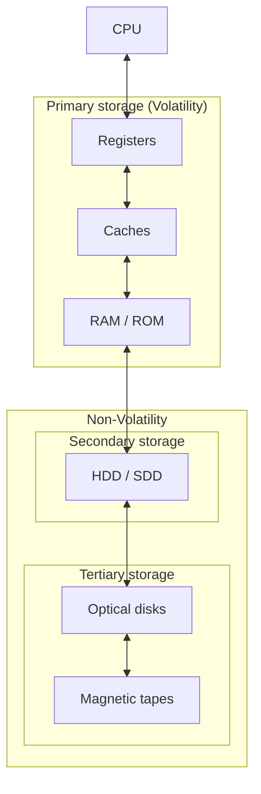
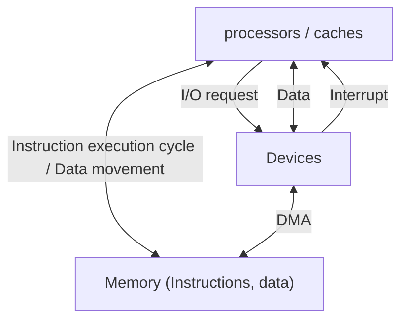
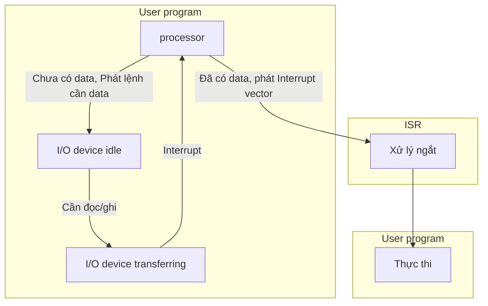
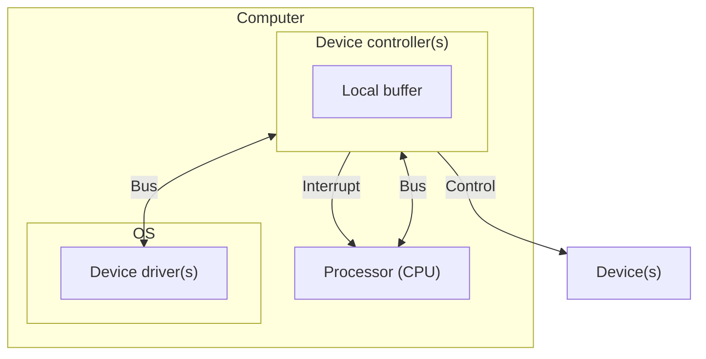
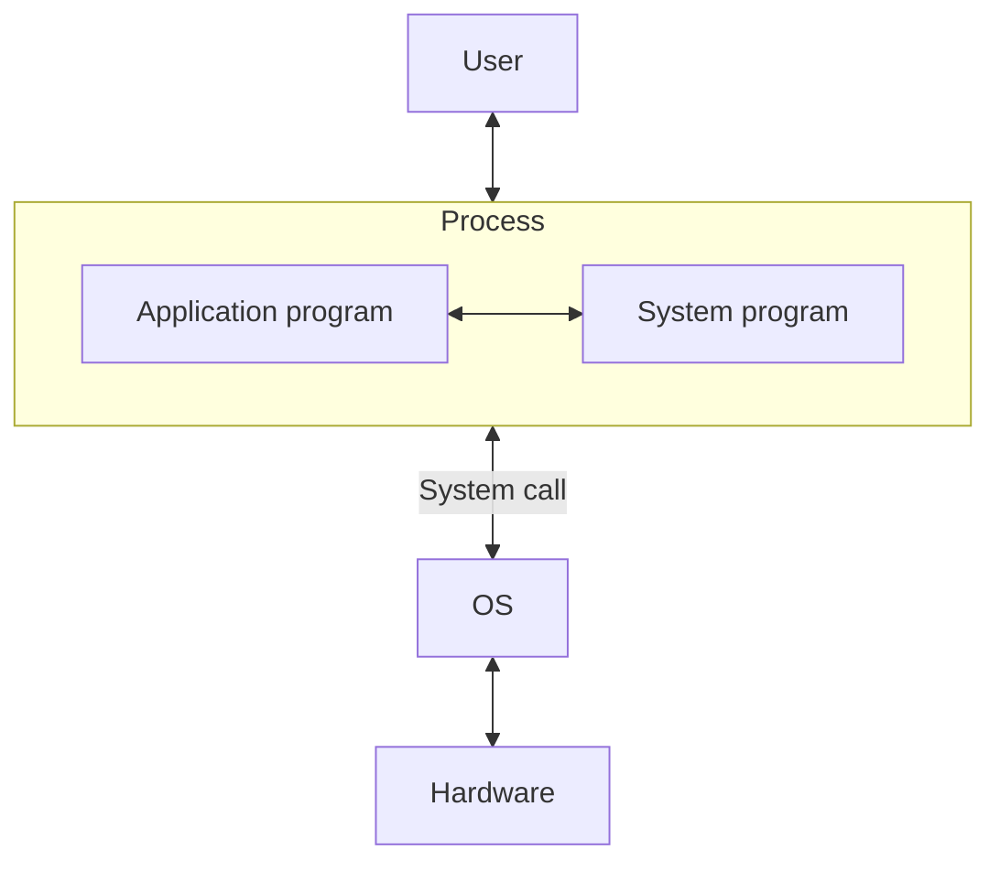

```insta-toc
---
title:
  name: Mục lục
  level: 1
  center: false
exclude: ""
style:
  listType: number
omit: []
levels:
  min: 1
  max: 6
---

# Mục lục

1. Tổ chức & Cấu trúc máy tính
    1. Phân loại hệ thống máy tính theo processor
    2. Phân loại hệ thống máy tính theo process
    3. Cấu trúc lưu trữ phân cấp (Storage hierarchy)
    4. Kiến trúc Von Neumann
        1. Đặc điểm
        2. Instruction execution cycle
    5. Ngắt (Interrupt)
        1. Đặc điểm
        2. Quy trình phát sinh & xử lý ngắt
2. Tổng quan về OS
    1. Định nghĩa OS
    2. Các thành phần của OS
3. Hoạt động của OS
    1. Các chương trình bên trong OS
    2. Processors và Device controllers
4. Các dịch vụ của OS
    1. Các dịch vụ cơ bản
    2. Lời gọi hệ thống (System call)
5. Phân loại kiến trúc OS
6. Chế độ hoạt động
```

# Tổ chức & Cấu trúc máy tính

## Phân loại hệ thống máy tính theo processor

| Đơn bộ xử lý<br>Uniprocessor system                                      | Đa bộ xử lý<br>Multiprocessor system<br>Parallel system                                                                                                                                                                                                | Gom cụm<br>Clustered system                                                                                                                    |
| ------------------------------------------------------------------------ | ------------------------------------------------------------------------------------------------------------------------------------------------------------------------------------------------------------------------------------------------------ | ---------------------------------------------------------------------------------------------------------------------------------------------- |
| Chỉ có **1 processor đa dụng** hoặc kèm theo *vài processor riêng biệt*. | Có nhiều processor trong hệ thống.<br><br>Có 1 processor **master** điều phối các processor khác, không thực thi mã người dùng.<br><br>Cần **cân bằng tải (Load balacing)** để cân bằng *khối lượng công việc của các processor* (Processor affinity). | Là một dạng đa bộ, nhưng gồm nhiều máy tính độc lập (node) làm việc với nhau, kết nối qua mạng.<br><br>Người dùng chỉ thao tác với 1 máy tính. |
|                                                                          | **Bất đối xứng,<br>Asymmetric Multiprocessing,<br>AMP**:<br>Mỗi processor thực hiện 1 việc riêng.                                                                                                                                                      | **Bất đối xứng,<br>Asymmetric Clustering,<br>ACP**:<br>1 node hot-standby/slave, các node còn lại chạy ứng dụng.                               |
|                                                                          | **Đối xứng,<br>Symmetric Multiprocessing,<br>SMP**:<br>Mọi processor cùng làm 1 việc.                                                                                                                                                                  | **Đối xứng,<br>Symmetric Clustering,<br>SCP<br>Distributed system**:<br>Các node cùng chạy & giám sát lẫn nhau.                                |

>[!note]
>- **Đối xứng**: Các processor **khác** nhau.
>- **Bất đối xứng**: Các processor **giống** nhau.

## Phân loại hệ thống máy tính theo process

| Đơn chương<br>Uniprogramming                                                                             | Đa chương<br>Multiprogramming                                                                                                    | Đa nhiệm<br>Multitasking                                                                                   |
| -------------------------------------------------------------------------------------------------------- | -------------------------------------------------------------------------------------------------------------------------------- | ---------------------------------------------------------------------------------------------------------- |
| - Các process được nạp **tuần tự** vào bộ nhớ.<br><br>- Tại 1 thời điểm, chỉ có 1 process được thực thi. | - Các process được nạp **đồng thời** vào bộ nhớ.<br><br>- Tại một thời điểm, CPU luôn có thể chọn ít nhất 1 process để thực thi. | Là mở rộng của đa chương. **Processor chuyển công việc thường xuyên**.                                     |
| - Không cần định thời.<br>- Cần đảm bảo an toàn dữ liệu.                                                 | - Cần định thời.<br>- Cần quản lý bộ nhớ tốt.<br>- Cần cơ chế đồng bộ và quản lý I/O.                                            | - Cần định thời phức tạp, công bằng, nhanh.<br>- Cần tốc độ xử lý nhanh để đáp ứng trải nghiệm người dùng. |

## Cấu trúc lưu trữ phân cấp (Storage hierarchy)

Hệ thống lưu trữ được tổ chức phân cấp dựa trên:
1. **Tốc độ truy xuất** (speed).
2. **Chi phí** (cost).
3. **Có thể lưu trữ dữ liệu khi không có nguồn điện**:
	1. **Volatility**: Chỉ có thể lưu trữ chỉ khi có điện.
	2. **Non-volatility**: Có thể lưu trữ khi không có điện.



Càng gần CPU:
- Tốc độ truy xuất càng cao.
- Chi phí càng cao.
- Dung lượng càng nhỏ.

>[!warning]
>Chú ý rằng đây chỉ là **mô hình lý thuyết**, không phải thực tiễn.

## Kiến trúc Von Neumann

### Đặc điểm

- Bộ nhớ chung chứa cả lệnh (instructions) và dữ liệu (data).
- Processor (bao gồm ALU, CU, registers, cache) thực hiện chu trình:
	- Lấy lệnh (fetch) từ bộ nhớ.
	- Giải mã lệnh (decode).
	- Thực thi lệnh (execute).
- Thiết bị I/O giao tiếp với processor thông qua I/O request, data, và interrupt.

### Instruction execution cycle

Gồm 3 bước:
1. **Fetch**: lấy lệnh từ bộ nhớ vào cache/thanh ghi.
2. **Decode**: giải mã lệnh.
3. **Execute**: thực hiện (có thể là tính toán hoặc yêu cầu I/O).

Trong quá trình này, processor cũng cần **Data movement**: lấy hoặc ghi dữ liệu từ bộ nhớ.

Khi chương trình cần I/O: Thực hiện quy trình phát sinh và xử lý ngắt như trên.

Để tăng tốc, nhiều hệ thống dùng **DMA (Direct Memory Access, Truy cập bộ nhớ trực tiếp)**. Thay vì thiết bị gửi dữ liệu -> processor -> Memory (tốn processor), thiết bị có thể chuyển thẳng dữ liệu vào Memory.




## Ngắt (Interrupt)

### Đặc điểm

**Interrupt** là **tín hiệu (Signal)** gửi tới processor để báo rằng có một sự kiện cần được xử lý ngay, tạm dừng chương trình đang chạy để nhảy sang thực hiện một đoạn chương trình đặc biệt gọi là **Interrupt Service Routine (ISR)** thông qua **Interrupt vector** (chứa địa chỉ của tất cả các service routine).
- Kiến trúc ngắt phải lưu địa chỉ của lệnh phát sinh ngắt.
- Ngắt được tạo ra bởi phần mềm do một lỗi (error) hoặc do một yêu cầu của người dùng (user request) được gọi là trap hoặc exception.
- Hệ điều hành hoạt động định hướng theo ngắt (interrupt driven).

### Quy trình phát sinh & xử lý ngắt

1. **Ban đầu**:
	1. Processor đang thực thi user program.
	2. I/O device chưa truyền dữ liệu (trạng thái **idle**).

2. **Phát sinh yêu cầu I/O**:
	1. User program cần đọc/ghi dữ liệu nên phát lệnh I/O request.
	2. I/O device chuyển từ idle sang **transferring** (bắt đầu truyền dữ liệu).
	3. **Chú ý rằng processor vẫn tiếp tục chạy user program (không phải chờ thiết bị)**.

3. **Hoàn tất truyền dữ liệu**:
	1. Sau khi I/O device hoàn tất công việc (ví dụ đọc/ghi xong), nó gửi tín hiệu báo hiệu (interrupt request) đến processor.

4. **Tín hiệu ngắt (interrupt signaled)**:
	1. processor nhận tín hiệu ngắt từ I/O device.
	2. processor tạm dừng user program.

5. **Xử lý ngắt (interrupt handled)**:
	1. processor chuyển sang *chế độ đặc quyền (kernel mode)* để chạy chương trình xử lý ngắt (Interrupt Service Routine – ISR).

6. **Trở lại user program**:
	1. Quay lại trạng thái ban đầu



----

# Tổng quan về OS

## Định nghĩa OS

**Hệ điều hành (Operating system)**:
1. Chương trình trung gian giữa phần cứng máy tính và người sử dụng.
2. Chức năng: **Quản lý và điều phối** việc sử dụng tài nguyên (phần cứng).

Mục tiêu:
1. Giúp người dùng dễ dàng sử dụng hệ thống.
2. Quản lý và cấp phát tài nguyên hệ thống một cách hiệu quả.

## Các thành phần của OS

Gồm 7 thành phần:

| Thành phần                                                 | Giới thiệu                                                                                                                                                                         | Nhiệm vụ                                                                                                                                                                                                |
| ---------------------------------------------------------- | ---------------------------------------------------------------------------------------------------------------------------------------------------------------------------------- | ------------------------------------------------------------------------------------------------------------------------------------------------------------------------------------------------------- |
| **Quản lý process (CPU)**                                  | [[2. Tiến trình & Tiểu trình#Khái niệm process\|Tiến trình (Process)]] là chương trình (Program) đang chạy.<br><br>Cần có:<br>- **CPU và Bộ nhớ**.<br>- Files.<br>- I/O devices... | - **Tạo** & **Hủy** process.<br><br>- **Tạm dừng** / **Thực thi tiếp** process.<br><br>- **Đồng bộ** hoạt động các process.<br><br>- **Giao tiếp** giữa các process.<br><br>- Khống chế **tắc nghẽn**.  |
| **Quản lý bộ nhớ chính (cần điện - volatile)**             | CPU chỉ dùng **trực tiếp** được bộ nhớ chính. Bộ nhớ chính là trung tâm của các xử lý.<br><br>Để nâng cao hiệu suất CPU, OS cần quản lý bộ nhớ thích hợp.                          | - **Theo dõi & quản lý** vùng nhớ trống / đã cấp phát.<br><br>- **Định thời chương trình** (*quyết định nạp chương trình nào khi có vùng nhớ trống*).<br><br>- **Cấp phát & thu hồi** vùng nhớ khi cần. |
| **Quản lý lưu trữ thứ cấp (không cần điện - nonvolatile)** | Bộ nhớ chính nhỏ, không bền vững -> cần lưu trữ thứ cấp.<br><br>Sử dụng thường xuyên, ảnh hưởng lớn đến tốc độ hệ thống -> cần quản lý hiệu quả.                                   | - **Quản lý** không gian trống trên đĩa.<br><br>- **Cấp phát** không gian lưu trữ.<br><br>- **Định thời đĩa** (disk scheduling).                                                                        |
| **Quản lý file**                                           | Hệ thống file gồm các file và folder.                                                                                                                                              | - **Tạo & xóa** file / folder.<br><br>- Thao tác **xử lý** file / folder (*copy, paste,...*).<br><br>- **Ánh xạ** file/folder vào thiết bị thứ cấp.<br><br>- **Sao lưu & phục hồi** dữ liệu.            |
| **Quản lý hệ thống I/O**                                   | Che dấu sự khác biệt của các thiết bị I/O trước user.                                                                                                                              | - Cơ chế: **Buffering, Caching, Spooling**.<br><br>- Cung cấp **giao diện** chung đến các trình điều khiển thiết bị.<br><br>- Bộ **điều khiển** các thiết bị phần cứng.                                 |
| **Hệ thống bảo vệ**                                        | Kiểm soát truy cập tài nguyên của user / process.                                                                                                                                  | - Kiểm soát **login / logout**.<br><br>- **Phân định truy cập** hợp pháp & bất hợp pháp.<br><br>- Thi hành các **chính sách bảo vệ** (*dữ liệu của ai được bảo vệ với ai*).                             |
| **Hệ thống thông dịch lệnh**                               | Chạy ẩn, khi user login, shell chạy, chờ lệnh từ user, thực thi và trả kết quả.                                                                                                    |                                                                                                                                                                                                         |

>[!note]
>Khi một chương trình được vận hành, **tất cả các thành phần trên của OS đều tham gia**.

>[!note]
>- **Volatile** (*bay hơi*): Bộ nhớ **cần điện** (bộ nhớ **chính**).
>- **Non-Volatile** (*không bay hơi*): Bộ nhớ **không điện** (bộ nhớ **thứ cấp**).

# Hoạt động của OS

## Các chương trình bên trong OS

Có 4 loại chương trình:
1. **Nhân (Kernel)**: Chương trình duy nhất luôn chạy tại tất cả các thời điểm máy tính hoạt động.
2. **Chương trình hệ thống (System program)**: Được đóng gói cùng với OS *khi tải OS về* nhưng không phải là một phần của kernel.
3. **Chương trình ứng dụng (Application program)**: Tất cả các chương trình không có liên kết (associate) với hoạt động của hệ thống.
4. **Middleware (Framework)**: Cung cấp các dịch vụ bổ sung hỗ trợ cho nhà phát triển ứng dụng như database, graphic,...

**System programs gồm**:
1. **Quản lý hệ thống file**: create, delete, rename, list.
2. **Thông tin trạng thái**: date, time, dung lượng bộ nhớ trống.
3. **Soạn thảo file**: file editor.
4. **Hỗ trợ ngôn ngữ lập trình**: compiler, assembler, interpreter.
5. **Nạp, thực thi, giúp tìm lỗi chương trình**: loader, debugger.
6. **Giao tiếp**: email, talk, web browser...

## Processors và Device controllers

Có các thành phần chính là **processor và các trình điều khiển thiết bị (Device controller)**, được kết nối với nhau thông qua *bus* để truy xuất bộ nhớ chia sẻ (Shared memory).
1. **Processor**:
	1. Di chuyển dữ liệu giữa bộ nhớ chính và các bộ đệm cục bộ.
	2. Khi device controller hoàn tất các thao tác, nó báo hiệu cho processor bằng cách phát sinh một *ngắt* (Interrupt).
	3. Một CPU có thể có nhiều processor.

2. **Device controller**:
	1. Mỗi device controller chịu trách nhiệm một loại thiết bị cụ thể.
	2. Mỗi thiết bị có tốc độ riêng, dung lượng lưu trữ riêng
		- -> Có bộ nhớ đệm riêng (**Local buffer**).
		- -> Có **driver** riêng (nằm trong OS) để quản lý thiết bị.



# Các dịch vụ của OS

## Các dịch vụ cơ bản

Có 9 dịch vụ:
1. Thực thi chương trình.

2. Thực hiện các thao tác I/O theo yêu cầu của chương trình.

3. Các thao tác trên hệ thống file.

4. Trao đổi thông tin giữa các process qua hai cách:
	1. Chia sẻ bộ nhớ (Shared memory).
	2. Chuyển thông điệp (Message passing).

5. Phát hiện lỗi.

6. Cấp phát tài nguyên (resource allocation).

7. Kế toán (accounting): Nhằm lưu vết user để tính phí hoặc đơn giản để thống kê.

8. Bảo vệ (protection) & an ninh (security):
	1. Hai process khác nhau không được ảnh hưởng nhau.
	2. Kiểm soát được các truy xuất tài nguyên của hệ thống.
	3. Chỉ các user được phép sử dụng hệ thống mới truy cập được tài nguyên của hệ thống (vd: thông qua username và password).

9. **Giao diện người dùng (User interface)**: VD: *Command-line* (CLI), *Graphics user* (GUI), *Touch-screen*.

## Lời gọi hệ thống (System call)

Các **process và OS** giao tiếp với nhau thông qua **lời gọi hệ thống (System call)**. Thường được viết bằng ngôn ngữ cấp cao (C hoặc C++) và hầu hết được truy cập thông qua các Application Programming Interface (API).

Có 3 APIs thông dụng là:
1. **Win32 API** cho Windows.
2. **POSIX API** cho POSIX-based systems (UNIX, Linux, MacOS X).
3. **Java API** cho các [[1. Giới thiệu & Cài đặt Java SE#Máy ảo Java (Java Virtual Machine, JVM)|máy ảo Java (JVM)]].

Có 3 phương pháp truyền tham số khi sử dụng system call:
1. Qua **register**.
2. Qua 1 **vùng nhớ**, địa chỉ của vùng nhớ được gửi đến hệ điều hành qua thanh ghi.
3. Qua **stack**.




>[!note]
>- Process giao tiếp với OS thông qua **System call (API)**.
>- Process giao tiếp với process thông qua:
>	- **Shared memory**: Dùng chung bộ nhớ.
>	- **Message passing**: Truyền tin.

# Phân loại kiến trúc OS

| Cấu trúc                              | Đặc điểm chính                                                                                                                                                                                                                            | VD                                                                                                   |
| ------------------------------------- | ----------------------------------------------------------------------------------------------------------------------------------------------------------------------------------------------------------------------------------------- | ---------------------------------------------------------------------------------------------------- |
| **Monolithic**                        | - **Toàn bộ OS trong một khối** (kernel + system program). <br><br>- Kernel: cung cấp file system, CPU scheduling, memory management...                                                                                                   | UNIX cổ điển.                                                                                        |
| **Layered Approach**                  | - OS chia thành nhiều **lớp (layer)**.<br><br>- Lớp dưới cùng là **hardware**.<br><br>- Lớp trên cùng giao tiếp với **user**.<br><br>- Lớp trên chỉ sử dụng hàm của lớp dưới.<br>                                                         | THE (Dijkstra).<br>OS/2 một phần.                                                                    |
| **Microkernel**<br>(Vi nhân)          | - **Kernel chỉ giữ chức năng tối thiểu** (*quản lý process, bộ nhớ, giao tiếp giữa các process*).<br><br>- Các dịch vụ khác chạy ở user space, giao tiếp bằng message passing.                                                            | Windows NT,<br>Tru-64 UNIX,<br>Apple MacOS server                                                    |
| **Modules (LKMs)**                    | - Gần giống **hướng đối tượng**, các module giao tiếp qua interfaces.<br><br>- CPU bao gồm nhiều core, mỗi core là một phần của một module. Có nhiều module thực thi các nhiệm vụ riêng. Kernel có thể nạp / bỏ các module một cách động. | Linux (modules).                                                                                     |
| **Hybrid Systems (Các cấu trúc lai)** | - Kết hợp nhiều cấu trúc.<br><br>- Linh hoạt tùy theo nhu cầu hiệu năng và bảo mật.                                                                                                                                                       | **Windows** (Monolithic + Microkernel).<br><br>macOS (XNU).<br><br>**Linux** (Monolithic + Modules). |

# Chế độ hoạt động

**Lợi ích khi phân chia chế độ**: Cho phép hệ điều hành bảo vệ chính nó và các thành phần khác của hệ thống.

**Phân loại chế độ**:
1. **Chế độ người dùng (User mode)**: Ngược lại với kernel mode (*tương tác với phần mềm*).
2. **Chế độ hạt nhân (Kernel mode)**: Toàn quyền truy cập tài nguyên (*tương tác với phần cứng*).
3. Và các chế độ mở rộng khác.

**Bit chế độ** được thêm vào phần cứng:
- Dùng để phân biệt khi nào thì hệ thống đang thực thi mã người dùng hay mã hạt nhân.
- Bit người dùng (`1`), bit hạt nhân (`0`).


