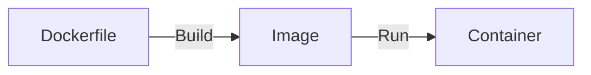

# Giới thiệu

## Container

**Containerlization** là công nghệ giúp cài đặt nhiều máy ảo trên 1 máy chủ vật lý (Virtualization).

**Container engine** là phần mềm sử dụng công nghệ containerlization để đóng gói phần mềm cùng với tất cả dependency (*thư viện, mã nguồn, cấu hình, ...*) vào trong một môi trường riêng biệt gọi là *container*, nó sẽ quản lý và vận hành các container này để phần mềm của chúng ta có thể chạy ở trong đó.

Container có các đặc điểm như:
- *Chứa tất cả mọi thứ mà phần mềm đó cần để chạy*.
- *Các process trong một container bị cô lập*, tách biệt với các tiến trình của các container khác trong cùng hệ thống
- **Máy ảo (Virtual machine)** một OS thực thụ, riêng biệt. Container giống như một *process* chạy trên hệ điều hành host.

## Docker

Docker là một phần mềm hỗ trợ containerlization.

Có 3 bước hoạt động chính:

Trong đó:
- **Dockerfile**: Bao gồm các định nghĩa, hướng dẫn cho Docker để xây dựng các Image. Dockerfile không có phần mở rộng.
- **Image** giống như class của các **Container**.
- **Container** là ứng dụng đang thực thi.

# Cài đặt

Docker vốn được sinh ra OS *Linux*, sau này mới mở sang các OS khác như Windows, Mac,... Nhưng khi cài Docker vào các OS này thì Docker sẽ tự cài thêm một máy ảo Linux để hoạt động, làm giảm hiệu năng.

**Docker Desktop** là một GUI để sử dụng Docker .Cài đặt Docker Desktop tại [Docker docs / Get Docker](https://docs.docker.com/get-started/get-docker/).

