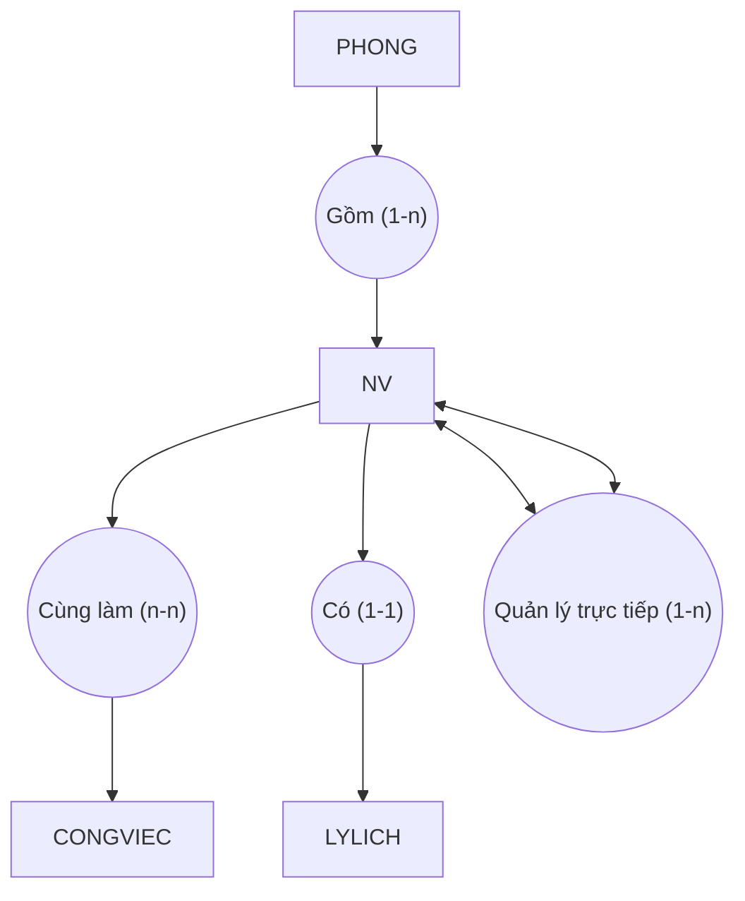
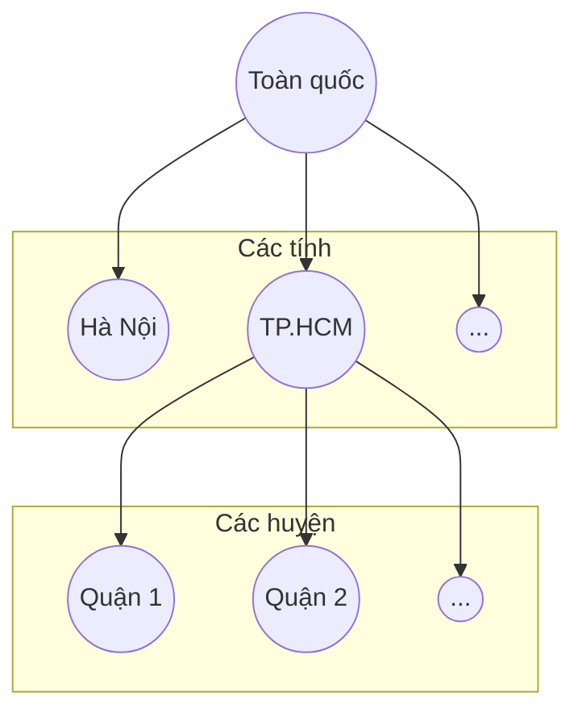
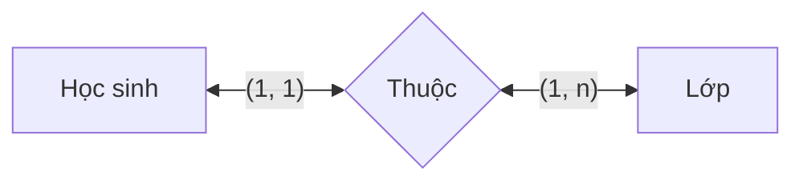
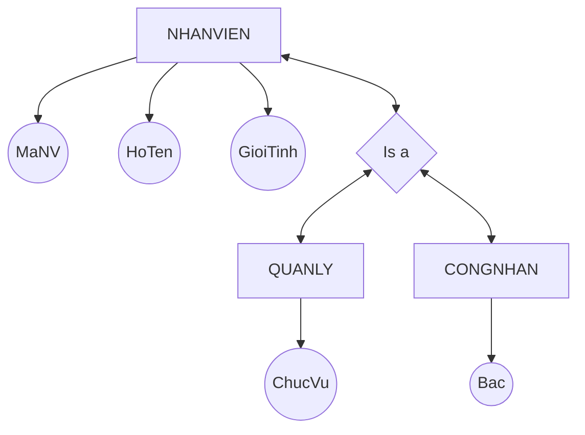
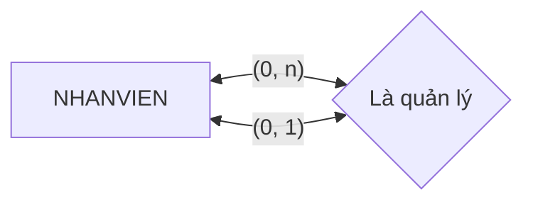
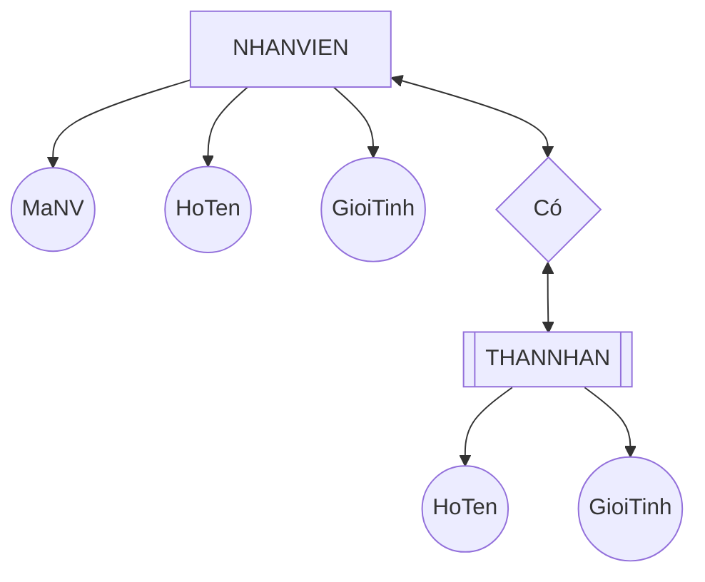
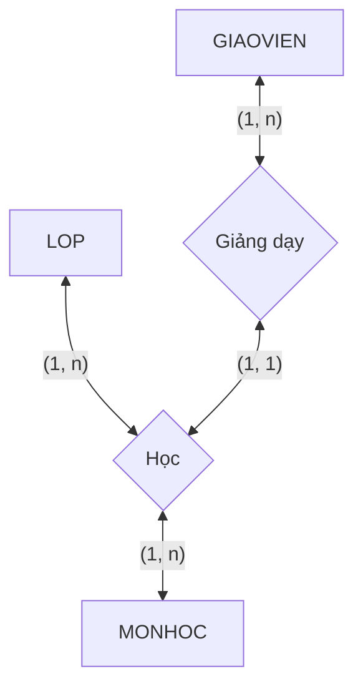

```insta-toc
---
title:
  name: Mục lục
  level: 1
  center: false
exclude: ""
style:
  listType: number
omit: []
levels:
  min: 1
  max: 6
---

# Mục lục

1. Mô hình mạng (Network data model)
2. Mô hình phân cấp (Hierachical data model)
3. Mô hình thực thể kết hợp (Enity-Relationship model, ERD)
4. Mô hình ER mở rộng (EERD)
    1. Chuyên biệt hóa, tổng quát hóa
    2. Mối kết hợp đệ quy
    3. Thực thể yếu
    4. Mối mở rộng
5. Mô hình dữ liệu hướng đối tượng (OOP model)
6. Mô hình quan hệ (Relationship model)
```

Mô hình dữ liệu (Data model) là sự trừu tượng hóa của môi trường thực, biểu diễn dữ liệu ở mức quan niệm.

# Mô hình mạng (Network data model)
\[Đọc thêm\]

Được biểu diễn bởi một *đồ thị có hướng* với các thành phần:
1. **Mẫu tin**: Mô tả 1 đối tượng trong thế giới thực.
2. **Loại mẫu tin**: Là 1 tập các mẫu tin có cùng tính chất.
3. **Loại liên hệ**: Mô tả liên kết giữa các loại mẫu tin.
4. **Bản số**: Chỉ ra số lượng các mẫu tin tham gia trong mối liên hệ:
	1. **(1:1) (one-to-one)**: mỗi mẫu tin của loại mẫu tin chủ kết hợp với đúng 1 mẫu tin của loại mẫu tin thành viên.
	2. **(1:n) (one-to-many)**: mỗi mẫu tin của loại mẫu tin chủ kết hợp với 1 hay nhiều mẫu tin thành viên.
	3. **(n:1) (many-to-one)**: nhiều mẫu tin của loại mẫu tin chủ kết hợp với đúng 1 mẫu tin của loại mẫu tin thành viên.

Nhận xét:
1. Tương đối đơn giản.
2. Dễ sử dụng.
3. Không thích hợp biểu diễn CSDL có quy mô lớn.
4. Khả năng diễn đạt ngữ nghĩa kém.



# Mô hình phân cấp (Hierachical data model)
\[Đọc thêm\]

Bao gồm:
1. **Nút**: Tượng trưng cho các thực thể.
2. **Quan hệ**: Quan hệ giữa các nút.

Nhận xét:
1. Đơn giản, tìm kiếm nhanh.
2. Khả năng diễn đạt ngữ nghĩa kém (các mối quan hệ n-n).
3. Không thích hợp biểu diễn CSDL có quy mô lớn.



# Mô hình thực thể kết hợp (Enity-Relationship model, ERD)

Có các thành phần sau:

| Thành phần                               | Ý nghĩa                                                                                                                                                                                                                                                                                                                                                                                                                                                                                               | Ký hiệu                |
| ---------------------------------------- | ----------------------------------------------------------------------------------------------------------------------------------------------------------------------------------------------------------------------------------------------------------------------------------------------------------------------------------------------------------------------------------------------------------------------------------------------------------------------------------------------------- | ---------------------- |
| **Loại thực thể (Enity)**                | Một loại thực thể trên thực tế. Mỗi loại thực thể tượng trưng cho nhiều thực thể.                                                                                                                                                                                                                                                                                                                                                                                                                     | Hình vuông, chữ in hoa |
| **Thuộc tính (Attribute)**               | Những tính chất của loại thực thể / mối.<br><br>Thuộc tính có 3 loại:<br><br>- **Đơn trị (Simple)**: *Chỉ có một giá trị*, không thể chia nhỏ.<br><br>- **Đa hợp (Composite)**: Thuộc tính có thể *được tạo thành từ nhiều thành phần (thuộc tính con)*.<br><br>- **Đa trị (Multi-valued)**: Thuộc tính có thể *có nhiều giá trị đối với 1 thực thể*.<br><br>**Khóa (key)**: Là tổ hợp các thuộc tính mà có giá trị *khác nhau ở mỗi thực thể*. Ký hiệu bằng cách gạch chân những thuộc tính là khóa. | Hình tròn / Ghim       |
| **Loại mối kết hợp (Relationship type)** | Sự liên kết giữa hai hay nhiều loại thực thể.<br><br>**Ngôi của mối** là số lượng thực thể tham gia mối, ký hiệu là (**max1, max2**) là số lượng max của 2 thực thể tham gia mối.                                                                                                                                                                                                                                                                                                                     | Hình thoi / Hình tròn  |
| **Bản số (Relationship cardinality)**    | Số lượng tối thiểu và số lượng tối đa các thực thể tham gia mối.                                                                                                                                                                                                                                                                                                                                                                                                                                      |                        |

VD:

- Mỗi học sinh thuộc tối thiểu 1 lớp và tối đa 1 lớp.
- Mỗi lớp có tối thiểu 1 học sinh và tối đa n học sinh.

# Mô hình ER mở rộng (EERD)

## Chuyên biệt hóa, tổng quát hóa

Sử dụng mối đặc biệt **Is a** để thể hiện 1 loại thực thể có thể được phân loại là các loại thực thể khác.


- `NHANVIEN` là tổng quát hóa của `QUANLY` và `CONGNHAN`.
- `QUANLY` và `CONGNHAN` là chuyên biệt hóa của `NHANVIEN`.

## Mối kết hợp đệ quy

Được tạo thành từ cùng một loại thực thể (hay một loại thực thể có loại mối kết hợp với chính nó).



## Thực thể yếu

Là loại thực thể **không có khóa**. Phải tham gia trong một loại mối kết hợp xác định trong đó có một loại thực thể chủ.



## Mối mở rộng

Có mối là thành viên của mối khác.



- Mỗi GIAOVIEN có tối thiểu 1 giảng dạy và tối đa n giảng dạy. Mỗi giảng dạy chỉ ứng với 1 LOP, 1 MONHOC, nên mỗi GIAOVIEN có tối thiểu 1 LOP, 1 môn và tối đa n LOP, n MONHOC.
- Mỗi MONHOC được dạy bởi tối thiểu 1 lớp, 1 GIAOVIEN và tối đa n LOP, n GIAOVIEN.
- Mỗi LOP được dạy cho tối thiểu 1 MONHOC, tối đa n MONHOC, và được dạy bởi tối thiểu 1 GIAOVIEN, tối đa n GIAOVIEN.

# Mô hình dữ liệu hướng đối tượng (OOP model)
\[Đọc thêm\]

Dựa trên cách tiếp cận OOP, gồm có: Lớp (class), Thuộc tính (Attribute), Phương thức (Operator),... Gồm có các đặc trưng như OOP.

# Mô hình quan hệ (Relationship model)

[[Mô hình quan hệ]].
