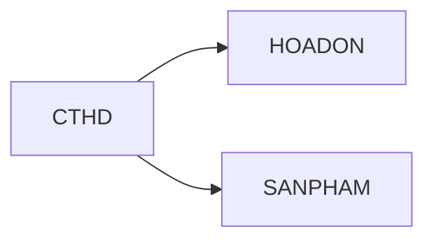

```insta-toc
---
title:
  name: Mục lục
  level: 1
  center: false
exclude: ""
style:
  listType: number
omit: []
levels:
  min: 1
  max: 6
---

# Mục lục

1. Object
2. Các từ khóa hiệu chỉnh kết quả truy vấn
3. Các phép toán quan hệ
    1. Phép chiếu (.)
    2. Phép đổi tên (AS)
    3. Phép chọn (WHERE)
    4. Phép gộp nhóm (GROUP BY HAVING)
    5. Phép kết bằng (JOIN / INNER JOIN)
    6. Các phép kết ngoại (LEFT JOIN, RIGHT JOIN, FULL JOIN)
    7. Phép hợp (UNION)
    8. Phép giao (INTERSECT)
    9. Phép trừ (EXCEPT)
    10. Phép chia (NOT EXISTS - NOT EXISTS)
```

`SELECT` chính là phép $\pi_\text{(object)}\text{table1}$ trong [[3. Mô hình quan hệ#Đại số quan hệ|Đại số quan hệ]].

Cấu trúc chung:
```sql
SELECT 
TOP n (WITH TIES)
DISTINCT
object AS name,...
FROM table1
JOIN table2 ON logicExp
...
WHERE logicExp
GROUP BY cols,...
HAVING logicExp
ORDER BY col1 DESC/ASC, col2 DESC/ASC,...
LIMIT n
```

Kết quả của SELECT có 2 loại:

| Bảng $n \times m$    | Bảng $1 \times 1$                 |
| -------------------- | --------------------------------- |
| Có $n \times m$ ô.   | Có 1 ô.                           |
| Được coi như 1 bảng. | Được coi như một dữ liệu (value). |

# Object

Là những gì bạn mong muốn trích xuất ra từ table.
- Object có thể là cột, hàm hoặc một giá trị cụ thể.
- Khi object là `*`, SELECT sẽ lấy hết dữ liệu có thể.

# Các từ khóa hiệu chỉnh kết quả truy vấn

1. `TOP n`: Chỉ lấy ra `n` *hàng* đầu tiên của bảng.
2. `TOP n WITH TIES`: Lấy ra `n` *hạng* đầu tiên. Mỗi hạng bao gồm một số hàng có giá trị giống nhau.
3. `DISTINCT`: Lọc bỏ các hàng trùng nhau, chỉ lấy các hàng độc nhất.
4. `ORDER BY col1 DESC/ASC`: Sắp xếp kết quả cột `col1` theo thứ tự giảm dần (`DESC`) hoặc tăng dần (`ASC`)

# Các phép toán quan hệ

## Phép chiếu (`.`)

Lấy ra các cột `col1`, `col2`,... trong bảng `tb`:
```sql
tb.col1, tb.col2,...
```

## Phép đổi tên (`AS`)

- Đối với bảng: `tb AS newTb`.
- Đối với cột: `col AS newCol`.

>[!NOTE]
>Có thể bỏ từ khóa `AS`.

## Phép chọn (`WHERE`)

Chọn ra các bộ thỏa mãn điều kiện `logicExp`:
```sql
WHERE logicExp
```

## Phép gộp nhóm (`GROUP BY HAVING`)

Gộp các hàng có chung giá trị ở các cột `cols`, sau đó lọc giữ các nhóm thỏa điều kiện `HAVING`:
```sql
GROUP BY cols
HAVING logicExp
```

>[!NOTE]
>`HAVING` chỉ dùng cho các nhóm sau khi `GROUP BY`, tức là dùng `HAVING` chung với các agreeate function.

## Phép kết bằng (`JOIN` / `INNER JOIN`)

Dựa trên cột `tbA.colA` và `tbB.colB`:
```sql
INNER JOIN tbB
ON tbA.colA = tbB.colB
```

>[!NOTE]
>Có thể bỏ từ khóa `INNER`.

## Các phép kết ngoại (`LEFT JOIN`, `RIGHT JOIN`, `FULL JOIN`)

Dựa trên cột `tbA.colA` và `tbB.colB`:
```sql
LEFT OUTER JOIN tb2
ON tbA.colA = tbB.colB
```

Tương tự với `RIGHT JOIN`.

>[!NOTE]
>Có thể bỏ từ khóa `OUTER`.

## Phép hợp (`UNION`)

Ghép `tbA` với `tbB`:
```sql
tbA
UNION
tbB
```

## Phép giao (`INTERSECT`)

Lấy ra những hàng xuất hiện ở cả `tbA` và `tbB`:
```sql
tbA
INTERSECT
tbB
```

## Phép trừ (`EXCEPT`)

Lấy ra những hàng chỉ có ở `tbA` mà không có ở `tbB`:
```sql
tbA
EXCEPT
tbB
```

## Phép chia (`NOT EXISTS` - `NOT EXISTS`)

VD: Cho quan hệ `CTHD` (chi tiết hóa đơn) là mối n-n giữa `HOADON` và `SANPHAM`.


Hiển thị thông tin hóa đơn với điều kiện là không tồn tại sản phẩm mà hóa đơn này không mua.

Bước 1: Lấy ra thông tin *các sản phẩm mà không được mua bởi hóa đơn nào*:
```sql
SELECT *
FROM SANPHAM
WHERE NOT EXISTS (
	SELECT *
	FROM CTHD
	WHERE
		CTHD.MaSP = SANPHAM.MaSP AND
		CTHD.MaHD = HOADON.MaHD
)
```

Bước 2: Nếu một hóa đơn nào đó không tồn tại trong danh sách các sản phẩm không được mua bởi hóa đơn nào, thì tức là hóa đơn đó đã mua tất cả sản phẩm.

```sql
SELECT *
FROM HOADON
WHERE
	... AND
	NOT EXISTS (
		SELECT *
		FROM SANPHAM
		WHERE
			... AND
			NOT EXISTS (
				SELECT *
				FROM CTHD
				WHERE
					CTHD.MaSP = SANPHAM.MaSP AND
					CTHD.MaHD = HOADON.MaHD
			)
	)
```

