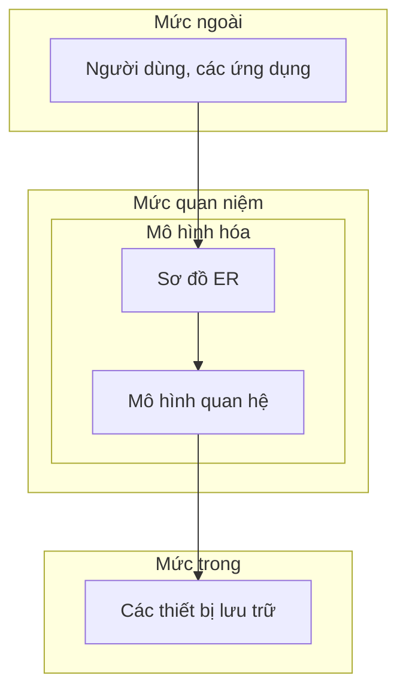

```insta-toc
---
title:
  name: Mục lục
  level: 1
  center: false
exclude: ""
style:
  listType: number
omit: []
levels:
  min: 1
  max: 6
---

# Mục lục

1. Dữ liệu (Data)
2. Hệ thống tập tin (File system)
3. Cơ sở dữ liệu (Database)
    1. Tổng quan về CSDL
    2. Hệ quản trị CSDL (DBMS, Database management system)
    3. Các mức biểu diễn CSDL
```

# Dữ liệu (Data)

Một mô tả hình thức về những sự kiện, khái niệm.

# Hệ thống tập tin (File system)

Là **tập hợp các file riêng lẻ** phục vụ cho mục đích của đơn vị sử dụng.

**Ưu điểm**:
1. Triển khai ứng dụng **nhanh**.
2. Khả năng đáp ứng nhanh chóng, kịp thời (vì chỉ phục vụ cho mục đích hạn hẹp).

**Nhược điểm**:
1. **Trùng lặp dữ liệu** -> lãng phí, dữ liệu không nhất quán.
2. **Khó khăn trong việc truy xuất**.
3. **Chi phí cao**.
4. **Hạn chế chia sẻ** dữ liệu.

# Cơ sở dữ liệu (Database)

## Tổng quan về CSDL

Là một hệ thống các thông tin:
- **Có cấu trúc**.
- Thỏa mãn yêu cầu khai thác thông tin **đồng thời của nhiều người dùng** hay nhiều ứng dụng với những mục đích khác nhau.

**Ưu điểm**:
1. **Giảm trùng lặp** thông tin xuống mức thấp nhất, đảm bảo tính nhất quán và toàn vẹn dữ liệu.
2. **Nhiều cách truy xuất**.
3. **Khả năng chia sẻ thông tin** cho nhiều người, nhiều ứng dụng khác nhau.

**Vấn đề**:
1. Dữ liệu phải được **cập nhật thường xuyên**.
2. Tính **bảo mật** và quyền khai thác thông tin của người sử dụng.
3. **Tranh chấp dữ liệu** (*do phải xử lý đồng thời*).
4. **Đảm bảo dữ liệu** khi có sự cố (*sao lưu, phục hồi).

## Hệ quản trị CSDL (DBMS, Database management system)

Là tập hợp các chương trình cho phép người sử dụng **tạo ra, duy trì, phân tích, khai thác** CSDL.
1. **Định nghĩa** – khai báo bộ khung dữ liệu, mô tả chi tiết về dữ liệu.
2. **Xây dựng** – lưu trữ dữ liệu.
3. **Xử lý – Truy vấn**, cập nhật dữ liệu và truy xuất báo cáo.

Một DBMS phải có:
1. **Ngôn ngữ giao tiếp** giữa người sử dụng và CSDL.
2. **Từ điển dữ liệu** (Data dictionary).
3. Có biện pháp **bảo mật** khi có yêu cầu.
4. Cơ chế **giải quyết tranh chấp** dữ liệu
5. Có cơ chế **sao lưu (backup), phục hồi (restore)**.
6. Đảm bảo tính **độc lập giữa dữ liệu & chương trình** (*CSDL không phụ thuộc vào ngôn ngữ lập trình, môi trường tạo ra ứng dụng,...*).
-> Mỗi DBMS khác nhau có cơ chế khác nhau để giải quyết các vấn đề.

**Ngôn ngữ giao tiếp**: Có 4 loại:
1. **Ngôn ngữ mô tả dữ liệu (DDL, Data Definition Language)**: Khai báo cấu trúc, quan hệ, quy định ràng buộc,...
2. **Ngôn ngữ thao tác dữ liệu (DML, Data Manipulation Language)**: Thực hiện các thao tác thêm, xóa, sửa dữ liệu.
3. **Ngôn ngữ truy vấn dữ liệu (SQL, Structured Query Language)**: Khai thác sử dụng để truy vấn thông tin cần thiết.
4. **Ngôn ngữ quản lý dữ liệu (DCL, Data Control Language)**: Quản lý bảo mật, phân quyền sử dụng.

## Các mức biểu diễn CSDL

Có 3 mức:
1. **Mức ngoài**: Gồm người dùng và các ứng dụng.
2. **Mức quan niệm**: Gồm các quan hệ, logic của CSDL.
3. **Mức trong**: Cấu trúc vật lý để lưu trữ CSDL/

Quy trình thiết ké CSDL:



