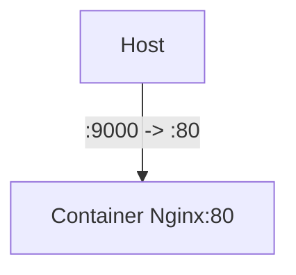
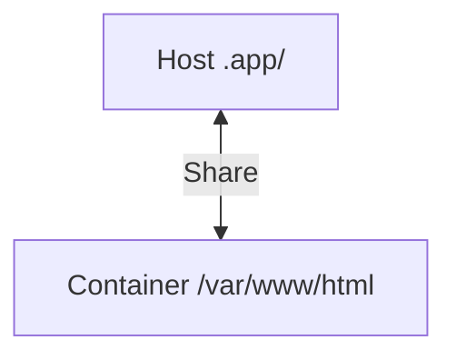
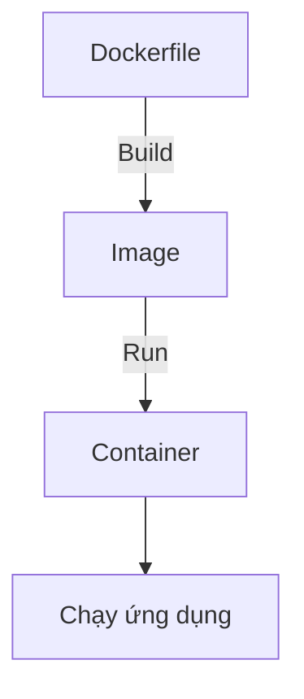

# Giới thiệu

## Container

**Containerlization** là công nghệ giúp cài đặt nhiều máy ảo trên 1 máy chủ vật lý (Virtualization).

**Container engine** là phần mềm sử dụng công nghệ containerlization để đóng gói phần mềm cùng với tất cả dependency (như thư viện, mã nguồn, cấu hình, ...) vào trong một môi trường riêng biệt gọi là *container*, nó sẽ quản lý và vận hành các container này để phần mềm của chúng ta có thể chạy ở trong đó.

Container có các đặc điểm như:
- *Chứa tất cả mọi thứ mà phần mềm đó cần để chạy*.
- *Tiến trình (process) trong một container bị cô lập*, tách biệt với các tiến trình của các container khác trong cùng hệ thống
- **Máy ảo (Virtual machine)** một hệ điều hành thực thụ, riêng biệt. Container giống như một *process* chạy trên hệ điều hành host.

Container giống như một máy ảo thu nhỏ, cần đơn ánh (map) với máy thật thì mới truy cập dữ liệu từ máy thật. Có 3 loại map là **map port**, **map path**, vừa **map port và vừa map path**.

VD: Map port: Khi gõ `http://localhost:9000` -> Truy cập vào Nginx trong container.


VD: Map path: Khi `.app/` thay đổi nội dung thì `/var/www/html` cũng thay đổi.


## Docker

Docker là một phần mềm hỗ trợ containerlization.

Có 3 bước hoạt động chính:


Trong đó:
- **Dockerfile** là một file văn bản chứa các hướng dẫn để Docker biết cách tạo ra docker image theo mong muốn của bạn. VD như Hệ điều hành, thư viện, cách thiết lập ứng dụng cụ thể,...
- **Image** giống như class của các **Container**.

# Cài đặt

Docker vốn được sinh ra OS *Linux*, sau này mới mở sang các OS khác như Windows, Mac,... Nhưng khi cài Docker vào các OS này thì Docker sẽ tự cài thêm một máy ảo Linux để hoạt động, làm giảm hiệu năng.

**Docker Desktop** là một phần mềm có giao diện đồ họa để sử dụng Docker .Cài đặt Docker Desktop tại [đây](https://docs.docker.com/get-started/get-docker/).

Để kiểm tra cài đặt thành công chưa, sử dụng:
```shell
docker run hello-world
```

Nếu cài đặt thành công thì terminal sẽ hiển thị đại khái là:
```shell
Hello from Docker!
This message shows that your installation appears to be working correctly.
```


