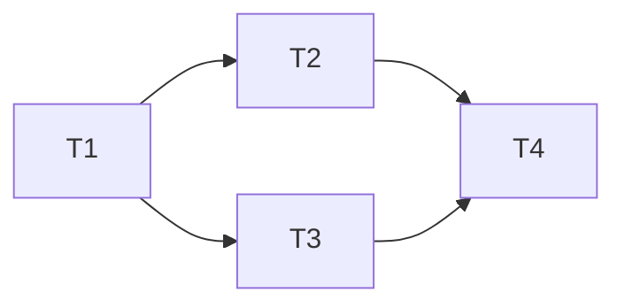

```insta-toc
---
title:
  name: Mục lục
  level: 1
  center: false
exclude: ""
style:
  listType: number
omit: []
levels:
  min: 1
  max: 6
---

# Mục lục

1. Nhận diện số lượng semaphore
2. Nhận xét hệ thống đồng bộ hóa
```

# Nhận diện số lượng semaphore

**Cần ít nhất mấy semaphore để đồng bộ sơ đồ này?**


- `s0`: Đồng bộ T1 và T2, T3, T4. Sau khi T1 kết thúc, T2 và T3 cái nào được thực thi trước không quan trọng, nếu quan trọng thì cần thêm semaphore.
- `s1`: Đồng bộ T2, T3 và T4.

Vậy cần 2 semaphore.

---
Cho  process P1 (A1, A2), P2 (B1, B2), P3 (C1, C2) thực thi đồng thời. Sử dụng semaphore để đồng bộ sao cho:
1. B1 thực thi sau A1.
2. C2 thực thi sau B1.

**Thiết kế semaphore cho hệ thống trên?**

Sơ đồ cấp phát: *A1 -> B1 -> C2* -> Cần **2 semaphore**.

|          | P1                                          | P2                                   | P3                                  |
| -------- | ------------------------------------------- | ------------------------------------ | ----------------------------------- |
| `s0 = 0` | --                                          | `wait(s0)`<br>`s0 = -1`<br>=> Block. | --                                  |
|          | **A1**                                      | **B1**                               | **C1**                              |
| `s1 = 0` | `signal(s0)`<br>`s0 = 0`<br>-> P2 được vào. | `signal(s1)`                         | `wait(s1)`<br>`s1 = -1`<br>=> Block |
|          | **A2**                                      | **B2**                               | **C2**                              |
|          | --                                          | --                                   | --                                  |

Ta thấy cần 2 biến:
- `s0`: Đồng bộ A1 - B1.
- `s1`: Đồng bộ B1 - C2.

Vậy cần 2 semaphore.

---
Cho 2 process:

```c++
void* T1(void* arg) {
	printf("1");
	printf("2");
	printf("5");
	printf("6");
}

void* T2(void* arg) {
	printf("3");
	printf("4");
	printf("7");
	printf("8");
}
```

**Thiết kế semaphore sao cho kết quả được in ra là `123456`**.

Thứ tự thực hiện: *T1 -> T2 -> T1 -> T2* => Cần **3 semaphore**.
```c++
semaphore s1 = 0, s2 = 0, s3 = 0;
```

Đặt lệnh:
```c++
void* T1(void* arg) {
	// T1 thực thi đầu tiên
	printf("1");
	printf("2");
	signal(s1); // Nhả quyền cho T2
	
	wait(s2); // Đợi T2
	printf("5");
	printf("6");
	signal(s3); // Nhả quyền cho T2
}

void* T2(void* arg) {
	// Đợi T1
	wait(s1);
	printf("3");
	printf("4");
	signal(s2); // Nhả quyền cho T1
	
	wait(s3); // Đợi T1
	printf("7");
	printf("8");
}
```

# Nhận xét hệ thống đồng bộ hóa

Khi sử dụng critical region, một biến `v` chỉ có thể được truy xuất thông qua phát biểu:
```
region v when B do S
```
**Ý nghĩa?** Khi `B` đúng, `S` thực thi và không có process nào khác được truy cập `v`.

---
Nhận xét giải pháp động bộ sau (ban đầu, `lock` = `false`):
```c++
do {
	while TestAndSet(&lock);
	critical section
	lock = false
	remainder section
} while(1)
```

- Giải pháp sử dụng cơ chế đồng bộ `TestAndSet` đảm bảo tại 1 thời điểm chỉ có 1 process được truy cập critical section (*mutual exclusion*). Khi process thỏa `TestAndSet`, `lock` sẽ là `True`.
- Nhưng ta thấy chưa có cơ chế đảm bảo chờ đợi giới hạn (*bounded waiting*) mà hiện `lock` bị kiểm soát hoàn toàn bởi 1 process, gây ra starvation.

---
Phân tích vai trò 2 semaphore `mutex` và `wrt` như sau:

**Dữ liệu chia sẻ**:
```c++
semaphore mutex = 1;
semaphore wrt = 1;
int read_cont = 0;
```

**Writer**:
```c++
wait(wrt);
// ...
signal(wrt);
```
-> `wrt` đảm bảo chỉ có `1` writer tại 1 thời điểm (mutual exclusion đối với writer).

**Reader**:
```c++
wait(mutex);
readcount++;
if (read_count == 1) wait(wrt);
signal(mutex);
// ...
wait(mutex);
readcount--;
if (read_count == 0) signal(wrt);
signal(mutex);
```
-> `mutex` đảm bảo chỉ có `1` reader tại 1 thời điểm (mutual exclusion đối với writer). Hơn nữa, nếu reader đọc đầu tiên (`read_count` = `1`) thì nó cũng giành được quyền write.

Giả sử đang có $1$ writer đang ở vùng tranh chấp và $n$ reader đang đợi thì trong số các reader này, sẽ có $1$ reader bị chặn bởi `wrt` và các reader kia bị chặn bởi `mutex`.

---
Cho một hệ thống giải quyết bài toán động bộ bounded-buffer bằng cách dùng 2 semaphore (`empty`, `full`, ban đầu đều là `0`).

**Producer**:
```c++
wait(empty);
count++;
signal(full);
```

**Consumer**:
```c++
wait(full);
count--;
signal(empty);
```

Hệ thống trên:
- Không đảm bảo mutual exclusion cho biến `count` vì không có semaphore nào bảo vệ routine `count++` và `count--`.
- Không đảm bảo bounded waiting vì cơ chế lấy quyền - nhả quyền chưa hợp lý. Tại thời điểm đầu tiên, producer block `empty`, consumer block `full` nên bị kẹt cứng.

---
Cho một hệ thống giải quyết bài toán động bộ bounded-buffer bằng cách dùng 1 semaphore (`mutex`, ban đầu `mutex` = `1`) và các biến chia sẻ `buffer[]` có kích thước `n`, `count`.

**Producer**:
```c++
while (count < n) {
	wait(mutex);
	// add to buffer[]
	count++;
	signal(mutex);
}
```

**Consumer**:
```c++
while (count > 0) {
	wait(mutex);
	// remove from buffer[]
	count--;
	signal(mutex);
}
```

Hệ thống trên:
- Mutual exclusion được đảm bảo vì những thay đổi trên `buffer` và `count` đã được bảo vệ bởi `mutex`.
- Do 2 process trên liên tục kiểm tra điều kiện ngoài `mutex` là `count < n` và `count > 0` nên đây là busy waiting.


