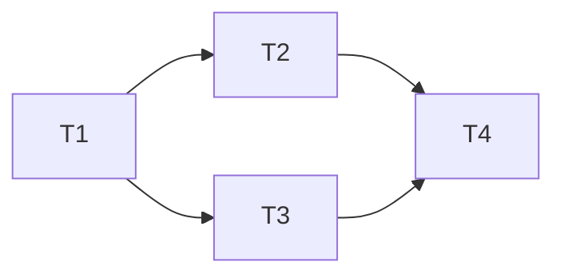

**Cần ít nhất mấy semaphore để đồng bộ sơ đồ này?**

- `s0`: Đồng bộ T1 và T2, T3, T4. Sau khi T1 kết thúc, T2 và T3 cái nào được thực thi trước không quan trọng, nếu quan trọng thì cần thêm semaphore.
- `s1`: Đồng bộ T2, T3 và T4.

Vậy cần 2 semaphore.

---
Cho  process P1 (A1, A2), P2 (B1, B2), P3 (C1, C2) thực thi đồng thời. Sử dụng semaphore để đồng bộ sao cho:
1. B1 thực thi sau A1.
2. C2 thực thi sau B1.

**Cần bao nhiêu semaphore?**

Sơ đồ cấp phát: *A1 -> B1 -> C2*.

|          | P1                                          | P2                                   | P3                                  |
| -------- | ------------------------------------------- | ------------------------------------ | ----------------------------------- |
| `s0 = 0` | --                                          | `wait(s0)` `s0 = -1` => Block. | --                                  |
|          | **A1**                                      | **B1**                               | **C1**                              |
| `s1 = 0` | `signal(s0)` `s0 = 0` -> P2 được vào. | `signal(s1)`                         | `wait(s1)` `s1 = -1` => Block |
|          | **A2**                                      | **B2**                               | **C2**                              |
|          | --                                          | --                                   | --                                  |

Ta thấy cần 2 biến:
- `s0`: Đồng bộ A1 - B1.
- `s1`: Đồng bộ B1 - C2.

Vậy cần 2 semaphore.

