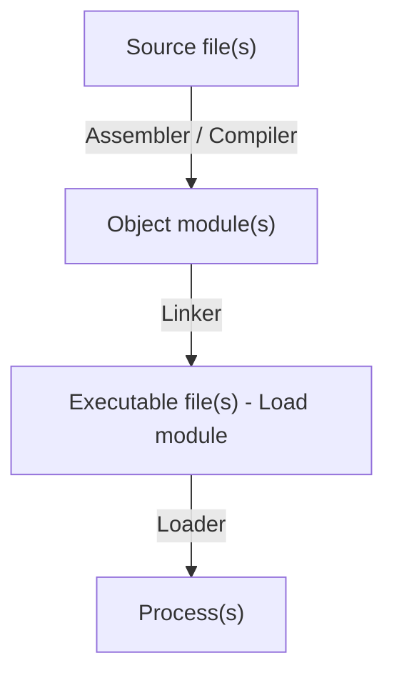
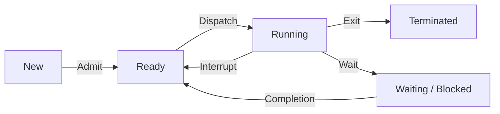

```insta-toc
---
title:
  name: Mục lục
  level: 1
  center: false
exclude: ""
style:
  listType: number
omit: []
levels:
  min: 1
  max: 6
---

# Mục lục

1. Tổng quan Tiến trình
    1. Khái niệm process
    2. Phân loại process
2. Cấu trúc process
    1. Các thành phần của process
    2. Cấu trúc Process control block (PCB)
3. Quy trình hoạt động
    1. Thứ tự cấp phát tài nguyên
    2. Quy trình khởi tạo process
    3. Quy trình nạp process vào bộ nhớ
4. Trạng thái process và hàng đợi process
    1. Trạng thái process
    2. Hàng đợi process
5. Các tác vụ đối với process
    1. Tạo mới process
    2. Kết thúc process
    3. Chuyển ngữ cảnh (Context switch)
6. Cộng tác giữa các process
    1. Tổng quan về Sự công tác giữa các process
    2. Mục đích cộng tác
    3. Cơ chế giao tiếp liên process (Inter process communication, IPC)
7. Tiểu trình (Thread)
    1. Tổng quan về thread
    2. Lợi ích thread
    3. Phân loại thread
```

# Tổng quan Tiến trình

## Khái niệm process

- **Tiến trình (Process)** là một chương trình đang thực thi. Một chương trình có thể có nhiều tiến trình.
- **Chương trình (Program)** là thực thể *bị động* lưu trên đĩa (trong **file thực thi - executable file**).
- **Tiến trình** là thực thể *chủ động*, được tải trên **RAM**.
- Chương trình trở thành tiến trình *khi một file thực thi được nạp vào bộ nhớ*.

## Phân loại process

Có 2 loại:
1. **Process hướng CPU (CPU-bound process)**:
	1. Là process có tổng thời gian thực hiện trên CPU nhiều (*Service time*, mỗi đơn vị thời gian dùng CPU (theo *chu kỳ CPU-I/O*) là *Burst time*).
	2. Thời gian hoàn thành phụ thuộc vào *tốc độ CPU*.

2. **Process hướng I/O (I/O bound process)**:
	1. Là process có thời gian thực hiện trên các thiết bị I/O nhiều.
	2. Thời gian hoàn thành phụ thuộc vào *chu kỳ đợi các thao tác nhập/xuất*. 

# Cấu trúc process

## Các thành phần của process

1. **Text section**: Chứa code (mã nguồn).
2. **Data section**: Chứa biến *toàn cục*.
3. **Program counter**, **registers**.
4. **Heap section**: Chứa bộ nhớ *cấp phát động*.
5. **Stack section**: Chứa dữ liệu tạm thời (*các hàm, giá trị trả về, biến cục bộ*).

>[!Note]
>Xét con trỏ sau được khai báo trong hàm `main()`:
>`int *ptr = malloc(sizeof(int));`.
>- Do con trỏ này nằm trong `main()`, nên nó thuộc **Stack section**.
>- Thứ thuộc heap section là `malloc(sizeof(int))`.

## Cấu trúc Process control block (PCB)

PCB là một cấu trúc dữ liệu trong **kernel**. Nó chứa toàn bộ thông tin cần thiết để quản lý một process.

Thành phần:
1. **Trạng thái process**: new, ready, running,...
2. **Trạng thái I/O**.
3. **Program counter**, **registers**.
4. Thông tin **định thời**.
5. Thông tin **quản lý bộ nhớ**.
6. **Lượng CPU, thời gian sử dụng**.

# Quy trình hoạt động

## Thứ tự cấp phát tài nguyên

1. RAM.
2. I/O devices.
3. Các tài nguyên khác.
4. CPU.

## Quy trình khởi tạo process

1. Cấp phát **ID**.
2. Cấp phát **không gian** để nạp process.
3. Khởi tạo **Process control block** (PCB).
4. Thiết lập **các mối quan hệ** cần thiết (VD: Lắp PCB vào stack,...).

## Quy trình nạp process vào bộ nhớ



# Trạng thái process và hàng đợi process

## Trạng thái process

1. **new**: Process vừa được tạo.
2. **ready**: Process đã có đủ tài nguyên, chờ thực thi.
3. **waiting** (hay **blocked**): Process đợi I/O hoàn tất, hoặc đợi tín hiệu.
4. **running**: Đang thực thi.
5. **terminated**: Process kết thúc.



>[!note]
>- Chỉ có process ở trạng thái **ready** mới có thể chuyển về **running** và **terminated**.
>- Không có trạng thái gì trở về **new**.

## Hàng đợi process

Có các loại queue sau:
1. **Hàng đợi công việc (Job queue)**: Tất cả process trên hệ thống.
2. **Hàng đợi sẵn sàng (Ready queue)**: Các process đang ở trạng thái *ready*.
3. **Hàng đợi thiết bị (Device queue)**: Các process đang ở trạng thái *waiting*.
4. ...

# Các tác vụ đối với process

## Tạo mới process

Một process có thể tạo nhiều tiến trình mới thông qua 1 [[Cấu trúc OS#Lời gọi hệ thống (System call)|system call]] *create-process*.
VD:
- Trong UNIX, `fork()` dùng để tạo một process mới.
- `exec()` được gọi sau đó để tạo các process con.

**Đặc điểm của cây process**:
- Process được tạo là process con của process tạo (process cha).
- Quan hệ cha-con định nghĩa một cây process.
- Process **con nhận tài nguyên từ cha hoặc OS**.
- Không gian địa chỉ của con được **nhân bản từ cha** qua template.
- Process cha có thể thực thi **đồng thời** với các process con hoặc thực thi **sau** khi process con thực thi xong.

## Kết thúc process

Có các trường hợp kết thúc process sau:
1. Process **tự kết thúc** khi thực hiện xong lệnh cuối cùng và gọi *system routine exit*.
2. Process kết thúc **do process khác** (có đủ quyền, VD: Cha).
3. Gọi **system routine abort** với tham số là **pid** (process identifier) của process cần được kết thúc.
4. **OS thu hồi tất cả các tài nguyên** của process kết thúc.

## Chuyển ngữ cảnh (Context switch)

Là chuyển đổi qua lại giữa các process. Nếu

# Cộng tác giữa các process

## Tổng quan về Sự công tác giữa các process

Trong khi thực thi process, các process có thể cộng tác (cooperate) để hoàn thành công việc.

## Mục đích cộng tác

1. **Chia sẻ dữ liệu** (information sharing).
2. **Tăng tốc tính toán** (computational speedup): Nếu hệ thống có nhiều CPU, chia công việc tính toán thành nhiều công việc tính toán nhỏ chạy song song
3. **Thực hiện một công việc chung**: Xây dựng một phần mềm phức tạp bằng cách chia thành các module/process hợp tác nhau.

## Cơ chế giao tiếp liên process (Inter process communication, IPC)

Có 2 mô hình:
1. **Bộ nhớ được chia sẻ (Shared memory)**:
	1. Là bộ nhớ dùng chung giữa các process.
	2. Quá trình giao tiếp được thực hiện bởi các process.

2. **Hệ thống truyền thông điệp (Message passing)**: Có 3 cách:
	1. **Đặt tên (Naming)**: Truyền message *trực tiếp* giữa 2 process hoặc *gián tiếp* qua mailbox.
	2. **Đồng bộ hóa (Synchronization)**: Blocking send, non-blocking send, blocking receive, non-blocking receive.
	3. **Tạo vùng đệm (Buffering)**: Dùng queue để tạm chứa các message. Queue có thể có giới hạn (*Bounded*), không giới hạn (*Unbounded*) hoặc không chứa (*No buffering*).

Mô hình **shared memory** có:
- **Ưu**: Tiết kiệm bộ nhớ.
- **Nhược**: Thiếu bảo mật, vì các process dùng chung bộ nhớ.

**Message passing** thì ngược lại.

>[!note]
>- Process giao tiếp với OS thông qua **System call (API)**.
>- Process giao tiếp với process thông qua:
>	- **Shared memory**: Dùng chung bộ nhớ.
>	- **Message passing**: Truyền tin.

# Tiểu trình (Thread)

## Tổng quan về thread

**Tiểu trình** là tiến trình con, hoặc có thể hiểu là đơn vị cơ bản nhất sử dụng CPU.

Bao gồm:
1. TID.
2. Program counter, Registers.
3. Stack.
4. Chia sẻ chung code.
5. Data, resourses (files).
6. TCP (tương ứng với PCB).

Mỗi process có 1 thread hoặc nhiều thread (Multithread).

## Lợi ích thread

1. **Đáp ứng nhanh**: Cho phép chương trình tiếp tục thực thi khi một bộ phận bị khóa hoặc một hoạt động dài.
2. **Chia sẻ một số tài nguyên**: Tiết kiệm không gian nhớ.
3. **Kinh tế**: Tạo và chuyển ngữ cảnh nhanh hơn process.
4. **Multiprocessor**: Có thể thực hiện song song.

## Phân loại thread

1. **User thread**: Là thread do thư viện của người dùng quản lý, không có sự can thiệp trực tiếp từ kernel, không cần [[Cấu trúc OS#Lời gọi hệ thống (System call)|system call]].
2. **Kernel thread**: Do kernel quản lý, cần quyền [[1. Tổng quan về hệ thống máy tính và OS#Chế độ hoạt động|kernel mode]].

Kernel thread có thể sử dụng tài nguyên do có quyền kernel mode. Do đó, các user thread cần ánh xạ đến các kernel thread để sử dụng tài nguyên.

**Có 3 cách ánh xạ user thread và kernel thread**:
1. **n-1 (Many-to-one)**:
	1. Nhiều user thread ứng với 1 kernel thread.
	2. Các user thread không chạy song song.
	3. Khi 1 user thread bị chặn, mọi user thread khác cũng bị chặn.
2. **1-1 (One-to-one)**: (phổ biến) 
	1. Một user thread ứng với 1 kernel thread.
	2. Các user thread chạy song song.
	3. Tạo kernel thread cũng đồng thời tạo user thread.
	4. Số lượng thread bị hạn chế.
3. **n-n (Many-to-many)**:
	1. Nhiều user thread ứng với nhiều kernel thread.
	2. Giải quyết được vấn đề của 2 cách trên.
	3. Khó cài đặt.


