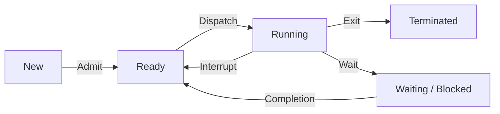

1. **Một tiến trình chứa những thành phần gì?**
	1. **Text section**: Chứa mã nguồn.
	2. **Data section**: Chứa biến *toàn cục*.
	3. **Program counter**, **registers**.
	4. **Heap section**: Chứa bộ nhớ cấp phát động.
	5. **Stack section**: Chứa dữ liệu tạm thời (các hàm, giá trị trả về, biến *cục bộ*).
	[[#Cấu trúc process]].

2. **Tiến trình có những trạng thái nào? Cách tiến trình chuyển trạng thái?**
	1. **new**: Process vừa được tạo.
	2. **ready**: Process đã có đủ tài nguyên, chờ thực thi.
	3. **waiting** (hay **blocked**): Process đợi I/O hoàn tất, hoặc đợi tín hiệu.
	4. **running**: Đang thực thi.
	5. **terminated**: Process kết thúc.
	Sơ đồ chuyển trạng thái:

[[#Trạng thái process]].

3. **Tại sao phải cộng tác giữa các tiến trình?**
	- Chia sẻ dữ liệu.
	- Tăng tốc tính toán.
	- Thực hiện một công việc chung.
	[[#Mục đích cộng tác]].

4. **PCB là gì? Dùng để làm gì?**
	PCB là 1 cấu trúc dữ liệu trong kernel, chứa toàn bộ thông tin cần thiết để quản lý 1 process. Bao gồm:
	1. Trạng thái của process.
	2. Program counter, register.
	3. Thông tin định thời, quản lý bộ nhớ.
	4. Lượng CPU, thời gian sử dụng.
	[[#Cấu trúc Process control block (PCB)]].
	
5. **Tiểu trình là gì?**
	Tiểu trình là tiến trình con, cũng là đơn vị cơ bản sử dụng CPU.
	[[#Tiểu trình (Thread)]].

6. **Trình tự thực thi của tiến trình cha và tiến trình con?**
	Tiến trình cha được thực thi trước con và đợi tiến trình con kết thúc rồi mới thực thi tiếp.
	[[#Tiểu trình (Thread)]].

7. **Các cơ chế trao đổi thông tin giữa các tiến trình?**
	Có 2 mô hình:
	1. Bộ nhớ chia sẻ (Shared memory): Các process dùng chung bộ nhớ.
	2. Hệ thống truyền thông điệp (Message passing): Các process giao tiếp qua địa chỉ của nhau.
	[[#Cơ chế giao tiếp liên process (Inter process communication, IPC)]]

8. **Trong quá trình thực thi chương trình sau thì thì tiến trình khi chạy từ chương trình trên đã trải qua những trạng thái nào? Vẽ sơ đồ chuyển trạng thái trong quá trình thực thi?**


>[!NOTE]
>- Khi bắt đầu chương trình -> **new - ready - running**.
>- Khi gặp input, output -> **waiting - ready - running**.
>- Khi gặp exit, kết thúc chương trình -> **terminated**.

```c
// new - ready - running
int main (int argc, char** argv) {
    int i = 2;
    while (i <= 5) {
        i++;
        if (i % 2 == 0) {
            printf("Hello");
            // i = 4 : waiting - ready - running
            
            printf ("Hi");
            // i = 4 : waiting - ready - running
        } else
            printf ("Bye");
            // i = 3 : waiting - ready - running
            // i = 5 : waiting - ready - running
    }
    exit (0);
    // terminated
}
```

new - ready - running - waiting - ready - running - waiting - ready - running - waiting - ready - running - waiting - ready - running - terminated.