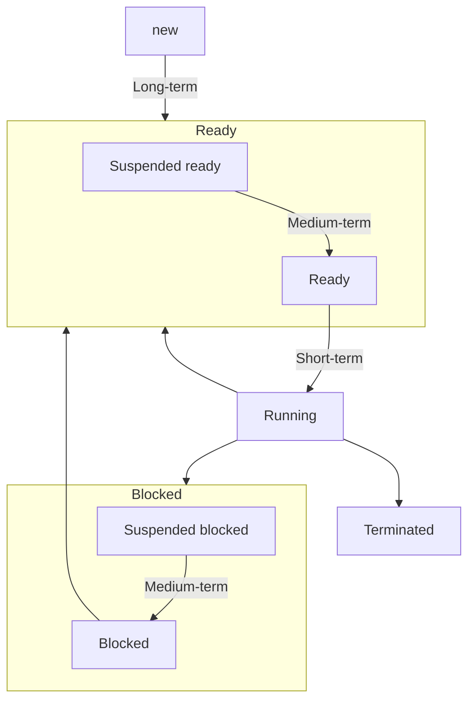

# Bảng thuật ngữ

| Tiếng Anh                               | Viết tắt | Tiếng Việt                           | Ý nghĩa                                                                                                                | Link                                                                         |
| --------------------------------------- | -------- | ------------------------------------ | ---------------------------------------------------------------------------------------------------------------------- | ---------------------------------------------------------------------------- |
| **Scheduling**                          |          | Định thời                            | Là chiến lược lựa chọn process/thread phù hợp để được thực thi sao cho đạt được hiệu quả cao nhất.                     | [[#Khái niệm\|Link]]                                                         |
| **Long-term scheduler, Job scheduler**  |          | Bộ định thời dài                     | Điều phối các process **Job queue -> Ready queue**.                                                                    | [[#Bộ định thời\|Link]]                                                      |
| **Short-term scheduler, CPU scheduler** |          | Bộ định thời ngắn                    | Điều phối các process **Ready queue -> running**.                                                                      | [[#Bộ định thời\|Link]]                                                      |
| **Mid-term scheduler**                  |          | Bộ định thời vừa                     | Điều phối các process vào đĩa (**Swap in**) hoặc ra khỏi đĩa (**Swap out**).                                           | [[#Bộ định thời\|Link]]                                                      |
| **Response time**                       |          | Thời gian đáp ứng                    | Khoảng thời gian từ lúc process gửi yêu cầu thực thi đến khi yêu cầu được đáp ứng lần đầu tiên.                        | [[#Hướng người dùng (User-oriented)\|Link]]                                  |
| **Waiting time**                        |          | Thời gian đợi                        | Tổng thời gian một tiến trình đợi trong ready queue                                                                    | [[#Hướng người dùng (User-oriented)\|Link]]                                  |
| **Turnaround time**                     |          | Thời gian hoàn thành                 | Khoảng thời gian từ lúc 1 process được nạp vào hệ thống đến khi process đó kết thúc                                    | [[#Hướng người dùng (User-oriented)\|Link]]                                  |
| **Response ratio**                      | RR       |                                      | $$\text{RR} = \frac{\text{W time}+\text{S time}}{\text{S time}}$$                                                      | [[#Một số giải thuật\|Link]]                                                 |
| **Selection function**                  |          | Hàm chọn lựa                         | Mô tả cách thức (căn cứ) để chọn process nào trong ready queue được thực thi.                                          | [[#Hàm chọn lựa (Selection function)\|Link]]                                 |
| **Decision mode**                       |          | Chế độ quyết định                    | Quyết định *thời điểm thực hiện hàm chọn lựa* để định thời.                                                            | [[#Chế độ quyết định (Decision mode) thời điểm thực thi hàm chọn lựa\|Link]] |
| **Non-preemptive**                      |          | Không trưng dụng                     | Proces không bị ngắt giữa chừng.                                                                                       | [[#Chế độ quyết định (Decision mode) thời điểm thực thi hàm chọn lựa\|Link]] |
| **Preemptive**                          |          | Trưng dụng.                          | Process có thể bị ngắt giữa chừng.                                                                                     | [[#Chế độ quyết định (Decision mode) thời điểm thực thi hàm chọn lựa\|Link]] |
| **Starvation**                          |          | Đói tài nguyên, Trì hoãn vô hạn định | Process đợi quá lâu mà không được running.                                                                             | [[#Một số giải thuật\|Link]]                                                 |
| **Bottleneck**                          |          | Nghẽn cổ chai                        | Một tài nguyên bị xử lý quá lâu, khiến các thread phải đợi.                                                            | [[#Tổng quan Định thời thread\|Link]]                                        |
| **Aging**                               |          |                                      | Cơ chế làm cho process đợi càng lâu thì càng có độ ưu tiên cao.                                                        | [[#Một số giải thuật\|Link]]                                                 |
| **First-come, first serve**             | FCFS     |                                      | Ưu tiên theo thứ tự xuất hiện.                                                                                         | [[#Một số giải thuật\|Link]]                                                 |
| **Shortest job first**                  | SJF      |                                      | Ưu tiên process có [[Tiến trình & Tiểu trình#Phân loại\|burst time]] thấp hơn.                                    | [[#Một số giải thuật\|Link]]                                                 |
| **Priority scheduling**                 |          |                                      | Ưu tiên process có độ ưu tiên thấp hơn. Có áp dụng **Aging**.                                                          | [[#Một số giải thuật\|Link]]                                                 |
| **Round Robin**                         | RR       |                                      | Cấp cho mỗi process một **Quantum time / Slice time** để running.                                                      | [[#Một số giải thuật\|Link]]                                                 |
| **Highest Response Ratio Next**         | HRRN     |                                      | Ưu tiên các process có **Response ratio (RR)** lớn (*Serve time* nhỏ).                                                 | [[#Một số giải thuật\|Link]]                                                 |
| **Multilevel Queue**                    | MQ       |                                      | Chia các process ra đợi ở *nhiều queue*, mỗi queue áp dụng định thời riêng.                                            | [[#Một số giải thuật\|Link]]                                                 |
| **Multilevel Feedback Queue**           | MFQ      |                                      | Chia các process ra đợi ở *nhiều queue*, mỗi queue áp dụng định thời riêng. Có áp dụng **Aging** để process đổi queue. | [[#Một số giải thuật\|Link]]                                                 |
| **Process-contention scope**            | PCS      | Phạm vi trong process.               | Phạm vi định thời của [[Tiến trình & Tiểu trình#Phân loại thread\|User thread]].                                  | [[#Tổng quan Định thời thread\|Link]]                                        |
| **System-contention scope**             | SCS      | Phạm vi toàn hệ thống.               | Phạm vi định thời của [[Tiến trình & Tiểu trình#Phân loại thread\|Kernel thread]].                                | [[#Tổng quan Định thời thread\|Link]]                                        |
| **Load balancing**                      |          | Cân bằng tải                         | Là phân phối khối lượng công việc đều nhau cho các CPU.                                                                | [[#Cân bằng tải (Load balancing)\|Link]]                                     |
| **Push migration**                      |          |                                      | CPU bị quá tải đẩy công việc cho CPU không bị quá tải.                                                                 | [[#Cân bằng tải (Load balancing)\|Link]]                                     |
| **Pull migration**                      |          |                                      | CPU không bị quá tải lấy công việc từ CPU bị quá tải.                                                                  | [[#Cân bằng tải (Load balancing)\|Link]]                                     |
| **Processor affinity**                  |          |                                      | Liên kết giữa tác vụ và CPU.                                                                                           | [[#Liên kết giữa tác vụ và processor (Processor affinity)\|Link]]            |
| **Soft affinity**                       |          | Liên kết mềm                         | Hệ thống sẽ cố giữ tác vụ chỉ chạy trên CPU đó (nhưng không đảm bảo).                                                  | [[#Liên kết giữa tác vụ và processor (Processor affinity)\|Link]]            |
| **Hard affinity**                       |          | Liên kết cứng                        | Cho phép process chọn một tập các CPU mà nó có thể chạy trên đó.                                                       | [[#Liên kết giữa tác vụ và processor (Processor affinity)\|Link]]            |

# Tổng quan về Định thời

## Khái niệm

**Định thời** có thể được hiểu là *phân phối thời gian sử dụng* một loại tài nguyên nào đó (chủ yếu là CPU) của process/thread.

## Ý nghĩa

- Có nhiều process chạy tại các thời điểm -> **Tận dụng tối đa CPU**.
- User tương tác với mỗi chương trình đang thực thi -> **Tối thiểu thời gian đáp ứng**.

## Yêu cầu đối với OS về định thời

1. Hỗ trợ sự **thực thi luân phiên** giữa nhiều process.
2. **Phân phối tài nguyên** hệ thống hợp lý.
3. **Tránh deadlock, trì hoãn** vô hạn định.
4. Cung cấp cơ chế **giao tiếp và đồng bộ** process.
5. Cung cấp cơ chế hỗ trợ user **tạo / kết thúc** process.

## Bộ định thời



Có 3 loại:
1. **Bộ định thời công việc (Job scheduler) / Bộ định thời dài (Long-term scheduler)**:
	1. Quyết định process nào trong *Job queue* sẽ được nạp vào bộ nhớ chính (RAM) để đưa vào *Ready queue*.
	2. Xảy ra *ít thường xuyên* (vì nạp job vào bộ nhớ không diễn ra liên tục).
2. **Bộ định thời CPU (CPU scheduler) / Bộ định thời ngắn (Short-term scheduler)**:
	1. Quyết định process nào trong *Ready queue* sẽ được cấp CPU tiếp theo. Đồng thời chuyển quyền điều khiển CPU cho process được chọn, bao gồm:
		1. Chuyển ngữ cảnh (thay đổi process).
		2. Chuyển chế độ người dùng.
		3. Nhảy đến vị trí thích hợp trong chương trình ứng dụng để khởi động lại chương trình (qua program counter).
		-> Gây hao tốn *Dispatch latency*: Thời gian thực hiện tất cả các bước trên.
	2. Xảy ra *thường xuyên*.
	3. Bị ngắt khi có interrupt, system call, tín hiệu đồng bộ hóa.
3. **Bộ định thời vừa (Medium-term scheduler)**:
	1. Điều chỉnh mức độ đa chương của hệ thống.
	2. Có thể chuyển process sang đĩa (*Swap out*) hoặc chuyển từ đĩa vào RAM (*Swap in*).
	3. Hoạt động khi CPU có dấu hiệu quá tải.

## Các tiêu chuẩn định thời

### Hướng người dùng (User-oriented)

1. **Thời gian đáp ứng (Response time)**: Khoảng thời gian từ lúc process gửi yêu cầu thực thi đến khi yêu cầu được đáp ứng lần đầu tiên (trong các hệ thống time-sharing, interactive system).
2. **Thời gian đợi (Waiting time)**: Tổng thời gian một tiến trình đợi trong ready queue.
3. **Thời gian hoàn thành (Turnaround time)**: Khoảng thời gian từ lúc 1 process được nạp vào hệ thống đến khi process đó kết thúc.

Cả 3 loại thời gian trên đều phải đạt **cực tiểu**.

Có 1 số công thức sau:
1. Response time = Start time - Arrival time.
2. Waiting time = Tổng các (Start time - Arrival time).
3. Turnaround time = Lúc process kết thúc - Start time.

### Hướng hệ thống (System-oriented)

1. **Hiệu năng sử dụng CPU (CPU utilization)**: Định thời sao cho CPU càng bận càng tốt phải đạt **cực đại**.
2. **Thông lượng (Throughput)**: Số process hoàn tất công việc trong một đơn vị thời gian phải đạt **cực đại**
3. **Tính công bằng (fairness)**: Tất cả process phải được đối xử như nhau.

# Các giải thuật định thời

## Các yếu tố

### Hàm chọn lựa (Selection function)

Mô tả cách thức (căn cứ) để chọn process nào trong ready queue được thực thi (*thường được dựa trên độ ưu tiên, yêu cầu về tài nguyên, đặc điểm thực thi của tiến trình,...*).

### Chế độ quyết định (Decision mode) thời điểm thực thi hàm chọn lựa

Quyết định *thời điểm thực hiện hàm chọn lựa* để định thời.
1. **Chế độ không trưng dụng (Non-preemptive)**: Process sẽ *thực thi cho đến khi kết thúc hoặc bị ngắt* (blocked) do yêu cầu I/O.
2. **Chế độ trưng dụng (Preemptive)**: Process *có thể bị ngắt giữa chừng*. Chi phí cao hơn non-preemptive nhưng đánh đổi lại bằng thời gian đáp ứng tốt hơn vì không có process nào độc chiếm CPU quá lâu.

### Thời điểm thực thi hàm chọn lựa

Hàm chọn lựa được thực thi vào các thời điểm sau:
1. Có process chuyển từ **running sang waiting**.
2. Có process chuyển từ **running sang ready**.
3. Có process chuyển từ **waiting/new sang ready**.
4. **Kết thúc** process.

- **Đối với thời điểm 1, 4**: Không cần chọn giải thuật định thời, áp dụng non-preemptive.
- **Đối với thời điểm 2, 3**: Ngược lại.

## Một số giải thuật

| Giải thuật                             | Hàm chọn lựa                                                                                                                                                                                                                                                                                                                                                                                     | Chế độ quyết định            | Ưu                                                                                                                                                                            | Nhược                                                                                                                                                                                                                                                                                        |
| -------------------------------------- | ------------------------------------------------------------------------------------------------------------------------------------------------------------------------------------------------------------------------------------------------------------------------------------------------------------------------------------------------------------------------------------------------ | ---------------------------- | ----------------------------------------------------------------------------------------------------------------------------------------------------------------------------- | -------------------------------------------------------------------------------------------------------------------------------------------------------------------------------------------------------------------------------------------------------------------------------------------- |
| **First-come, first-serve (FCFS)**     | - Process nào yêu cầu CPU trước sẽ được chọn.<br><br>- Process sẽ thực thi đến khi kết thúc hoặc bị blocked do I/O.                                                                                                                                                                                                                                                                              | Non-preemptive.              | - **Processor time không bị phân phối lại** (không bị ngắt).<br><br>- **Chi phí thực hiện thấp nhất** (vì không thay đổi thứ tự ưu tiên).                                     | **Waiting time trung bình như nhau**.                                                                                                                                                                                                                                                        |
| **Shortest job first (SJF)**           | - Process có [[Tiến trình & Tiểu trình#Phân loại process\|burst time]] sẽ được chọn.                                                                                                                                                                                                                                                                                                             | Preemptive / Non-preemptive. | **Waiting time trung bình thấp**.                                                                                                                                             | - **Cài đặt phức tạp**.<br><br>- **Ko thể được cài đặt tại process ngắn** vì ko có cách nào để biết chiều dài processor time tiếp theo.<br><br>- Độc quyền hay ko độc quyền processor -> **SJF có nhiều phiên bản** và sẽ tối ưu hay ko tối ưu phụ thuộc vào chiến lược độc quyền processor. |
| **Priority scheduling**                | Mỗi process được cấp 1 số ưu tiên dựa vào:<br><br>- Burst time.<br><br>- Yêu cầu bộ nhớ, số lượng file cần dùng.<br><br>- Tỉ lệ thời gian dùng I/O so với CPU.<br><br>- ...<br><br>Có thể xuất hiện **Trì hoãn vô hạn định** đối với những process có độ ưu tiên thấp -> Tăng độ ưu tiên của process theo thời gian (*Aging*).                                                                   | Preemptive / Non-preemptive. |                                                                                                                                                                               |                                                                                                                                                                                                                                                                                              |
| **Round Robin (RR)**                   | Mỗi process được cấp 1 đơn vị thời gian rất nhỏ (10-1000 ms) để dùng CPU (Quantum time / time slice, $q$). Hết thời gian này, process trở về cuối [[Tiến trình & Tiểu trình#Hàng đợi process\|ready queue]].<br><br>Mỗi process sẽ không đợi quá $(n-1).q$ quantum time, với $n$ là kích thước ready queue.<br><br>Nên ưu tiên [[Tiến trình & Tiểu trình#Phân loại process\|process hướng CPU]]. | Preemptive.                  | - **Waiting time thấp** (Các process sẽ được luân phiên xử lý).<br><br>- **Hiệu quả cao** với các process liên quan đến I/O, user.<br><br>- Việc **cài đặt ko quá phức tạp**. | - **Waiting time trung bình theo RR thường lớn**.<br><br>- Nếu $q$ quá lớn thì RR thành **FIFO**.<br><br>- Nếu $q$ quá nhỏ thì **context change time lớn**.<br><br>-> $q$ nên dài hơn 80% processor time.                                                                                    |
| **Highest Response Ratio Next (HRRN)** | Gọi:<br>$$\text{Response ratio} = \frac{\text{W time}+\text{S time}}{\text{S time}}$$<br><br>Thuật toán ưu tiên các process có *Response ratio (RR)* lớn (*Serve time* nhỏ).<br>                                                                                                                                                                                                                 | Preemptive / Non-preemptive. | **Waiting time trung bình thấp hơn Aging**.                                                                                                                                   | **Độ phức tạp cao**.                                                                                                                                                                                                                                                                         |
| **Multilevel Queue**                   | [[Tiến trình & Tiểu trình#Hàng đợi process\|Ready queue]] được chia thành nhiều queue riêng biệt theo một số tiêu chuẩn sau:<br>1. Đặc điểm và yêu cầu định thời của process.<br>2. Phân loại process: Foreground (interactive), background,...<br><br>Process được gán cố định vào một queue, mỗi queue sử dụng giải thuật định thời riêng.                                                     | Preemptive / Non-preemptive. |                                                                                                                                                                               | - Process **không thể chuyển từ queue này sang queue khác**.<br><br>- Có thể làm **giảm hiệu suất hệ thống** trong trường hợp 1 queue có quá<br>nhiều process.                                                                                                                               |
| **Multilevel Feedback Queue**          | Phân loại process dựa trên các đặc tính về [[Tiến trình & Tiểu trình#Phân loại process\|burst time]].<br><br>Sau một khoảng thời gian nào đó, các I/O process và interactive process sẽ ở các queue có độ ưu tiên cao hơn các CPU process.<br><br>Một process đã chờ quá lâu ở một queue có độ ưu tiên thấp có thể được chuyển đến queue có độ ưu tiên cao hơn (*Aging*).                        | Preemptive.                  |                                                                                                                                                                               |                                                                                                                                                                                                                                                                                              |

Bảng tính thời gian các thuật toán:

**VD1**: Tính *Thời gian đáp ứng (Response time)*, *thời gian chờ (Waiting time)*, *thời gian hoàn thành (Turnaround time)* của các process sau bằng các thuật toán trên:

| Process | Arrival time | Burst time |
| ------- | ------------ | ---------- |
| P1      | 0            | 12         |
| P2      | 2            | 7          |
| P3      | 5            | 8          |
| P4      | 9            | 3          |
| P5      | 12           | 6          |

*a. FCFS*

Gantt:
```sh
|   p1   |   p2   |   p3   |   p4   |   p5   |
0        12       19       27       30       36
```

|     | Burst | Arrival | Response     | Waiting      | Turnaround   |
| --- | ----- | ------- | ------------ | ------------ | ------------ |
| P1  | 12    | 0       | 0 - 0 = 0    | 0 - 0 = 0    | 12 - 0 = 12  |
| P2  | 7     | 2       | 12 - 2 = 10  | 12 - 2 = 10  | 19 - 2 = 17  |
| P3  | 8     | 5       | 19 - 5 = 14  | 19 - 5 = 14  | 27 - 5 = 22  |
| P4  | 3     | 9       | 27 - 9 = 18  | 27 - 9 = 18  | 30 - 9 = 21  |
| P5  | 6     | 12      | 30 - 12 = 18 | 30 - 12 = 18 | 36 - 12 = 24 |

*b.1. SJF non-preemptive*

Gantt:
```sh
|   p1   |   p4   |   p5   |   p2   |   p3   |
0        12       15       21       28       36
```

|     | Burst | Arrival | Response    | Waiting     | Turnaround  |
| --- | ----- | ------- | ----------- | ----------- | ----------- |
| P1  | 12    | 0       | 0 - 0 = 0   | 0 - 0 = 0   | 12 - 0 = 12 |
| P2  | 7     | 2       | 21 - 2 = 19 | 21 - 2 = 19 | 28 - 2 = 26 |
| P3  | 8     | 5       | 28 - 5 = 23 | 28 - 5 = 23 | 36 - 5 = 31 |
| P4  | 3     | 9       | 12 - 9 = 3  | 12 - 9 = 3  | 15 - 9 = 6  |
| P5  | 6     | 12      | 15 - 12 = 3 | 15 - 12 = 3 | 21 - 12 = 9 |

*b.2. SJF preemptive*

| Thời điểm | Process đã hoàn thành | Process đang xử lý | Thời điểm hoàn thành dự kiến | Process đang chờ  |
| --------- | --------------------- | ------------------ | ---------------------------- | ----------------- |
| 0         |                       | (P1, 12)           | 0 + 12 = 12                  |                   |
| 2         |                       | (P2, 7)            | 2 + 7 = 9                    | (P1, 10)          |
| 5         |                       | (P2, 7)            | 2 + 7 = 9                    | (P1, 10); (P3, 8) |
| 9         | (P2, 7)               | (P4, 3)            | 9 + 3 = 12                   | (P1, 10); (P3, 8) |
| 12        | (P4, 3)               | (P5, 6)            | 12 + 6 = 18                  | (P1, 10); (P3, 8) |
| 18        | (P5, 6)               | (P3, 8)            | 18 + 8 = 26                  | (P1, 10)          |
| 26        | (P3, 8)               | (P1, 10)           | 26 + 10 = 36                 |                   |
| 36        | (P1, 10)              |                    |                              |                   |

Gantt:
```sh
|   p1   |   p2   |   p4   |   p5   |   p3   |   p1   |
0        2        9        12       18       26       36
```

|     | Burst | Arrival | Response    | Waiting     | Turnaround       |
| --- | ----- | ------- | ----------- | ----------- | ---------------- |
| P1  | 12    | 0       | 0 - 0 = 0   | 26 - 2 = 24 | 2 + 24 + 10 = 36 |
| P2  | 7     | 2       | 2 - 2 = 0   | 2 - 2 = 0   | 9 - 2 = 7        |
| P3  | 8     | 5       | 18 - 5 = 13 | 18 - 5 = 13 | 26 - 5 = 21      |
| P4  | 3     | 9       | 9 - 9 = 0   | 9 - 9 = 0   | 12 - 9 = 3       |
| P5  | 6     | 12      | 12 - 12 = 0 | 12 - 12 = 0 | 18 - 12 = 6      |

# Định thời thread

## Tổng quan Định thời thread

|                                                                      | Phạm vi định thời                                   | Thông qua                                             |
| -------------------------------------------------------------------- | --------------------------------------------------- | ----------------------------------------------------- |
| **[[Tiến trình & Tiểu trình#Phân loại thread\|User thread]]**   | Bên trong process (*Process-contention scope, PCS*) | Các thư viện quản lý thread bởi thiết lập độ ưu tiên. |
| **[[Tiến trình & Tiểu trình#Phân loại thread\|Kernel thread]]** | Toàn hệ thống (*System-contention scope, SCS*)      | Trực tiếp trên CPU.                                   |

## Định thời đa bộ xử lý

### Đa xử lý bất đối xứng

Tất cả các thao tác lập lịch, xử lý I/O được thực hiện bởi 1 CPU (**Master server**). Các CPU còn lại chỉ thực thi user code.

**Ưu**: Đơn giản, chỉ một CPU truy xuất dữ liệu hệ thống, không cần chia sẻ dữ liệu.

**Nhược**: Master server có thể bị nghẽn cổ chai (**bottleneck**) -> giảm hiệu năng của hệ thống.

### Đa xử lý đối xứng

#### Hướng xử lý

Có 2 hướng:
1. **Tất cả thread cùng nằm trong 1 queue**: Nảy sinh 2 hiện tượng sau:
	1. Có thread không được CPU nào chọn.
	2. Có thread được nhiều CPU chọn -> Cần có cơ chế kiểm tra & khóa truy xuất thread -> Hiệu năng có thể giảm do bottleneck.
2. **Mỗi CPU có queue riêng** (phổ biến):
	1. Hiệu năng không bị ảnh hưởng.
	2. Khối lượng công việc của các CPU không đồng đều.

#### Cân bằng tải (Load balancing)

**Cân bằng tải** là phân phối khối lượng công việc đều nhau cho các CPU.

Có 2 cách:
1. **Push migration**: Một tác vụ đặc biệt sẽ kiểm tra định kỳ tải của từng CPU. Nếu tình trạng quá tải xuất hiện, hệ thống sẽ di chuyển (push) tác vụ từ CPU bị quá tải sang các CPU khác.
2. **Pull migration**: CPU rỗi kéo (pull) tác vụ đang chờ từ CPU bận.

#### Liên kết giữa tác vụ và processor (Processor affinity)

Có 2 dạng liên kết:
1. **Liên kết mềm (Soft affinity)**: Hệ thống sẽ cố giữ tác vụ chỉ chạy trên CPU đó (nhưng không đảm bảo).
2. **Liên kết cứng (Hard affinity)**: Cho phép process chọn một tập các CPU mà nó có thể chạy trên đó.

# Định thời trên một số OS

|                            | Linux                                                                                                                                                             | Windows                                                                                                                                                                    |
| -------------------------- | ----------------------------------------------------------------------------------------------------------------------------------------------------------------- | -------------------------------------------------------------------------------------------------------------------------------------------------------------------------- |
| **Nguyên tắc chung**       | Định thời theo **lớp**.<br><br>Mỗi lớp có độ ưu tiên riêng.<br><br>Preemptive.                                                                                    | Định thời **theo độ ưu tiên**. Tiến trình có độ ưu tiên cao nhất luôn được chạy.<br><br>Preemptive.                                                                        |
| **Bộ định thời chính**     | - **$O(1)$** scheduler (Linux 2.5).<br><br>- **CFS** (Complete Fair Scheduler).<br><br>- **Real-time scheduler** theo POSIX.                                      | **Scheduler mặc định** trong Windows với 32 mức độ ưu tiên.                                                                                                                |
| **Mức độ ưu tiên**         | - **2 khoảng**: Time-sharing và real-time.<br><br>- Giá trị nhỏ hơn = ưu tiên cao hơn.<br><br>- Giá trị nice: -20 đến 19.                                         | - **32 mức**: *variable* (1–15) và **real-time** (16–31).<br><br>- Độ ưu tiên 0 dành cho quản lý bộ nhớ.<br><br>- Có lớp ưu tiên (priority class) và độ ưu tiên tương đối. |
| **Cơ chế chọn tiến trình** | - **$O(1)$**: Chọn theo *queue & độ ưu tiên*.<br><br>- **CFS**: chọn tiến trình có *virtual run time nhỏ nhất.<br><br>- **Real-time**: *Ưu tiên tĩnh* theo POSIX. | - Chọn process có *độ ưu tiên cao nhất*.<br><br>- Nếu hết quantum hoặc bị block thì thay thế.<br><br>- Idle thread chạy khi không có process nào.                          |
| **Thời gian sử dụng CPU**  | - Dựa trên *tỷ lệ CPU và giá trị nice*.<br><br>- Có *target latency*, thay đổi theo số tiến trình.                                                                | - Có *quantum time*.<br><br>- Khi hết quantum, độ ưu tiên có thể giảm nhưng không thấp hơn cơ sở.                                                                          |
| **Khác**                   | - **Android**: Dùng *Linux scheduler*, phân nhóm process, có thể kill tiến trình dựa trên ưu tiên.                                                                | - **Windows API** cung cấp lớp ưu tiên (REALTIME, HIGH, NORMAL, v.v.).<br><br>- Windows 7 có **UMS** (User-mode Scheduling) quản lý định thời ở user mode.                 |


