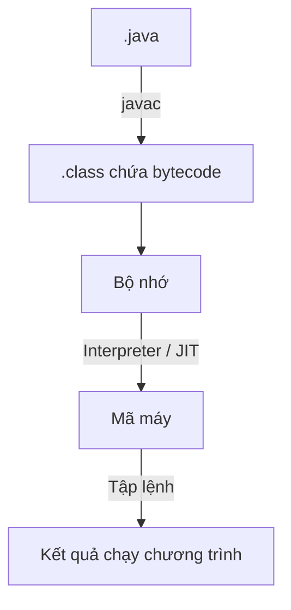
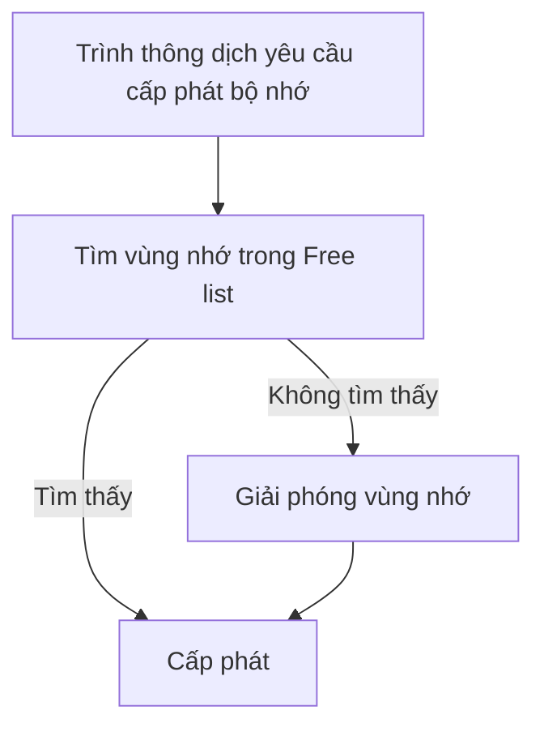

# Tổng quan

## Giới thiệu

**Java** là một ngôn ngữ lập trình hướng đối tượng được xây dựng trên nền tảng của C/C++. Do vậy nó sử dụng các cú pháp của C và các đặc trưng hướng đối tượng của C++.

**Java SE** (Java Platform, Standard Edition, Java core) là phiên bản Java tiêu chuẩn, cung cấp đầy đủ các công cụ và thư viện cốt lõi để phát triển ứng dụng Java độc lập (desktop, console, backend,...).

## Các đặc trưng của Java

### Đơn giản
Những người thiết kế mong muốn phát triển một ngôn ngữ dễ học và quen thuộc với đa số người lập trình. Do vậy Java được loại bỏ các đặc trưng phức tạp của C/C++ như con trỏ, thao tác nạp đè (overload),… Java không sử dụng lệnh `goto`, `struct` và `union`, cũng như file header (`.h`).

### Thuần hướng đối tượng
Java được thiết kế xoay quanh mô hình hướng đối tượng. Vì vậy trong Java, tiêu điểm là dữ liệu và các phương pháp thao tác lên dữ liệu đó. Dữ liệu và các phương pháp mô tả trạng thái và cách ứng xử của một đối tượng trong Java.

### Độc lập với phần cứng & hệ điều hành, dẫn đến độ phân tán cao
Một chương trình Java được viết tại một máy nhưng có thể chạy được bất kỳ đâu. Chúng được thể hiện ở mức mã nguồn và mức nhị phân.

#### Mức mã nguồn
Người lập trình cần mô tả kiểu cho mỗi biến. Kiểu dữ liệu trong Java nhất quán cho tất cả các hệ điều hành và phần cứng khác nhau. Java có riêng một thư viện các lớp cơ sở. Vì vậy chương trình Java được viết trên một máy có thể dịch và chạy trơn tru trên các loại máy khác mà không cần viết lại.

#### Mức nhị phân
Môi trường phát triển của Java được chia làm hai phần: Trình biên dịch và trình thông dịch. Không như C/C++, trình biên dịch của Java chuyển mã nguồn thành dạng bytecode độc lập với phần cứng. Nhưng để thực thi chương trình dưới dạng bytecode, tại mỗi máy cần phải có trình thông dịch của Java (máy ảo Java). Máy ảo Java chuyển bytecode thành mã lệnh mà CPU thực thi được.

### Mạnh
Java có các quy tắc lập trình rất nghiêm ngặt. Cú pháp sẽ được kiểm tra lúc biên dịch và thông dịch và lỗi lập trình có thể được phát hiện trước khi chạy chương trình.

### Bảo mật

#### Lớp bảo mật 1
 - **Tính đóng gói (Encapsulation)** của OOP.
 - **Không hỗ trợ con trỏ (pointer)**: bạn không thể truy cập vào địa chỉ bộ nhớ một cách thủ công.
 - **Ngăn chặn tràn bộ nhớ qua mảng (Array Bound Checking)**: Java kiểm tra giới hạn mảng khi truy cập: nếu bạn truy cập đến phần tử ngoài phạm vi mảng, thì sẽ bị `ArrayIndexOutOfBoundsException` thay vì truy xuất dữ liệu ngẫu nhiên như trong C/C++.
 - **Bộ thu gom rác (Garbage Collector – GC)**: Tự động quản lý bộ nhớ. Khi một đối tượng không còn được tham chiếu, GC sẽ thu hồi bộ nhớ đó.

#### Lớp bảo mật 2
- **Java Security Manager**: Là một lớp bảo vệ ở cấp hệ thống, kiểm soát quyền truy cập vào tài nguyên hệ thống. Lập trình viên hoặc quản trị viên có thể cấu hình policy file để chỉ định quyền của từng phần mềm Java.
- **Java Sandbox**:
	- Là môi trường thực thi hạn chế, thường được áp dụng cho [[1. Giới thiệu & Cài đặt Java SE#Applet|Applet]] và các ứng dụng chạy trong mạng như [[1. Giới thiệu & Cài đặt Java SE#Ứng dụng cơ sở dữ liệu|JDBC]].
	- Khi một ứng dụng được cho là không tin cậy chạy trong sandbox:
		- Nó bị giới hạn quyền truy cập tài nguyên.
		- Không thể đọc/ghi tập tin hệ thống.
		- Không thể truy cập mạng trừ khi được cho phép.

#### Lớp bảo mật 3
Các trình thông dịch kiểm tra xem bytecode có đảm bảo các qui tắc an toàn trước khi thực thi.

#### Lớp bảo mật 4
Kiểm soát việc nạp các lớp lên bộ nhớ để giám sát việc vi phạm giới hạn truy xuất trước khi nạp vào hệ thốn

### Đa luồng
Java sử dụng kỹ thuật đa luồng (Multithread) để thực thi nhiều tác vụ đồng thời.

# Ứng dụng Java

## Applet
- Applet là một chương trình Java chạy trên trên trình duyệt web có hỗ trợ Java.
- Applet được nhúng bên trong trang HTML bằng thẻ `<applet>` hoặc `<object>`.
- Khi người dùng truy cập trang web, trình duyệt sẽ tải Applet, và chương trình Java đó sẽ chạy trực tiếp trên máy người dùng.
- Vai trò của Applet: Tạo giao diện đồ họa tương tác ngay trên trình duyệt. Vai trò này hiện đã được thay thế bằng [[Giới thiệu & Cài đặt JavaScript|JavaScript]].

## Servlet
- Servlet là một chương trình Java chạy trên server, được thiết kế để xử lý các yêu cầu từ máy khách (client) trong ứng dụng web.
- Khi người dùng (máy trạm) gửi yêu cầu qua trình duyệt, Servlet nhận yêu cầu, xử lý dữ liệu (có thể là truy vấn CSDL, tính toán, xác thực...), rồi trả lại kết quả cho người dùng – thường là nội dung HTML.

## Ứng dụng Console
Các chương trình này chạy từ dấu nhắc lệnh và không sử dụng giao diện đồ họa. Các thông tin nhập xuất được thể hiện tại dấu nhắc lệnh.

## Ứng dụng GUI
Đây là các chương trình Java cho phép người dùng tương tác qua giao diện đồ họa.

## Ứng dụng cơ sở dữ liệu
Java hỗ trợ xây dựng các ứng dụng kết nối và làm việc với cơ sở dữ liệu thông qua **JDBC API** (Java Database Connectivity). JDBC là giao diện lập trình chuẩn trong Java dùng để: ^8a96af
- Kết nối đến hệ quản trị cơ sở dữ liệu (MySQL, Oracle, PostgreSQL, SQLite...),
- Gửi truy vấn SQL (`SELECT`, `INSERT`, `UPDATE`, `DELETE`...),
- Nhận và xử lý kết quả trả về từ cơ sở dữ liệu.

# Môi trường Java (JRE, Java Runtime Environment)

Môi trường Java gồm 5 thành phần:
- **Ngôn ngữ Java**: Cú pháp lập trình (class, interface, điều kiện, vòng lặp...).
- **Bytecode**: Mã trung gian (dạng nhị phân) sau khi biên dịch từ mã `.java`.
- **Thư viện lớp chuẩn**: Gồm hàng ngàn class hỗ trợ xử lý chuỗi, tệp, mạng, giao diện,...
- **Máy ảo Java (JVM)**: Thực thi bytecode và cung cấp môi trường chạy an toàn, độc lập nền tảng.
- **Cấu trúc `.class`**: Quy định cách tổ chức bytecode bên trong tệp biên dịch (`.class`).

## Máy ảo Java (Java Virtual Machine, JVM)

**Máy ảo** (Virtual Machine) là một *phần mềm mô phỏng lại một hệ thống máy tính* hoàn chỉnh, bao gồm:
- Bộ nhớ.
- CPU.
- Tập lệnh.
- Quản lý luồng thực thi chương trình.

**JVM** là một máy ảo chuyên dùng để *thực thi chương trình Java*, không phụ thuộc phần cứng hay hệ điều hành.

**Các chức năng tổng quát của JVM**:
- Cho phép chạy mã Java trên mọi nền tảng.
- Quản lý tài nguyên như bộ nhớ, tiến trình, luồng (thread) một cách an toàn.
- Tạo môi trường độc lập giúp Java đạt được *"Write Once, Run Anywhere"*.

**Các chức năng cụ thể của JVM**:
- **Nạp `.class`**: JVM nhận mã bytecode từ trình biên dịch Java (`javac`).
- **Quản lý bộ nhớ**: Gồm heap (dữ liệu động), stack (gọi hàm), metaspace (class metadata).
- **Giải phóng vùng nhớ (Garbage Collector)**: Tự động thu hồi bộ nhớ không dùng nữa.
- **Thông dịch và Biên dịch**: Chạy từng lệnh bytecode hoặc biên dịch sang mã máy qua JIT.

## Quy trình biên dịch, thông dịch và thực thi mã Java:


Trong đó:
- **javac** (Java Compiler): Trình biên dịch mã nguồn `.java` thành bytecode (`.class`). 
- **JIT** (Just-in-time Compiler): Trình biên dịch Java tức thời. Có khả năng biên dịch bytecode thành mã máy ngay khi chương trình đang chạy, giúp tăng hiệu năng so với việc chỉ thông dịch bytecode từng dòng. JIT được dùng thay cho **trình thông dịch** khi cần.
- Từ giai đoạn lưu `.class` vào bộ nhớ, thông dịch và thực thi đều được thực hiện bởi JVM.

## Nguyên lý quản lý bộ nhớ

Trong các ngôn ngữ như C/C++ hay Pascal, người lập trình phải tự tay cấp phát và giải phóng bộ nhớ (dùng `malloc`/`free`, `new`/`delete`, ...). Việc này rất dễ dẫn đến:
- Rò rỉ bộ nhớ (không giải phóng vùng nhớ sau khi dùng).
- Sử dụng vùng nhớ đã bị giải phóng.
- Lỗi phân mảnh bộ nhớ (memory fragmentation)

Java sử dụng mô hình máy ảo Java (JVM) để quản lý bộ nhớ, trong đó **Heap** là vùng cấp phát bộ nhớ chính.

**Phân loại Heap**:
- **Heap tĩnh**: Lưu trữ thông tin về lớp, hằng số, và phương thức.
- **Heap động**: Cấp phát đối tượng lúc chạy (runtime objects). Heap động được chia thành 2 luồng:
	- Luồng chứa các đối tượng.
	- Luồng chứa các con trỏ trỏ tới các đối tượng đó.

**Các kỹ thuật để tối ưu việc sử dụng Heap**:
- **Free list** (danh sách vùng nhớ rảnh): Lưu các khối chưa được sử dụng.
- **Allocated list**: lưu các khối đang được cấp phát.
- **Best-fit allocation**: Khi có một yêu cầu về cấp phát bộ nhớ, hệ thống xem xét trong *free list* để lấy ra khối bộ nhớ đầu tiên có kích cỡ sát nhất. Chiến thuật cấp phát này giảm tối thiểu việc phân mảnh của Heap.
- **Coalescing**: Gom các vùng nhớ rảnh nằm liền kề nhau.
- **Compaction**: Di chuyển các đối tượng để tạo ra vùng nhớ rảnh liên tục → hỗ trợ cấp phát nhanh hơn.

**Quy trình hoạt động**:

Ngoài ra, việc giải phóng vùng nhớ có thể được kích hoạt nếu xuất hiện một số tình huống khẩn cấp.

## Nguyên lý kiểm tra `.class`

Trước khi `.class` được thực thi, **Class Loader** và các thành phần kiểm tra của JVM sẽ tiến hành 4 bước kiểm tra bảo mật để:
- Ngăn mã độc.
- Bảo vệ bộ nhớ, hệ thống file, mạng, và OS.
- Đảm bảo không có hành vi phá hoại hoặc truy cập trái phép

File `.class` gồm ba phần chính:
1. **Bytecode**: Mã trung gian được JVM thực thi.
2. **Thông tin về class**: Danh sách phương thức, các giao diện đã implement, các giá trị có sẵn.
3. **Thuộc tính**: Các metadata khác liên quan đến class.
Các thông tin này được tổ chức thành các bảng:
- **Field Table**: Chứa danh sách biến (thuộc tính).
- **Method Table**: Chứa các phương thức (hàm).
- **Interface Table**: Chứa danh sách interface và hằng số.

**Các bước kiểm tra**:
1. Kiểm tra cú pháp (Syntax check).
2. Kiểm tra các nguyên tắc logic (Semantic check).
3. Kiểm tra luồng hoạt động (Bytecode verification).
4. Kiểm tra các lỗi xảy ra khi thực thi chương trình (Runtime check).

# Bộ công cụ phát triển Java (JDK, Java Development Kit)

**JDK** (Java Development Kit) là bộ công cụ dành cho lập trình viên Java. Nó cung cấp mọi thứ bạn cần để viết, biên dịch, và thực thi ứng dụng Java, bao gồm [[1. Giới thiệu & Cài đặt Java SE#Môi trường Java (JRE, Java Runtime Environment)|JRE]].

**Cài đặt JDK**:
1. Bạn có thể tải JDK tại [trang web chính thức của Oracle](https://www.oracle.com/java/technologies/downloads/#jdk24-windows). Riêng đối với Windows, hãy tải về file `x64 Installer`. Mặc định, folder của JDK 24.0.2 đặt tại `C:\Program Files\Java\jdk-24`.
2. Tạo biến môi trường:
	1. Vào cửa sổ `System properties`, tab `Advanced`, chọn `Environment Variables`.
	2. Tại cửa sổ `Environment Variables`, mục `System Variables` chọn `New...` để tạo biến mới. Hãy đặt `Variable name` là `JAVA_HOME`  và `Variable value` là đường dẫn folder JDK.
	3. Tại biến `PATH`, chọn `Edit...` để thêm giá trị `%JAVA_HOME%\bin`.

Để kiểm tra xem JDK đã được cài đặt chưa, bạn dùng lệnh:
```bash
java -version
```

Để biên dịch một chương trình Java, chạy:
```bash
javac urFile.java
```

Để thực thi một chương trình Java, chạy:
```bash
java urFile
```

Để tiện cho việc sử dụng, bạn cần dùng một IDE. IDE chuyên dùng và đại trà cho Java là **IntelliJ IDEA**. Bạn có thể tại nó tại [trang web chính thức của JetBrains](https://www.jetbrains.com/idea/download/?source=google&medium=cpc&campaign=APAC_en_ASIA_IDEA_Branded&term=intellij+idea&content=693444343121&gad_source=1&gad_campaignid=9730668635&gbraid=0AAAAADloJzj1pAb9m8W2JyRN8yA0i7HCj&gclid=CjwKCAjw1ozEBhAdEiwAn9qbzZQE84tNfGhZxyFrknY_Gx2whQZLZz7mr8MC2Ub7sMk3eYEhc3YuyxoCYvAQAvD_BwE&section=windows#). Bản sử dụng miễn phí (**Comunity - C**) đã đầy đủ các tính năng.
