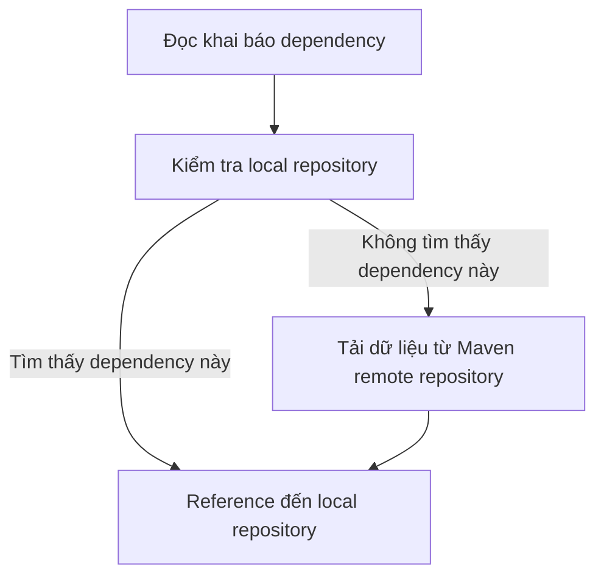

# Giới thiệu

**Apache Maven** là một chương trình giúp quản lý dự án một cách dễ dàng. Nó cho phép các dev có thể quản lý về version, các [[4. OOP nâng cao#Inversion of control|dependency]], quản lý [[1. Giới thiệu & Cài đặt Java SE#Quy trình biên dịch, thông dịch và thực thi mã Java|build]], tự động tải về javadoc & source,...

# Cài đặt

Maven đã được cài đặt sẵn trong Intelliji IDEA, chỉ cần click chọn khi tạo project mới.

Cấu trúc một project Maven được tạo bởi Intelliji IDEA như sau:

```lua
src/
├── main/
│   ├── main.java
│   └── resources/
├── test/
│   └── java/
├── target/
└── pom.xml
```

# Nguyên lý hoạt động

## `pom.xml`

`pom.xml` là nơi khai báo tất cả những gì liên quan đến dự án được cấu hình qua Maven, như khai báo các dependency, version của dự án, tên dự án, repossitory,... Nó có nội dung như sau:

```xml
<?xml version="1.0" encoding="UTF-8"?>  
<project xmlns="http://maven.apache.org/POM/4.0.0"  
         xmlns:xsi="http://www.w3.org/2001/XMLSchema-instance"  
         xsi:schemaLocation="http://maven.apache.org/POM/4.0.0 http://maven.apache.org/xsd/maven-4.0.0.xsd">  
    <modelVersion>4.0.0</modelVersion>  
	
    <groupId>org.example</groupId>  
    <artifactId>marven-test</artifactId>  
    <version>1.0-SNAPSHOT</version>  
	
    <properties>
	    <maven.compiler.source>24</maven.compiler.source>  
        <maven.compiler.target>24</maven.compiler.target>  
        <project.build.sourceEncoding>UTF-8</project.build.sourceEncoding>  
    </properties>
    
</project>
```

## Thêm dependency

Để thêm dependency, ta dùng thẻ `<dependencies>` khai báo thông tin các dependency trước. Thông tin mỗi dependency được khai báo trong cặp thẻ `<dependency>`. Khi build file này, Maven sẽ tự tải về các dependency từ [Marven remote repository](https://mvnrepository.com/), kể cả các dependency con hay folder con của nó vào local repository.

Quy trình hoạt động cụ thể:


VD:

Ta muốn thêm vào các dependency của thư viện *Apache Commons Collections 3.2.2*, ta vào [trang chủ của dự án](https://mvnrepository.com/artifact/commons-collections/commons-collections/3.2.2) và sao chép link nhúng thư viện này vào thẻ `<dependencies>` như sau:
```xml
<dependency>
    <groupId>commons-collections</groupId>
    <artifactId>commons-collections</artifactId>
    <version>3.2.2</version>
</dependency>
```

Khi build file này, Maven sẽ tự tải về *Apache Commons Collections 3.2.2*.

## Thêm repository

Như đã biết, Marven sẽ tải dependency từ Marven remote repository. Tuy nhiên, có một số dependency không có sẵn trên Marven remote repository mà có trên các repository. Khi đó, ta phải chủ động thêm repository bằng thẻ `<repositories>`.

VD: 

## Maven scope

**Scope** là phạm vi sử dụng của các dependency, được khai báo bằng thẻ `<scope>urScopename</scope>`

Có một số scope sau:
1. Compile (mặc định):  Không cần định nghĩa
2. **`provided`**: 
3. **`runtime`**:
4. **`test`**:

## Maven goals / lifecircle

```bash
mvn compile
```
Biên dịch project và đưa các file kết quả vào `target`.

```bash
mvn package
```
Tạo ra file `.jar` trong `target`. Đây file Java Archive, là một file nén được sử dụng để đóng gói nhiều file Java (class, resources, metadata) thành một file duy nhất để dễ dàng phân phối và chạy ứng dụng.

```bash
mvn clean
```
Xóa tất cả mọi thứ trong `target`.

Trong IDE Itelliji IDEA, bạn không thể dùng Maven tại local terminal nếu chưa cài đặt Maven toàn cục. Bạn có thể sử dụng các goals tại tab *Maven* bên phải.

