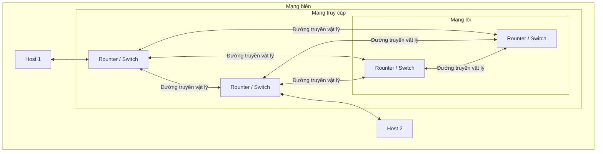

```insta-toc
---
title:
  name: Mục lục
  level: 1
  center: false
exclude: ""
style:
  listType: number
omit: []
levels:
  min: 1
  max: 6
---

# Mục lục

1. Tổng quan về Internet
    1. Định nghĩa Internet
    2. Kết nối và truyền dữ liệu
    3. Nhà cung cấp dịch vụ Internet (ISP, Internet Service Provider)
2. Các vùng mạng
    1. Mạng biên (Edge network)
    2. Mạng truy cập (Access network)
    3. Mạng lõi (Core network)
        1. Chuyển mạch gói (Packet switching)
        2. Chuyển mạch kênh (Circuit switching)
3. Các vấn đề liên quan đến chậm trễ và mất gói
    1. Hàng đợi (Queueing)
    2. Độ trễ
    3. Thông lượng (Throughput, $T$)
    4. Chương trình đo độ trễ traceroute
    5. Mất gói tin
4. Phân tầng giao thức mạng
    1. Định nghĩa phân tầng giao thức mạng
    2. Mô hình phân tầng TCP/IP
    3. Mô hình phân tầng OSI
```

# Tổng quan về Internet

## Định nghĩa Internet

**Ở góc độ phần cứng**:
- Internet là một mạng máy tính (computer network) kết nối hàng tỷ thiết bị *máy tính, dây mạng, card mạng, modem, router,...* trên toàn thế giới. Các thiết bị này gọi là **host** hay **end system (hệ thống đầu cuối)**.
- Internet là **mạng của các mạng**.

**Ở góc độ phần mềm (dịch vụ)**: Internet cung cấp **[[2. Application layer#Socket|các API]]** cho các phần mềm hoạt động. Cho phép các ứng dụng kết nối với nhau và dùng [[2. Application layer#Các dịch vụ vận chuyển trên application layer|các dịch vụ vận chuyển]].

## Kết nối và truyền dữ liệu

Các hệ thống đầu cuối kết nối với nhau qua **liên kết truyền thông (communication links)** và **bộ chuyển mạch (switches)**.

**Các liên kết** có thể là:
- Cáp đồng trục (Coaxial cable).
- Dây đồng (Copper wire).
- Cáp quang (Optical fiber).
- Sóng vô tuyến (Radio spectrum).

Tốc độ truyền được đo bằng **bit/giây (bits/second)**.

**Quá trình truyền dữ liệu**: [[#Mạng lõi (Core network)]].

Đường đi từ hệ thống gửi đến hệ thống nhận gọi là **route/path (tuyến đường)**.

## Nhà cung cấp dịch vụ Internet (ISP, Internet Service Provider)

Người dùng truy cập Internet thông qua **ISP**: Một số ISP:
- ISP dân dụng: công ty cáp, điện thoại.
- ISP doanh nghiệp, ISP trường đại học.
- ISP cung cấp WiFi công cộng: sân bay, khách sạn, quán cà phê.
- ISP di động: 3G/4G/5G.

Mỗi ISP là một mạng gồm
- Bộ chuyển mạch (Switcher).
- Liên kết (Link).

Các ISP cần liên kết với nhau.
- ISP cấp thấp (lower-tier) kết nối qua ISP cấp cao (upper-tier).
- ISP cấp cao gồm **routers tốc độ cao (high-speed routers)** kết nối bằng **cáp quang tốc độ cao (fiber-optic links)**.

# Các vùng mạng




## Mạng biên (Edge network)

Mạng biên bao gồm các host. Có 2 loại host:
1. **Client (máy khách)**: Dùng dịch vụ.
2. **Server (máy chủ)**: Thường là máy mạnh, có khả năng lưu trữ và phân phối dữ liệu.

## Mạng truy cập (Access network)

Mạng truy cập kết nối các host với bộ định tuyến đầu tiên (còn gọi là **bộ định tuyến biên, Edge router**).

Các router kết nối với nhau qua **đường truyền vật lý**.

Phân loại đường truyền theo hình thức:
1. **Vô tuyến**: Không dây.
2. **Hữu tuyến**: Có dây.

Phân loại đường truyền theo hướng:
1. **Có hướng**: Tín hiệu lan truyền trong chất rắn (cáp).
2. **Vô hướng**: Tín hiệu lan truyền tự do (sóng vô tuyến).

Một số loại mạng truy cập:

| Mạng truy cập                             | Độ bao phủ | Tốc độ (Mb/s)       | Ghi chú            |
| ----------------------------------------- | ---------- | ------------------- | ------------------ |
| **Mạng truy cập tế bào diện rộng (WCAN)** | ~ 10 km    | ~ 10                | ISP                |
| **Bluetooth**                             |            |                     |                    |
| **Vệ tinh**                               |            | ~ 100               | Độ trễ truyền cao  |
| **Mạng cục bộ không dây (WLAN, Wi-fi)**   | ~ 10 m     | ~ 11- **450**       | Xung quanh tòa nhà |
| **Ethernet (LAN)**                        |            | ~ 0.1 - **10** Gb/s |                    |
| **Mạng trung tâm dữ liệu**                |            | ~ 10 - **100** Gb/s | Trung tâm dữ liệu  |
| **Sóng mặt đất (Terrestrial microwave)**  |            |                     |                    |

## Mạng lõi (Core network)

Mạng lõi bao gồm mạng lưới các **rounter / switch** được kết nối bởi các **liên kết** (link). Có 2 loại chuyển mạch:

### Chuyển mạch gói (Packet switching)
\[Thông dụng\]

Thường là **Bộ định tuyến (Router)** hoặc **Bộ chuyển mạch (Switch)**. Sau đây chỉ dùng từ router:

Quy trình:
1. Chia nhỏ dữ liệu, tạo thành **gói tin (Packet, Segment, Datagram)**.
2. Router nhận hết tất cả các bit của gói tin -> **Độ trễ truyền**.
3. Các gói được chuyển tới các liên kết trung gian, cuối cùng chuyển qua đầu ra.

Các router có 2 nhiệm vụ:
1. **Chuyển tiếp (Foward) / Mức dữ liệu (Data plane)**:
	- Là hành động *cục bộ* trên từng router.
	- Chuyển gói tin từ đầu vào đến đầu ra thích hợp của router dựa trên địa chỉ trong header của gói tin.

2. **Định tuyến (Route) / Mức điều khiển (Control plane)**:
	- Là hành động *toàn cục* trên các router.
	- Tìm các tuyến đường đi thích hợp từ nguồn gửi gói tin đến đích sao cho chi phí thấp nhất, nhanh nhất, ít nghẽn nhất.
	- Có 2 cách tiếp cận:
		1. Dùng **[[4. Network layer#Các thuật toán định tuyến|Các thuật toán định tuyến]]** do các router đảm nhiệm.
		2. Dùng **[[4. Network layer#SDN (Software defined networking)|Phần mềm (SDN, Software-defined-networking)]]** được điều khiển từ xa bởi các server.

**Ưu**:
- Độ trễ ổn định, phù hợp dịch vụ thời gian thực.

**Nhược**:
- Lãng phí tài nguyên.

### Chuyển mạch kênh (Circuit switching)
\[Cũ\]

Chuyển mạch kênh chia băng thông thành các kênh riêng theo 2 cách:
1. **FDM**:
	1. Phổ tần được chia thành nhiều dải tần (bandwidth).
	2. Tốc độ truyền thấp do mỗi gói tin chỉ dùng 1 dải tần để truyền.

2. **TDM**:
	1. Thời gian chia thành các khung, mỗi khung có các khe thời gian dành riêng cho từng kết nối.
	2. Các khe được thay phiên xuất hiện tại 1 thời điểm chứ không xuất hiện liên tục, nên giảm tốc độ truyền.

**Ưu**:
- Tận dụng tài nguyên linh hoạt, nhanh chóng.
- Tránh mất gói, trễ gói.

**Nhược**:
- Độ trễ khó lường trước. VD: Khi người dùng im lặng hoặc ngừng truyền dữ liệu, các kênh sẽ rảnh.

# Các vấn đề liên quan đến chậm trễ và mất gói

### Hàng đợi (Queueing)

Khi có quá nhiều gói tin được gửi đến router, vượt quá khả năng xử lý của router, các gói đó buộc phải đợi ở bộ nhớ tạm.

### Độ trễ

Độ trễ mạng tại một nút (host, rounter, switcher,...):
$$d_{nodal​} = d_{proc} ​+ d_{queue} ​+ d_{trans} ​+ d_{drop} \quad (s)$$
Trong đó:
- **$d_{proc}$: Độ trễ xử lý**: Thời gian mà *nút mất để xử lý gói tin*, bao gồm:
	- Kiểm tra bit lỗi.
	- Xác định đường ra.
	- Thường có độ lớn nhỏ hơn *microsec*.

- **$d_{queue}$: Độ trễ hàng đợi**: Thời gian *gói ở trong queue*, phụ thuộc vào mức độ nghẽn của router. Tính bằng băng thông.

- **$d_{trans}$: Độ trễ truyền**: Thời gian để *đẩy toàn bộ gói dữ liệu lên đường truyền (thông qua nút)*.
$$d_{trans}=\frac{L}{R} \quad (s)$$
	Với:
	- $L \quad (bit)$ (**Length**): Độ dài gói tin.
	- $R \quad (bit/s)$ (**Transmisstion rate, Bandthwith, Băng thông**): Tốc độ truyền tin tối đa của liên kết.

- **Số lượng gói tin truyền được**:
$$ n = \frac{1}{d_{trans}} = \frac{R}{L} \quad \text{(gói)} $$

- **$d_{drop}$: Độ trễ lan truyền**: Thời gian tín hiệu lan truyền qua *đường truyền vật lý*.
$$d_{drop}=\frac{d}{s} \quad (s)$$
	Với:
	- $d$ (**Link length**): Độ dài đường truyền vật lý (*khoảng cách vật lý*).
	- $s$: Tốc độ truyền tin của đường truyền, phụ thuộc vào loại đường truyền. Đối với các kết nối đặc biệt có thể xấp xỉ tốc độ ánh sáng.

**Cường độ Lưu lượng**: Mức độ chiếm dụng đường truyền bởi gói tin.
$$I=\frac{L.\alpha}{R}.100 \quad (\%)$$
	Với $\alpha$ là tốc độ đến của gói tin.

- $I \approx 0$: Độ trễ trung bình nhỏ.
- $I > 0$: Độ trễ trung bình lớn, xuất hiện **hàng đợi**.
- $I > 1$: Độ trễ trung bình rất lớn, xuất hiện **mất gói**.

### Thông lượng (Throughput, $T$)

**Thông lượng** là số bit được truyền từ nguồn đến đích trong một khoảng thời gian, cũng đồng nghĩa với *tốc độ truyền bit*, dao động từ 0 đến băng thông.

Có 2 loại:
1. **Thông lượng tức thời**: Thông lượng đo tại 1 thời điểm.
2. **Thông lượng trung bình**: Thông lượng đo trong 1 khoảng thời gian, là *băng thông nhỏ nhất tại 2 nút liên tiếp* trên đường đi muốn đo. Hiện tượng **thắt nút cổ chai (Bottleneck)** xảy ra tại liên kết giữa 2 nút liên tiếp có băng thông kém nhất, khiến các gói tin bị kẹt lại ở liên kết này.

Giả sử có 4 nút:

- $R_c$: Băng thông máy khách (Độ sử dụng liên kết máy khách).
- $R_s$: Băng thông máy chủ (Độ sử dụng liên kết máy chủ).
- $R$: Băng thông trung tâm (Độ sử dụng liên kết trung tâm, Liên kết thắt nút cổ chai).
Thì:
- Thông lượng tối đa:
$$T = \min(R_c, R, R_s) \quad (bit/s)$$
- Mức sử dụng liên kết máy khách (Tương tự với máy chủ):
$$u_c = \frac{T}{R_c}.100 \quad (\%)$$
- Mức sử dụng liên kết trung tâm: Với $n$ là số lượng client / server đi qua liên kết trung tâm:
$$ u_{tt} = \frac{T.n}{R}.100 \quad (\%)$$

### Chương trình đo độ trễ traceroute

Traceroute hỗ trợ đo độ trễ từ nguồn đến từng router.

Các bước đo độ trễ của router thứ $i$:
1. Từ nguồn, gửi *3 gói tin* với router thứ $i$ (3 probes). Mỗi gói tin có một giá trị **TTL (Time to live)**.
2. Khi router thứ $i$ nhận được gói tin thì sẽ phản hồi với bên gửi. Dựa vào thời gian gửi và phản hồi để đo độ trễ.

### Mất gói tin

Xảy ra khi bộ nhớ của queue bị đầy, tức là độ trễ tiến đến vô cùng, băng thông > 1.

Các gói tin bị mất có thể:
1. **Được truyền lại** bởi nút trước đó, hoặc bởi nút nguồn.
2. **Không được truyền lại**.
Tùy vào giao thức.


# Phân tầng giao thức mạng

## Định nghĩa phân tầng giao thức mạng

Là chia nhỏ chức năng của mạng máy tính thành nhiều tầng (layer), mỗi tầng đảm nhiệm một phần công việc riêng biệt.
1. Mỗi tầng chỉ thực hiện chức năng chuyên biệt, không cần lo phần việc của tầng khác.
2. Các tầng chỉ có thể giao tiếp với các tầng liền kề với nó.

**Lợi ích**:
- **Cấu trúc rõ ràng**: Cho phép xác định và liên kết các thành phần trong hệ thống.
- **Module hóa**: Giúp dễ dàng trong việc vận hành và cập nhật hệ thống.

## Mô hình phân tầng TCP/IP

Gồm **5** tầng:

| Tầng                                  | Đơn vị vận chuyển (gói tin) | Phạm vi vận chuyển                        |
| ------------------------------------- | --------------------------- | ----------------------------------------- |
| **Tầng ứng dụng (Application layer)** | Message                     | Giữa 2 ứng dụng mạng                      |
| **Tầng vận chuyển (Transport layer)** | Segment                     | Giữa 2 tiến trình                         |
| **Tầng mạng (Network layer)**         | Datagram                    | Giữa 2 host liên tiếp                     |
| **Tầng liên kết (Link layer)**        | Frame                       | Giữa 2 nút (Router, Switch,...) liên tiếp |
| **Tầng vật lý (Physical layer)**      | Bit                         | Giữa 2 thiết bị vật lý                    |

Mỗi tầng đều:
1. **Multiplexing**: Khi gửi gói tin, các tầng **thêm header** của riêng mình vào gói tin và **dùng các giao thức ở tầng dưới**.
2. **Demultiplexing**: Khi nhận gói tin, các tầng **kiểm tra và gỡ header** của riêng mình ra và **dùng các giao thức ở tầng trên**.


## Mô hình phân tầng OSI

Gồm **7** tầng:


