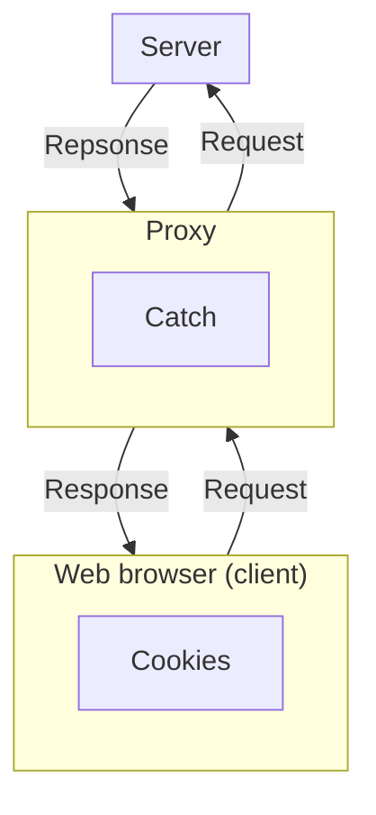

```insta-toc
---
title:
  name: Mục lục
  level: 1
  center: false
exclude: ""
style:
  listType: number
omit: []
levels:
  min: 1
  max: 6
---

# Mục lục

1. Giới thiệu HTTP (Hypertext transfer protocol)
2. Phân loại HTTP và Các phiên bản HTTP
3. HTTP message
    1. HTTP request
    2. HTTP response
4. Cookies
5. Web cache (Proxy server)
```



# Giới thiệu HTTP (Hypertext transfer protocol)

**HTTP** là:
- Dựa trên **TCP port 80**.
- Có chức năng **lấy dữ liệu do server trả về**.
- Không lưu trạng thái vận chuyển (**stateless**). VD: Nếu client yêu cầu cùng một object 2 lần, server vẫn gửi lại, không nhớ lần trước..

# Phân loại HTTP và Các phiên bản HTTP

Có 2 loại:
1. **HTTP không bền vững (Non-Persistant)**:
	1. Một TCP connection chỉ vận chuyển được **1 object** (file) của trang web.
	2. Không có pipelining: Các request và response được gửi và nhận tuần tự.
	3. -> Lãng phí tài nguyên và thời gian.
	4. Thời gian đáp ứng: $2.\text{RTT}+\text{thời gian truyền object}$. VD: Số RTT để tải 10 object cho 1 trang web là 11 RTT.

2. **HTTP bền vững (Persistant)**:
	1. Một TCP connection có thể vận chuyển **nhiều object (Multiplexing)**. Toàn bộ object của trang web có thể được gửi 1 lần duy nhất.
	2. Cho phép **pipelining**: Gửi nhiều request đồng thời, không cần tuần tự từng request.

Các phiên bản HTTP ngày nay đều là persistant connection, thậm chí tối ưu thêm các tính năng khác.

| Tính năng                 | HTTP/1.1                                                                   | HTTP/2                                                                                                        | HTTP/3 (QUIC)                                                    |
| ------------------------- | -------------------------------------------------------------------------- | ------------------------------------------------------------------------------------------------------------- | ---------------------------------------------------------------- |
| Giao thức                 | **Nhiều** TCP connections                                                  | **Một** TCP connection.                                                                                       | **Nhiều luồng**, mỗi luồng là 1 TCP riêng biệt, quản lý qua UDP. |
| Thuật toán định thời      | **FCFS** (First come first serve): Gói nào tới trước thì được xử lý trước. | **Robin Round: Multiplexing** (đa luồng / **frame**). Mỗi luồng có một thời gian hoạt động cố định và xen kẽ. | **QUIC**: Mỗi stream là một TCP connection riêng biệt.<br>       |
| HOL blocking              | Có                                                                         | Có ở TCP layer                                                                                                | Không (per-stream)                                               |
| Định dạng dữ liệu         | Text                                                                       | Binary + Compression (HPACK)                                                                                  | Binary + Compression (QPACK)                                     |
| Mức độ ưu tiên truyền tin | Không                                                                      | Có (weight + dependency)                                                                                      | Có, đơn giản hơn                                                 |
| Server Push               | Không                                                                      | Có                                                                                                            | Có                                                               |
| Thiết lập Kết nối         | TCP                                                                        | TCP                                                                                                           | TCP hỗ trợ 0 RTT                                                 |
Trong đó:
- **HOL Blocking (Head-of-line blocking)**: Là hiện tượng nghẽn mạng khi một gói tin quá lớn đứng đầu luồng TCP, khiến các gói tin sau phải chờ.
- **Server push**: Là server có khả năng tự gửi về client quan trọng mà không cần client yêu cầu.
- **RTT (Round trip time)**: Là khoảng thời gian từ lúc client gửi request đến khi nhận response từ server.

# HTTP message

Có 2 loại message:
1. **Request**: Do client gửi đến server.
2. **Response**: Do server gửi về client.

## HTTP request

Gồm 3 thành phần:
1. **Request**: Gồm có:
	1. **Method**: Hành động client muốn thực hiện.
	2. **URL**: Địa chỉ của tài nguyên cần truy cập.
	3. **Version**: Phiên bản của HTTP.

2. **Header**: Gồm có:
	1. **Host**: Tên server.
	2. **Connection close**: Yêu cầu server ngắt kết nối khi hoàn thành response.
	3. **User agent**: Loại trình duyệt web.
	4. **Accept language**: Ngôn ngữ giao tiếp.

3. **Body**: Dữ liệu đính kèm theo cần server xử lý.

Một số HTTP Method:

| Method   | Ý nghĩa                                                         |
| -------- | --------------------------------------------------------------- |
| `GET`    | **Lấy dữ liệu** từ server (chỉ đọc, không thay đổi trạng thái). |
| `HEAD`   | Giống `GET` nhưng chỉ lấy phần header, không lấy body.          |
| `POST`   | **Upload dữ liệu mới** lên server (tạo mới hoặc xử lý).         |
| `PUT`    | **Upload và thay thế** toàn bộ tài nguyên tại URL chỉ định.     |
| `PATCH`  | **Cập nhật một phần tài nguyên** tại URL chỉ định.              |
| `DELETE` | **Xóa tài nguyên** tại URL chỉ định.                            |

VD:
```sh
GET /somedir/page.html HTTP/1.1\r\n
Host: www.someschool.edu\r\n
Connection: close\r\n
User-agent: Mozilla/5.0\r\n
Accept-language: fr\r\n
Accept-encoding: gzip,deflate\r\n
Connection: keep-alive\r\n
```

Trong đó các `Accept-language` và `Accept-encoding` có thể có hậu tố `q:n` ám chỉ độ ưu tiên `n`, ưu tiên nhất khi `n` là `1`. Mặc định là `q:1`.

## HTTP response

Gồm 3 thành phần:
1. **Status**: Gồm có:
	1. **Version**: Phiên bản của HTTP.
	2. **Status code**: Trạng thái truyền dữ liệu dưới dạng mã số.
	3. **Status message/phrase**: Trạng thái truyền dữ liệu dưới dạng chữ.

2. **Header**: Gồm có:
	1. **Connection close**: Yêu cầu server ngắt kết nối khi hoàn thành response.
	2. **Date**: Thời điểm tạo response.
	3. **Server**: Loại server đang chạy.
	4. **Last modified**: Lần cuối tài nguyên được sửa.
	5. **Content length**: Kích thước tài nguyên.
	6. **Content type**: Kiểu tài nguyên (HTML, PNG,...).

3. **Body**: Tài nguyên mà client yêu cầu.

Một số HTTP status code / message phổ biến:

| Code  | Message                      | Ý nghĩa                                                                     |
| ----- | ---------------------------- | --------------------------------------------------------------------------- |
| `200` | `OK`                         | Nhận request, trả response thành công.                                      |
| `301` | `Moved Permanently`          | Trả response thất bại vì *tài nguyên cần tìm đã được chuyển sang URL khác*. |
| `400` | `Bad Request`                | Trả response thất bại vì *request không hợp lệ*.                            |
| `404` | `Not Found`                  | Trả response thất bại vì *không tìm thấy tài nguyên cần tìm*.               |
| `505` | `HTTP Version Not Supported` | Trả response thất bại vì *phiên bản HTTP không được hỗ trợ*.                |


VD:
```sh
HTTP/1.1 200 OK
Connection: close
Date: Tue, 18 Aug 2015 15:44:04 GMT
Server: Apache/2.2.3 (CentOS)
Last-Modified: Tue, 18 Aug 2015 15:11:03 GMT
Content-Length: 6821
Content-Type: text/html; char-set:UTF-8\r\n
```

# Cookies

Do HTTP có tính *stateless* nên cần có cookies.
**Cookies** được dùng để **tạo trạng thái cho người dùng**, VD *lịch sử truy cập trang web, lịch sử mua hàng,...*.

>[!important]
>Cookie chỉ lưu **dữ liệu người dùng tại browser**, không lưu dữ liệu của server website.

Mỗi một tên miền có một cookie riêng.

Quy trình:
1. Khi server gửi về response sẽ đồng thời ghi dữ liệu vào cookie (Set cookie) -> File cookie **nằm tại client**, được **quản lý bởi browser**.
2. Khi browser gửi request sẽ đồng thời gửi dữ liệu từ cookie.

**Chức năng của cookie**:
1. Theo dõi hành vi của client trên 1 trang web (**cookie bên thứ nhất**).
2. Theo dõi hành vi của client trên nhiều trang web (**cookie bên thứ ba**), VD *các server tạo quảng cáo sẽ có cookie rơi vào dạng cookie bên thứ 3*.

# Web cache (Proxy server)

**Web cache** là một host có vị trí logic trung gian giữa client và server, lưu lại các object (ảnh, HTML, CSS, JS) được request gần đây.

Quy trình:
1. Browser gửi request đến cache.
2. Cache kiểm tra object có sẵn không.
	1. Nếu có, trả về ngay.
	2. Nếu không, catch gửi request đến server, nhận response, lưu lại và chuyển cho browser.
	Chú ý: Cache chỉ lưu được các object được quy định trong header property `Cache-Control`. Nếu `Cache-Control: no-catch` thì tức là catch không được lưu trữ object gì.

Như vậy:
- Catch là **server** đối với client.
- Catch là **client** đối với server.

**Lợi ích**:
1. **Giảm thời gian** phản hồi (nếu cache hit).
2. **Giảm lưu lượng** qua đường truyền quốc tế, tiết kiệm chi phí băng thông.
3. **Tăng hiệu suất** Internet toàn cục.

**Vấn đề phát sinh**: Dữ liệu trong cache có thể bị lỗi thời (stale)
-> Dùng **Conditional GET**:
1. Server lần đầu gửi object thì gửi kèm `last modified`.
2. Cache lưu object và `last modified`.
3. Khi cache nhận được request mới, nó gửi đi request có header `If-Modified-Since` tới server. Server kiểm tra:
	1. Nếu object chưa bị thay đổi thì sever trả về mã `304 Not Modified`.
	2. Nếu object đã bị thay đổi thì server sẽ trả về request chứa object mới về cache.
