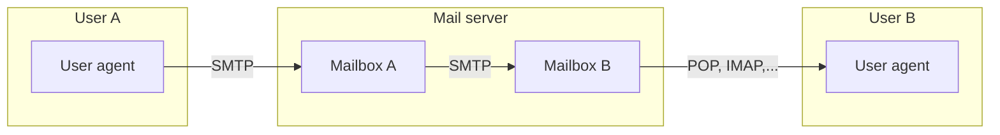

```insta-toc
---
title:
  name: Mục lục
  level: 1
  center: false
exclude: ""
style:
  listType: number
omit: []
levels:
  min: 1
  max: 6
---

# Mục lục

1. Kiến trúc hệ thống email
2. Giao thức để truy cập email
3. Định dạng mail
4. Các phiên làm việc của SMTP
```

# Kiến trúc hệ thống email



Gồm 3 thành phần:
1. **User Agent (UA)**:
    - Là ứng dụng để người dùng **soạn/gửi/nhận** mail. VD: *Outlook, Apple Mail, Gmail,...*

2. **Mail Server**:
    - Là trung tâm hạ tầng e-mail, vừa có chức năng nhận mail (server), gửi mail (client).
    - Mỗi user có 1 **mailbox** để lưu thư.
    - Nếu server nhận không khả dụng, mail giữ trong **message queue** và thử gửi lại sau (30 phút/lần).

3. **SMTP (Simple Mail Transfer Protocol)**
    - Là giao thức application layer, dùng **TCP port 25**, có chức năng **gửi mail vào mailbox** của người nhận.
    - Quy trình:
        1. **SMTP client** (server gửi) mở kết nối đến **SMTP server** (server nhận).
        2. Kết nối logic (HELO/EHLO, MAIL FROM, RCPT TO, DATA, QUIT).
        3. Đẩy mail vào mailbox của người nhận.
    - **Persistent connection**: Có thể gửi nhiều mail trong cùng một kết nối TCP.

>[!important]
>- Giao thức **gửi mail**: SMTP,...
>- Giao thức **truy cập / nhận mail**: POP, IMAP, HTTP,...
>- Giao thức **truy cập đến webmail (UA)**: HTTP.

# Giao thức để truy cập email

1. **POP (Post Office Protocol)**: Tải mail về client rồi xóa mail đó ở mailbox.
2. **IMAP (Internet Mail Access Protocol)**: Cũng như POP, nhưng mail vẫn còn ở mailbox chứ không tự động xóa.
3. **HTTP**: ...

# Định dạng mail

Gồm 2 phần chính:
1. **Header**: Gồm có:
	1. **From**: Người gửi.
	2. **To**: Người nhận.
	3. **Subject**: Tiêu đề mail.
	4. Các trường khác **Bc, Bcc,...**.

2. **Body**: Nội dung mail.

VD:
```sh
From: alice@crepes.fr
To: bob@hamburger.edu
Subject: Searching for the meaning of life.

The meaning of life can be derived from philosophical and religious contemplation of, and scientific inquiries about, existence, social ties, consciousness, and happiness.
```

# Các phiên làm việc của SMTP

1. `HELO` / `EHLO`: Khai báo tên client.
2. `MAIL FROM`: Khai báo địa chỉ mail người gửi.
3. `RCPT TO`: Khai báo địa chỉ mail 1 người nhận.
4. `DATA`: Khai báo nội dung mail và gửi mail.
5. `QUIT`: Kết thúc phiên.

